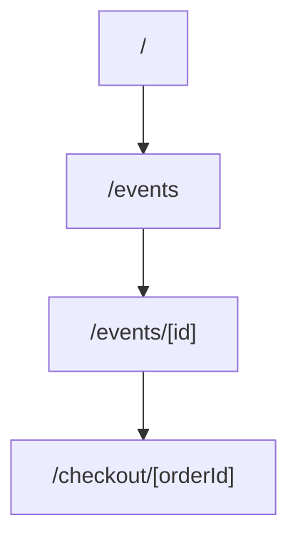

# Phase 2 — Information Architecture

| Field | Value |
| --- | --- |
| **Phase** | 2 of 11 |
| **Epic** | [01-frontend-plan-and-design-direction.md](01-frontend-plan-and-design-direction.md) |
| **Status** | ⬜ To Do |
| **Owner** | Frontend Lead / Product Design |

> **Objective:** Map the complete application as a route tree grouped by access level, aligned to Next.js App Router segments and required roles. Every route maps to ≥1 backend endpoint or is explicitly static.

---

## 1. Route Tree (proposed — validate & complete)

### Public (no auth)
| Route | Screen | Primary endpoint(s) |
| --- | --- | --- |
| `/` | Landing | `GET /events/upcoming`, `GET /config/public` |
| `/events` | Event listing | `GET /events` |
| `/events/[id]` | Event details | `GET /events/:id` |
| `/search` | Search results | `GET /events/search`, `GET /events/category/:category` |
| `/login` | Login | `POST /auth/login` |
| `/register` | Register | `POST /auth/register` |
| `/verify-email` | Email verification | `POST /auth/verify-email` |
| `/forgot-password` | Request reset | `POST /auth/request-reset` |
| `/reset-password` | Reset password | `POST /auth/reset-password` |

### Participant (`PARTICIPANT`)
| Route | Screen | Primary endpoint(s) |
| --- | --- | --- |
| `/checkout/[orderId]` | Checkout & payment | `POST /tickets/reserve`, `POST /orders`, `POST /orders/:id/pay` |
| `/orders` | Order history | `GET /orders` (by user) |
| `/orders/[id]` | Order details | `GET /orders/:id` |
| `/tickets` | My tickets | `GET /tickets/:id` per ticket |
| `/tickets/[id]` | Ticket + QR | `GET /tickets/:id`, `GET /tickets/:id/pdf` |
| `/notifications` | Notifications | `GET /notifications/me` |
| `/profile` | Profile | `GET /users/me`, `PUT /users/me` |
| `/settings` | Settings | `PATCH /users/me/password`, `PUT /notifications/preferences/me`, `DELETE /users/me` |

### Organizer (`ORGANIZER`)
| Route | Screen | Primary endpoint(s) |
| --- | --- | --- |
| `/organizer` | Dashboard | `GET /analytics/dashboard` |
| `/organizer/events` | My events | `GET /events/organizer/:organizerId` |
| `/organizer/events/new` | Create event | `POST /events`, `POST /events/:id/image` |
| `/organizer/events/[id]/edit` | Edit event | `PUT /events/:id`, `POST /events/:id/publish` |
| `/organizer/events/[id]/ticket-types` | Ticket config | `POST/PUT/DELETE /events/:id/ticket-types/*` |
| `/organizer/events/[id]/participants` | Participants | `GET /tickets/event/:eventId/stats` |
| `/organizer/events/[id]/analytics` | Event analytics | `GET /analytics/events/:id`, `GET /analytics/events/:id/sales-timeline` |
| `/organizer/scanner` | Check-in scanner | `POST /tickets/check-in` |

### Admin (`ADMIN`)
| Route | Screen | Primary endpoint(s) |
| --- | --- | --- |
| `/admin` | Dashboard | `GET /analytics/platform` |
| `/admin/reports` | Reports | `GET /analytics/revenue-report`, `POST /analytics/export` |
| `/admin/moderation` | Moderation | `GET /events`, `DELETE /events/:id` |

## 2. Navigation Hierarchy
- Global nav (public):
- Participant nav (top / bottom mobile):
- Organizer nav (sidebar):
- Admin nav:

## 3. Sitemap Diagram
_Add a Mermaid or image sitemap covering all routes above._

---

## Acceptance Criteria
- [ ] Every route mapped to a role and ≥1 endpoint (or flagged static)
- [ ] Navigation hierarchy defined per role
- [ ] Sitemap diagram covers all routes
- [ ] No orphan routes; reconciled with Screen Inventory (Phase 4)
