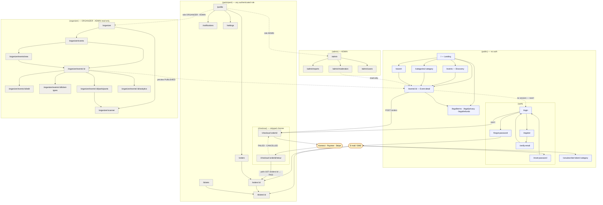

# Phase 2 — Information Architecture

| Field | Value |
| --- | --- |
| **Phase** | 2 of 11 |
| **Epic** | [01-frontend-plan-and-design-direction.md](01-frontend-plan-and-design-direction.md) |
| **Status** | ✅ Complete |
| **Owner** | Frontend Lead / Product Design |
| **Depends on** | [Phase 1 — Product Design Brief](02-product-design-brief.md) · the implemented contract in `backend/src` (verified, not assumed) |

> **Objective:** Map the complete application as a route tree grouped by access level, aligned to
> Next.js 16 App Router segments and required roles. Every route maps to ≥ 1 real backend endpoint
> or is explicitly static. This document also fixes the URL contract, the navigation hierarchy per
> role, and the route-protection behaviour — so that Phases 3–11 never have to invent a path, a
> query parameter, or a redirect.

---

## Contents

| | Section | What it fixes |
|---|---|---|
| **0** | [Ground rules and contract corrections](#0-ground-rules-and-contract-corrections) | What the Epic text got wrong, and the nine gaps this phase found |
| **1** | [The route tree](#1-the-route-tree) | 33 canonical routes + 3 static pages, per zone, each with role, rendering and endpoints |
| **2** | [App Router segment layout](#2-nextjs-app-router-segment-layout) | Route groups, the real folder tree, and where every special file sits |
| **3** | [Navigation hierarchy per role](#3-navigation-hierarchy-per-role) | Public header, 4 participant tabs, organizer sidebar, admin sidebar |
| **4** | [Sitemap diagram](#4-sitemap-diagram) | Every route in one picture |
| **5** | [Route protection matrix](#5-route-protection-matrix) | Role per pattern, and why 401 and 403 must never share a handler |
| **6** | [URL and query-parameter conventions](#6-url-and-query-parameter-conventions) | The filter contract for `/events` and `/search` |
| **7** | [French vs English path segments](#7-french-vs-english-path-segments) | The decision, the reasoning, the one exception |
| **8** | [Open items handed to other phases](#8-open-items-handed-to-other-phases) | What Phase 3+ and the backend now owe |
| — | [Acceptance criteria](#acceptance-criteria) | |

---

## 0. Ground rules and contract corrections

### 0.1 What this document is authoritative for

This is the **single source of truth for every URL in the Tickr frontend.** No later phase may
introduce a route, rename a segment, or invent a query parameter without amending this document
first. Phase 4 (Screen Inventory) enumerates *screens* against these routes; Phase 11 (Frontend
Architecture) enumerates *modules* against them. Both consume this tree; neither redefines it.

Everything below is constrained by the API that actually exists. Every route can be built today, but
**four ship degraded** until backend work lands, and each says so in place rather than being quietly
designed around: `/register` and `/forgot-password` (no mail is sent), `/organizer/events/[id]` and
its child tabs (no `DRAFT` is reachable by id), `/admin/moderation` (no admin-capable delete), and
`/organizer/events/[id]/participants` (aggregates, no attendee rows).

### 0.2 Five corrections to the Epic text

The Epic body ([issue #64](https://github.com/HexHunters/Tickr/issues/64) and
[01-frontend-plan-and-design-direction.md](01-frontend-plan-and-design-direction.md) §2.2) contains
five claims that do not match `backend/src`. **This document follows the code.**

| Epic says | Verified reality | Source |
|---|---|---|
| Base path `/v1` | **`/api`** — `app.setGlobalPrefix(apiPrefix)` with `API_PREFIX` defaulting to `'api'`. Full base: `https://api.tickr.tn/api`. Swagger at `/api/docs` | `backend/src/main.ts:17`, `config/app.config.ts` |
| Pagination `{ data, meta: { page, limit, total, totalPages } }` | **Flat**: `{ data, total, page, limit, totalPages, hasNextPage, hasPreviousPage }`. There is no `meta` object | `event-list.dto.ts:174-215` (`PaginatedEventListDto`) |
| Error envelope `{ statusCode, message, errors[], timestamp }` | The only globally registered filter is **`AllExceptionsFilter`**, which emits `{ statusCode, code, message, details, timestamp, path, method }`. `http-exception.filter.ts` and `validation-exception.filter.ts` exist but are wired to nothing, so their shapes are never returned. A `ValidationPipe` rejection arrives with `message` as a **string array**, not a string — the error renderer must handle both | `app.module.ts:80-83`, `all-exceptions.filter.ts:52-60` |
| Sold out → `409`, rate limited → `429` | Sold out (`INSUFFICIENT_AVAILABILITY`) → **`400`** (`orders.controller.ts:93`); order-creation rate limiting (`RATE_LIMITED`) → **`403`** (`:91`). **No controller emits `409` or `204` at all** — the only path to `409` is a `ConflictException` nothing throws. The throttler limits that would produce `429` are configured but their guard is not registered ([§5.3](#53-the-eight-meanings-of-403)) | `orders.controller.ts:88-95`, `users.module.ts:131-146` |
| Commission fetched at runtime via `GET /config/public` | **No such endpoint exists.** See [§0.3](#03--get-configpublic-does-not-exist) | — |

The envelope's `code` is **not** a machine-readable domain code: for anything a controller throws it
is the HTTP reason phrase — `'Bad Request'`, `'Forbidden'`, `'Not Found'`. The domain error types
(`INSUFFICIENT_AVAILABILITY`, `RATE_LIMITED`, `ORDER_EXPIRED`, `MAX_ATTEMPTS_EXCEEDED`, …) are
produced internally and **discarded at the controller boundary** — only `error.message` survives.
Every route that must distinguish two errors behind one status code therefore does so by
**status + endpoint context**, isolated in a single `mapApiError()` module — see
[Phase 1 §G.2](02-product-design-brief.md#g2-http-and-business-error-mapping).

### 0.3 ⚠ `GET /config/public` DOES NOT EXIST

`ls backend/src/config` returns `*.config.ts` files only — there is **no config controller anywhere
in the codebase**. `PLATFORM_COMMISSION_RATE` is read in exactly one place, inside
`create-order.handler.ts:41`, and is never exposed over HTTP.

⚠ **Do not read the rate out of `config/payments.config.ts`.** That file declares
`payments.commission.rate` with a fallback of `0.04`, but it is **not in `ConfigModule.forRoot`'s
`load[]`** (`app.module.ts:32`), so the `payments.*` namespace never resolves and the value is dead.
The live rate is the `0.06` inline fallback at `create-order.handler.ts:41`, and the fraud limits
below come from the inline fallbacks at `fraud-detection.service.ts:36-43` for the same reason.

The Epic body and `docs/02-technique/05-configuration-management.md:278` both reference
`GET /config/public`. **Both references are aspirational.** Treat it as a required backend task,
never as an available call.

**Where the frontend would have used it, and what it does instead:**

| Surface | What it needs | Interim source |
|---|---|---|
| `/events/[id]` — ticket sheet, before an order exists | Commission rate, to satisfy [Phase 1 §E.3](02-product-design-brief.md#e3--disclose-the-service-fee-the-instant-a-quantity-exists--never-at-the-payment-step) (fee disclosed the instant a quantity exists) | `PLATFORM_COMMISSION_RATE` constant, **labelled « estimation »** |
| `/organizer/events/new`, `/organizer/events/[id]/edit` | Live « votre billet à 50 DT coûtera 53 DT à l'acheteur » arithmetic | Same constant |
| `/checkout/[orderId]` — pre-order copy « réservés pendant 15 minutes » | `reservationTtlMinutes` | `RESERVATION_TTL_MINUTES` constant. **The live countdown is driven by the order's own `expiresAt`, never by this constant** |
| `/legal/refunds` | The rate quoted in the refund policy | Same constant, reviewed at publication |

**Interim implementation — exactly one module, `frontend/src/lib/config/platform.ts`:**

```ts
// ⚠ INTERIM. Every value here duplicates backend state that no endpoint exposes.
// Delete this module the day GET /config/public ships. See docs/08-frontend/03-information-architecture.md §0.3
export const PLATFORM_COMMISSION_RATE = Number(
  process.env.NEXT_PUBLIC_PLATFORM_COMMISSION_RATE ?? '0.06',
);                                   // create-order.handler.ts:41
export const RESERVATION_TTL_MINUTES = 15;   // reserve-tickets.handler.ts:24
export const ORDER_EXPIRATION_MINUTES = 15;  // create-order.handler.ts:42
export const MAX_TICKETS_PER_EVENT = 10;     // fraud-detection.service.ts:40-43
export const MAX_ORDERS_PER_HOUR = 5;        // fraud-detection.service.ts:36-39
export const CURRENCY = 'TND';               // currency.vo.ts
export const CURRENCY_SYMBOL = 'DT';
export const CURRENCY_DECIMALS = 3;          // millimes
```

**Three hard rules that keep the drift survivable:**

1. **No component reads `process.env` directly.** One module, one place to correct.
2. **Any figure derived from `PLATFORM_COMMISSION_RATE` is labelled an estimate** in the UI and is
   discarded the instant an order exists. Once `POST /orders` has returned, `subtotal`,
   `platformFee`, `paymentFees` and `total` come from the API verbatim and are never recomputed.
3. **`CURRENCY`, `CURRENCY_SYMBOL` and `CURRENCY_DECIMALS` are not drift risks** — they are fixed in
   `currency.vo.ts` and will not change. Only the rate and the TTLs are compromises.

### 0.4 Nine further gaps found while building this tree

These were discovered by grounding every route against `backend/src`. Each one changes what a route
can show, so each is recorded here rather than being discovered during implementation.

| # | Finding | Source | IA consequence |
|---|---|---|---|
| **1** | **`GET /events/organizer/:organizerId` requires `ORGANIZER` or `ADMIN`.** An organizer may only pass their own id (403 otherwise); only an admin may pass another's | `events.controller.ts:405-429` | **No public organizer profile page is possible in V1.** Confirms the non-goal in [Phase 1 §A.4](02-product-design-brief.md#a4-what-tickr-is-deliberately-not) |
| **2** | **`organizer.displayName` is a hard-coded placeholder** — every one of the six event query handlers returns `'Event Organizer'` with a `// TODO: Fetch from Users module` | `get-event-by-id.handler.ts:163`, `get-published-events.handler.ts:144`, +4 others | **No real organizer name may be rendered anywhere** — not on cards, not on `/events/[id]`. The organizer block is omitted from V1 rather than showing "Event Organizer" |
| **3** | **`GET /events` rejects `q`.** The global `ValidationPipe` runs `whitelist + forbidNonWhitelisted`, and `EventFilterDto` has no `q` field, so `/api/events?q=jazz` returns **400** | `main.ts:28-36`, `event-filter.dto.ts` | Search and filtering are **two non-composable surfaces**. See [§6.3](#63-search--a-separate-non-composable-surface) |
| **4** | **`GET /events/search` accepts only `q`, `page`, `limit`** — no category, city, date, price or sort | `events.controller.ts:255-289` | `/search` cannot carry filter chips. Flagged as a backend work item |
| **5** | **`DELETE /events/:id` is `@Roles('ORGANIZER')` + `IsEventOwnerGuard`, and neither has an ADMIN bypass** (`RolesGuard` has no superuser rule; `IsEventOwnerGuard` compares `organizerId === user.userId` only) | `events.controller.ts:582-584`, `roles.guard.ts:78-85`, `is-event-owner.guard.ts:75-80` | **`/admin/moderation` cannot delete an event today.** The route ships **read-only**, with the destructive action visible-but-blocked and the gap raised. See [§1.5](#15-admin-zone--admin) |
| **6** | **`GET /events/:id` cannot return a DRAFT to anyone — including its owner.** The handler gates on `isOwner = requestingUserId === event.organizerId`, but the route is `@Public()`, `EventsController` carries **no class-level `JwtAuthGuard`**, and no `APP_GUARD` is registered anywhere. Passport therefore never runs on this route, `@CurrentUser()` returns `null`, and `requestingUserId` is `undefined` on every call | `get-event-by-id.handler.ts:70-77`, `events.controller.ts:180-181` (no class guard) and `:368-377`, `current-user.decorator.ts` | **Every DRAFT is a 403 when fetched by id.** A draft exists for the organizer zone only as an `EventListDto` row from `GET /events/organizer/:organizerId` — which carries no `description`, no `imageUrl` and no `ticketTypes[]`, so a draft cannot be reopened, prefilled for edit, or given ticket types after a reload. Blocking backend task — see [§8](#8-open-items-handed-to-other-phases) |
| **7** | **No transactional e-mail is sent by either token flow.** `POST /auth/register` never issues a verification token (a commented-out `TODO`) while `POST /auth/login` returns 403 when `emailVerified` is false; `POST /auth/request-reset` creates a reset token but its send is also a `TODO` | `auth.controller.ts:154-155` vs `:187-192`; `:282` | **A newly registered user cannot log in, and no reset link is ever delivered.** `/register → /verify-email → /login` and `/forgot-password → /reset-password` are both broken end-to-end. There is no resend-verification endpoint either, so the 403 has **no recovery path in the API**. Blocking backend task — see [§8](#8-open-items-handed-to-other-phases) |
| **8** | **Notifications have no read/unread state.** `NotificationDto` carries a delivery `status` (`PENDING · SENDING · SENT · DELIVERED · FAILED`), not `isRead` | `notification.dto.ts:22-63`, `notification-status.vo.ts` | `/notifications` is a **delivery log**, not an inbox. **No unread badge is possible** on any navigation surface. Copy says « Messages envoyés », never « Notifications non lues » |
| **9** | **`EmailVerifiedGuard` exists and is provided but is applied to no controller** | `users.module.ts:78,182` — no `@UseGuards(EmailVerifiedGuard)` anywhere | No route may gate on email verification. A « vérifiez votre adresse » banner is advisory only |

---

## 1. The route tree

### 1.1 Reading the tables

- **Route** — the literal URL path. Dynamic segments use Next.js `[param]` notation.
- **Screen** — the working name. Phase 4 owns the full screen specification.
- **Role** — the *minimum* authenticated role. `—` means no authentication at all.
- **Rendering** — `SSG` static · `SSR` server-rendered per request · `ISR n` statically rendered and
  revalidated every *n* seconds · `CSR` client-rendered with React Query. Rationale in [§2.4](#24-rendering-strategy-and-why-every-protected-zone-is-client-rendered).
- **Primary endpoint(s)** — API paths relative to `https://api.tickr.tn/api`.
- **Notes** — the non-obvious constraint an implementer will otherwise get wrong.

### 1.2 Public zone — no authentication

| Route | Screen | Role | Rendering | Primary endpoint(s) | Notes |
|---|---|---|---|---|---|
| `/` | Landing / discovery home | — | `SSR` · `ISR 60` on the no-city variant | `GET /events/upcoming` | Accepts `city`/`country`/`page`/`limit` only — **no category, date or price filters**. Editorial rails that need those hit `GET /events` instead. City-first scoping per [Phase 1 §J](02-product-design-brief.md#j-competitive-inspiration) |
| `/events` | Discovery listing with filters | — | `SSR` (dynamic — `searchParams`) | `GET /events` | The only surface carrying the full filter set. **Rejects `q` with 400** (gap 3). Param contract in [§6.2](#62-the-events-parameter-contract) |
| `/events/[id]` | Event detail + ticket sheet | — | `SSR` (dynamic, never ISR) | `GET /events/:id` | `id` is a UUID (`ParseUUIDPipe` → 400 on a malformed id, render as 404). Never cached: availability is a per-fetch snapshot ([Phase 1 §E.2](02-product-design-brief.md#e2--availability-is-stated-in-words-and-numbers-never-implied-by-a-disabled-button)). ⚠ The route is `@Public()` with no guard, so **the bearer token is ignored and nobody — not even the owner — can fetch a DRAFT** (gap 6). A 403 here means *unpublished*, and renders as « Cet événement n'est pas disponible », never as a permission error. `generateMetadata` + JSON-LD `Event` here — this is the page that gets pasted into WhatsApp |
| `/search` | Search results | — | `CSR` | `GET /events/search` | `q` is **required** and must be **2–200 characters** after trimming (`search-events.handler.ts:59-70`) — a 1-character or empty query is a 400, so the submit threshold is two characters. Only `q`, `page`, `limit` are read. `noindex, follow` |
| `/categories/[category]` | Category listing | — | `SSR` · `ISR 60` · `generateStaticParams` over the 10 enum values | `GET /events/category/:category` | Segment is the **lowercased** enum (`/categories/concert`); the API upper-cases it. Only `page`/`limit` — no other filters. An unknown category is a 400 → render `not-found.tsx`. Canonical form for single-category browse ([§6.4](#64-categoriescategory-vs-eventscategory)) |
| `/login` | Sign in | — | `CSR` | `POST /auth/login` | Throttled **5 / 15 min** → 429. **`403` means e-mail not verified and nothing else** (`auth.controller.ts:188`); a deactivated account raises `UnauthorizedException` in `local.strategy.ts:73`, so it is a **401** indistinguishable by status from bad credentials. Neither is a role failure. Accepts `?next=` ([§5.4](#54-the-next-parameter-contract)) |
| `/register` | Create account | — | `CSR` | `POST /auth/register` | Throttled **3 / hour** → 429. Duplicate email → **400** (not 422, despite the Swagger annotation). Always creates a `PARTICIPANT`; there is no organizer self-signup endpoint. **⚠ Gap 7: no verification email is sent, so the account cannot yet log in** — the success screen must not promise an email that will not arrive until the backend task lands |
| `/verify-email` | Email verification | — | `CSR` | `POST /auth/verify-email` | Reads `?token=` from the URL and POSTs it in the body. `SkipThrottle`. Invalid or expired → 400. ⚠ **There is no resend endpoint**, so the recovery is « contactez-nous » and not a « demander un nouveau lien » button (gap 7). Also reachable without a token, as an instruction screen |
| `/forgot-password` | Request reset | — | `CSR` | `POST /auth/request-reset` | Throttled **3 / hour** → 429. Always returns 200 — **the UI must not reveal whether the address exists**; the success copy is identical either way. ⚠ The token is created but **the e-mail is never sent** (`auth.controller.ts:282`), so the flow dead-ends today (gap 7) |
| `/reset-password` | Set a new password | — | `CSR` | `POST /auth/reset-password` | Reads `?token=` from the URL, POSTs it with the new password. On success, redirect to `/login` with a success flash — **the endpoint does not return a session** |
| `/unsubscribe/[token]/[category]` | Email unsubscribe | — | `CSR` | `GET /notifications/unsubscribe/:token/:category` | `category` is constrained to **`marketing`** or **`event_reminders`** (any other value → 400). ⚠ The endpoint is a **`GET` with a side effect**, so it must fire on an explicit « Confirmer la désinscription » press, never on page load — email scanners and link prefetchers would otherwise unsubscribe users silently |
| `/legal/terms` | CGU | — | `SSG` | *(static)* | Label « Conditions générales d'utilisation » |
| `/legal/privacy` | Privacy policy | — | `SSG` | *(static)* | Label « Politique de confidentialité » |
| `/legal/refunds` | Refund policy | — | `SSG` | *(static)* | Must state that **the 6 % service fee is not refunded** (`request-refund.handler.ts:56`). Linked from `/events/[id]` and `/orders/[id]` — this page does real work in the purchase flow |

### 1.3 Participant zone — any authenticated user

`PARTICIPANT`, `ORGANIZER` and `ADMIN` all use this zone: `/orders`, `/tickets`, `/users/me` and
`/notifications` carry `JwtAuthGuard` **with no role guard**. An organizer buys tickets like anyone
else, and there is no second wallet.

| Route | Screen | Role | Rendering | Primary endpoint(s) | Notes |
|---|---|---|---|---|---|
| `/checkout/[orderId]` | Checkout & payment | any authenticated | `CSR` | `GET /orders/:id`, `POST /orders/:id/pay` | **The order already exists when this route is reached** — `POST /orders` is fired from the ticket sheet on `/events/[id]` and reserves the tickets internally ([Phase 1 §M.21](02-product-design-brief.md#m4-the-purchase-flow)). This route **never calls `POST /tickets/reserve`**; doing so would create a second, orphaned hold. Countdown is driven by `order.expiresAt`. `pay` body: `{ paymentMethod: STRIPE\|KONNECT\|PAYMEE, idempotencyKey? }` → `{ id, paymentUrl?, clientSecret?, status }`. Stripped chrome — no nav, no tabs |
| `/checkout/[orderId]/retour` | Payment return handler | any authenticated | `CSR` | `GET /orders/:id` (polled) | The gateway return URL. **Confirmation is webhook-driven, so the outcome is never read from the return query string** — the page polls `GET /orders/:id` until `PAID`, `FAILED` or `CANCELLED`, and presents a prolonged `PENDING`/`PROCESSING` as *verification in progress*, never as failure. On `PAID` → `/orders/[id]`. See [§7.3](#73-the-one-exception-in-the-tree) on the French segment |
| `/orders` | Order history | any authenticated | `CSR` | `GET /orders` | Flat pagination. **Only `page` and `limit` are accepted** — `PaginationQueryDto` under `forbidNonWhitelisted`, so `?status=PAID` returns 400. Status filtering is client-side over the loaded pages and must be labelled as filtering *this page*, not the whole history |
| `/orders/[id]` | Order detail + refund | any authenticated | `CSR` | `GET /orders/:id`, `POST /orders/:id/refund` | 403 here means *this order is not yours*, not a role failure. Renders `subtotal`, `platformFee`, a **conditional** `paymentFees` line and `total` verbatim. The refund confirmation must show the arithmetic first: **refund = subtotal + paymentFees; the commission is not returned** |
| `/tickets` | My tickets (wallet) | any authenticated | `CSR` | `GET /tickets` | Accepts `page`, `limit`, **`status`** (server-side, unlike `/orders`). Default view groups by upcoming vs. past. This is the route the bottom tab points at — it must be fast and work on a bad connection |
| `/tickets/[id]` | Ticket pass + QR | any authenticated | `CSR` | `GET /tickets/:id`, `GET /tickets/:id/pdf`, `POST /tickets/:id/transfer` | `GET /tickets/:id` admits the ticket owner **or the event's organizer** (`get-ticket-by-id.handler.ts:44-51`). `qrCode` is a plain string — `v1-{uuid}-{checksum}` (`ticket.dto.ts:33`, `qr-code.vo.ts`) — rendered and cached client-side, so the pass works offline. It is stable for the ticket's life **except across a transfer**, which mints a new one (`ticket.entity.ts:461`): invalidate the cached pass when `POST /tickets/:id/transfer` succeeds. Dark `ink-950` pass, QR ≥ 240 px ([Phase 1 §M.30](02-product-design-brief.md#m4-the-purchase-flow)). The PDF is the backup path: **owner-only**, a 302 to a signed S3 URL behind the bearer token (so never a plain `<a href>`), and a 404 until the post-confirmation listener has produced it. Transfer is a courtesy hand-off — no pricing, no listing |
| `/notifications` | Message history | any authenticated | `CSR` | `GET /notifications/me` (`?page&limit`), `GET /notifications/:id` | **⚠ A delivery log, not an inbox** (gap 8). No read state exists, so **no unread badge anywhere**. Channels are **EMAIL and SMS only** — `PUSH` is dead in `isSupportedChannel`. Copy never says « notification »; it says « e-mail » or « SMS ». `GET /notifications/:id` powers an in-page expansion, not a route |
| `/profile` | Profile | any authenticated | `CSR` | `GET /users/me`, `PUT /users/me` | The single source of the current user's `id` — needed by the organizer zone to call `GET /events/organizer/:organizerId`. Fetched once per session and cached |
| `/settings` | Settings | any authenticated | `CSR` | `PATCH /users/me/password`, `GET /notifications/preferences/me`, `PUT /notifications/preferences/me`, `DELETE /users/me` | Preferences are exactly four booleans: `emailEnabled`, `smsEnabled`, `marketingEnabled`, `eventRemindersEnabled`. **Do not render a PUSH toggle.** `DELETE /users/me` sits in a separate, visually distinct danger section behind a typed confirmation |

### 1.4 Organizer zone — `ORGANIZER` (`ADMIN` read-only)

`ADMIN` is admitted to this zone because `GET /events/organizer/:organizerId`,
`POST /tickets/check-in` and `GET /tickets/event/:eventId/stats` all list `'ADMIN'`. But
**`RolesGuard` has no superuser bypass**, so every write route (`@Roles('ORGANIZER')` +
`IsEventOwnerGuard`) rejects an admin. The zone therefore renders **read-only for `ADMIN`**: create,
edit, publish, delete and ticket-type controls are hidden, not disabled-and-failing.

| Route | Screen | Role | Rendering | Primary endpoint(s) | Notes |
|---|---|---|---|---|---|
| `/organizer` | Dashboard | `ORGANIZER` · `ADMIN` (read-only) | `CSR` | `GET /analytics/dashboard` | Accepts `timeRange` (`7d` · `30d` · `90d`, default `30d`). ⚠ Shows **gross sales only**. The organizer payout model is contradicted between `04-modele-economique.md` and the code, and no payout logic exists ([Phase 1 §L](02-product-design-brief.md#l-open-contract-questions-for-the-backend) gap 8). Never imply a net figure |
| `/organizer/events` | My events | `ORGANIZER` · `ADMIN` | `CSR` | `GET /events/organizer/:organizerId` | `organizerId` comes from `GET /users/me`, **never from the URL** — an organizer passing any other id gets 403. Accepts `status` (`EventStatus`), `page`, `limit`. ⚠ `status` is applied **after** the page is fetched and `total` is overwritten with the filtered page length (`get-organizer-events.handler.ts:82-90`), so a filtered view must not print a count or trust `totalPages`. Default view splits `DRAFT` / `PUBLISHED` / past. `DRAFT` must be unmistakable |
| `/organizer/events/new` | Create event | `ORGANIZER` only | `CSR` | `POST /events`, then `POST /events/:id/image` | Two steps: the event is created first, the image is uploaded against the returned id. **One image per event** — no gallery. ⚠ The result is a `DRAFT` and therefore not re-openable by id (gap 6), so hold the created event in memory for the rest of the session. Shows the live buyer-price arithmetic from the ⚠ interim constant ([§0.3](#03--get-configpublic-does-not-exist)) |
| `/organizer/events/[id]` | Event overview (owner view) | `ORGANIZER` (owner) | `CSR` | `GET /events/:id` | Same endpoint as the public page, and it ignores the bearer token. ⚠ **A `DRAFT` is a 403 here even for its owner** (gap 6), so until the backend accepts optional auth this screen — and `/edit` and `/ticket-types`, which read the same endpoint — can only render events that are already `PUBLISHED`. Unknown id → 404 |
| `/organizer/events/[id]/edit` | Edit · publish · delete | `ORGANIZER` (owner) | `CSR` | `PUT /events/:id`, `POST /events/:id/publish`, `DELETE /events/:id`, `POST /events/:id/image` | All four carry `IsEventOwnerGuard`. `DRAFT → PUBLISHED` is one-way in practice — publish is a confirmation step, not a toggle. Delete lives in a danger section |
| `/organizer/events/[id]/ticket-types` | Ticket types | `ORGANIZER` (owner) | `CSR` | `POST /events/:id/ticket-types`, `PUT /events/:id/ticket-types/:typeId`, `DELETE /events/:id/ticket-types/:typeId` | Reads the current tiers from `GET /events/:id` (`ticketTypes[]`) — there is no separate list endpoint. Each row shows `soldQuantity` / `availableQuantity` / `isSoldOut` / `isOnSale` as returned |
| `/organizer/events/[id]/participants` | Participants & check-in stats | `ORGANIZER` (owner) · `ADMIN` | `CSR` | `GET /tickets/event/:eventId/stats` | ⚠ **This is an aggregate stats endpoint, not a participant list.** No endpoint returns per-attendee rows for an event, so the screen is a stats board with a check-in entry point, not a table of names. Flagged in [§8](#8-open-items-handed-to-other-phases) |
| `/organizer/events/[id]/analytics` | Event analytics | `ORGANIZER` (owner) · `ADMIN` | `CSR` | `GET /analytics/events/:id`, `GET /analytics/events/:id/sales-timeline` | Gross sales only, as above |
| `/organizer/scanner` | Check-in scanner | `ORGANIZER` · `ADMIN` | `CSR` | `POST /tickets/check-in` | Dark surface, huge targets, unambiguous valid/invalid, usable at a venue door at night ([Phase 1 §D.2](02-product-design-brief.md#d2-colour)). Body is `{ qrCode, deviceId (≤ 100), locationGate (≤ 50) }` — all three **required** (`check-in.dto.ts`), so the device id and gate are chosen once per shift, not per scan. Not event-scoped in the URL — the scanned ticket carries its own event, and ⚠ the API checks the role but **not** that the operator owns that event. Must degrade to manual reference entry when the camera is unavailable |

### 1.5 Admin zone — `ADMIN`

| Route | Screen | Role | Rendering | Primary endpoint(s) | Notes |
|---|---|---|---|---|---|
| `/admin` | Platform overview | `ADMIN` | `CSR` | `GET /analytics/platform` | The only endpoint carrying `@Roles('ADMIN')` in the analytics controller |
| `/admin/reports` | Revenue reports & export | `ADMIN` | `CSR` | `GET /analytics/revenue-report`, `POST /analytics/export` | ⚠ Both are **`JwtAuthGuard` only at the guard level**; the admin scope is applied *inside* the handler (`user.role === 'ADMIN'` is passed as a flag, and a non-admin can get `ACCESS_DENIED` → 403). The UI still restricts the route to `ADMIN` — but do not assume the API does. `revenue-report` requires `startDate` and `endDate`; `NO_DATA` returns **404**, which must render as an empty state, not an error |
| `/admin/moderation` | Event moderation | `ADMIN` | `CSR` | `GET /events` | ⚠ **Read-only in V1.** `DELETE /events/:id` is `@Roles('ORGANIZER')` + `IsEventOwnerGuard` with no admin bypass (gap 5), so an admin **cannot** take an event down. `GET /events` also returns `PUBLISHED` only, so the list is not a moderation queue. The screen lists those events with a visible, explained « suppression indisponible » state and **no contact-the-organizer action** — no reporting endpoint exists, and gap 2 leaves the organizer nameless. Do not ship a delete button that always 403s |
| `/admin/users` | User directory | `ADMIN` | `CSR` | `GET /users`, `GET /users/:id` | Both are `@Roles('ADMIN')`. `GET /users` also takes a server-side **`role`** filter and defaults to **`limit=10`** (max 100) — unlike every other list in this document (`users.controller.ts:49-52`, `:336-337`). The detail view is a **slide-over on this route**, not a separate URL — `GET /users/:id` has no route of its own. 40 px data-table rows, desktop-first ([Phase 1 §D.9](02-product-design-brief.md#d9-spacing-and-density)) |

### 1.6 Route count reconciliation

| Zone | Routes |
|---|---|
| Public (excluding `/legal/*`) | 11 |
| Participant | 9 |
| Organizer | 9 |
| Admin | 4 |
| **Canonical total** | **33** |
| Static `/legal/*` group | 3 |
| **Addressable URLs** | **36** |

Earlier working notes recorded **31**, counting `/checkout/[orderId]/retour` and
`/organizer/events/[id]` as part of their parents. Both need their own `page.tsx` — the first has its
own polling lifecycle and is entered directly from a gateway redirect, the second is the owner
overview distinct from `/edit` — so both are counted. **33 is the number to build.**

### 1.7 Endpoint coverage matrix

Every V1 endpoint is either mapped to a route or explicitly excluded. There are no orphans in either
direction.

**Consumed by the UI**

| Endpoint | Route(s) |
|---|---|
| `POST /auth/register` | `/register` |
| `POST /auth/login` | `/login` |
| `POST /auth/verify-email` | `/verify-email` |
| `POST /auth/request-reset` | `/forgot-password` |
| `POST /auth/reset-password` | `/reset-password` |
| `POST /auth/refresh-token` | *(no route — axios interceptor, single-flight refresh; see [§5.2](#52-401-and-403-are-not-the-same-failure))* |
| `GET /users/me` · `PUT /users/me` | `/profile` (+ bootstrap for every protected zone) |
| `PATCH /users/me/password` · `DELETE /users/me` | `/settings` |
| `GET /users` · `GET /users/:id` | `/admin/users` |
| `GET /events` | `/events`, `/admin/moderation` |
| `GET /events/search` | `/search` |
| `GET /events/category/:category` | `/categories/[category]` |
| `GET /events/upcoming` | `/` |
| `GET /events/:id` | `/events/[id]`, `/organizer/events/[id]`, `/organizer/events/[id]/edit` (form prefill), `/organizer/events/[id]/ticket-types` (the `ticketTypes[]` source) |
| `GET /events/organizer/:organizerId` | `/organizer/events` |
| `POST /events` · `POST /events/:id/image` | `/organizer/events/new`, `/organizer/events/[id]/edit` |
| `PUT /events/:id` · `POST /events/:id/publish` · `DELETE /events/:id` | `/organizer/events/[id]/edit` |
| `POST\|PUT\|DELETE /events/:id/ticket-types[/:typeId]` | `/organizer/events/[id]/ticket-types` |
| `POST /orders` | *(fired from the ticket sheet on `/events/[id]`, lands on `/checkout/[orderId]`)* |
| `GET /orders` | `/orders` |
| `GET /orders/:id` | `/orders/[id]`, `/checkout/[orderId]`, `/checkout/[orderId]/retour` |
| `POST /orders/:id/pay` | `/checkout/[orderId]` |
| `POST /orders/:id/refund` | `/orders/[id]` |
| `GET /tickets` | `/tickets` |
| `GET /tickets/:id` · `GET /tickets/:id/pdf` · `POST /tickets/:id/transfer` | `/tickets/[id]` |
| `POST /tickets/check-in` | `/organizer/scanner` |
| `GET /tickets/event/:eventId/stats` | `/organizer/events/[id]/participants` |
| `GET /analytics/dashboard` | `/organizer` |
| `GET /analytics/events/:id` · `.../sales-timeline` | `/organizer/events/[id]/analytics` |
| `GET /analytics/platform` | `/admin` |
| `GET /analytics/revenue-report` · `POST /analytics/export` | `/admin/reports` |
| `GET /notifications/me` · `GET /notifications/:id` | `/notifications` |
| `GET\|PUT /notifications/preferences/me` | `/settings` |
| `GET /notifications/unsubscribe/:token/:category` | `/unsubscribe/[token]/[category]` |

**Deliberately not called by the UI**

| Endpoint | Why |
|---|---|
| `POST /tickets/reserve` | `POST /orders` already reserves internally (`create-order.handler.ts` step 5). Calling this from the participant flow creates an **orphaned second hold** that ties up inventory for 15 minutes. Internal/alternate path only |
| `POST /tickets/confirm` | Called by the Payments module after payment settles. Never client-initiated |
| `POST /tickets/cancel` | No V1 entry point — participant-side cancellation happens through the order refund path. If a per-ticket cancel is wanted, it needs a Phase 4 screen decision first |
| `POST /notifications` | System/admin dispatch. No V1 UI |
| `POST /payments/webhooks/stripe` · `GET /payments/webhooks/konnect` · `POST /payments/webhooks/paymee` | **Server-to-server. Never called by a browser under any circumstance.** Note that the Konnect webhook is a `GET` — it must not be confused with the `/checkout/[orderId]/retour` user-facing return URL |

---

## 2. Next.js App Router segment layout

### 2.1 Zone → route group → layout → guard → chrome

Route groups (`(name)`) organise layouts and guards **without adding a URL segment**. There are four
zones and one nested presentational group.

| Zone | Group | Guard in its `layout.tsx` | Chrome |
|---|---|---|---|
| Public | `(public)` | none | `PublicHeader` + `Footer`; auth pages use a nested `(auth)` group with a centred card layout and no nav |
| Participant | `(participant)` | `RequireAuth` — any authenticated role | Nested `(app)` group: header + **4-item bottom tab bar**. Nested `(checkout)` group: **stripped** — wordmark, countdown, money, nothing else |
| Organizer | `(organizer)` | `RequireRole(['ORGANIZER','ADMIN'])` | Persistent left sidebar ≥ `lg`, top bar + drawer below |
| Admin | `(admin)` | `RequireRole(['ADMIN'])` | Persistent left sidebar ≥ `lg`, top bar + drawer below |

The `(participant)` group splits into `(app)` and `(checkout)` because they share a guard but must
not share chrome: [Phase 1 §J](02-product-design-brief.md#j-competitive-inspiration) locks the
checkout as a stripped trust surface with **no competing affordance** — no tabs, no nav, no exits.
Splitting the group is how that is enforced structurally instead of by a per-page `hideNav` prop.

### 2.2 The folder tree

```text
frontend/src/
├── middleware.ts                             # see §2.5 — redirects only, never authorisation
└── app/
    ├── layout.tsx                            # <html lang="fr" dir="ltr">, Archivo + Inter, <Providers>, skip link
    ├── globals.css                           # Tailwind 4 @theme tokens (Phase 1 §K.1)
    ├── error.tsx                             # 'use client' — root error boundary
    ├── global-error.tsx                      # 'use client' — replaces the root layout when it throws
    ├── not-found.tsx                         # designed 404 with a search entry point
    ├── robots.ts                             # disallows every protected zone (§6.7)
    ├── sitemap.ts                            # built from GET /events + the 10 categories + static pages
    ├── manifest.ts
    │
    ├── (public)/
    │   ├── layout.tsx                        # PublicHeader + Footer
    │   ├── page.tsx                          #  →  /
    │   ├── loading.tsx
    │   ├── events/
    │   │   ├── page.tsx                      #  →  /events
    │   │   ├── loading.tsx                   # filter-aware card-grid skeleton
    │   │   └── [id]/
    │   │       ├── page.tsx                  #  →  /events/[id]      (generateMetadata + JSON-LD)
    │   │       ├── loading.tsx               # hero + sticky-bar skeleton, no CLS
    │   │       ├── error.tsx                 # 'use client'
    │   │       └── not-found.tsx             # « Cet événement n'est plus disponible »
    │   ├── search/
    │   │   ├── page.tsx                      #  →  /search
    │   │   └── loading.tsx
    │   ├── categories/
    │   │   └── [category]/
    │   │       ├── page.tsx                  #  →  /categories/[category]   (generateStaticParams ×10)
    │   │       ├── loading.tsx
    │   │       └── not-found.tsx             # unknown category
    │   ├── legal/
    │   │   ├── layout.tsx                    # prose container, max 72ch
    │   │   ├── terms/page.tsx                #  →  /legal/terms
    │   │   ├── privacy/page.tsx              #  →  /legal/privacy
    │   │   └── refunds/page.tsx              #  →  /legal/refunds
    │   ├── (auth)/                           # no URL segment — layout only
    │   │   ├── layout.tsx                    # centred card, wordmark, no nav
    │   │   ├── login/page.tsx                #  →  /login
    │   │   ├── register/page.tsx             #  →  /register
    │   │   ├── verify-email/page.tsx         #  →  /verify-email          (?token=)
    │   │   ├── forgot-password/page.tsx      #  →  /forgot-password
    │   │   └── reset-password/page.tsx       #  →  /reset-password        (?token=)
    │   └── unsubscribe/
    │       └── [token]/
    │           └── [category]/
    │               └── page.tsx              #  →  /unsubscribe/[token]/[category]
    │
    ├── (participant)/
    │   ├── layout.tsx                        # RequireAuth — no chrome of its own
    │   ├── (app)/
    │   │   ├── layout.tsx                    # AppHeader + BottomTabs (4) + <main>
    │   │   ├── orders/
    │   │   │   ├── page.tsx                  #  →  /orders
    │   │   │   ├── loading.tsx
    │   │   │   └── [id]/
    │   │   │       ├── page.tsx              #  →  /orders/[id]
    │   │   │       └── not-found.tsx
    │   │   ├── tickets/
    │   │   │   ├── page.tsx                  #  →  /tickets
    │   │   │   ├── loading.tsx
    │   │   │   └── [id]/
    │   │   │       ├── page.tsx              #  →  /tickets/[id]
    │   │   │       ├── error.tsx             # 'use client' — must offer the cached pass at the door
    │   │   │       └── not-found.tsx
    │   │   ├── notifications/page.tsx        #  →  /notifications
    │   │   ├── profile/page.tsx              #  →  /profile
    │   │   └── settings/page.tsx             #  →  /settings
    │   └── (checkout)/
    │       ├── layout.tsx                    # stripped: wordmark + countdown slot only
    │       └── checkout/
    │           └── [orderId]/
    │               ├── page.tsx              #  →  /checkout/[orderId]
    │               ├── error.tsx             # 'use client' — must never imply a charge succeeded/failed
    │               ├── not-found.tsx
    │               └── retour/
    │                   └── page.tsx          #  →  /checkout/[orderId]/retour
    │
    ├── (organizer)/
    │   ├── layout.tsx                        # RequireRole(ORGANIZER|ADMIN) + OrganizerSidebar/Drawer
    │   └── organizer/
    │       ├── page.tsx                      #  →  /organizer
    │       ├── loading.tsx
    │       ├── events/
    │       │   ├── page.tsx                  #  →  /organizer/events
    │       │   ├── new/page.tsx              #  →  /organizer/events/new
    │       │   └── [id]/
    │       │       ├── layout.tsx            # event context header + horizontal tab strip
    │       │       ├── page.tsx              #  →  /organizer/events/[id]
    │       │       ├── not-found.tsx
    │       │       ├── edit/page.tsx         #  →  /organizer/events/[id]/edit
    │       │       ├── ticket-types/page.tsx #  →  /organizer/events/[id]/ticket-types
    │       │       ├── participants/page.tsx #  →  /organizer/events/[id]/participants
    │       │       └── analytics/page.tsx    #  →  /organizer/events/[id]/analytics
    │       └── scanner/page.tsx              #  →  /organizer/scanner
    │
    └── (admin)/
        ├── layout.tsx                        # RequireRole(ADMIN) + AdminSidebar/Drawer
        └── admin/
            ├── page.tsx                      #  →  /admin
            ├── reports/page.tsx              #  →  /admin/reports
            ├── moderation/page.tsx           #  →  /admin/moderation
            └── users/page.tsx                #  →  /admin/users   (detail = slide-over, not a route)
```

### 2.3 Where the special files sit, and why

| File | Placement rule | Rationale |
|---|---|---|
| `layout.tsx` | Root, one per zone group, one per nested chrome group, and **one at `organizer/events/[id]`** | The event-context layout is the only nested layout below a zone. It holds the event title, status badge and tab strip so those do not re-fetch and re-mount across the five child tabs |
| `loading.tsx` | Every **server-rendered** segment that fetches (`/`, `/events`, `/events/[id]`, `/search`, `/categories/[category]`) and the two heaviest client zones (`/organizer`, `/orders`, `/tickets`) | On SSR segments it is the Suspense fallback and is what a 3G user actually sees. In CSR zones it covers the code-split chunk load only — **inside** those pages the skeletons come from React Query state, not from `loading.tsx`. Do not add `loading.tsx` to a segment whose page renders instantly from cache; an unnecessary flash is worse than none |
| `error.tsx` | `/events/[id]`, `/tickets/[id]`, `/checkout/[orderId]`, plus root | Only where a failure has a *specific* recovery. A generic boundary everywhere produces generic copy, which [Phase 1 §E.5](02-product-design-brief.md#e5--every-failure-names-its-cause-in-french-in-money-terms-and-offers-exactly-one-way-forward) forbids. **`/checkout/[orderId]/error.tsx` is the most delicate file in the app**: it must never state that a payment failed or succeeded — only that the status is unknown and is being checked |
| `not-found.tsx` | Root, `/events/[id]`, `/categories/[category]`, `/orders/[id]`, `/tickets/[id]`, `/checkout/[orderId]`, `/organizer/events/[id]` | Every route with a dynamic id that can 404. Each says *what* was not found, not "page not found" — a deleted or unpublished event says so rather than implying a broken link |
| `global-error.tsx` | Root only | Catches a throwing root layout. Ships its own `<html>`/`<body>` and must not import the design system, which may be what broke |
| `template.tsx` | **Not used** | Nothing in the tree needs per-navigation remount |
| `default.tsx` | **Not used** | No parallel routes in V1 |
| `route.ts` | **Not used in V1** | The browser talks to `https://api.tickr.tn/api` directly. If httpOnly cookies are adopted ([§2.5](#25-middlewarets--what-it-may-and-may-not-do)), a `/api/auth/*` BFF handler set appears here — the route tree above does not change |

### 2.4 Rendering strategy, and why every protected zone is client-rendered

**Public routes are server-rendered** because they are the product's front door: they must be
indexable, must produce Open Graph metadata for the WhatsApp and Instagram links that carry Tickr's
traffic, and must paint before hydration on a 3G connection.

**Every protected route is client-rendered**, and this is a consequence of the auth contract, not a
preference. `POST /auth/login` returns `{ accessToken, refreshToken, expiresIn, user }` **in the JSON
body**. There is no cookie session. The existing `frontend/src/lib/api/client.ts` stores the token in
`localStorage`, which a React Server Component cannot read. Server-rendering `/orders` would
therefore mean either shipping the token to the server on every navigation or duplicating the auth
contract — both worse than accepting CSR on screens that are behind a login and do not need SEO.

Two consequences to design for:

- Protected zones **must** render a real skeleton, never a blank screen, since first paint carries no
  data. The `loading.tsx` placement in [§2.3](#23-where-the-special-files-sit-and-why) follows from this.
- Discovery caching is capped at **60 seconds** anywhere, and `/events/[id]` is never cached at all,
  because `soldQuantity` is incremented at **hold** time (`event-query.adapter.ts:84-92`) and restored
  on expiry — availability can legitimately go *up*, and sold out is not terminal. A five-minute ISR
  window would show a sold-out tier that is no longer sold out.
  See [Phase 1 §E.2](02-product-design-brief.md#e2--availability-is-stated-in-words-and-numbers-never-implied-by-a-disabled-button).

If Phase 11 moves tokens into httpOnly cookies, protected routes may migrate to SSR **without any
change to this route tree**. That is the intended upgrade path.

### 2.5 `middleware.ts` — what it may and may not do

With tokens in `localStorage`, middleware **cannot see whether a user is authenticated**. It must
therefore never be the authorisation boundary.

**Middleware may:**
- Normalise trailing slashes and lower-case the `/categories/[category]` segment.
- Redirect legacy paths — in particular **`/auth/login` → `/login`** and `/auth/register` → `/register`,
  because `client.ts` currently hard-redirects to `/auth/login`, a path that does not exist in this
  tree (see [§8](#8-open-items-handed-to-other-phases), item 3).
- Attach request-id and security headers.

**Middleware may not:**
- Gate a route on a role. Authorisation lives in the zone `layout.tsx` guards **and, authoritatively,
  in the API**. A non-httpOnly "role hint" cookie is trivially forged and may only ever be used to
  choose a nicer redirect, never to grant access.

---

## 3. Navigation hierarchy per role

Design weight is **70 % participant / 25 % organizer / 5 % admin**
([Phase 1 §B](02-product-design-brief.md#b-target-users)), and the navigation reflects it: the
participant surface is the only one designed thumb-first.

### 3.1 Public — header and footer

**Mobile (base → `md`), 56 px, sticky, `surface` on `canvas`:**

```text
┌──────────────────────────────────────────────────────────┐
│  Tickr        [ Tunis ▾ ]              (🔍)   Connexion   │
└──────────────────────────────────────────────────────────┘
```

- **Wordmark** → `/`.
- **City chip** — persistent, scopes `/` (`GET /events/upcoming?city=`) and `/events`
  (`?city=`). City-first scoping, per the Fever takeaway in
  [Phase 1 §J](02-product-design-brief.md#j-competitive-inspiration). Its label is its **value**
  (« Tunis »), never its field name.
- **Search icon** → `/search`.
- **« Connexion »** → `/login?next=<current path>`. No hamburger: the public product is two levels
  deep and the footer carries the rest.

**Desktop (`md` →), 64 px:**

```text
┌───────────────────────────────────────────────────────────────────────────────────────┐
│  Tickr   Découvrir   Catégories ▾   [ 🔍 Rechercher un événement    ]  [Tunis ▾]      │
│                                                       Connexion   [ Créer un compte ] │
└───────────────────────────────────────────────────────────────────────────────────────┘
```

- **Découvrir** → `/events` · **Catégories ▾** → a Headless UI `Menu` of the 10 `EventCategory`
  values, each using its backend `displayNameFr` and icon, linking to `/categories/[category]`.
- The inline search field submits to `/search?q=…`.
- **« Créer un compte »** is the only `cobalt-600` primary button in the public header — one action
  colour, one primary action.

**Footer (all breakpoints):** Découvrir · the 10 categories · CGU · Confidentialité · Politique de
remboursement · contact. No locale switcher ships in V1 (French only).

**When a session exists**, the public header swaps `Connexion / Créer un compte` for the avatar menu
from [§3.2](#32-participant--four-mobile-tabs-and-a-desktop-header). The rest of the header is unchanged —
a logged-in user browsing events is still in the public zone.

### 3.2 Participant — four mobile tabs and a desktop header

**Mobile bottom tabs — exactly four, never five** ([Phase 1 §I.3](02-product-design-brief.md#i3-mobile-base--sm)).
Fixed, above `env(safe-area-inset-bottom)`, 56 px + inset, `shadow-sticky`:

| Tab | Icon (Heroicons) | Target | Active for |
|---|---|---|---|
| **Découvrir** | `Squares2X2Icon` | `/events` | `/`, `/events`, `/events/[id]`, `/categories/*` |
| **Recherche** | `MagnifyingGlassIcon` | `/search` | `/search` |
| **Mes billets** | `TicketIcon` | `/tickets` | `/tickets`, `/tickets/[id]` |
| **Compte** | `UserCircleIcon` | `/profile` | `/profile`, `/settings`, `/orders`, `/orders/[id]`, `/notifications` |

Rules:
1. **The tab bar is hidden on `/checkout/[orderId]` and `/checkout/[orderId]/retour`** — structurally,
   by living in the `(app)` group and not the `(checkout)` group.
2. **No badge on any tab.** There is no unread state to count (gap 8), and a fabricated badge is
   exactly the dishonesty [Phase 1 §C.2](02-product-design-brief.md#c2-the-seven-attributes-made-operational) forbids.
3. Labels are always visible — icon-only tabs fail the "an icon never carries meaning alone" rule.
4. Tapping the active tab scrolls its list to top; it does not re-navigate.
5. The tab bar is `<nav aria-label="Navigation principale">` with `aria-current="page"` on the active item.

**Compte** is a hub screen, because four tabs cannot hold seven destinations:

```text
Compte
  Mon profil            →  /profile
  Mes commandes         →  /orders
  Messages reçus        →  /notifications
  Paramètres            →  /settings
  ─────────────────────────────────────
  Espace organisateur   →  /organizer      (ORGANIZER · ADMIN only)
  Administration        →  /admin          (ADMIN only)
  ─────────────────────────────────────
  Se déconnecter
```

**Desktop (`md` →)** replaces the tabs with a top bar: wordmark · Découvrir · Recherche · Mes billets ·
city chip · avatar menu containing exactly the Compte list above.

### 3.3 Organizer — sidebar, drawer, and event context

**Desktop (`lg` →):** a persistent 240 px left sidebar, `surface` on `canvas`, with a `border`
hairline. Three destinations only — the organizer's model is « my events », not « my modules ».

```text
┌─────────────────────┐
│  Tickr  · Organisateur
│
│  ▸ Tableau de bord   →  /organizer
│  ▸ Mes événements    →  /organizer/events
│  ▸ Scanner           →  /organizer/scanner
│
│  ─────────────────
│  [ + Créer un événement ]      →  /organizer/events/new   (ORGANIZER only)
│
│  ↩ Voir le site      →  /
│  Compte ▾            →  participant menu
└─────────────────────┘
```

**Mobile / tablet (< `lg`):** the sidebar becomes a top bar with a Headless UI `Dialog` drawer
carrying the same three destinations. Additionally — because check-in happens standing at a door,
one-handed, in the dark ([Phase 1 §B.2](02-product-design-brief.md#b2-secondary-persona--the-organizer)) —
**`/organizer` and `/organizer/events/[id]` carry a persistent bottom-anchored « Scanner » action.**
It is the only organizer control designed for the thumb zone.

**Event context navigation** — rendered by `organizer/events/[id]/layout.tsx`, a horizontally
scrollable tab strip under the event title and status badge:

| Tab | Route |
|---|---|
| Aperçu | `/organizer/events/[id]` |
| Modifier | `/organizer/events/[id]/edit` |
| Billetterie | `/organizer/events/[id]/ticket-types` |
| Participants | `/organizer/events/[id]/participants` |
| Statistiques | `/organizer/events/[id]/analytics` |

For an `ADMIN`, **Modifier** and **Billetterie** are not rendered — the underlying endpoints reject
`ADMIN` outright (gap 5). Hiding beats disabling here: a disabled tab implies a permission that could
be granted, and none can be.

### 3.4 Admin — sidebar

Desktop-first (5 % design weight), same sidebar component as the organizer with a different item set
and no create action:

```text
┌─────────────────────┐
│  Tickr  · Administration
│
│  ▸ Vue d'ensemble    →  /admin
│  ▸ Rapports          →  /admin/reports
│  ▸ Modération        →  /admin/moderation
│  ▸ Utilisateurs      →  /admin/users
│
│  ─────────────────
│  ↩ Voir le site      →  /
│  Compte ▾
└─────────────────────┘
```

Below `lg` the same drawer pattern applies and **data tables become stacked cards** — the admin
tables are the one place density increases, and they are the one thing that must not be reflowed
into a horizontal scroll on a phone.

### 3.5 Cross-zone transitions

Six seams. Each is a routing contract, not a UI detail.

| # | Seam | Behaviour |
|---|---|---|
| **1** | `/events/[id]` (public) → checkout | The ticket sheet is fully usable logged out ([Phase 1 §E.1](02-product-design-brief.md#e1--two-taps-from-poster-to-checkout-and-never-ask-who-you-are-before-showing-the-price)). On « Continuer » with no session: persist the selection under `sessionStorage['tickr.pendingSelection.<eventId>']`, then `/login?next=/events/<id>%3Fsheet%3D1`. On return, the sheet reopens with the quantity intact. With a session: `POST /orders` → `router.replace('/checkout/' + order.id)`. **`replace`, not `push`** — Back must not return to a sheet whose hold now exists elsewhere |
| **2** | `/checkout/[orderId]` → gateway → `/checkout/[orderId]/retour` | Konnect and Paymee redirect off-site (`paymentUrl`); Stripe stays in-page (`clientSecret`). The return page **polls `GET /orders/:id`** and ignores every query parameter the gateway appends. `PAID` → `/orders/[id]`; `FAILED`/`CANCELLED` → back to `/checkout/[orderId]` with the failure state and the remaining hold; still `PENDING`/`PROCESSING` after the poll budget → « vérification en cours », never « échec » |
| **3** | Participant → organizer | Only via **Compte ▾ → Espace organisateur**, rendered when `user.role` is `ORGANIZER` or `ADMIN`. There is no automatic redirect on login — an organizer who came to buy a ticket stays where they were |
| **4** | Organizer/admin → public | « ↩ Voir le site » → `/`. Session preserved |
| **5** | Email links | `/verify-email?token=…` · `/reset-password?token=…` · `/unsubscribe/[token]/[category]` · deep links to `/tickets/[id]` and `/orders/[id]` (which pass through `/login?next=` when cold) |
| **6** | 403 in any zone | **Never a logout and never a redirect to `/login`.** See [§5.2](#52-401-and-403-are-not-the-same-failure) |

### 3.6 Breadcrumbs, back behaviour and focus

- **No breadcrumbs in the public or participant zones** — maximum depth is two, and breadcrumbs on a
  poster-led surface are visual noise.
- **Breadcrumbs in the organizer and admin zones only**, one level:
  `Mes événements / Concert Jazz Club / Billetterie`.
- **A route change moves focus to the page `<h1>`** and announces the new title politely; the skip
  link (« Aller au contenu principal ») is the first focusable element on every page
  ([Phase 1 §H.2](02-product-design-brief.md#h2-keyboard-navigation)).
- **Filter changes use `router.replace`; pagination uses `router.push`.** Back should undo *going to
  page 3*, not undo twelve keystrokes of a city filter.
- **Scroll restoration** is on for list routes; `scroll: false` on every filter-driven `replace`.

---

## 4. Sitemap diagram

> The diagram uses `:param` for dynamic segments (Mermaid-safe). The folder tree in
> [§2.2](#22-the-folder-tree) uses the real Next.js `[param]` form. They describe the same routes.



---

## 5. Route protection matrix

### 5.1 The matrix

`Auth` = a valid access token is required. `Role` = the roles the **API** admits. `Guard` = where the
frontend enforces it. The API is always the real authority; the frontend guard exists to avoid a
flash of forbidden content and to produce a designed failure instead of a raw 403.

| Route pattern | Auth | Role admitted by the API | Frontend guard | On **401** | On **403** |
|---|---|---|---|---|---|
| `/` · `/events` · `/events/[id]` · `/search` · `/categories/[category]` · `/legal/*` | no | — | none | n/a | `/events/[id]` only: a 403 means **the event is not published** — the route ignores the token, so this fires for the owner too (gap 6). Render `not-found.tsx` copy (« Cet événement n'est pas disponible »), never « interdit » and never a login prompt |
| `/login` · `/register` · `/verify-email` · `/forgot-password` · `/reset-password` | no | — | **Reverse guard**: an authenticated user hitting `/login` is redirected to `next` or their role home | n/a | On `/login` **403 = e-mail not verified** (a deactivated account is a 401). ⚠ No resend-verification endpoint exists, so the message must send the user to the original e-mail and to support — it may not offer an action the API cannot serve |
| `/unsubscribe/[token]/[category]` | no | — | none | n/a | n/a — invalid token/category is a **400** |
| `/checkout/[orderId]` · `/checkout/[orderId]/retour` | yes | any | `(participant)/layout.tsx` → `RequireAuth` | **Refresh first**, replay once, and only then `/login?next=<full path>`. The order survives — it is server-side state with its own `expiresAt` | Order belongs to another user → « Cette commande n'est pas la vôtre » + link to `/orders`. **Never a logout** |
| `/orders` · `/orders/[id]` · `/tickets` · `/tickets/[id]` · `/notifications` · `/profile` · `/settings` | yes | any | `RequireAuth` | Refresh → replay → `/login?next=` | Resource-ownership failure → designed 403 with a link to the corresponding list |
| `/organizer` · `/organizer/events` · `/organizer/scanner` | yes | `ORGANIZER` · `ADMIN` | `(organizer)/layout.tsx` → `RequireRole(['ORGANIZER','ADMIN'])` | Refresh → replay → `/login?next=` | Wrong role → **role-home redirect** ([§5.5](#55-role-mismatch-home-routes)) with an explanatory page, no login prompt |
| `/organizer/events/new` | yes | **`ORGANIZER` only** | `RequireRole(['ORGANIZER'])` | as above | An `ADMIN` never sees the entry point; direct navigation renders the designed 403 |
| `/organizer/events/[id]` | yes | `PUBLISHED` events only — `GET /events/:id` is `@Public()` and resolves no user (gap 6) | `RequireRole(['ORGANIZER','ADMIN'])`; ownership is not enforceable here today | as above | Any `DRAFT`, and any non-owner → the same 403. Copy « Cet événement n'est pas disponible » + link to `/organizer/events`, since the frontend cannot tell the two apart |
| `/organizer/events/[id]/edit` · `/ticket-types` | yes | **`ORGANIZER` owner only** (`IsEventOwnerGuard`, no admin bypass) | `RequireRole(['ORGANIZER'])`; tabs hidden for `ADMIN` | as above | Designed 403; the event context header stays so the user is not stranded |
| `/organizer/events/[id]/participants` · `/analytics` | yes | `ORGANIZER` (owner) · `ADMIN` | `RequireRole(['ORGANIZER','ADMIN'])` | as above | Designed 403 |
| `/admin` · `/admin/users` | yes | `ADMIN` | `(admin)/layout.tsx` → `RequireRole(['ADMIN'])` | Refresh → replay → `/login?next=` | Role-home redirect |
| `/admin/reports` | yes | ⚠ `JwtAuthGuard` **only** at the guard level; admin scope applied inside the handler | `RequireRole(['ADMIN'])` — the UI is stricter than the API on purpose | as above | `ACCESS_DENIED` from the handler → designed 403 |
| `/admin/moderation` | yes | `ADMIN` for the listing (`GET /events` is public); **no admin-capable delete exists** | `RequireRole(['ADMIN'])` | as above | n/a — the destructive action is not offered |

### 5.2 401 and 403 are not the same failure

They are handled by **different code paths that must never be merged**.

**401 — "we do not know who you are."**

```
401 → is a refresh already in flight?
        yes → queue this request behind it
        no  → POST /auth/refresh-token  (single-flight)
                success → persist tokens, replay the original request once
                failure → clear tokens, router.replace('/login?next=' + encodeURIComponent(pathname + search))
```

Three rules:
1. **One refresh at a time.** Ten parallel queries hitting a stale token must produce one refresh
   call and ten replays, not ten refreshes.
2. **Replay once, never twice.** A 401 on the replayed request is a real session end.
3. **Never redirect from inside `/checkout`** until the refresh has genuinely failed. A token
   expiring mid-checkout that destroys the user's order context is the single worst bug this
   document can prevent — and it is what the current `client.ts` does today
   ([§8](#8-open-items-handed-to-other-phases), item 3).

**403 — "we know exactly who you are, and the answer is still no."** A refresh cannot help. A logout
actively harms: it destroys a valid session over a permission question. **403 never clears a token
and never routes to `/login`.**

### 5.3 The eight meanings of 403

`403` is overloaded eight ways in this API. A single global handler would be wrong in most of them,
which is why 403 is resolved by **endpoint context** in `mapApiError()` and never by a route guard
alone.

| # | Source | Endpoint | Meaning | Frontend treatment |
|---|---|---|---|---|
| 1 | `RolesGuard` | any `@Roles(...)` route | Wrong role | Designed 403 page + role-home link |
| 2 | `IsEventOwnerGuard` | `PUT/DELETE /events/:id`, publish, ticket-types, image | Organizer is not the owner | « Vous n'êtes pas l'organisateur de cet événement » |
| 3 | `events.controller.ts:426` | `GET /events/organizer/:organizerId` | An organizer passed someone else's id | Should be unreachable — the id always comes from `GET /users/me`. If it happens, it is a bug, log it |
| 4 | `get-event-by-id.handler.ts:76` | `GET /events/:id` | The event is not `PUBLISHED`. The route resolves no user (gap 6), so this fires for **every** caller, owner included | Render as **not available** — « Cet événement n'est pas disponible » — never as *forbidden*, on the public route and in the organizer zone alike. Naming a draft would also leak its existence |
| 5 | `get-order-by-id.handler.ts:53-55` | `GET /orders/:id` | The order belongs to another user (an `ADMIN` is exempt here) | « Cette commande n'est pas la vôtre » |
| 6 | **`RATE_LIMITED`** | **`POST /orders`** | The fraud limit of **5 orders / hour / user** was hit | ⚠ **Not a permission failure at all.** « Vous avez atteint la limite de 5 commandes par heure. Réessayez plus tard. » — inline on the ticket sheet, with no logout and no navigation |
| 7 | `auth.controller.ts:188` | `POST /auth/login` | `emailVerified === false` — and only that. A deactivated account is a **401** from `local.strategy.ts:73` | Form-level message pointing at the original e-mail. ⚠ **No resend-verification endpoint exists**, so this state has no recovery in the API today (gap 7); do not render a « renvoyer le lien » button that cannot call anything |
| 8 | `ACCESS_DENIED` | `GET /analytics/revenue-report`, `POST /analytics/export`, `GET /orders` (`get-orders-by-user.handler.ts:46`), `GET /tickets/:id` (`get-ticket-by-id.handler.ts:51`) | Handler-level scope check, below the guards | Designed 403 for the surface |

**`429` is a genuinely different failure.** It is configured globally (`users.module.ts:131-146`:
3 req/s, 20 req/10 s, 100/min) and per auth route (`register` 3/h, `login` 5/15 min, `request-reset`
3/h). It disables the action and re-enables it on a visible timer, and is never confused with case 6
above, which is a business limit rather than a traffic limit. ⚠ **No `ThrottlerGuard` is registered
as an `APP_GUARD` anywhere in `backend/src`**, so none of these limits is enforced today. Build the
429 handling anyway — wiring the guard is a one-line change on the backend, not a redesign.

### 5.4 The `next` parameter contract

```
/login?next=%2Fcheckout%2F0f1c…%3Fstep%3Dpay
```

| Rule | Reason |
|---|---|
| `next` **must** start with exactly one `/` and must not start with `//` or contain `://` | Open-redirect defence. A failing value is dropped, not sanitised into something else |
| Same-origin only; `next` is never an absolute URL | Same |
| Max 512 characters, URL-encoded once | Prevents a URL that cannot be pasted into a chat message |
| `next` is consumed once, then removed from history via `router.replace` | Back must not bounce the user through `/login` again |
| A `next` pointing at `/checkout/[orderId]` is validated **after** login by re-fetching the order. If it has expired, land on `/events/[id]` with the expired-hold state instead | A user who authenticates into a dead checkout with no explanation will assume they were charged |
| `next` is never used to cross a role boundary | If the target's role guard rejects, fall through to the role home instead of looping |

### 5.5 Role-mismatch home routes

When a role guard rejects, the user is shown a designed page — **not a redirect that silently
swallows their intent** — with one primary action pointing at their own home:

| Actual role | Home | Primary action copy |
|---|---|---|
| Unauthenticated | `/events` | « Découvrir des événements » |
| `PARTICIPANT` | `/tickets` | « Voir mes billets » |
| `ORGANIZER` | `/organizer` | « Mon espace organisateur » |
| `ADMIN` | `/admin` | « Tableau de bord » |

---

## 6. URL and query-parameter conventions

### 6.1 Why filter state lives in the URL

Filter and pagination state for `/events`, `/search` and `/categories/[category]` lives **entirely in
the URL query string**. There is no zustand store mirroring it, and no component-local filter state
that the URL is written back from. Six reasons, in the order they matter for Tickr:

1. **Distribution.** Tickr's traffic arrives as pasted links in WhatsApp groups and Instagram
   stories. « Voilà ce qui se passe ce week-end à Tunis » is a URL or it is nothing.
   `/events?city=Tunis&dateFrom=2026-08-22&dateTo=2026-08-23` is that message.
2. **The back button becomes correct for free.** Filter state in React state makes Back leave the
   page; in the URL it steps back through the user's own decisions.
3. **`/events` is server-rendered.** Next.js hands `searchParams` to the server component, so the
   filtered result set is in the first HTML response — no blank grid, no hydration flash on 3G.
4. **One cache key.** The React Query key is derived from the normalised URL params, so two paths to
   the same filter set share one cache entry and one in-flight request.
5. **Deep-linkable empty and error states, and analytics for free.** A support conversation is a URL,
   not a description of which chips were tapped — and the URL *is* the page identity, so no custom
   event is needed to see which lenses people use.
6. **No duplicated state to desynchronise.** zustand holds session and ephemeral UI only.

### 6.2 The `/events` parameter contract

`GET /events` is backed by `EventFilterDto` under a global `ValidationPipe` with
`whitelist + forbidNonWhitelisted + transform`. **Any parameter not in this table produces a 400**,
so the URL→API mapping is a strict allowlist, not a pass-through.

| URL param | Sent to API | Type / format | Default (omitted from the URL) | Notes |
|---|---|---|---|---|
| `category` | `category` | `EventCategory` enum, **UPPERCASE** | none | Single value. The API has no multi-category filter — the chip row is single-select, and the UI must not imply otherwise |
| `city` | `city` | string ≤ 100, case-insensitive | none | Bound to the persistent header city chip |
| `country` | `country` | string ≤ 100 | none | Supported but **not surfaced** in V1 (Tunisia-only product). Kept in the allowlist so a deep link does not 400 |
| `dateFrom` | `dateFrom` | URL: `YYYY-MM-DD` → API: full ISO 8601 | none | Expanded to `T00:00:00.000` **in `Africa/Tunis` (UTC+1, no DST)** then serialised as UTC. Expanding in the browser's local zone is the bug this row exists to prevent |
| `dateTo` | `dateTo` | URL: `YYYY-MM-DD` → API: full ISO 8601 | none | Expanded to `T23:59:59.999` in `Africa/Tunis`. **Inclusive** — « samedi » must include Saturday |
| `minPrice` | `minPrice` | decimal **dinars**, `.` separator, ≥ 0 | none | Not millimes. `50` means 50 DT. The UI displays `,` per `fr-TN` but the URL always uses `.` |
| `maxPrice` | `maxPrice` | decimal dinars, `.` separator, ≥ 0 | none | The « Jusqu'à 50 DT » ceiling chip |
| `sortBy` | `sortBy` | one of `createdAt` · `updatedAt` · `startDate` · `endDate` · `title` · `totalCapacity` · `soldTickets` · `publishedAt` | `startDate` | Only **three** are exposed as named lenses: « Bientôt » (`startDate` ASC), « Les plus demandés » (`soldTickets` DESC), « Nouveautés » (`publishedAt` DESC). The rest stay valid for deep links |
| `sortOrder` | `sortOrder` | `ASC` · `DESC` | `DESC` | ⚠ The API default is `DESC`. « Bientôt » must therefore send `sortOrder=ASC` **explicitly**, or the soonest events land last |
| `page` | `page` | integer ≥ 1 | `1` | 1-based. Clamped to `totalPages` from the flat response |
| — | `limit` | — | **fixed at 20, never in the URL** | A shared link must show the same page to everyone. Making `limit` responsive would change what "page 3" means per device, and the API caps it at 100 anyway |
| ⚠ `q` | **not sent** | — | — | **`GET /events` rejects `q` with 400** (gap 3). See [§6.3](#63-search--a-separate-non-composable-surface) |

**Serialization rules** — all enforced in one module, `frontend/src/lib/url/event-filters.ts`:

```ts
// The single parser. Every consumer of /events params goes through this.
export const eventFiltersSchema = z.object({ /* the allowlist above */ });

export function parseEventFilters(sp: URLSearchParams): EventFilters;   // lenient: drops invalid values
export function toSearchParams(f: EventFilters): URLSearchParams;       // canonical order, defaults omitted
export function toApiQuery(f: EventFilters): Record<string, string>;    // allowlist + TZ expansion
```

1. **Defaults are never written.** `/events` and `/events?page=1&sortOrder=DESC` are the same page and
   the second form is never produced.
2. **Canonical parameter order** — `category, city, country, dateFrom, dateTo, minPrice, maxPrice,
   sortBy, sortOrder, page` — so identical filter sets yield one cache key and one CDN entry.
3. **An empty value removes the parameter.** `city=` never appears.
4. **Invalid values are dropped silently** and the URL is rewritten to the cleaned form. A malformed
   deep link shows results, never a 400.
5. **Any filter change resets `page` to 1**, and uses `router.replace(..., { scroll: false })`.
   **Pagination uses `router.push`** so Back undoes a page change.
6. **Text inputs debounce 300 ms** before the URL is written.
7. **Chips are labelled with their value, not their field** — « Tunis », « Ce week-end »,
   « Jusqu'à 50 DT » — per the Meetup takeaway in [Phase 1 §J](02-product-design-brief.md#j-competitive-inspiration).

### 6.3 `/search` — a separate, non-composable surface

`GET /events/search` accepts **`q` (required), `page`, `limit` and nothing else**. It has no
category, city, date, price or sort parameters. Search and filtering therefore **cannot be
combined server-side**, and this is a product constraint, not an implementation choice.

| Rule | Detail |
|---|---|
| `q` is exclusive to `/search` | `/events` never carries it; `/search` never carries a filter |
| Typing a query while filters are applied navigates to `/search?q=…` | With a visible, dismissible note: « La recherche ignore vos filtres. » and a one-tap « Revenir aux filtres » back to the previous `/events` URL |
| A `q` shorter than **2 characters** after trimming is a **400** | `search-events.handler.ts:59-70`. The page never submits below the threshold; it renders the "start typing" state instead |
| Results are **not** filtered client-side | The response is one server page of a larger set; filtering it locally would produce a result count that is simply wrong |
| `/search` is `noindex, follow` | Search-result pages are not a public index surface |
| `q` is trimmed and capped at **200 characters** | `search-events.handler.ts:66-70`. `SearchDto` exists in `event-filter.dto.ts` but the controller does not use it — it reads `@Query('q')` directly, so the only enforced bounds are the handler's |

**Backend work item:** make `GET /events/search` accept `EventFilterDto` (or add `q` to `GET /events`).
That single change collapses these two surfaces into one and removes the note above. Recorded in
[§8](#8-open-items-handed-to-other-phases).

### 6.4 `/categories/[category]` vs `/events?category=`

Both exist and they are not redundant.

| | `/categories/[category]` | `/events?category=CONCERT` |
|---|---|---|
| Endpoint | `GET /events/category/:category` | `GET /events` |
| Extra filters | **none** — only `page`, `limit` | the full set |
| Rendering | `SSR` + `ISR 60` + `generateStaticParams` over the 10 enum values | `SSR` dynamic |
| Indexing | **Indexable. The canonical form of a single-category browse** | `noindex, follow` |
| Segment case | lowercase (`/categories/concert`); the API upper-cases it | UPPERCASE enum value |

**The rule:** a bare category browse lives at `/categories/[category]`. The moment a second lens is
applied the UI navigates to `/events?category=…&city=…`, which emits
`<link rel="canonical" href="/categories/concert">` — as does any single-category-only state at
`/events`. Ten pre-rendered, indexable category pages earn real organic traffic; a hundred filter
permutations do not.

### 6.5 Protected-zone list parameters

| Route | Accepted | Rejected — and what happens |
|---|---|---|
| `/tickets` | `status`, `page` | `status` **is** supported server-side (`GET /tickets?status=`). URL-driven, same rules as §6.2 |
| `/orders` | `page` only | ⚠ `GET /orders` uses `PaginationQueryDto` under `forbidNonWhitelisted` — **`?status=PAID` returns 400.** Status filtering is client-side over loaded pages and must be labelled « sur cette page » |
| `/organizer/events` | `status` (`EventStatus`), `page` | ⚠ The API accepts `status` but filters **after** paginating and then sets `total` to the filtered page length (`get-organizer-events.handler.ts:82-90`) — so a filtered view shows no count and does not paginate. The default view is the three-way `DRAFT` / `PUBLISHED` / past split |
| `/admin/users` | `page`, **`role`** | `role` filters server-side (`users.controller.ts:339`); page size defaults to **10** here, not 20. Plus client-side search over the loaded page, labelled as such |
| `/admin/moderation` | `page` | `GET /events` returns `PUBLISHED` only, so the list is never a full moderation queue. Client-side search over the loaded page, labelled as such |
| `/admin/reports` | `startDate`, `endDate` (both **required** by the API) | `NO_DATA` → **404**, rendered as an empty state, never as an error |

### 6.6 Path and identifier conventions

- **Every dynamic id is a UUID.** `ParseUUIDPipe` returns **400** on a malformed id — the frontend
  validates the shape before fetching and renders `not-found.tsx` rather than surfacing a 400.
- **Lowercase, hyphenated segments.** No camelCase, no underscores — except
  `/unsubscribe/[token]/[category]`, whose `category` values (`marketing`, `event_reminders`) are
  **fixed by the backend** and must be passed through verbatim.
- **No trailing slashes** (`trailingSlash: false`); middleware normalises.
- **Never put a user id in a path.** `/organizer/events` resolves `organizerId` from `GET /users/me`;
  an organizer passing another id gets a 403 by design.
- **Ephemeral UI state may use the query string** where it should survive a share or a reload —
  `?sheet=1` reopens the ticket sheet on `/events/[id]` after authentication. It never uses the hash.

### 6.7 Indexing, canonical URLs, sitemap and Open Graph

| Surface | Directive |
|---|---|
| `/`, `/events` (no params), `/categories/[category]`, `/events/[id]`, `/legal/*` | `index, follow` |
| `/events` **with** any query parameter | `noindex, follow` — canonical to `/events` or to `/categories/[category]` when category is the only lens |
| `/search` | `noindex, follow` |
| Every protected route | `noindex, nofollow` + `robots.ts` disallow: `/checkout`, `/orders`, `/tickets`, `/notifications`, `/profile`, `/settings`, `/organizer`, `/admin`, `/unsubscribe` |
| `/events/[id]` | `generateMetadata` → title, description (truncated `description`), `og:image` from `imageUrl`, `og:type=website`, plus JSON-LD `Event` (`name`, `startDate`, `endDate`, `location`, `offers.price` from `ticketSummary.minPrice`, `priceCurrency: "TND"`, `availability` from `isSoldOut`). **This is the page that gets pasted into WhatsApp — its preview card is a distribution asset, not an SEO detail** |
| `sitemap.ts` | Published events from `GET /events` (paged), the 10 category pages, `/`, `/events`, `/legal/*`. Never a protected route |

Note that `EventListDto` already carries `ticketSummary { minPrice, maxPrice, currency, totalCapacity,
totalSold, totalAvailable, ticketTypeCount, hasAvailableTickets }`, plus `salesProgress`, `isSoldOut`
and `isOnSale` — so **a discovery card shows price and availability with no additional request**, and
the JSON-LD offer block needs no extra call either.

---

## 7. French vs English path segments

### 7.1 The decision

> **Path segments are English. Every user-visible label is French.**
> `/events` renders as « Découvrir » · `/tickets` renders as « Mes billets » ·
> `/organizer/events/[id]/ticket-types` renders as « Billetterie ».

All strings are externalised from day one ([Phase 1 §C.3](02-product-design-brief.md#c3-voice-and-tone)),
so the label layer and the routing layer are already separate concerns. This decision keeps them that
way.

### 7.2 Why

| # | Reason | Detail |
|---|---|---|
| **1** | **Path segments are code, not copy** | They are folder names, route constants, Playwright selectors, analytics page identities and log lines. Every one of those is English in this repository, as is the entire stack. French folder names would create two vocabularies inside one codebase |
| **2** | **1:1 with the API resource** | `/events/[id]` ↔ `GET /events/:id`; `/orders/[id]` ↔ `GET /orders/:id`; `/tickets` ↔ `GET /tickets`. A developer reading a network log can map request to route without a translation table. `/billets` ↔ `GET /tickets` breaks that instantly |
| **3** | **Diacritics break shareable URLs** | `/événements` percent-encodes to `/%C3%A9v%C3%A9nements`. In a WhatsApp message — Tickr's primary distribution channel — that is what the recipient sees. It looks broken, it defeats copy-paste, and it corrupts analytics grouping. Stripping the accents (`/evenements`) yields a word that is neither correct French nor English |
| **4** | **The Arabic locale is planned** | [Phase 1 §M.1](02-product-design-brief.md#m1-product-and-scope) commits to Arabic as a future locale. With French paths, Arabic would need a third path vocabulary or an untranslated French URL served to Arabic readers. With neutral English segments, adding Arabic is a **prefix**: `/ar/events`, same tree underneath. Never `/ar/الفعاليات` |
| **5** | **The SEO argument does not survive contact with the data** | Tunisian search behaviour mixes French, Arabic and transliterated Latin. The ranking signals that matter here are `<title>`, `<h1>`, the meta description and the JSON-LD `Event` block — **all of which are French** ([§6.7](#67-indexing-canonical-urls-sitemap-and-open-graph)). Keyword weight from a path segment is negligible by comparison, and the segment that actually carries meaning — the event's own name — is not in the URL at all in V1 |
| **6** | **Renaming later is expensive; keeping labels flexible is free** | A path is a permanent public contract with search engines, pasted links and gateway return-URL configuration. A label is a JSON value. Put the churn where it is cheap |

**Considered and rejected:**

| Option | Why not |
|---|---|
| Full French paths (`/evenements`, `/billets`, `/mes-commandes`) | Reasons 1–4 above. Also splits the codebase's vocabulary permanently |
| Locale-prefixed French from day one (`/fr/evenements`) | Adds a segment to every URL to serve a single locale, and still commits to a French path vocabulary |
| French **aliases** redirecting to English | Duplicate canonical surface, doubled sitemap and analytics maintenance, for no measurable gain |

### 7.3 The one exception in the tree

**`/checkout/[orderId]/retour`** is the only French segment in 33 routes, and it is inconsistent with
the rule above. It is called out here rather than quietly normalised:

- It is a **gateway return URL**. Once registered with Konnect and Paymee, changing it is a
  provider-dashboard configuration change coordinated with a deploy, not a code change.
- It is user-visible for only a few seconds, and always inside the stripped checkout chrome.

**Recommendation:** rename to **`/checkout/[orderId]/return`** *before* the first gateway sandbox
registration. After that point the cost of changing it exceeds the value of the consistency, and the
exception should simply be documented and left alone. **This is a decision with an expiry date —
take it in Phase 3, not later.** The route tree in [§1](#1-the-route-tree) records `retour` because
that is the canonical tree as agreed; amend both this document and the tree if the rename happens.

The `/legal/*` children follow the English rule with French labels: `/legal/terms` → « Conditions
générales d'utilisation », `/legal/privacy` → « Politique de confidentialité », `/legal/refunds` →
« Politique de remboursement ».

### 7.4 Locale strategy for V1

- **No locale prefix ships in V1.** `/events`, not `/fr/events`. A prefix for a single locale is
  noise, and it would change every URL the day it were removed.
- `<html lang="fr" dir="ltr">` in the root layout; `fr-TN` for every `Intl` formatter (dates, and
  numbers with `,` as the decimal separator and `tabular-nums`).
- When Arabic lands, a `[locale]` segment or a middleware rewrite adds `/ar/*` **above** the existing
  tree. French stays at the unprefixed root so no existing link breaks. `dir="rtl"` becomes a
  root-attribute swap because the design system uses logical properties.
- Copy lives in `messages/fr.json` from day one. **No hard-coded French in a component**, including
  navigation labels — the tables in [§3](#3-navigation-hierarchy-per-role) are content, not code.

---

## 8. Open items handed to other phases

**Backend work items surfaced or confirmed by this phase** (in priority order; 3, 4 and 9 also appear
in [Phase 1 §L](02-product-design-brief.md#l-open-contract-questions-for-the-backend)):

| # | Item | Blocks |
|---|---|---|
| **1** | **Send the two transactional e-mails.** `POST /auth/register` never issues a verification token (`auth.controller.ts:154-155`) while `POST /auth/login` returns 403 for `emailVerified === false` (`:187-192`), and `POST /auth/request-reset` never sends its link (`:282`). A resend-verification endpoint is needed too, or the 403 has no recovery | The entire `/register → /verify-email → /login → /checkout` path, and `/forgot-password → /reset-password`. The highest-priority backend item in the whole Epic |
| **2** | **Make `GET /events/:id` resolve an optional bearer token** — apply `JwtAuthGuard` with a passthrough for `@Public()`, or add an owner-scoped `GET /events/:id` under `JwtAuthGuard`. Today the route resolves no user, so `requestingUserId` is always `undefined` and every `DRAFT` is a 403 (gap 6) | The whole organizer create → edit → publish loop. `/organizer/events/[id]`, `/edit` and `/ticket-types` can only open events that are already `PUBLISHED`, so a draft cannot be reopened after a reload |
| **3** | **Implement `GET /config/public`** returning at least `{ commissionRate, currency, reservationTtlMinutes }` | Removes the interim constant module in [§0.3](#03--get-configpublic-does-not-exist) and the « estimation » labels on `/events/[id]` and `/organizer/events/new` |
| **4** | **Add a machine-readable `code` to the error envelope**, carrying the domain error types the handlers already produce | Collapses [§5.3](#53-the-eight-meanings-of-403) from context-guessing to a switch statement |
| **5** | **Allow `ADMIN` on `DELETE /events/:id`** (and give `IsEventOwnerGuard` an admin bypass) | `/admin/moderation` ships read-only until this lands |
| **6** | **Make `GET /events/search` accept `EventFilterDto`**, or add `q` to `GET /events` | Collapses `/search` and `/events` into one composable surface and removes the note in [§6.3](#63-search--a-separate-non-composable-surface) |
| **7** | **Add a per-event participant list endpoint.** `GET /tickets/event/:eventId/stats` returns aggregates only | `/organizer/events/[id]/participants` is a stats board, not a list, until this exists |
| **8** | **Populate `organizer.displayName`** from the Users module — all six event query handlers return the literal `'Event Organizer'` | Any organizer attribution on cards or `/events/[id]` |
| **9** | **Settle the organizer payout model** | All organizer revenue UI; surfaces show **gross sales only** meanwhile |
| **10** | **Register `ThrottlerGuard` as an `APP_GUARD`** — the limits in `users.module.ts:131-146` and the `@Throttle()` decorators on the auth routes are configured but unenforced | Nothing in the UI, which handles 429 regardless; listed so the gap is not mistaken for a frontend omission |

**Closed by this re-verification:** the QR payload is *not* an open question. `TicketDto.qrCode` is a
plain string, `v1-{uuid}-{checksum}` (`ticket.dto.ts:33`, `qr-code.vo.ts`), generated once at hold
time (`reserve-tickets.handler.ts:120`) and rewritten **only** by a transfer
(`ticket.entity.ts:461`). The client renders and caches it locally; the sole cache rule is to
invalidate the stored pass when `POST /tickets/:id/transfer` succeeds. Nothing here blocks
`/tickets/[id]`.

**Frontend defects to fix before the first protected route ships** (`frontend/src/lib/api/client.ts`):

1. **The 401 handler hard-redirects and clears the token with no refresh attempt**, even though
   `POST /auth/refresh-token` exists. Replace with the single-flight refresh-and-replay in
   [§5.2](#52-401-and-403-are-not-the-same-failure).
2. **It redirects to `/auth/login`, which is not a route in this tree.** The canonical path is
   `/login`. Fix the client; add the middleware redirect in
   [§2.5](#25-middlewarets--what-it-may-and-may-not-do) as a safety net for any stale link.
3. **It discards the current location**, so the user cannot be returned to where they were. Add
   `?next=` per [§5.4](#54-the-next-parameter-contract).
4. **`baseURL` defaults to `http://localhost:3000`** with no `/api` suffix. Every path in this
   document is relative to `https://api.tickr.tn/api`.

**Handed to later phases:**

| Phase | Owes |
|---|---|
| **3 — User Journeys** | Step-by-step flows over exactly these routes; the `/checkout/[orderId]/retour` polling budget and its copy at each threshold; the `retour` vs `return` rename decision ([§7.3](#73-the-one-exception-in-the-tree)) |
| **4 — Screen Inventory** | One screen spec per route in [§1](#1-the-route-tree), reconciled 1:1 with this tree; the `/organizer/events/[id]/participants` design given the aggregate-only endpoint |
| **6 — Component Inventory** | `PublicHeader`, `BottomTabs`, `OrganizerSidebar`, `AdminSidebar`, `RequireAuth`, `RequireRole`, `FilterChipRow`, `PaginationControl` — all named here, all specified there |
| **11 — Frontend Architecture** | The `mapApiError()` module, the single-flight refresh interceptor, `lib/url/event-filters.ts`, `lib/config/platform.ts`, and the httpOnly-cookie migration that would let protected zones become SSR |

---

## Acceptance Criteria

- [x] Every route mapped to a role and ≥ 1 endpoint (or flagged static) — 33 canonical routes + 3 static legal pages, [§1](#1-the-route-tree)
- [x] Navigation hierarchy defined per role — public header, 4 participant tabs, organizer sidebar, admin sidebar, [§3](#3-navigation-hierarchy-per-role)
- [x] Sitemap diagram covers all routes — [§4](#4-sitemap-diagram)
- [x] No orphan routes — every route is reachable from at least one navigation surface or an external link (email/gateway), and every V1 endpoint is either mapped to a route or explicitly excluded with a reason, [§1.7](#17-endpoint-coverage-matrix)
- [x] Route tree expressed as Next.js App Router segments with route groups, and the placement of every `layout` / `loading` / `error` / `not-found` justified — [§2](#2-nextjs-app-router-segment-layout)
- [x] A rendering strategy assigned to every route, with the reason protected zones are client-rendered — [§2.4](#24-rendering-strategy-and-why-every-protected-zone-is-client-rendered)
- [x] Route protection matrix defined, with **401 and 403 handled by different code paths** and all eight sources of 403 enumerated — [§5](#5-route-protection-matrix)
- [x] URL and query-parameter contract fixed for `/events`, `/search`, `/categories/[category]` and every protected list, including timezone and decimal-separator rules — [§6](#6-url-and-query-parameter-conventions)
- [x] French vs English path segments decided and justified, with the single exception documented and given a decision deadline — [§7](#7-french-vs-english-path-segments)
- [x] Every reference to `GET /config/public` flagged **⚠ NOT IMPLEMENTED** with the interim constant approach specified — [§0.3](#03--get-configpublic-does-not-exist)
- [x] The five incorrect claims in the Epic body corrected against `backend/src` — [§0.2](#02-five-corrections-to-the-epic-text)
- [x] **Reconciled with the Screen Inventory** — [Phase 4 §3](05-screen-inventory.md#3-count-and-reconciliation-with-phase-2) maps the same 33 routes to 33 screens, with no orphan in either direction
- [ ] **`GET /config/public` implemented** — backend change; until then the interim constant stands
- [ ] **`POST /auth/register` issues a verification token, and `POST /auth/request-reset` sends its mail** — backend change; `/register → /login` and `/forgot-password → /reset-password` are both broken end-to-end without it
- [ ] **`GET /events/:id` resolves an optional bearer token** — backend change; without it no `DRAFT` is reachable by id and the organizer zone can only open published events ([§8](#8-open-items-handed-to-other-phases), item 2)
- [ ] **`/admin/moderation` delete capability** — backend change; the route ships read-only
- [ ] **`/checkout/[orderId]/retour` → `/return` rename** — decide in Phase 3, before the first gateway registration
- [ ] **Reviewed and signed off by the Product Owner**
