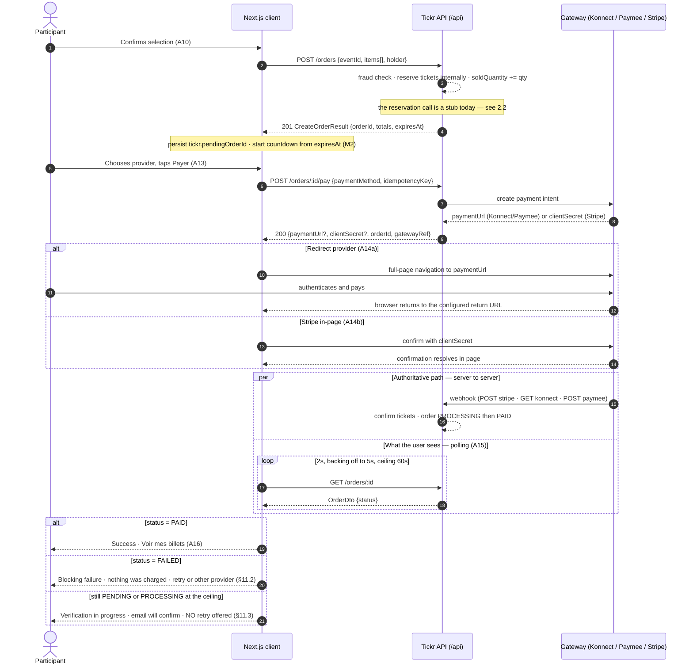
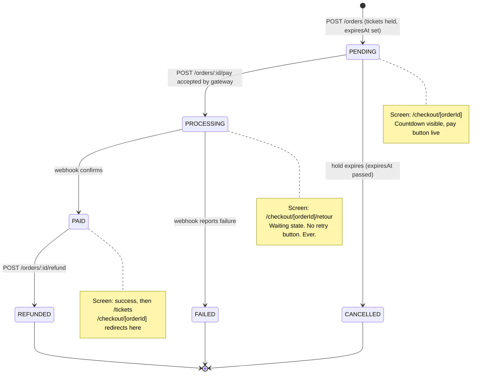
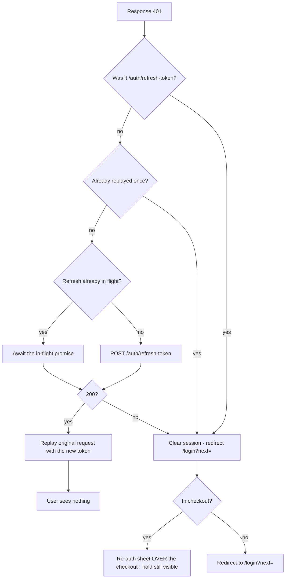

# Phase 3 — User Journey Mapping

| Field | Value |
| --- | --- |
| **Phase** | 3 of 11 |
| **Epic** | [01-frontend-plan-and-design-direction.md](01-frontend-plan-and-design-direction.md) |
| **Status** | ✅ Complete |
| **Owner** | Product Design / Frontend Lead |
| **Depends on** | [Phase 1 — Product Design Brief](02-product-design-brief.md) (locked) · [Phase 2 — Information Architecture](03-information-architecture.md) (route tree) · Backend REST API on `/api` |

> **Objective:** Document every user journey as *step → screen → user action → API call → result state*, against the **real** backend contracts. Each journey names the exact endpoint (method + path), the success UI state, and **every** failure branch. Where the design depends on something the backend does not yet expose, that dependency is marked as a task rather than assumed away.

---

## 0. How to read this document

### 0.1 Contract corrections — read this before anything else

Four statements that circulate in the Epic, the README and the Phase 2 scaffold are **wrong against the code**. Every journey below uses the corrected form.

| # | Claim in circulation | Verified reality | Source |
| --- | --- | --- | --- |
| 1 | API base is `/v1` (GitHub issue #64) | Base is **`https://api.tickr.tn/api`**. The global prefix is `api` and nothing else. Dev: `http://localhost:3000/api` | `main.ts:17`, `config/app.config.ts` (`API_PREFIX \|\| 'api'`) |
| 2 | Pagination is `{ data, meta: { … } }` | Pagination is **flat**, and the field set differs per module: events and tickets return `{ data, total, page, limit, totalPages, hasNextPage, hasPreviousPage }`; orders stop at `totalPages`; notifications stop at `limit`. Derive « page suivante » from `page < totalPages`, never from `hasNextPage` alone | `PaginatedEventListDto`, `PaginatedTicketListDto`, `PaginatedOrdersDto` (`order.dto.ts:38-44`), `PaginatedNotificationsDto` (`notification.dto.ts:180-192`) |
| 3 | The purchase flow is `POST /tickets/reserve` **then** `POST /orders` | **`POST /orders` reserves the tickets internally.** Calling `/tickets/reserve` from the participant flow creates a second, orphaned hold | `create-order.handler.ts` step 5 → `ticketReservation.reserveTickets()` |
| 4 | `GET /config/public` supplies the commission rate | **The endpoint does not exist.** There is no config controller in the codebase | `backend/src/config/` contains only `*.config.ts` files; `PLATFORM_COMMISSION_RATE` is read inside `create-order.handler.ts:41` |

Two more, smaller, but they change screens:

- **Sold out is `400`, not `409`.** `INSUFFICIENT_AVAILABILITY` is mapped to `BadRequestException`. See [§11.7](#117-sold-out-during-checkout).
- **Rate-limited order creation is `403`, not `429`.** `RATE_LIMITED` is mapped to `ForbiddenException`. See [§11.6](#116-403--an-overloaded-status).

### 0.2 Table legend

Every journey is a numbered step table with the same six columns:

| Column | Meaning |
| --- | --- |
| **Step** | Ordinal within the journey. Referenced elsewhere as `A4`, `F2`, … |
| **Screen / route** | A route from the Phase 2 canonical tree. No journey introduces a route that is not in that tree |
| **User action** | What the human does. `—` means the step is automatic |
| **API call** | `METHOD /path`, relative to `/api`. `—` means no network call |
| **Success state** | What is on screen when the call resolves |
| **Failure branches** | `status → state`, each resolved in [§11](#11-edge-cases) |

### 0.3 Journey index

| ID | Journey | Actor | Routes touched | § |
| --- | --- | --- | --- | --- |
| **A** | Purchase — discovery to ticket | Participant (anon → auth) | `/`, `/events`, `/search`, `/categories/[category]`, `/events/[id]`, `/checkout/[orderId]`, `/checkout/[orderId]/retour`, `/tickets`, `/tickets/[id]` | [§2](#2-journey-a--participant-purchase-happy-path) |
| **B** | Registration + email verification | Anonymous | `/register`, `/verify-email`, `/login` | [§3](#3-journey-b--participant-registration--email-verification) |
| **C** | Login + silent token refresh | Participant / Organizer / Admin | `/login`, any authenticated route | [§4](#4-journey-c--participant-login--token-refresh) |
| **D** | Refund request | Participant | `/orders`, `/orders/[id]` | [§5](#5-journey-d--participant-refund-request) |
| **E** | Ticket transfer | Participant | `/tickets`, `/tickets/[id]` | [§6](#6-journey-e--participant-ticket-transfer) |
| **F** | Create → ticket types → image → publish | Organizer | `/organizer/events`, `/organizer/events/new`, `/organizer/events/[id]`, `/organizer/events/[id]/ticket-types`, `/organizer/events/[id]/edit` | [§7](#7-journey-f--organizer-create--ticket-types--image--publish) |
| **G** | Analytics review | Organizer | `/organizer`, `/organizer/events/[id]/analytics`, `/organizer/events/[id]/participants` | [§8](#8-journey-g--organizer-analytics-review) |
| **H** | Door check-in | Organizer | `/organizer/scanner` | [§9](#9-journey-h--organizer-door-check-in) |
| **I** | Platform review + export | Admin | `/admin`, `/admin/reports`, `/admin/moderation`, `/admin/users` | [§10](#10-journey-i--admin-platform-review--export) |

### 0.4 Notation for gaps

| Marker | Meaning |
| --- | --- |
| **⚠ NOT IMPLEMENTED** | The endpoint or field referenced by an earlier document does not exist. Never call it. An interim is given |
| **⚠ BACKEND TASK** | Implementable today, but only through a workaround. The workaround is specified, and the fix is listed in [§12](#12-backend-tasks-this-phase-depends-on) |
| **⚠ DEFECT** | Existing frontend code is wrong and must be changed before the journey works |

---

## 1. Cross-cutting mechanics

These five mechanics appear in more than one journey. They are specified once here and referenced by ID from the step tables.

### 1.1 The error envelope, and what the UI is allowed to key off

```jsonc
// AllExceptionsFilter — the only filter registered (app.module.ts:81-84). Every error, no exception.
{ "statusCode": 400, "code": "Bad Request", "message": "…", "timestamp": "…", "path": "/api/orders", "method": "POST" }

// A ValidationPipe failure goes through the same filter — but `message` is an ARRAY of English strings
{ "statusCode": 400, "code": "Bad Request", "message": ["quantity must not be less than 1"], "timestamp": "…", "path": "…", "method": "POST" }
```

**There is no machine-readable *domain* code.** `code` is populated from the HTTP reason phrase (`Bad Request`, `Forbidden`, `Not Found`), and `details` is always `undefined`, so it never reaches the wire. `HttpExceptionFilter` and `ValidationExceptionFilter` exist under `shared/infrastructure/common/filters/` but are **registered nowhere** — do not build against the `error` or `errors[]` fields they would have produced.

The rich domain error types the handlers produce — `INSUFFICIENT_AVAILABILITY`, `RATE_LIMITED`, `ORDER_EXPIRED`, `MAX_ATTEMPTS_EXCEEDED`, `TICKET_LIMIT_EXCEEDED`, `EVENT_NOT_PUBLISHED` — are **discarded at the controller boundary**, where they collapse into `BadRequestException` / `ForbiddenException` / `NotFoundException`.

The consequence for every journey below: **the UI disambiguates by `status` + *which call failed*, never by parsing `message`.** The endpoint context is what carries the meaning. This lives in exactly one module so there is exactly one place to fix when [§12 task 2](#12-backend-tasks-this-phase-depends-on) lands.

```ts
// src/lib/api/errors.ts — the ONLY place that interprets a backend error
export type ApiFailure =
  | { kind: 'SOLD_OUT' }            // 400 on POST /orders
  | { kind: 'ORDER_EXPIRED' }       // 400 on POST /orders/:id/pay
  | { kind: 'MAX_PAY_ATTEMPTS' }    // 400 on POST /orders/:id/pay (3 attempts)
  | { kind: 'RATE_LIMITED_ORDERS' } // 403 on POST /orders  ← NOT a role failure
  | { kind: 'EMAIL_NOT_VERIFIED' }  // 403 on POST /auth/login
  | { kind: 'FORBIDDEN_ROLE' }      // 403 anywhere else
  | { kind: 'NOT_FOUND' }           // 404
  | { kind: 'THROTTLED' }           // 429
  | { kind: 'VALIDATION'; errors: unknown[] }
  | { kind: 'OFFLINE' }             // no response received
  | { kind: 'SERVER' };             // 5xx

export function mapApiError(err: unknown, ctx: RequestContext): ApiFailure { /* status + ctx.endpoint */ }
```

> **Message strings are never rendered to a user.** They are English, gateway-flavoured, and untranslatable. They may be logged; they may be shown behind a « Détails techniques » disclosure on admin screens only.

### 1.2 Session and token lifecycle — single-flight refresh

**Contract, verified:**

| Call | Request | Response |
| --- | --- | --- |
| `POST /auth/login` | `{ email, password }` | `{ accessToken, refreshToken, expiresIn, user: { id, email, firstName, lastName, role } }` |
| `POST /auth/refresh-token` | `{ refreshToken }` | `{ accessToken, expiresIn }` — **no refresh-token rotation** |

Access token **7 d** (`JWT_EXPIRES_IN`, default `'7d'` — `jwt.service.ts:74`), refresh token 30 d (`JWT_REFRESH_EXPIRES_IN`). *`docs/02-technique/02-api-contract.md` says 24 h and is stale; so is the `JWT_ACCESS_EXPIRATION` (`15m`) handed to `JwtModule.register` in `users.module.ts:125` — the signer never reads it.* `POST /auth/refresh-token` is `@SkipThrottle()`, so a refresh storm cannot lock a user out. Because the refresh token is never rotated, it is written once at login and only replaced at the next login.

**⚠ DEFECT — `frontend/src/lib/api/client.ts` must be rewritten before any authenticated journey works.** Three separate problems:

1. It hard-redirects to `/auth/login` on **any** `401` with no refresh attempt — a token expiring mid-checkout destroys the order context.
2. It redirects to **`/auth/login`**, which is not in the Phase 2 canonical tree. The route is **`/login`**.
3. Its default `baseURL` is `http://localhost:3000` — **missing the `/api` prefix**, so every request 404s until `NEXT_PUBLIC_API_URL` is set. The default must be `http://localhost:3000/api`.

**Required behaviour** (referenced from step tables as **M1**):

```ts
let refreshInFlight: Promise<string> | null = null;

apiClient.interceptors.response.use(undefined, async (error) => {
  const original = error.config;
  const isRefreshCall = original?.url?.includes('/auth/refresh-token');

  if (error.response?.status !== 401 || original._retried || isRefreshCall) {
    return Promise.reject(error);
  }
  original._retried = true;                       // replay at most once

  refreshInFlight ??= postRefresh()               // single flight: N parallel 401s → 1 refresh
    .finally(() => { refreshInFlight = null; });

  try {
    const accessToken = await refreshInFlight;    // all queued requests await the same promise
    original.headers.Authorization = `Bearer ${accessToken}`;
    return apiClient(original);                   // replay the ORIGINAL request
  } catch {
    clearSession();
    const next = encodeURIComponent(location.pathname + location.search);
    location.assign(`/login?next=${next}`);       // /login — never /auth/login
    return Promise.reject(error);
  }
});
```

Rules that fall out of it, and that the journeys assume:

- **A `401` is never user-visible** unless the refresh itself fails.
- The replay happens **once**. A second `401` on the replayed request is a real session failure.
- Concurrent `401`s (a dashboard firing four queries) trigger **one** refresh, not four.
- `?next=` is always absolute-path + query, so the user lands back exactly where they were — including `/checkout/[orderId]`.
- **Mid-checkout, the re-authentication is a sheet over the checkout, not a navigation** ([Phase 1 §G.4](02-product-design-brief.md)). The redirect form is the fallback for hard navigations only.

### 1.3 The hold contract — one clock, from the server

`POST /orders` returns **`expiresAt`**. That field is the single source of truth for every countdown in the product. Nothing is computed from a client clock start.

- **Reservation TTL: 15 min** (`reserve-tickets.handler.ts:24`). **Order expiry: `ORDER_EXPIRATION_MINUTES`, default 15** (`create-order.handler.ts:42`). They are two settings that happen to agree; the UI trusts `expiresAt` and never re-derives either.
- Countdown is stated in **both** forms, always, per [Phase 1 §E.4](02-product-design-brief.md): « Il reste **12:34** » *and* « vos billets sont gardés jusqu'à **21:45** ».
- Three phases: **calm** (> 5 min, `ink-700`), **warning** (≤ 5 min, `warning-700`), **critical** (≤ 60 s, `danger-700` + `aria-live="assertive"` announcement at 5:00, 1:00 and 0:00 only — not every tick).
- Because clocks drift, the countdown is computed as `expiresAt − (Date.now() + skew)`, where `skew` is the delta between the `Date` response header and local time at first load.
- **Reaching zero never navigates on its own.** It swaps the checkout into the expired blocking state ([§11.1](#111-reservation--order-expired)).
- Referenced from step tables as **M2**.

### 1.4 Money, and the commission constant

**⚠ NOT IMPLEMENTED — `GET /config/public` does not exist.** The Epic, this folder's README and the Phase 2 scaffold all reference it for `commissionRate`. There is no config controller in the backend. **Do not call it, do not write a hook for it, do not stub it in MSW as if it were real.**

Interim: one build-time constant module, imported everywhere, with a single comment naming the day it must be deleted.

```ts
// src/lib/config/platform.ts
// ⚠ INTERIM. The rate is authoritative ONLY inside the backend (create-order.handler.ts:41).
// Delete this file the day GET /config/public ships — see docs/08-frontend/04-user-journeys.md §12.
export const PLATFORM_COMMISSION_RATE = Number(
  process.env.NEXT_PUBLIC_PLATFORM_COMMISSION_RATE ?? '0.06',
);
export const RESERVATION_TTL_MINUTES = 15;
export const CURRENCY = 'TND' as const;
```

**The constant is used for exactly one thing: the pre-order estimate** at [A7](#21-step-table). The instant an order exists, **every figure on screen comes from `OrderDto`** — `subtotal`, `platformFee`, `paymentFees`, `total` — and never from arithmetic in the client. This is what keeps the drift risk bounded to a single, clearly-labelled estimate.

**Formatting** (locked in [Phase 1 §M.2](02-product-design-brief.md)): TND, symbol `DT`, **3 decimals** (millimes), comma as decimal separator, non-breaking space before `DT`, `tabular-nums` on every figure.

| Context | Rule | Example |
| --- | --- | --- |
| Card / list price, « À partir de » | Hide millimes when zero | `50 DT` |
| Any figure with non-zero millimes | Always show all three | `52,500 DT` |
| Order summary, totals, receipts, refunds | Always show all three | `106,000 DT` |

**Commission arithmetic** (`order.entity.ts:192`): `total = subtotal + subtotal × rate`. The fee is **added on top** — the participant pays it. `paymentFees` exists on `OrderDto` and `OrderEntity.setPaymentFees()` can rewrite the total, but **nothing calls it today**, so it is always `0`. The `OrderSummary` component still renders it as a **conditional** line (`paymentFees > 0`), so the day it is wired the UI is already correct.

Referenced from step tables as **M3**.

### 1.5 Availability is a snapshot, never a counter

`soldQuantity` increments at **hold** time (`tickets/infrastructure/adapters/event-query.adapter.ts:88`, atomic `sold_quantity + :qty`, called from `reserve-tickets.handler.ts:99`) and is **restored** when a hold expires or is cancelled (`expire-tickets.handler.ts:93`, `cancel-tickets.handler.ts:105`).

Therefore: **remaining counts can go up**, and **sold-out is not terminal**. (⚠ Today the checkout path holds nothing at all — see the reservation-stub note in [§2.2](#22-payloads-exactly-as-the-api-expects-them).)

- Availability is rendered from `TicketTypeDto.availableQuantity` / `isSoldOut` / `isOnSale` and `EventListDto.ticketSummary`, as a per-fetch snapshot with a « Mis à jour à l'instant » affordance — never as a live ticking counter.
- Every sold-out state carries **« Vérifier à nouveau »**, because stock genuinely returns.
- React Query: `staleTime: 30_000` on event detail, `refetchOnWindowFocus: true`. No polling of availability — polling is reserved for order status ([§2.4](#24-polling-contract-webhook-driven-confirmation)).
- Referenced from step tables as **M4**.

---

## 2. Journey A — Participant purchase (happy path)

**Actor:** a participant, anonymous at entry, authenticated by [A9](#21-step-table).
**Promise:** poster → paid in under 90 seconds for a returning user ([Phase 1 §M.1](02-product-design-brief.md)).
**Shape:** steps A6–A10 happen inside **one bottom sheet on mobile / one right rail on desktop**; the event never leaves the screen.

### 2.1 Step table

| Step | Screen / route | User action | API call | Success state | Failure branches |
| --- | --- | --- | --- | --- | --- |
| **A1** | `/` (SSR) | Opens Tickr | `GET /events/upcoming` | Hero rail + category rails + city chips. Each card shows poster, title, date, venue, « À partir de 50 DT » and a scarcity badge — **all from `EventListDto.ticketSummary`, zero follow-up requests** (**M4**) | `5xx` → skeletons replaced by « Connexion perdue » + « Réessayer ». Empty array → editorial fallback, never a blank hero |
| **A2** | `/events` (SSR) | Filters by city / date / category / price | `GET /events?category&city&country&dateFrom&dateTo&minPrice&maxPrice&page&limit&sortBy&sortOrder` | Grid + active-filter chips. **Filter state is in the URL** — shareable, back-button correct. Pagination from `hasNextPage` / `totalPages`, `limit` 20 (`@Max(100)`) | `0` results → [§11.10](#1110-empty-search-results). `429` → [§11.8](#118-429-throttled). `400` → filters reset to last valid set, chip flagged. ⚠ `EventFilterDto` has **no `q`**, and the global `ValidationPipe` runs `forbidNonWhitelisted` (`main.ts:29-36`), so any unknown query key is a `400` — free text belongs to A3 alone |
| **A3** | `/search` (CSR) | Types a query | `GET /events/search?q=…` | Debounced 300 ms, results under the field, query echoed in the empty state | Same as A2 |
| **A4** | `/categories/[category]` (SSR) | Taps a category rail | `GET /events/category/:category` | Category listing. ⚠ **No endpoint exposes a French label** — `displayNameFr` lives in `event-category.vo.ts:40` and is never serialised into a DTO. The 10-value enum → French map is owned by the frontend and must mirror that file | `404` on an unknown segment → [§11.5](#115-404-not-found). `0` results → « Rien de prévu en Théâtre pour l'instant » + « Voir tous les événements » |
| **A5** | `/events/[id]` (SSR) | Opens an event | `GET /events/:id` | Poster → title → facts → price → ticket types → description → organizer name. Sticky purchase bar appears past the price block. `EventDto.ticketTypes[]` gives `availableQuantity`, `isSoldOut`, `isOnSale` per tier (**M4**) | `404` → [§11.5](#115-404-not-found). **`403` → the event is `DRAFT` or `CANCELLED` and you are not its organizer** (`get-event-by-id.handler.ts:74`). On this public route it renders as « Cet événement n'est plus disponible », **never as « Accès refusé »** — see [§11.9](#119-event-cancelled) ⚠ BACKEND TASK. `status === 'CANCELLED'` on an owner view → cancelled banner |
| **A6** | `/events/[id]` — sheet | Taps « Choisir mes billets » | — | Bottom sheet opens (Headless UI `Dialog`, focus-trapped, `Esc` + swipe to close). **One ticket type at a time in V1** | — |
| **A7** | `/events/[id]` — sheet | Sets quantity | — | Stepper bounded by two real limits, **the binding one always named**: tier `availableQuantity`, and **10 tickets/event/user** (`fraud-detection.service.ts:40-42`). ⚠ `CreateOrderRequestDto` puts **no ceiling on `holders[]`** — `@ArrayMaxSize(10)` belongs to `ReserveTicketsDto`, a contract this flow never uses — so the fraud limit is the only server-side stop and the client enforces it. Breakdown appears at qty ≥ 1, labelled « Estimation » (**M3**) | Requested qty > available → stepper clamps + « Il ne reste que 2 billets Standard ». Qty would exceed the per-event limit → « Vous pouvez acheter au maximum 10 billets pour cet événement » |
| **A8** | `/events/[id]` — sheet | Fills holder details | — | Buyer block (`firstName`, `lastName`, `email`) pre-filled from `GET /users/me` when authenticated. « Les billets sont à mon nom » **checked by default** collapses tickets 2..n; unchecking reveals `{ name, email }` per ticket. Primary button reads « Continuer · 106,000 DT » | zod: invalid email inline at blur; the button stays enabled and focuses the first error on submit |
| **A9** | `/login` or `/register` | Signs in (**only if anonymous**) | `POST /auth/login` | **Selection is persisted first** (zustand + `sessionStorage`), the user returns to the sheet exactly as they left it. **No login is ever required to see a price** ([Phase 1 §E.1](02-product-design-brief.md)) | See [Journey C](#4-journey-c--participant-login--token-refresh). `403` here means **email not verified** — [§11.6](#116-403--an-overloaded-status) |
| **A10** | `/events/[id]` — sheet | Taps « Continuer » | **`POST /orders`** — creates the order **and reserves the tickets** | `201` → **`CreateOrderResult`, not an `OrderDto`**: `{ orderId, subtotal, platformFee, total, currency, expiresAt }` — no `status`, no `items[]`, no `paymentFees`. Client persists `tickr.pendingOrderId`, then `router.replace('/checkout/{id}')` — **`replace`, so Back cannot re-post**. The full order is read at A11 | `404` `EVENT_NOT_FOUND` / `TICKET_TYPE_NOT_FOUND` → [§11.5](#115-404-not-found). **`400`** covers `EVENT_NOT_PUBLISHED`, `INSUFFICIENT_AVAILABILITY`, `TICKET_LIMIT_EXCEEDED`, `VALIDATION_ERROR` → [§11.7](#117-sold-out-during-checkout). **`403` = `RATE_LIMITED`, not a role failure** → [§11.6](#116-403--an-overloaded-status) |
| **A11** | `/checkout/[orderId]` (CSR) | — | `GET /orders/:id` | `OrderSummary` (the *same* component as the sheet and the confirmation) renders `subtotal`, `platformFee`, conditional `paymentFees`, `total` — **all from the API** (**M3**). Countdown starts from `expiresAt` (**M2**) | `404` → order not found. `403` → not your order. `status === 'PAID'` → **redirect to the ticket, never re-offer payment**. `expiresAt` already past → [§11.1](#111-reservation--order-expired) |
| **A12** | `/checkout/[orderId]` | Picks a provider | — | Three named radio cards, **local first**: Konnect « Carte bancaire tunisienne · e-DINAR », Paymee « Carte bancaire tunisienne », Stripe « Carte internationale ». Last-used pre-selected. An `idempotencyKey` UUID is minted **now** and kept for the whole attempt | — |
| **A13** | `/checkout/[orderId]` | Taps « Payer 106,000 DT » | **`POST /orders/:id/pay`** `{ paymentMethod, idempotencyKey }` | `200` → `{ paymentUrl?, clientSecret?, orderId, gatewayRef }`. Button enters its loading state and **stays** loading through the navigation | `404` → order gone. `400` covers `ORDER_EXPIRED` → [§11.1](#111-reservation--order-expired); `INVALID_STATUS`; `MAX_ATTEMPTS_EXCEEDED` (**3 attempts**, `PaymentEntity.MAX_ATTEMPTS`) → [§11.2](#112-payment-failed); `GATEWAY_ERROR` → [§11.2](#112-payment-failed) |
| **A14a** | → gateway | Pays on Konnect / Paymee | — (external) | Before leaving: « Vous allez être redirigé vers Konnect pour payer en toute sécurité. Vous reviendrez automatiquement. » Then `location.assign(paymentUrl)` — a **full-page** navigation, never an iframe | User abandons at the gateway → the hold keeps running; returning to `/checkout/[orderId]` shows the countdown and the pay button again ⚠ see the pending-intent caveat in [§11.2](#112-payment-failed) |
| **A14b** | `/checkout/[orderId]` | Pays with Stripe in-page | — (Stripe.js) | `clientSecret` confirmed in-page. **The countdown stays visible throughout.** ⚠ `@stripe/stripe-js` is not in the current dependency set — adding it is an implementation-ticket prerequisite | Card declined → [§11.2](#112-payment-failed), with the countdown still running |
| **A15** | `/checkout/[orderId]/retour` (CSR) | Returns from the gateway | **poll `GET /orders/:id`** | « Nous confirmons votre paiement… **Ne fermez pas cette page.** » — a designed waiting state, never a bare spinner. Terminal states are read from `OrderStatus` **and nothing else**. See [§2.4](#24-polling-contract-webhook-driven-confirmation) | `PAID` → A16. `FAILED` → [§11.2](#112-payment-failed). Still `PENDING`/`PROCESSING` at the ceiling → [§11.3](#113-payment-stuck-processing-past-the-poll-ceiling) — **not an error, and no retry offered**. ⚠ Return-URL caveat in [§2.3](#23-payment-sequence-with-webhook-and-polling) |
| **A16** | `/checkout/[orderId]/retour` | — | — | Success: amount paid, order reference, event + date + venue, « un **email** de confirmation est en route » (the channel is always named « email » or « SMS » — the word « notification » is never used), one dominant CTA: **« Voir mes billets »**. ⚠ **No transactional message is dispatched today** — the notifications module listens on `'ticket.confirmed'` / `'user.registered'` / `'user.password-reset'`, while `DomainEvent.eventName` emits the **class name** (`domain-event.base.ts:38-40`), so no handler ever fires ([§12 task 24](#12-backend-tasks-this-phase-depends-on)) | — |
| **A17** | `/tickets` | Taps « Voir mes billets » | `GET /tickets?page&limit&status` + `GET /events/:id` per distinct `eventId` | Ticket list. ⚠ `TicketDto` carries **no event data and no `orderId`** — see [§2.5](#25-finding-the-tickets-that-belong-to-an-order) | `0` results moments after payment → « Vos billets arrivent… » + auto-refetch, never « Aucun billet » |
| **A18** | `/tickets/[id]` | Opens a ticket | `GET /tickets/:id` (+ `GET /events/:eventId` for context) | Dark `ink-950` pass. **QR ≥ 240 px on pure white with a quiet zone**, rendered client-side from the `qrCode` **string** — `v1-{uuid}-{md5(uuid)[0:4]}`, `qr-code.vo.ts:24-31` — so it works offline. The string is **stable for the ticket's lifetime**: only `transfer()` ever reassigns it (`ticket.entity.ts:465`), so it is safe to cache and only a transfer invalidates that cache. Holder name prominent. « Augmenter la luminosité » full-screen mode | `404` → ticket gone. `403` → not yours (e.g. after a transfer, [Journey E](#6-journey-e--participant-ticket-transfer)). `CHECKED_IN` → QR dimmed + success stamp + timestamp. `CANCELLED`/`EXPIRED` → QR hidden, reason stated |
| **A19** | `/tickets/[id]` | Taps « Télécharger le PDF » | `GET /tickets/:id/pdf` | ⚠ **The route is `@Redirect()`-based *and* `Bearer`-authenticated** (`tickets.controller.ts:289`), so `window.open` / a plain `<a href>` sends no token and gets a `401`; and `pdfUrl` on the DTO is an **S3 key**, not a URL, so it cannot be linked either. Interim: `fetch` with the `Authorization` header, let the browser follow the `302`, save the blob — which needs CORS on the bucket. Real fix in [§12 task 17](#12-backend-tasks-this-phase-depends-on) | `404` when `pdfUrl` is null — the PDF is generated asynchronously (`ticket-confirmed-infra.listener.ts:80`) and may not exist yet. Copy: « Le PDF n'est pas encore prêt. Votre QR ci-dessus suffit à l'entrée. » PDF is a *backup*, never the primary path |

### 2.2 Payloads, exactly as the API expects them

```jsonc
// A10 — POST /api/orders
{
  "eventId": "550e8400-e29b-41d4-a716-446655440002",
  "items": [{
    "ticketTypeId": "550e8400-e29b-41d4-a716-446655440010",
    "quantity": 2,
    "holders": [                                  // length MUST equal quantity — see the note below
      { "name": "Yasmine Ben Salah", "email": "yasmine@example.tn" },
      { "name": "Karim Trabelsi",    "email": "karim@example.tn"   }
    ]
  }],
  "holder": {                                     // order-level contact, required by the TN gateways
    "firstName": "Yasmine", "lastName": "Ben Salah", "email": "yasmine@example.tn"
  }
}
```

> `holders[]` items accept **`name` + `email` only** — no `phone`, and no length ceiling. (`ReserveTicketsDto`, a different and unused-by-this-flow contract, carries the `@ArrayMinSize(1) @ArrayMaxSize(10)` pair and a phone. Do not copy its shape.)
>
> **`holders.length` must equal `quantity`.** The handler prices `item.quantity` but reserves `item.holders.length` (`create-order.handler.ts:111` vs `:144`); a mismatch charges for one number of tickets and holds another, and nothing validates it.

```jsonc
// A10 — 201 response. This is CreateOrderResult, NOT an OrderDto: six fields, nothing more.
{
  "orderId": "…",                                 // ← note: orderId, not id
  "subtotal": 100, "platformFee": 6, "total": 106, "currency": "TND",
  "expiresAt": "2026-08-20T21:45:00.000Z"         // ← the countdown's only source (M2)
}

// A11 — GET /api/orders/:id → OrderDto, the shape every money figure on screen binds to
{
  "id": "…", "userId": "…", "eventId": "…", "status": "PENDING",
  "items": [{ "id": "…", "ticketTypeId": "…", "ticketTypeName": "Standard",
              "quantity": 2, "unitPrice": 50, "lineTotal": 100 }],
  "subtotal": 100, "platformFee": 6, "paymentFees": 0, "total": 106, "currency": "TND",
  "paymentMethod": null, "transactionId": null, "paidAt": null,
  "refundedAt": null, "refundReason": null,
  "expiresAt": "2026-08-20T21:45:00.000Z",
  "createdAt": "2026-08-20T21:30:00.000Z", "updatedAt": "…"
}
```

> **⚠ BACKEND TASK — blocking. `POST /orders` reserves nothing today.** Step 5 of `create-order.handler.ts` calls `ticketReservation.reserveTickets()`, but `TICKET_RESERVATION_PORT` is bound to `TicketReservationAdapter` — a logging stub that returns fabricated ids (`ticket-reservation.adapter.ts:29-45`, wired at `payments.module.ts:119-120`). `confirmTickets()` and `cancelReservations()` are stubs too. **Consequence:** no ticket row is ever created, `soldQuantity` never moves during checkout, and a paid order leaves `GET /tickets` empty — [A17](#21-step-table)–[A19](#21-step-table) and [Journey E](#6-journey-e--participant-ticket-transfer) have nothing to show. The flow documented here is the correct one; it cannot run end-to-end until the adapter delegates to the Tickets module.

```jsonc
// A13 — POST /api/orders/:id/pay
{ "paymentMethod": "KONNECT", "idempotencyKey": "…uuid…" }   // STRIPE | KONNECT | PAYMEE

// 200 — ProcessPaymentResult (NOT a Stripe-style PaymentIntent)
{ "paymentUrl": "https://gateway…", "clientSecret": undefined, "orderId": "…", "gatewayRef": "…" }
```

**Branch on the field, not on the provider name:** `paymentUrl` present → redirect; `clientSecret` present → in-page. That way a fourth provider needs no frontend change.

### 2.3 Payment sequence, with webhook and polling



**The rule the diagram encodes: the browser's return from the gateway proves nothing.** Query parameters on the return URL are *never* read as an outcome. `OrderStatus` from `GET /orders/:id` is the only truth.

> **⚠ BACKEND TASK — the gateway return URL is static and order-agnostic.**
> Konnect is initialised with `PAYMENT_SUCCESS_URL` / `PAYMENT_FAIL_URL` (defaults `https://tick-r.tn/payments/success` and `…/failure`, `konnect.adapter.ts:87-93`) and Paymee with a static `return_url` (`paymee.adapter.ts:68`). **Neither interpolates the order id**, and neither points at `/checkout/[orderId]/retour`.
> **Fix:** build the return URL per order — `${FRONTEND_URL}/checkout/${order.id}/retour`.
> **Interim that needs no new route:** set both env vars to `https://tick-r.tn/checkout/pending/retour`. The dynamic segment `[orderId]` receives the literal `"pending"`; the route detects that sentinel, reads `tickr.pendingOrderId` from `localStorage`, and `router.replace()`s to the real id. If the sentinel is present *and* storage is empty (a different browser finished the payment), the screen renders the recovery state: « Nous n'avons pas pu retrouver votre commande sur cet appareil. » → « Voir mes commandes » (`/orders`).

### 2.4 Polling contract (webhook-driven confirmation)

| Parameter | Value | Why |
| --- | --- | --- |
| Endpoint | `GET /orders/:id` | The only authoritative status |
| Start | Immediately on mount of `/checkout/[orderId]/retour` | The webhook may already have landed |
| Interval | `2 s` for the first 10 s, then `3 s`, then `5 s` | Typical webhook latency is a few seconds; back-off protects the throttler |
| Ceiling | **60 s** wall-clock | Beyond it, waiting stops being informative |
| Stop conditions | `status ∈ {PAID, FAILED, CANCELLED, REFUNDED}` **or** ceiling reached | — |
| Throttle safety | ≤ 6 requests in any 10 s window, ≈ 18 across the full 60 s | The buckets are 3 req/s, 20 req/10 s and 100 req/min (`users/infrastructure/users.module.ts:131-146`) |
| On `429` while polling | Double the interval, keep the same ceiling, never surface an error | The user is already waiting; a throttle is not their problem. (No `ThrottlerGuard` is wired today — see [§11.8](#118-429-throttled)) |
| Tab hidden | Polling pauses; resumes and fires immediately on `visibilitychange` | Battery, and mobile browsers throttle timers anyway |
| Copy throughout | « Nous confirmons votre paiement… Ne fermez pas cette page. » | Waiting must read as expected, not broken |

**Order status → screen**, and nothing else decides the screen:



### 2.5 Finding the tickets that belong to an order

**⚠ BACKEND TASK.** `GET /tickets` returns `TicketDto` — `id, eventId, ticketTypeId, qrCode, status, priceAmount, priceCurrency, holderName, holderEmail, pdfUrl, checkedInAt, reservedUntil, createdAt`. It carries **no `orderId`**, and the endpoint accepts no `orderId` filter. `TicketDetailDto` *does* expose `orderId`, but only one ticket at a time.

**Interim, used by A17 and by `/orders/[id]`:**

1. `GET /tickets?status=CONFIRMED&page=1&limit=20`.
2. Filter client-side on `eventId === order.eventId`.
3. Keep those whose `createdAt` is ≥ `order.createdAt`, newest first, and take `order.items[].quantity` of them.

This is correct in every realistic case and ambiguous only when the same user buys the same event twice within the same second. **Fix:** add `orderId` to `TicketDto` and support `GET /tickets?orderId=`.

A second, related gap: **`TicketDetailDto` carries no event title, date or venue**, so `/tickets/[id]` must additionally call `GET /events/:eventId` (public, cacheable, deduped by React Query). `/tickets` therefore issues one `GET /events/:id` per *distinct* event in the page — typically one or two calls, not one per ticket.

---

## 3. Journey B — Participant registration + email verification

**Actor:** anonymous. **Entry:** `/register`, or the auth gate at [A9](#21-step-table).

| Step | Screen / route | User action | API call | Success state | Failure branches |
| --- | --- | --- | --- | --- | --- |
| **B1** | `/register` | Fills email, password, first name, last name, optional phone | — | Live password checklist, all five rules visible **before** submission: ≥ 8 characters, one lowercase, one uppercase, one digit, one special character (`RegisterUserDto` regex). Phone must match `^\+?[1-9]\d{1,14}$` | zod blocks submission; each unmet rule stays visible in `ink-700`, satisfied rules turn `success-700` |
| **B2** | `/register` | Submits | `POST /auth/register` | `201 { userId, message }`. Screen switches to « Vérifiez votre boîte mail » with the email echoed back and a « Modifier mon adresse » link back to the form | **`400`** — the email already exists (`BadRequestException`, despite Swagger advertising `422`). Copy: « Un compte existe déjà avec cette adresse. » → « Se connecter ». **`400` validation** → field-level errors. **`429`** — throttle is **3 registrations/hour** → [§11.8](#118-429-throttled) |
| **B3** | email client | Opens the verification link | — | Link lands on `/verify-email?token=…` | **⚠ BACKEND TASK — no email is sent today.** `auth.controller.ts` register still carries `// TODO: Generate email verification token and send email`. No `EMAIL_VERIFICATION` token is created, so no valid link can exist. The whole journey is blocked on this |
| **B4** | `/verify-email` | — (automatic) | `POST /auth/verify-email` `{ token }` | `200` → « Votre adresse est confirmée. » → auto-redirect to `/login` after 2 s, with the email pre-filled | **`400`** invalid or expired token → « Ce lien n'est plus valide. » ⚠ **There is no resend endpoint**, so the single recovery is « Contacter le support » and no « Renvoyer le lien » button is drawn. Adding `POST /auth/resend-verification` is [§12 task 5](#12-backend-tasks-this-phase-depends-on) |
| **B5** | `/login` | Signs in | `POST /auth/login` | See [Journey C](#4-journey-c--participant-login--token-refresh) | **`403` = email not verified**, not a role failure → « Votre adresse n'est pas encore confirmée. » ⚠ With no resend endpoint and no valid link in existence ([B3](#3-journey-b--participant-registration--email-verification)), the only recovery is « Contacter le support ». See [§11.6](#116-403--an-overloaded-status) |

**Two facts that shape the IA:**

- **Registration always creates a `PARTICIPANT`.** `auth.controller.ts` hard-codes `role: UserRole.PARTICIPANT` and `RegisterUserDto` has no role field. **There is no self-service organizer sign-up.** `/register` must not offer an « Je suis organisateur » choice that the API cannot honour; the organizer path is « Vous organisez des événements ? Contactez-nous » until [§12 task 6](#12-backend-tasks-this-phase-depends-on) lands.
- **`EmailVerifiedGuard` exists but is applied to no route.** Verification is enforced *only* at login. The frontend must not assume a verified email on any other call.

**Password reset** shares this journey's shape and its blocker:

| Step | Screen / route | User action | API call | Success state | Failure branches |
| --- | --- | --- | --- | --- | --- |
| **B6** | `/forgot-password` | Enters email | `POST /auth/request-reset` | `200` **always**, whether or not the account exists (anti-enumeration). Copy must match: « Si un compte existe avec cette adresse, un lien vient d'être envoyé. » — never « Email envoyé » | **`429`** — 3/hour → [§11.8](#118-429-throttled). ⚠ **The reset email is not sent either** — the token *is* created (1 h expiry) but the send is a `TODO` |
| **B7** | `/reset-password` | Sets a new password | `POST /auth/reset-password` `{ token, newPassword }` | `200` → redirect to `/login`. All the user's other reset tokens are invalidated server-side | **`400`** invalid/expired token → « Ce lien a expiré. » → « Demander un nouveau lien » (`/forgot-password`). Password rules identical to B1 |

---

## 4. Journey C — Participant login + token refresh

| Step | Screen / route | User action | API call | Success state | Failure branches |
| --- | --- | --- | --- | --- | --- |
| **C1** | `/login` | Enters credentials | `POST /auth/login` `{ email, password }` | `200 { accessToken, refreshToken, expiresIn, user }`. Session stored (**M1**), then routed by `user.role`: `PARTICIPANT` → `?next=` or `/`; `ORGANIZER` → `/organizer`; `ADMIN` → `/admin` | **`401`** wrong credentials **or** deactivated account (`local.strategy.ts:67-72`) — both are « Identifiants incorrects. » (never reveal which). **`403`** email not verified, and only that (`auth.controller.ts:188`) → [§11.6](#116-403--an-overloaded-status). **`429`** — 5 attempts/15 min → [§11.8](#118-429-throttled) |
| **C2** | any authenticated route | — | any call → `401` | **M1**: single-flight `POST /auth/refresh-token`, then the original request is replayed once with the new token. **The user sees nothing** — no flash, no toast, no navigation | Refresh returns `401` → session cleared → `location.assign('/login?next=…')`. Mid-checkout this is a **sheet over the checkout**, not a navigation ([§11.4](#114-401-token-expired)) |
| **C3** | `/profile` | Opens their profile | `GET /users/me` | Profile form pre-filled; also the source for the buyer block at [A8](#21-step-table) | `401` → C2 |
| **C4** | `/profile` | Saves | `PUT /users/me` | Optimistic patch + « Profil mis à jour ». Query `users.me` invalidated | `400` validation → inline. `409`-shaped conflicts do not occur on this route |
| **C5** | `/settings` | Changes password | `PATCH /users/me/password` | « Mot de passe modifié. » **The existing session keeps working** — no tokens are revoked server-side. Say so: « Vous restez connecté sur cet appareil. » | `400` covers `INVALID_CURRENT_PASSWORD`, `WEAK_PASSWORD` and `SAME_PASSWORD` — each lands inline on its own field, never as a page-level error |
| **C6** | `/settings` | Deletes the account | `DELETE /users/me` | Two-step confirmation typing « SUPPRIMER », then `200 { message }`, session cleared, redirect to `/`. This **deactivates** (`isActive: false`); a later login attempt returns `401` « Identifiants incorrects » | `400` → the destructive dialog stays open with the reason inline |

**Session storage contract** (behaviour is fixed here; the mechanism belongs to [Phase 11](11-frontend-architecture.md)):

| Item | Lifetime | Notes |
| --- | --- | --- |
| `accessToken` | 7 d | Attached as `Authorization: Bearer …` by the request interceptor |
| `refreshToken` | 30 d | **Never rotated** — `POST /auth/refresh-token` returns only `{ accessToken, expiresIn }`. Replaced only by a fresh login |
| `user` (id, email, role, names) | Session | Drives role-based navigation and route guards |
| `tickr.pendingOrderId` | Until the order reaches a terminal status | Required to recover the gateway return ([§2.3](#23-payment-sequence-with-webhook-and-polling)) |

---

## 5. Journey D — Participant refund request

**Precondition:** `order.status === 'PAID'`. `canBeRefunded()` returns true **only** for `PAID` (`order.entity.ts:359`).

| Step | Screen / route | User action | API call | Success state | Failure branches |
| --- | --- | --- | --- | --- | --- |
| **D1** | `/orders` | Opens order history | `GET /orders?page&limit` | Flat paginated list — **`PaginatedOrdersDto` stops at `totalPages`**: `{ data, total, page, limit, totalPages }`, with no `hasNextPage`/`hasPreviousPage`, so paging is `page < totalPages`. Each row: event, date, `total`, status pill | `403` on the list route is a **server-side ownership failure**, not a role failure → generic retry. Empty → « Vous n'avez pas encore de commandes » → « Découvrir des événements » |
| **D2** | `/orders/[id]` | Opens an order | `GET /orders/:id` | `OrderSummary` (same component as checkout, **M3**) + payment method + `paidAt` + the ticket list for the order ([§2.5](#25-finding-the-tickets-that-belong-to-an-order)). « Demander un remboursement » shown **only** when `status === 'PAID'` | `404` → [§11.5](#115-404-not-found). `403` `ACCESS_DENIED` → not your order |
| **D3** | `/orders/[id]` — dialog | Taps « Demander un remboursement » | — | **The arithmetic is shown before anything is requested**, never after. See the block below. Reason field is **required** (`@IsNotEmpty`) — offer four preset reasons plus free text | — |
| **D4** | `/orders/[id]` — dialog | Confirms | `POST /orders/:id/refund` `{ reason }` | `200 { refundId, status }` — `status` is a `RefundStatus`, and **this response is the only time the client ever sees it** ([§11.11](#1111-refund-outcomes)). The order becomes `REFUNDED` whatever the gateway answered. ⚠ Ticket cancellation does **not** happen: `request-refund.handler.ts:99-100` passes `order.items[].id` — *order-item* ids — to `cancelReservations()`, which is itself a stub, so no ticket is cancelled and no stock returns | `400` `INVALID_STATUS` — already refunded, or never paid → « Cette commande ne peut plus être remboursée. » `400` `GATEWAY_ERROR` → [§11.11](#1111-refund-outcomes). `404` → order gone |
| **D5** | `/orders/[id]` | — | `GET /orders/:id` on focus | ⚠ **`OrderDto` carries no refund status** — only `status: REFUNDED`, `refundedAt`, `refundReason` — and no endpoint reads a refund back. The `RefundStatus` from D4 is kept client-side against the order id and rendered from there; on another device the screen can only state « Remboursement demandé le … » | `FAILED` **never offers a retry button** — gateway refunds are not safely client-retryable. See [§11.11](#1111-refund-outcomes) |

**The non-refundable commission, stated before the request** (`request-refund.handler.ts:56` — `refund = subtotal + paymentFees`; the platform fee is excluded):

```
Montant payé                              106,000 DT
Frais de service (non remboursables)       −6,000 DT
─────────────────────────────────────────────────────
Montant remboursé                         100,000 DT
```

Two tickets at 50 DT: `subtotal = 100,000 DT`, `platformFee = 6,000 DT` (6 % added on top), `total = 106,000 DT`, **refund = 100,000 DT**. The figures come from `OrderDto` — the client computes only the difference for display, never the fee itself. Konnect has **no refund API**: its adapter returns `success: false` (`konnect.adapter.ts:141-150`), so a Konnect refund is recorded **`FAILED`**, not `PENDING`. `PENDING` survives only when the provider call *throws*. Either way the money has not moved and the work is back-office — which is what both copies must promise.

> **⚠ BACKEND TASK (security).** `RequestRefundHandler` receives `command.userId` but **never checks it against `order.userId`** — any authenticated user who knows an order UUID can refund it. The frontend only ever offers refunds on orders returned by `GET /orders`, but that is not a defence. Add the ownership check; this is the highest-severity item in [§12](#12-backend-tasks-this-phase-depends-on).

---

## 6. Journey E — Participant ticket transfer

**Preconditions, all enforced by `TicketEntity`:** status `CONFIRMED`; `transferCount < 3` (`MAX_TRANSFER_COUNT`); not checked in.

| Step | Screen / route | User action | API call | Success state | Failure branches |
| --- | --- | --- | --- | --- | --- |
| **E1** | `/tickets` | Opens their tickets | `GET /tickets?status=CONFIRMED` | List; « Transférer » offered only on `CONFIRMED` tickets ([§2.5](#25-finding-the-tickets-that-belong-to-an-order) for event context) | Empty → « Vous n'avez pas encore de billets » → « Découvrir des événements » |
| **E2** | `/tickets/[id]` | Taps « Transférer ce billet » | `GET /tickets/:id` | Dialog stating the three consequences plainly: « Le QR actuel sera invalidé », « Ce billet quittera votre compte », « Il vous reste 2 transferts sur 3 » (`3 − transferCount`) | Hidden entirely when `status !== 'CONFIRMED'`, `checkedInAt !== null`, or `transferCount >= 3`; in the last case the row shows « Limite de transferts atteinte » rather than a dead button |
| **E3** | `/tickets/[id]` — dialog | Enters the recipient's email | — | **« Le destinataire doit déjà avoir un compte Tickr. »** stated *before* submission — the API resolves the email to an existing user and fails otherwise | zod email validation inline |
| **E4** | `/tickets/[id]` — dialog | Confirms | `POST /tickets/:id/transfer` `{ newOwnerEmail }` | `200 { newQrCode }`. **The ticket leaves the sender's account** — `userId` and `holderEmail` are reassigned, the QR is regenerated and `pdfUrl` is cleared (`ticket.entity.ts:463-469`), so the recipient has a working QR and no PDF. UI: success toast, invalidate `tickets`, `router.replace('/tickets')` | **`404` `USER_NOT_FOUND`** → « Aucun compte Tickr n'utilise cette adresse. » → « Inviter par email » (`mailto:` share of the event link) as the one recovery. **`403`** not the owner. **`400` `TRANSFER_FAILED`** — wrong status, checked in, or the 3-transfer limit |
| **E5** | `/tickets` | — | `GET /tickets` | The transferred ticket is **gone** from the list. Recipient sees it in theirs, with a new QR | ⚠ **Never re-fetch `/tickets/[id]` after a successful transfer** — it now answers `403 ACCESS_DENIED`. Navigation must be `replace`, and the detail query must be removed from the cache, not invalidated |

> **⚠ BACKEND TASK.** `TicketEntity.transfer()` reassigns `userId`, `holderEmail` and `qrCode` but **leaves `holderName` untouched** — the pass the recipient sees still carries the *sender's* name, which is the exact field door staff check ([Phase 1 §F.7](02-product-design-brief.md)). Either accept `newHolderName` in `TransferTicketDto` or derive it from the recipient's profile. Until then the transfer dialog must warn: « Le nom imprimé sur le billet reste le vôtre. »

---

## 7. Journey F — Organizer: create → ticket types → image → publish

**Actor:** `ORGANIZER`. Every write below is additionally guarded by **`IsEventOwnerGuard`**, so another organizer's event answers `403`.

| Step | Screen / route | User action | API call | Success state | Failure branches |
| --- | --- | --- | --- | --- | --- |
| **F1** | `/organizer/events` | Opens their events | `GET /events/organizer/:organizerId` where `organizerId = user.id` | Tabs Brouillons / Publiés / Terminés. **Drafts appear only here** — the public list is published-only | **`403`** when the id is not their own (or they are not `ORGANIZER`/`ADMIN`) → [§11.6](#116-403--an-overloaded-status). Empty → [§11.12](#1112-empty-organizer-dashboard) |
| **F2** | `/organizer/events/new` | Fills the event form | — | Steps: identity (`title` ≤ 200, `description` ≤ 5000, `category` from the 10-value enum) → dates (`startDate`, `endDate`, ISO 8601) → location, **nested as `location: { … }`** (`city` and `country` **required** ≤ 100; `address` ≤ 500, `postalCode` ≤ 20, `latitude`, `longitude` optional) | zod mirrors every backend constraint so the first server round-trip is never a validation lesson |
| **F3** | `/organizer/events/new` | Saves the draft | `POST /events` | `201 { eventId }`, status `DRAFT`. `router.replace('/organizer/events/{id}/ticket-types')` — the next required step, not a dead-end confirmation | `400` validation → field-level. `403` → not an `ORGANIZER` |
| **F4** | `/organizer/events/[id]/ticket-types` | Adds a tier | `POST /events/:id/ticket-types` | `201 { ticketTypeId }`. Body: `name` ≤ 100, `description?` ≤ 500, `price` > 0, `currency` (`TND`), `quantity` integer > 0, `salesStartDate`, `salesEndDate` (both required, ISO), `isActive?` | `400` covers `DUPLICATE_NAME`, **`MAX_TICKET_TYPES_REACHED` — 10 tiers per event (`event.entity.ts:127`)**, `INVALID_PRICE`, `INVALID_SALES_PERIOD`, `CANNOT_MODIFY`. `422` `VALIDATION_ERROR`. `403` not the owner. `404` event gone |
| **F5** | `/organizer/events/[id]/ticket-types` | Edits / removes a tier | `PUT /events/:id/ticket-types/:typeId` · `DELETE /events/:id/ticket-types/:typeId` | Inline update. Deleting a tier with sales must be confirmed with the sold count spelled out | `400` when the tier cannot be modified (sales exist) → the reason is stated on the row, not in a toast |
| **F6** | `/organizer/events/[id]/edit` | Uploads the poster | `POST /events/:id/image` — **`multipart/form-data`, field name `file`** | `200 { imageUrl, thumbnailUrl }`. Client-side pre-check mirrors the server: **≤ 5 MB**, `image/jpeg` · `image/png` · `image/webp` **only**. Crop to 3:2 before upload | **`413`** too large → « Image trop lourde (max 5 Mo) ». **`415`** wrong type → « Formats acceptés : JPEG, PNG, WebP ». `400` `EVENT_NOT_MODIFIABLE`. `403` not the owner. **One image per event — there is no gallery**; a second upload replaces the first, and the UI must say so |
| **F7** | `/organizer/events/[id]` | Previews before publishing | ⚠ see the note below | Owner preview with a persistent « Brouillon — invisible par le public » bar and « Publier » as the primary action | ⚠ `GET /events/:id` **cannot serve this today** — see the note |
| **F8** | `/organizer/events/[id]/edit` | Taps « Publier » | `POST /events/:id/publish` | `200`. Status `DRAFT → PUBLISHED`, `publishedAt` set. Success state offers the **public link with a copy button** — the single most valuable thing an organizer wants at that moment | **`400`** with five distinct causes, each of which must name the missing thing and deep-link to the field: `MISSING_TITLE`, `MISSING_LOCATION`, **`MISSING_TICKET_TYPES`** (« Ajoutez au moins un type de billet » → `/organizer/events/[id]/ticket-types`), `EVENT_DATE_IN_PAST`, `WRONG_STATUS` (already published). **`422`** `VALIDATION_ERROR`. **`403`** not the owner. **`404`** |
| **F9** | `/organizer/events/[id]/edit` | Cancels the event | `DELETE /events/:id` — **with a JSON body `{ reason }`** (1–1000 chars, required) | ⚠ **This does not delete — it cancels.** The handler is `cancelEvent`; status becomes `CANCELLED`. The dialog must say « Annuler l'événement », never « Supprimer », must collect the reason, and must state what happens to buyers ([§11.9](#119-event-cancelled)) | `400` `ALREADY_CANCELLED` / `ALREADY_COMPLETED` / `ALREADY_STARTED` / `WRONG_STATUS`. **`422` `MISSING_REASON`** — so the confirm button stays disabled until the reason is filled. `403` not the owner |

> **⚠ BACKEND TASK — the organizer cannot preview their own draft.** `GET /events/:id` is `@Public()`, and `JwtAuthGuard` **short-circuits on `@Public()` before populating `request.user`** (`jwt-auth.guard.ts:58`). So `requestingUserId` is always `undefined` on that route, and `get-event-by-id.handler.ts:71-79` rejects every non-`PUBLISHED` event with `ACCESS_DENIED` → **`403`** — *including for its owner, with a valid token attached*.
> **Interim for F7:** build `/organizer/events/[id]` from `GET /events/organizer/:organizerId` and select the matching row. That returns `EventListDto`, so the preview is missing `ticketTypes[]`, `address`, `postalCode` and coordinates — pair it with the ticket-type list the organizer just created, and label the screen a summary rather than a true preview.
> **Fix:** make the guard populate `request.user` when a valid Bearer token is present on a `@Public()` route (optional authentication), which makes the handler's existing `isOwner` branch work as written.

> **⚠ BACKEND TASK — `GET /events/organizer/:organizerId?status=` paginates incorrectly.** The handler fetches a page, *then* filters by status in memory and recomputes `total` from the filtered page (`get-organizer-events.handler.ts:83-99`), so `total`, `totalPages` and `hasNextPage` are wrong whenever `status` is used. **Frontend rule until fixed: never send `status`.** Fetch unfiltered and build the Brouillons / Publiés / Terminés tabs client-side from `EventListDto.status`.

---

## 8. Journey G — Organizer analytics review

| Step | Screen / route | User action | API call | Success state | Failure branches |
| --- | --- | --- | --- | --- | --- |
| **G1** | `/organizer` | Opens the console | `GET /analytics/dashboard?timeRange=30d&page&limit` | `OrganizerDashboardDto`: `totalRevenue`, `currency`, `totalEvents`, `totalTicketsSold`, `averageCheckInRate`, `revenueTimeline[]`, `events[]` (each an `EventAnalyticsDto`), plus flat `page`/`limit`/`total`. `timeRange` accepts **`7d` \| `30d` \| `90d` only** — render it as three segmented buttons, never a date picker | ⚠ **No `403` is reachable**: the route carries no `RolesGuard` and the handler never returns `ACCESS_DENIED`, so any authenticated user gets a dashboard scoped to their own id. `totalEvents` counts **events with recorded sales**, not events owned → [§11.12](#1112-empty-organizer-dashboard). `5xx` → skeletons hold their shape, « Réessayer » |
| **G2** | `/organizer/events/[id]/analytics` | Opens one event | `GET /analytics/events/:id` | `EventAnalyticsDto`: `totalRevenue`, `totalTicketsSold`, `totalCapacity`, `checkInCount`, `checkInRate`, `conversionRate`, `averageTicketPrice`, `topSellingTicketType`, `salesByDay[]`, `checkInsByHour[]`, `lastUpdated`. **`lastUpdated` is rendered** — figures are stated as of a moment, not as live | ⚠ **`404` is the zero-sales state, not an error.** The analytics row is materialised only for events carrying a `TICKET_SOLD` metric in the last 30 days (`refresh-analytics.handler.ts:94-112`), so a live event with no sales `404`s: render « Aucune vente pour l'instant » + « Copier le lien de l'événement », never « introuvable ». ⚠ The handler performs **no ownership check**, so `403` never fires here and any authenticated user can read any event's figures — [§12 task 20](#12-backend-tasks-this-phase-depends-on) |
| **G3** | `/organizer/events/[id]/analytics` | Changes granularity / range | `GET /analytics/events/:id/sales-timeline?granularity=day&startDate=…&endDate=…` | Time series `{ timestamp, value, label? }[]`. **`startDate` and `endDate` are both required ISO 8601 strings** — the client always sends them; `granularity` is `hour` \| `day` | `400` when the range is malformed or inverted → the range control resets to the last valid pair, with the reason inline |
| **G4** | `/organizer/events/[id]/participants` | Opens the door view | `GET /tickets/event/:eventId/stats` | `CheckInStatsDto`: `totalTickets`, `checkedIn`, `checkInRate` (whole-number %), `byType[]`. ⚠ **`byType` is always `[]`** — `get-event-check-in-stats.handler.ts:61` still carries the `// TODO` — so V1 renders the three headline figures and no per-tier table | `403` only when the role is not `ORGANIZER`/`ADMIN`; **ownership is never checked**, so any organizer can read any event's counters. `404` event gone. Before the doors open, all zeros → « Les entrées n'ont pas encore commencé » |

**Two constraints that must be visible on these screens:**

- **All revenue is gross.** `totalRevenue` is what buyers paid; **no payout model exists in the code** and the economic documents contradict each other ([Phase 1 §L gap 8](02-product-design-brief.md)). Every revenue figure is labelled « Ventes brutes », and **no « vous recevrez X » figure is displayed anywhere** until the payout model is settled.
- **Analytics are not real-time, and the lag is knowable.** The materialised views are rebuilt by a cron every **10 minutes** (`analytics-refresh.service.ts:21`) and each response is cached **5 minutes** (`CACHE_TTL = 300`), so a figure can be a quarter of an hour old. `lastUpdated` sits next to the headline numbers; client refresh is manual (`refetchOnWindowFocus`) and never polled — polling cannot make the number fresher.

---

## 9. Journey H — Organizer door check-in

**Actor:** `ORGANIZER` or `ADMIN` (`@Roles('ORGANIZER', 'ADMIN')` on `POST /tickets/check-in`). **Context:** a phone at a venue door, one hand, poor light, possibly poor signal.

| Step | Screen / route | User action | API call | Success state | Failure branches |
| --- | --- | --- | --- | --- | --- |
| **H1** | `/organizer/scanner` | Opens the scanner | — | One-time setup, then remembered in `localStorage`: **`deviceId`** (≤ 100 chars, e.g. `scanner-gate-a-001`) and **`locationGate`** (≤ 50 chars, e.g. `Gate A`). Both are **required** by `CheckInDto`; the scanner cannot run without them | Missing config → a blocking setup card, not a failed scan |
| **H2** | `/organizer/scanner` | Grants camera access | — | Live camera preview, large reticle, torch toggle. A **manual QR entry field** is always available as the fallback | Permission denied → « Autorisez la caméra pour scanner » + step-by-step for iOS/Android + manual entry stays usable |
| **H3** | `/organizer/scanner` | Scans a QR | `POST /tickets/check-in` `{ qrCode, deviceId, locationGate }` | `200 CheckInResponseDto { isValid, ticketId, holderName, ticketTypeName, checkedInAt, failureReason }` → **full-screen green**, holder name in `display-l`, time. ⚠ **Do not print the tier** — `ticketTypeName` is hard-coded `'General Admission'` in the handler (`check-in-ticket.handler.ts:123`). Haptic + short tone. Auto-dismiss after 1.5 s back to scanning | **Every failure is a `400` or `404` — see the table below.** All render as **full-screen red** with the reason in one short French sentence and one action: « Scanner à nouveau » |
| **H4** | `/organizer/scanner` | Watches the counter | `GET /tickets/event/:eventId/stats` every 30 s | Persistent header: `checkedIn / totalTickets` + rate. Refreshed on a slow interval so the door staff can see progress without leaving the scanner | `429` → skip that refresh silently; **never let the counter's failure interrupt scanning** |

**Check-in failure map** — all verified in `check-in-ticket.handler.ts` and `ticket.entity.ts:373-399`:

| Cause | Status | Screen | French copy |
| --- | --- | --- | --- |
| QR string unparseable | `400` `INVALID_QR_CODE` | Red | « QR non reconnu. » |
| Ticket unknown | `404` `TICKET_NOT_FOUND` | Red | « Billet introuvable. » |
| Event unknown | `404` `EVENT_NOT_FOUND` | Red | « Événement introuvable. » |
| More than **1 h** before `startDate` | `400` `CHECK_IN_OUTSIDE_WINDOW` | Amber | « Les entrées ouvrent à 20:00. » (`CHECK_IN_WINDOW_HOURS_BEFORE = 1`) |
| After `endDate` | `400` `CHECK_IN_OUTSIDE_WINDOW` | Amber | « Les entrées sont fermées. » |
| **Already checked in** | `400` `CHECK_IN_FAILED` | Red, distinct | « Billet déjà utilisé à 20:47. » — the audit row *is* recorded and a `DuplicateCheckInAttemptedEvent` is emitted |
| Status not `CONFIRMED` (cancelled, expired, still reserved) | `400` `CHECK_IN_FAILED` | Red | « Billet non valide (annulé ou non confirmé). » |

> **Note for implementers:** `isValid` and `failureReason` in `CheckInResponseDto` are effectively dead on the success path — a *failed* check-in comes back as a **`400`**, not as `200 { isValid: false }` (the handler returns `Result.fail` after saving the audit row). The scanner must therefore read failures from the **HTTP status**, and treat `isValid` as always-true decoration.

> **⚠ BACKEND TASK — the throttler will fight the door.** The global throttler is **3 req/s, 20 req/10 s, 100 req/min** (`users/infrastructure/users.module.ts:131-146`) and `POST /tickets/check-in` does not opt out. It is inert until a `ThrottlerGuard` is registered ([§11.8](#118-429-throttled)) — but the day it is, a busy gate scanning three people every two seconds hits `429` within a minute.
> **Interim:** the scanner queues scans and releases at most **2 per second**, showing « File d'attente : 3 » rather than an error; on `429` it backs off 2 s and retries the *same* scan automatically (check-in is naturally idempotent — the second attempt on an already-used ticket returns the duplicate state, which is the correct thing to show).
> **Fix:** `@SkipThrottle()` on the check-in route, or a dedicated high-limit throttler bucket.

> **Offline is not supported for check-in, by design.** There is no offline endpoint, and queuing scans locally would admit people whose tickets were refunded or already used. When the device is offline, the scanner shows a blocking « Hors ligne — impossible de valider les entrées » state and **disables scanning**, rather than accepting scans it cannot honour. This is the one place where [§11.13](#1113-offline) does not degrade gracefully, and it must be said out loud in the organizer's pre-event checklist.

---

## 10. Journey I — Admin platform review + export

**Actor:** `ADMIN`. Design weight 5 % ([Phase 1 §M.1](02-product-design-brief.md)) — functional, dense, no delight.

| Step | Screen / route | User action | API call | Success state | Failure branches |
| --- | --- | --- | --- | --- | --- |
| **I1** | `/admin` | Opens the console | `GET /analytics/platform?startDate&endDate` (both optional) | `PlatformAnalyticsDto`: `periodStart`, `periodEnd`, `totalRevenue`, `currency`, **`platformCommission`**, `totalEvents`, `totalTicketsSold`, `activeUsers`, `conversionRate`, `revenueByCategory[] { category, revenue, percentage }`, `topEvents[] { eventId, title, revenue, ticketsSold }`, `lastUpdated` | **`403`** → not an `ADMIN`; this is a role failure and routes back to the user's own home. `400` malformed dates |
| **I2** | `/admin/reports` | Picks a period | `GET /analytics/revenue-report?startDate&endDate` | `RevenueReportDto`: `reportId`, `reportType`, `format`, `url`, `generatedAt`, `periodStart`, `periodEnd`, `totalRevenue`, `currency`, `totalTransactions`. **`startDate` and `endDate` are required here** (unlike I1) and the span may not exceed 1 year. ⚠ `url` comes back **empty** and `reportType` is always `'REVENUE_SUMMARY'` — the downloadable file comes from I3, never from here | `400` missing, inverted, or > 1 year. **`404` `NO_DATA`** when the period holds no revenue metric → « Aucune donnée sur cette période », a neutral empty state rather than an error |
| **I3** | `/admin/reports` | Exports | `POST /analytics/export` `{ reportType, format, startDate, endDate, eventId? }` | `reportType ∈ { EVENT_REVENUE, PLATFORM_SUMMARY, TICKET_SALES }`, `format ∈ { CSV, PDF }`. `201` with a `url` — an S3 signed link valid **1 hour** (`generate-report.handler.ts:116`) → open it in a new tab. The button holds its loading state until the URL arrives; generation is synchronous from the client's point of view | `400` invalid enum, inverted range or span > 1 year. **`404` `NO_DATA`.** ⚠ **No `403` exists** — neither `GET /analytics/revenue-report` nor `POST /analytics/export` carries `@Roles('ADMIN')`, so any authenticated user can generate a platform report ([§12 task 20](#12-backend-tasks-this-phase-depends-on)). Slow response → « Génération du rapport… » after 5 s, never a silent spinner |
| **I4** | `/admin/users` | Browses users | `GET /users?page&limit` | Paginated table (flat envelope), 40 px rows, filter by role | `403` not an `ADMIN` |
| **I5** | `/admin/users` | Opens one user | `GET /users/:id` | Read-only detail. **There is no role-change endpoint** — see the note below | `404` unknown id |
| **I6** | `/admin/moderation` | Reviews events | `GET /events?page&limit&sortBy=publishedAt&sortOrder=DESC` | Published events, newest first | ⚠ **Drafts are invisible here** — `GET /events` returns `PUBLISHED` only. An admin *can* inspect a specific organizer via `GET /events/organizer/:organizerId` (the controller allows `ADMIN` for any id), but only if they already know the organizer's UUID |
| **I7** | `/admin/moderation` | Cancels an event | `DELETE /events/:id` | ⚠ **Not possible for an admin today** — see the note below | — |

> **⚠ BACKEND TASK — `/admin/moderation` cannot moderate.** `DELETE /events/:id`, `PUT /events/:id` and `POST /events/:id/publish` are all `@Roles('ORGANIZER')` **plus `IsEventOwnerGuard`**, and that guard compares `event.organizerId` to `user.userId` with **no `ADMIN` bypass** (`is-event-owner.guard.ts:78`). An admin therefore receives `403` on every moderation action against an event they do not own.
> **Consequence for Phase 4:** `/admin/moderation` ships in V1 as **read-only** — a list with a « Signaler à l'organisateur » mailto and no destructive controls. Do not design a delete button that cannot fire.
> **Fix:** add an `ADMIN` bypass to `IsEventOwnerGuard`, and add `'ADMIN'` to the `@Roles` list on the moderation-relevant routes.

> **⚠ BACKEND TASK — no role management.** `/admin/users` is read-only because no endpoint changes a user's role. Combined with registration hard-coding `PARTICIPANT`, **there is no supported way to create an organizer** other than a direct database write. This blocks the entire organizer funnel and is [§12 task 6](#12-backend-tasks-this-phase-depends-on).

---

## 11. Edge cases

Every sub-section states the **trigger**, how the client **detects** it, the **exact UI state** (with the French copy), and **exactly one** primary recovery action — per [Phase 1 §E.5](02-product-design-brief.md). The failure *shape* — toast, inline, or blocking — follows [Phase 1 §G.0](02-product-design-brief.md): **anything touching money or a ticket is blocking**.

### 11.1 Reservation / order expired

| | |
| --- | --- |
| **Trigger** | The `expiresAt` countdown reaches zero, **or** `POST /orders/:id/pay` returns `400` `ORDER_EXPIRED`, **or** `GET /orders/:id` returns `status: CANCELLED` while `PENDING` |
| **Detection** | Client-side countdown (**M2**) *and* the server response — whichever fires first. The countdown alone never navigates |
| **Route** | `/checkout/[orderId]` |
| **Shape** | **Blocking**, owns the viewport |
| **UI state** | **Votre réservation a expiré**<br>Les billets ont été remis en vente. **Aucun montant n'a été débité.**<br>*The countdown component is replaced, not merely stopped. The pay button is removed from the DOM, not disabled.* |
| **Recovery (one)** | **« Reprendre ma sélection »** → returns to `/events/[id]` with the sheet **pre-filled from the persisted selection**, one tap from a fresh `POST /orders`. Secondary, quiet: « Retour à l'événement » |
| **After recovery** | The new `POST /orders` may legitimately now fail on availability — that is [§11.7](#117-sold-out-during-checkout), and it must be handled, not assumed away |
| **Cleanup** | `tickr.pendingOrderId` is cleared; the `orders.detail` query is removed from the cache |

### 11.2 Payment failed

| | |
| --- | --- |
| **Trigger** | `POST /orders/:id/pay` → `400` `GATEWAY_ERROR`, **or** polling resolves to `OrderStatus.FAILED` |
| **Detection** | Status + endpoint context (**§1.1**) |
| **Route** | `/checkout/[orderId]` or `/checkout/[orderId]/retour` |
| **Shape** | **Blocking** |
| **UI state** | **Le paiement n'a pas abouti**<br>Votre banque a refusé la transaction. **Aucun montant n'a été débité.**<br>Vos billets restent réservés pendant **6:12** *(the countdown keeps running — a failed attempt does not release the hold)* |
| **Recovery (one)** | **« Réessayer le paiement »**, with **« Choisir un autre moyen de paiement »** as the quiet secondary — a Konnect failure is very often solved by Paymee, and the three-provider architecture only pays off if the UI uses it at the moment of failure |
| **Idempotency** | The retry reuses **the same `idempotencyKey`** as the failed attempt. A provider *switch* mints a **new** key |
| **Attempt budget** | **3 attempts per order** (`PaymentEntity.MAX_ATTEMPTS`). The screen shows « Tentative 2 sur 3 » from the second attempt on |
| **`MAX_ATTEMPTS_EXCEEDED`** | A different state: retrying is impossible, so no retry button is drawn. « Nous ne pouvons plus relancer le paiement de cette commande. » → one action: **« Voir mes commandes »** (`/orders`) |
| **⚠ Provider-switch caveat** | `process-payment.handler.ts:80-96` returns **any existing pending payment** for the order regardless of the method requested. If the first attempt is still `PENDING` (the user abandoned at the gateway rather than failing), choosing a different provider returns **the original provider's `paymentUrl`**. Until this filters on `paymentMethod`, the UI must label the secondary action « Réessayer avec un autre moyen » and, if the returned `paymentUrl` host does not match the chosen provider, fall back to the retry copy rather than silently sending the user to the wrong gateway. Listed in [§12](#12-backend-tasks-this-phase-depends-on) |

### 11.3 Payment stuck `PROCESSING` past the poll ceiling

| | |
| --- | --- |
| **Trigger** | 60 s of polling elapses with `status` still `PENDING` or `PROCESSING` |
| **Detection** | The poll ceiling in [§2.4](#24-polling-contract-webhook-driven-confirmation) |
| **Route** | `/checkout/[orderId]/retour` |
| **Shape** | **Blocking, but explicitly not an error** — neutral colours, no `danger` token anywhere on this screen |
| **UI state** | **Votre paiement est en cours de vérification**<br>Cela peut prendre quelques minutes. Vous recevrez un **email** dès la confirmation *(⚠ not dispatched today — [§12 task 24](#12-backend-tasks-this-phase-depends-on))*.<br>Référence de commande : **les 8 premiers caractères de `order.id`** (aucune référence courte n'existe côté API) |
| **Recovery (one)** | **« Voir mes commandes »** (`/orders`) |
| **Forbidden** | **No retry button. No « Réessayer le paiement ». No error styling.** This is precisely how double payments happen ([Phase 1 §F.6](02-product-design-brief.md)) |
| **Background** | `/orders` and `/orders/[id]` re-fetch on window focus, so the status resolves itself the next time the user looks |

### 11.4 `401` token expired

| | |
| --- | --- |
| **Trigger** | Any authenticated request returns `401` |
| **Detection** | The axios response interceptor (**M1**) |
| **Shape** | **Invisible** in the normal case |
| **UI state (normal)** | **Nothing.** Single-flight `POST /auth/refresh-token`, then the original request is replayed once. No toast, no spinner change, no navigation |
| **UI state (refresh fails)** | Mid-checkout: a **re-authentication sheet over** `/checkout/[orderId]` — « Votre session a expiré. Reconnectez-vous pour finaliser votre commande. » with the order summary and countdown still visible behind it. **The hold keeps running, so the sheet shows it.** Anywhere else: redirect to `/login?next=<current path>` |
| **Recovery (one)** | Re-authenticate. On success the checkout resumes at the exact step, with the selection intact |
| **Guards** | Never refresh in response to a `401` *on* `/auth/refresh-token`; never replay more than once (`_retried`); N concurrent `401`s trigger one refresh |



### 11.5 `404` not found

| | |
| --- | --- |
| **Trigger** | `GET /events/:id`, `GET /orders/:id`, `GET /tickets/:id`, `GET /users/:id`, or a malformed UUID rejected by `ParseUUIDPipe` |
| **Shape** | **Full page** for a navigation; **inline** for a background query |
| **UI state** | **Cette page n'existe plus**<br>L'événement a peut-être été retiré ou l'adresse est incorrecte.<br>*Never « Erreur 404 » alone, and never an implication that the user typed something wrong when the event was simply removed* |
| **Recovery (one)** | **« Découvrir des événements »** → `/events`, with the search field focusable on the same screen |
| **Note** | A `ParseUUIDPipe` rejection is a **`400`**, not a `404`. It renders the same screen — a mistyped id is not a validation lesson |

### 11.6 `403` — an overloaded status

`403` carries **eight** distinct verified meanings in this API. [Phase 2 §5.3](03-information-architecture.md) holds the full table and is the reference. Below are the ones these journeys hit; the endpoint context is the only way to tell them apart.

| Context | Real meaning | Shape | Copy | Recovery (one) |
| --- | --- | --- | --- | --- |
| **`POST /orders`** | **`RATE_LIMITED`** — the fraud service caps **5 orders/hour/user** (`fraud-detection.service.ts:36-38`). Mapped to `ForbiddenException`, **not `429`** | **Blocking**, in the sheet | « Vous avez atteint la limite de **5 commandes par heure**. Réessayez dans **34 minutes**. » — never « Accès refusé » | **« Voir mes commandes »** (`/orders`) — the user has very likely already bought what they wanted |
| **`POST /auth/login`** | **Email not verified, and only that** (`auth.controller.ts:188`) — a deactivated account is a `401` from `local.strategy.ts:72` | Inline, under the form | « Votre adresse n'est pas encore confirmée. » | **« Contacter le support »** — ⚠ **no resend endpoint exists**, so a « Renvoyer le lien » button must not be drawn ([§12 task 5](#12-backend-tasks-this-phase-depends-on)) |
| **Everywhere else** | The remaining five: `RolesGuard` wrong role · `IsEventOwnerGuard` non-owner · organizer-id mismatch (`events.controller.ts:426`) · order ownership on `GET /orders/:id` · handler-scope `ACCESS_DENIED` on ticket queries | Full page | « Cette page est réservée aux organisateurs. » / « Cette commande n'est pas la vôtre. » | **Go to the actor's own home** — `/` for a participant, `/organizer`, `/admin` |
| **`GET /events/:id`** | A `DRAFT` or `CANCELLED` event, which the handler rejects for **every** caller including its owner (`get-event-by-id.handler.ts:74`) | Full page | « Cet événement n'est plus disponible. » — **never « Accès refusé »**, which would leak that a draft exists | **« Découvrir des événements »** |

> The retry window in the rate-limit copy is **derived client-side** from the timestamps of the user's own recent orders (`GET /orders`, `createdAt` of the 5th-most-recent within the hour). The API returns no `Retry-After`. If the window cannot be derived, the copy degrades to « Réessayez dans un moment » rather than inventing a number.

### 11.7 Sold out during checkout

| | |
| --- | --- |
| **Trigger** | `POST /orders` → **`400`** (`INSUFFICIENT_AVAILABILITY`), or a tier arrives from `GET /events/:id` with `isSoldOut: true` |
| **⚠ Flag** | **This is a `400`, not a `409`.** Both the Epic and the Phase 2 scaffold assume `409`. `INSUFFICIENT_AVAILABILITY`, `EVENT_NOT_PUBLISHED`, `TICKET_LIMIT_EXCEEDED` and plain validation errors all collapse into the same `400`, which is why the client keys off `POST /orders` as the context and re-reads availability before deciding what to say |
| **Detection** | `400` on `POST /orders` → immediately re-fetch `GET /events/:id` and **compare the tier's `availableQuantity` to the requested quantity**. That comparison, not the message string, decides which of the three states below renders |
| **Shape** | **Blocking, inside the sheet** — the event never leaves the screen |
| **State ① partial stock** | « Il ne reste que **2 billets Standard**. » The stepper **auto-adjusts to 2**. Primary: **« Continuer avec 2 billets »**. The fee estimate updates with it |
| **State ② tier gone, others available** | « Standard est complet. » Other tiers listed inline with their real `availableQuantity`. Primary: the cheapest available tier |
| **State ③ nothing left** | « **Complet** — pour l'instant. » Two things, because **sold-out is not terminal** (**M4**): **« Vérifier à nouveau »** as the primary — a lapsed 15-minute hold genuinely returns stock — and below it a recovery grid « D'autres événements à Tunis », built from `GET /events?city=…&category=…` (`GET /events/search` accepts `q` alone), turning the product's worst state into a discovery moment |
| **Also `400` here** | `EVENT_NOT_PUBLISHED` (the organizer unpublished or cancelled mid-checkout) → « Cet événement n'est plus en vente. » → « Découvrir des événements ». `TICKET_LIMIT_EXCEEDED` → « Vous avez déjà 10 billets pour cet événement, le maximum autorisé. » → « Voir mes billets » |

### 11.8 `429` throttled

| | |
| --- | --- |
| **Trigger** | Global throttler — **3 req/s** (short), **20 req/10 s** (medium), **100 req/min** (long). Plus per-route limits: register **3/h**, login **5/15 min**, password reset **3/h** |
| **Shape** | **Toast** for reads; **inline, with a timer** for writes |
| **UI state (read)** | « Trop de requêtes. Nous réessayons… » — the request is retried automatically with exponential back-off (`1 s → 2 s → 4 s`, max 3 attempts). React Query `retry` is configured to back off on `429` and **not** to retry mutations |
| **UI state (write)** | The action is **disabled with a visible countdown**: « Réessayez dans **12 s** ». The button never silently fails and re-enables itself when the timer ends |
| **Auth routes** | Login: « Trop de tentatives de connexion. Réessayez dans **15 minutes**. » with a « Mot de passe oublié ? » link — a throttled login is usually a forgotten password |
| **Recovery (one)** | Wait — expressed as a timer, never as « réessayez plus tard » |
| **Never** | A `429` never clears the session, never navigates, and never discards form state |
| **⚠ Not enforced yet** | No `ThrottlerGuard` is registered as an `APP_GUARD` anywhere in `backend/src`, so every `@Throttle()` / `@SkipThrottle()` decorator is inert today. Build this handling anyway — wiring the guard is a one-line backend change, not a redesign |

### 11.9 Event cancelled

| | |
| --- | --- |
| **Trigger** | `EventStatus.CANCELLED` |
| **Audience A — a browser** | Full-width `danger-100` banner above the poster, imagery desaturated, sticky purchase bar **replaced by non-interactive text**: « Cet événement a été annulé par l'organisateur. » No path to buy |
| **Audience B — a ticket-holder** | Banner on `/tickets` and on `/tickets/[id]`: « Événement annulé — voici ce qui se passe pour votre paiement. » The on-screen copy **must match the `EVENT_CANCELLED` email** word for word — ⚠ that template has no listener and is never sent today ([§12 task 24](#12-backend-tasks-this-phase-depends-on)) |
| **Recovery (one)** | Holder: **« Voir ma commande »** (`/orders/[id]`), where the refund path lives ([Journey D](#5-journey-d--participant-refund-request)). Browser: **« Découvrir des événements »** |
| **⚠ BACKEND TASK — blocking** | `GET /events/:id` returns **`403`** for a `CANCELLED` event to everyone except its organizer (`get-event-by-id.handler.ts:74`, since `isPublished` is false). So a shared link to a cancelled event is a bare `403`, and a ticket-holder's `/tickets/[id]` **cannot fetch its event context at all** ([§2.5](#25-finding-the-tickets-that-belong-to-an-order) depends on that call). **Fix:** treat `CANCELLED` as publicly readable — it was public until the moment it was cancelled. **Interim:** `/tickets/[id]` treats a `403` from `GET /events/:eventId` as « Événement annulé » and renders the pass without event details, rather than as a permission error |

### 11.10 Empty search results

| | |
| --- | --- |
| **Trigger** | `GET /events/search` or `GET /events` returns `total: 0` |
| **Shape** | **Empty state**, in place of the grid, never a toast |
| **UI state** | « Aucun événement pour **“jazz”** à **Sfax** en **septembre** » — the actual filters are echoed back, not a generic sentence. Below it, the widest matching lens is *previewed*: « 12 événements à Sfax toutes catégories » |
| **Recovery (one)** | **« Effacer les filtres »** — which removes the *most restrictive* filter first rather than all of them, and updates the URL |
| **Adjacent** | Empty category (`/categories/[category]`): « Rien de prévu en **Théâtre** pour l'instant » → « Voir tous les événements » |

### 11.11 Refund outcomes

| | |
| --- | --- |
| **Trigger** | The `status` field of the `POST /orders/:id/refund` response. ⚠ **That is the only time it is readable** — no endpoint reads a refund back, and `GET /orders/:id` reports only `REFUNDED` + `refundedAt` |
| **Before the request** | The arithmetic block from [§5](#5-journey-d--participant-refund-request) is **always shown first**. A user must never discover the non-refundable commission afterwards |
| **`RefundStatus.PENDING`** | Reached only when the provider call *throws*. Neutral in-progress state: « Remboursement en cours — comptez 3 à 10 jours ouvrés selon votre banque. » **Recovery: none needed** — the screen shows the timeline and nothing to press |
| **`COMPLETED`** | « Remboursement effectué — **100,000 DT**. » Order status `REFUNDED`. ⚠ The tickets are **not** cancelled and the stock does **not** return — see [D4](#5-journey-d--participant-refund-request) |
| **`FAILED`** | The **normal Konnect outcome**, not an anomaly: its adapter has no refund API and returns `success: false`. « Le remboursement n'a pas pu être traité automatiquement — notre équipe le traite manuellement. » **No retry button**; gateway refunds are not safely client-retryable. **Recovery (one): « Contacter le support »** with the order reference pre-filled |
| **`400 INVALID_STATUS`** | The order is not `PAID` — already refunded, or never paid. « Cette commande ne peut plus être remboursée. » → « Voir mes billets » |

### 11.12 Empty organizer dashboard

| | |
| --- | --- |
| **Trigger** | `GET /events/organizer/:organizerId` returns `total: 0`. ⚠ **`GET /analytics/dashboard` cannot decide this** — its `totalEvents` counts events with recorded sales, so an organizer with three unsold events also reads `0` |
| **Shape** | A genuine **first-run experience**, never an error, never an empty table with zeros |
| **UI state** | « Créez votre premier événement » + three short lines on what publishing does: vente en ligne, paiement Konnect / Paymee / Stripe, contrôle des entrées par QR. Metric tiles are **hidden entirely**, not rendered as zeros |
| **Recovery (one)** | **« Créer mon premier événement »** → `/organizer/events/new` |
| **Sibling** | An event with no sales yet (`/organizer/events/[id]/analytics`): « Aucune vente pour l'instant » with the **shareable public link and a copy button as the primary action** — the single most useful control on that screen |

### 11.13 Offline

| | |
| --- | --- |
| **Trigger** | `navigator.onLine === false`, or an axios error with **no `response`** |
| **Shape** | **Persistent banner** pinned below the header, plus per-action treatment |
| **UI state** | « Vous êtes hors ligne. » Cached content stays readable — React Query serves the cache and **suppresses error states while offline**. **Confirmed tickets and their QR codes render from cache**, because the QR is a *string* the client draws locally ([Phase 1 §L gap 5](02-product-design-brief.md)) — this is the whole reason that contract matters |
| **Mutating actions** | Disabled **with an explanation**, never failing on tap: « Indisponible hors ligne » |
| **During payment** | If connectivity drops between `POST /orders/:id/pay` and the polling result, the copy is explicit: « **Nous n'avons pas pu vérifier le statut de votre paiement.** Ne relancez pas le paiement. » → **« Voir mes commandes »**. It **never** says the payment failed |
| **Recovery (one)** | **« Réessayer »**, enabled the moment `online` fires; queued reads refetch automatically |
| **Check-in** | The one non-degrading case — scanning is **blocked** offline ([§9](#9-journey-h--organizer-door-check-in)) |

### 11.14 No notifications

| | |
| --- | --- |
| **Trigger** | `GET /notifications/me?page&limit` returns `total: 0` |
| **UI state** | « Aucune notification » — the calmest state in the product. No illustration, no CTA, no suggestion |
| **Recovery** | **None.** Not every empty state needs an action, and inventing one here would be noise |
| **⚠ DEFECT** | All four notification routes read the wrong key: `notifications.controller.ts:116,140,163,180` use `@CurrentUser('id')`, while the JWT user object exposes `userId` (`jwt.strategy.ts:66-70`). The handlers receive `undefined`, so `/notifications` and the preference toggles on `/settings` cannot work until this reads `@CurrentUser('userId')` |
| **Vocabulary** | The list mixes `EMAIL` and `SMS` items only. **`PUSH` exists in `NotificationChannel` but `isSupportedChannel` rejects it** — the channel is dead. Preferences (`GET`/`PUT /notifications/preferences/me` → `emailEnabled`, `smsEnabled`, `marketingEnabled`, `eventRemindersEnabled`) **must not offer a push toggle**, and every string in the product says « email » or « SMS », never « notification » |

---

## 12. Backend tasks this phase depends on

Ordered by what blocks the most journey surface. **Item 0 outranks every other line and is numbered 0 only to keep the existing references stable.** Items 1–3 block a journey outright.

| # | Task | Blocks | Interim in this document |
| --- | --- | --- | --- |
| **0** | **Implement `TicketReservationAdapter`.** `TICKET_RESERVATION_PORT` is bound to a logging stub (`ticket-reservation.adapter.ts`, `payments.module.ts:119-120`), so `POST /orders` creates no tickets, moves no `soldQuantity`, confirms nothing after the webhook and cancels nothing on refund | **Journey A after payment, Journey D's stock return, Journey E entirely** | None. Ticket issuance cannot be demonstrated end-to-end |
| **1** | **Send the verification email.** `POST /auth/register` never creates an `EMAIL_VERIFICATION` token (`// TODO` in `auth.controller.ts`), so no valid `/verify-email?token=` link can exist — and login rejects unverified accounts with `403` | **Journey B entirely**, and therefore every authenticated journey for a new user | None possible. Accounts must be verified out-of-band until this ships |
| **2** | **Per-order gateway return URL.** `PAYMENT_SUCCESS_URL` / `PAYMENT_FAIL_URL` (Konnect) and `return_url` (Paymee) are static and carry no order id | **A15**, the whole return leg of Journey A | `"pending"` sentinel + `tickr.pendingOrderId` — [§2.3](#23-payment-sequence-with-webhook-and-polling) |
| **3** | **Ownership check on refund.** `RequestRefundHandler` ignores `command.userId` — any authenticated user can refund any order id (**security**) | Journey D's integrity | Only offer refunds on orders from `GET /orders`. Not a defence |
| **4** | **Implement `GET /config/public`** returning `{ commissionRate, currency, reservationTtlMinutes }`. **⚠ NOT IMPLEMENTED** today, despite the Epic, the README and `docs/02-technique/05-configuration-management.md` | The fee estimate at **A7** silently lies the day ops changes the rate | `NEXT_PUBLIC_PLATFORM_COMMISSION_RATE` in one constants module — [§1.4](#14-money-and-the-commission-constant) |
| **5** | **Add `POST /auth/resend-verification`** | The only recovery for an expired verification link | « Contacter le support » |
| **6** | **Role management** — an organizer application flow, or an admin endpoint to promote a user. Registration hard-codes `PARTICIPANT` and no endpoint changes a role | **Journeys F–H have no supported way to acquire an actor**; `/admin/users` is read-only | Database write |
| **7** | **`ADMIN` bypass in `IsEventOwnerGuard`** + `'ADMIN'` in `@Roles` on moderation routes | **I7** — `/admin/moderation` cannot moderate | Ship `/admin/moderation` read-only |
| **8** | **Optional auth on `@Public()` routes** so `GET /events/:id` can see its owner | **F7** — an organizer cannot preview their own draft | Build the preview from `GET /events/organizer/:organizerId` |
| **9** | **Make `CANCELLED` events publicly readable** on `GET /events/:id` (currently `403`) | [§11.9](#119-event-cancelled) — shared links and ticket-holder context | Treat `403` on that call as « annulé » |
| **10** | **Add a machine-readable `code`** to the error envelope, carrying the domain error types the handlers already produce | Every failure branch keys off status + endpoint context instead | `mapApiError()`, isolated in one module — [§1.1](#11-the-error-envelope-and-what-the-ui-is-allowed-to-key-off) |
| **11** | **Status-code semantics:** `409` for `INSUFFICIENT_AVAILABILITY`, `429` for `RATE_LIMITED` | [§11.6](#116-403--an-overloaded-status), [§11.7](#117-sold-out-during-checkout) | Endpoint context disambiguates |
| **12** | **`orderId` on `TicketDto` + `GET /tickets?orderId=`** | **A17** and `/orders/[id]` must heuristically match tickets | `status` + `eventId` + `createdAt` filtering — [§2.5](#25-finding-the-tickets-that-belong-to-an-order) |
| **13** | **`@SkipThrottle()` on `POST /tickets/check-in`** — 3 req/s cannot serve a venue door | **H3** at any real gate | Client-side queue at ≤ 2 scans/s with automatic back-off |
| **14** | **Filter pending payments by `paymentMethod`** in `process-payment.handler.ts` | Switching provider after an abandoned attempt returns the wrong gateway URL | Verify the returned `paymentUrl` matches the chosen provider — [§11.2](#112-payment-failed) |
| **15** | **Fix `?status=` pagination** on `GET /events/organizer/:organizerId` (filters after paginating) | **F1** counts are wrong | Never send `status`; tab client-side |
| **16** | **`holderName` on transfer** — the recipient's pass keeps the sender's name | **Journey E** at the door | Warn in the transfer dialog |
| **17** | **Ticket PDF delivery.** `GET /tickets/:id/pdf` is `Bearer`-only yet answers a `302`, so no navigation can open it; and it `404`s while `pdfUrl` is null with no way to know when the file will exist. Return `200 { url }` instead | **A19** | Authenticated `fetch` + blob, needing bucket CORS. PDF stays a labelled backup; the QR is the primary |
| **18** | **Settle the organizer payout model** ([Phase 1 §L gap 8](02-product-design-brief.md)) | Journey G shows **gross sales only** and no « vous recevrez X » | Label every figure « Ventes brutes » |
| **19** | **Read-back for refunds.** `POST /orders/:id/refund` returns `RefundStatus` once; `OrderDto` carries only `refundedAt` / `refundReason`, and no endpoint reads a refund | **D5** on any second visit or second device | Persist the D4 status client-side against the order id |
| **20** | **Scope checks on analytics.** `GET /analytics/events/:id` performs no ownership check, and `GET /analytics/revenue-report` / `POST /analytics/export` declare an `ACCESS_DENIED` branch their handlers never return, with no `@Roles('ADMIN')` above them (**security**) | **G2**, **I2–I3** — any authenticated user can read any organizer's figures and generate a platform report | None. The UI simply never links to another organizer's ids |
| **21** | **`byType` on `GET /tickets/event/:eventId/stats`** — the array is hard-coded `[]` (`// TODO`), and `ticketTypeName` in `CheckInResponseDto` is the constant `'General Admission'` | **G4**'s per-tier table, the tier line on the **H3** success screen | Render headline counters only; do not print a tier |
| **22** | **Correct user key in the notifications controller** — `@CurrentUser('id')` on all four routes should be `@CurrentUser('userId')` | `/notifications` and the preference toggles on `/settings` | None; the surfaces stay behind the fix |
| **23** | **Register `ThrottlerGuard`** as an `APP_GUARD` — configured but never applied, so every rate limit is inert | Nothing today; everything the day it lands unannounced | Build `429` handling now ([§11.8](#118-429-throttled)) |
| **24** | **Align notification event keys.** The module listens on `'ticket.confirmed'`, `'user.registered'` and `'user.password-reset'`, but `DomainEvent.eventName` is the class name, so **no transactional email or SMS is ever sent** | Every « vous recevrez un email » promise: **A16**, [§11.3](#113-payment-stuck-processing-past-the-poll-ceiling), [§11.9](#119-event-cancelled), and task 1 | None. The copy stays, because it describes the intended contract |

---

## 13. Route ↔ journey coverage

All 33 canonical routes plus the 3 static `/legal/*` pages. No journey introduces a route outside the Phase 2 tree; no route is left without a journey.

| Route | Role | Journeys | Primary endpoint(s) |
| --- | --- | --- | --- |
| `/` | public | A1 | `GET /events/upcoming` |
| `/events` | public | A2 | `GET /events` |
| `/events/[id]` | public | A5–A10 | `GET /events/:id` |
| `/search` | public | A3 | `GET /events/search` |
| `/categories/[category]` | public | A4 | `GET /events/category/:category` |
| `/login` | public | A9, B5, C1 | `POST /auth/login` |
| `/register` | public | B1–B2 | `POST /auth/register` |
| `/verify-email` | public | B4 | `POST /auth/verify-email` |
| `/forgot-password` | public | B6 | `POST /auth/request-reset` |
| `/reset-password` | public | B7 | `POST /auth/reset-password` |
| `/unsubscribe/[token]/[category]` | public | — (single-shot) | `GET /notifications/unsubscribe/:token/:category` |
| `/legal/*` | public | — | **static**, no endpoint |
| `/checkout/[orderId]` | participant | A11–A14 | `GET /orders/:id`, `POST /orders/:id/pay` |
| `/checkout/[orderId]/retour` | participant | A15–A16 | poll `GET /orders/:id` |
| `/orders` | participant | D1, §11.3, §11.6 | `GET /orders` |
| `/orders/[id]` | participant | D2–D5 | `GET /orders/:id`, `POST /orders/:id/refund` |
| `/tickets` | participant | A17, E1, E5 | `GET /tickets` |
| `/tickets/[id]` | participant | A18–A19, E2–E4 | `GET /tickets/:id`, `GET /tickets/:id/pdf`, `POST /tickets/:id/transfer` |
| `/notifications` | participant | §11.14 | `GET /notifications/me` |
| `/profile` | participant | C3–C4 | `GET /users/me`, `PUT /users/me` |
| `/settings` | participant | C5–C6 | `PATCH /users/me/password`, `GET`+`PUT /notifications/preferences/me`, `DELETE /users/me` |
| `/organizer` | organizer | G1 | `GET /analytics/dashboard` |
| `/organizer/events` | organizer | F1 | `GET /events/organizer/:organizerId` |
| `/organizer/events/new` | organizer | F2–F3 | `POST /events` |
| `/organizer/events/[id]` | organizer | F7 ⚠ | `GET /events/organizer/:organizerId` (interim) |
| `/organizer/events/[id]/edit` | organizer | F6, F8–F9 | `PUT /events/:id`, `POST /events/:id/image`, `POST /events/:id/publish`, `DELETE /events/:id` |
| `/organizer/events/[id]/ticket-types` | organizer | F4–F5 | `POST`/`PUT`/`DELETE /events/:id/ticket-types` |
| `/organizer/events/[id]/participants` | organizer | G4 | `GET /tickets/event/:eventId/stats` |
| `/organizer/events/[id]/analytics` | organizer | G2–G3 | `GET /analytics/events/:id`, `GET /analytics/events/:id/sales-timeline` |
| `/organizer/scanner` | organizer | H1–H4 | `POST /tickets/check-in` |
| `/admin` | admin | I1 | `GET /analytics/platform` |
| `/admin/reports` | admin | I2–I3 | `GET /analytics/revenue-report`, `POST /analytics/export` |
| `/admin/moderation` | admin | I6–I7 ⚠ read-only | `GET /events` |
| `/admin/users` | admin | I4–I5 | `GET /users`, `GET /users/:id` |

**Endpoints deliberately never called by the UI:**

| Endpoint | Why |
| --- | --- |
| `POST /tickets/reserve` · `POST /tickets/confirm` | Internal to the order flow. `POST /orders` reserves; the Payments module confirms after the webhook. Calling them from the UI creates orphaned holds |
| `POST /tickets/cancel` | No participant-facing cancellation exists in V1 — the participant path is a refund ([Journey D](#5-journey-d--participant-refund-request)) |
| `POST /payments/webhooks/stripe` · `GET /payments/webhooks/konnect` · `POST /payments/webhooks/paymee` | **Server-to-server only.** Never called by a browser under any circumstance |
| `POST /notifications` | Server-side dispatch |
| `GET /notifications/:id` | The list carries everything the UI renders |

---

## 14. Handover to Phase 4 — Screen Inventory

Every state named in this document is a screen or a screen state that [Phase 4](05-screen-inventory.md) must enumerate. The non-obvious ones, which are easy to forget and expensive to add late:

1. `/checkout/[orderId]` — **expired** blocking state ([§11.1](#111-reservation--order-expired))
2. `/checkout/[orderId]` — **payment failed**, with the countdown still live ([§11.2](#112-payment-failed))
3. `/checkout/[orderId]` — **`MAX_ATTEMPTS_EXCEEDED`**, no retry control ([§11.2](#112-payment-failed))
4. `/checkout/[orderId]/retour` — **waiting**, **success**, **failed**, and **verification-in-progress** — four distinct screens, not one with a spinner ([§2.4](#24-polling-contract-webhook-driven-confirmation))
5. `/checkout/[orderId]/retour` — **`"pending"` sentinel recovery**, when the order id cannot be recovered from this device ([§2.3](#23-payment-sequence-with-webhook-and-polling))
6. Ticket sheet — **partial stock**, **tier gone**, **nothing left** — three sold-out states, not one ([§11.7](#117-sold-out-during-checkout))
7. Re-authentication **sheet over** the checkout ([§11.4](#114-401-token-expired))
8. `/tickets/[id]` — `CONFIRMED` · `CHECKED_IN` · `CANCELLED` · `EXPIRED` · **event cancelled** ([§11.9](#119-event-cancelled))
9. `/organizer/scanner` — setup · scanning · success · seven distinct failures · offline-blocked ([§9](#9-journey-h--organizer-door-check-in))
10. `/organizer/events/[id]` — the **draft summary** that stands in for a real preview until [§12 task 8](#12-backend-tasks-this-phase-depends-on) lands
11. `/admin/moderation` — **read-only** list with no destructive controls ([§10](#10-journey-i--admin-platform-review--export))
12. Every empty state in [§11.10](#1110-empty-search-results), [§11.12](#1112-empty-organizer-dashboard), [§11.14](#1114-no-notifications), plus « no tickets » and « no orders »

---

## Acceptance Criteria

- [x] Every journey names exact endpoints (method + path)
- [x] Success **and** each failure branch has a defined UI state
- [x] Reservation-hold timer behavior documented — [§1.3](#13-the-hold-contract--one-clock-from-the-server), driven by the server's `expiresAt`, in both relative and absolute form
- [x] Token-refresh (`401`) flow documented — [§1.2](#12-session-and-token-lifecycle--single-flight-refresh) and [§11.4](#114-401-token-expired), single-flight, replay-once, redirect only on refresh failure
- [x] All edge cases mapped to a screen/state — [§11](#11-edge-cases), fourteen sub-sections, each with one recovery action
- [x] The real purchase flow is documented — `POST /orders` reserves internally; `POST /tickets/reserve` is never called by the UI
- [x] Payment confirmation is webhook-driven, with an explicit polling contract and a sequence diagram
- [x] The non-refundable commission arithmetic is shown before the refund is requested
- [x] Every route in the Phase 2 canonical tree is covered by at least one journey — [§13](#13-route--journey-coverage)
- [x] Contract errors in the Epic (`/v1`, `meta` pagination, reserve-then-order, `GET /config/public`) are flagged and corrected — [§0.1](#01-contract-corrections--read-this-before-anything-else)
- [x] Every dependency on an unimplemented endpoint is marked and given an interim — [§12](#12-backend-tasks-this-phase-depends-on)
- [ ] Backend tasks 0–3 resolved (ticket-reservation adapter · verification email · per-order return URL · refund ownership check) — **requires backend change**
- [ ] `GET /config/public` implemented and the interim constants module deleted — **requires backend change**
- [ ] Journey copy reviewed by a native `fr-TN` speaker — **requires external sign-off**
- [ ] Journeys walked through against hi-fi screens in Phase 9 — **requires Figma**
