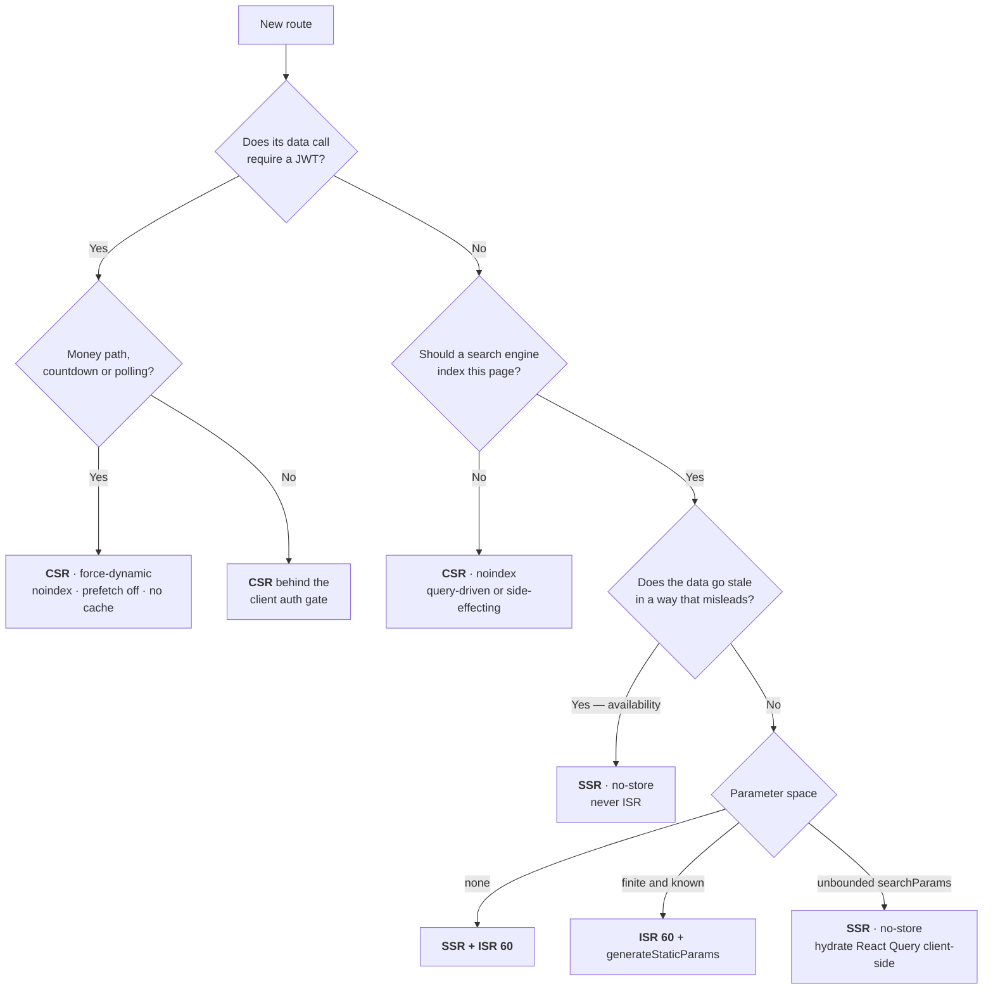

# Phase 4 — Screen Inventory

| Field | Value |
| --- | --- |
| **Phase** | 4 of 11 |
| **Epic** | [01-frontend-plan-and-design-direction.md](01-frontend-plan-and-design-direction.md) |
| **Status** | ✅ Complete |
| **Owner** | Frontend Lead |
| **Depends on** | [Phase 1 — Product Design Brief](02-product-design-brief.md) · [Phase 2 — Information Architecture](03-information-architecture.md) · [Phase 3 — User Journeys](04-user-journeys.md) |

> **Objective:** Exhaustive list of every MVP screen — one row per screen, reconciled against the
> Phase 2 route tree. No orphan routes, no screens without a route. Every row states its rendering
> strategy **and why**, the real endpoints it calls, the states it must implement, and its build
> priority. Where a screen's design depends on a capability the backend does not have, it is marked
> **⚠ NOT IMPLEMENTED** and handed to the backend as a work item rather than quietly designed in.

---

## Contents

| | Section | What it fixes |
|---|---|---|
| **0** | [How to read this document](#0-how-to-read-this-document) | Column definitions, rendering codes, state legend, priority definitions |
| **1** | [Rendering strategy](#1-rendering-strategy) | The doctrine, the JWT constraint, the decision tree, caching and indexing |
| **2** | [The screen inventory](#2-the-screen-inventory) | 33 routes + the 3-page static legal group, in four role tables |
| **3** | [Count and reconciliation](#3-count-and-reconciliation-with-phase-2) | The exact total, agreement with Phase 2, and the endpoints deliberately left unwired |
| **4** | [Money-path screens in detail](#4-money-path-screens-in-detail) | The five screens where a defect costs a user money |
| **5** | [Cross-cutting states](#5-cross-cutting-states-every-screen-implements) | What every screen implements without being told |
| **6** | [Commission configuration](#6-commission-configuration) | Global and event-specific effective-rate behavior |
| **7** | [Other contract gaps](#7-other-contract-gaps-that-shape-screens) | Nine verified gaps that change what a screen can be — 7.4 is the only one that blocks P0 |
| **8** | [The P0 MVP cut](#8-the-p0-mvp-cut) | The minimum set for a first usable release, and its one backend dependency |
| **9** | [Route → App Router file map](#9-route--app-router-file-map) | Directly implementable, one line per screen |
| **10** | [Risks and open questions](#10-risks-and-open-questions) | What could still move |
| — | [Acceptance Criteria](#acceptance-criteria) | |

---

## 0. How to read this document

### 0.1 Column definitions

| Column | Meaning |
|---|---|
| **Screen** | The product name of the surface. One screen per row. A surface that appears *inside* another — the ticket-selection sheet, the filter sheet, the provider chooser, the refund confirmation — is documented on its host row and specified in [Phase 6](07-component-inventory.md); it does not get a row or a route. |
| **Route** | The exact App Router path from the [Phase 2](03-information-architecture.md) canonical tree. Dynamic segments in `[brackets]`. Phase 4 adds, renames and removes nothing. |
| **Role** | The minimum role the **backend** enforces. `public` means no token is sent. This is a statement about the API, not about the client-side guard ([§1.2](#12-why-nothing-behind-a-jwt-is-server-rendered)). |
| **Rendering + why** | One of the codes in [§0.2](#02-rendering-codes) followed by the reason, in one clause. The reason is part of the deliverable — a rendering choice with no recorded reason is one the next person will silently reverse. |
| **Primary endpoint(s)** | Verified endpoints on `https://api.tickr.tn/api`. Endpoints that exist but must **not** be called from this screen appear ~~struck through~~ with the reason. |
| **Key states** | States beyond the happy path. Shared states are abbreviated per [§0.3](#03-state-legend); screen-specific states are named in full. |
| **P** | Priority per [§0.4](#04-priority-definitions). |

### 0.2 Rendering codes

| Code | Next.js mechanism | Correct when |
|---|---|---|
| **SSG** | Prerendered at build, no per-request work | Content that never varies and needs no data — the legal pages |
| **ISR n** | Prerendered + `export const revalidate = n` | Public, indexable, and tolerant of *n* seconds of staleness |
| **SSR** | `export const dynamic = 'force-dynamic'` + `fetch(…, { cache: 'no-store' })` | Public and indexable, but the data must be fresh per request or the parameter space is unbounded |
| **CSR** | Static shell + data fetched in the browser through `apiClient` with the bearer token | Everything behind a JWT — see [§1.2](#12-why-nothing-behind-a-jwt-is-server-rendered) |
| **CSR◐** | CSR plus a polling query with back-off | Screens whose truth arrives asynchronously, from a webhook |

### 0.3 State legend

Every screen also implements everything in [§5](#5-cross-cutting-states-every-screen-implements). The
`Key states` column lists only what is **specific** to that screen, using these abbreviations:

| Code | Meaning |
|---|---|
| `L` | Loading — a skeleton matching the final layout. Never a bare spinner (Phase 1 §G.1) |
| `∅` | A designed empty state: an explanation plus one action that resolves it |
| `err` | The shared error mapping ([§5.4](#54-the-eight-meanings-of-403--and-the-three-that-shape-screens)), rendered in one of the three failure shapes (Phase 1 §G.0) |
| `403` | A refusal — disambiguated, because 403 has **eight documented meanings** in this API ([§5.4](#54-the-eight-meanings-of-403--and-the-three-that-shape-screens)) |
| `404` | A designed not-found, never a bare page |
| `off` | Offline: the screen's degraded but honest behaviour |

### 0.4 Priority definitions

| | Definition | The test |
|---|---|---|
| **P0** | Required for a **first usable release**. | Remove it: does the money loop still close — stranger → ticket → door — and can an organizer still put an event on sale? |
| **P1** | Required for a **complete V1**. | Remove it: does a human now have to do manually something the user should do themselves? |
| **P2** | Ships **after** launch. Internal, low-frequency, or currently blocked by a backend gap. | Remove it: does anything user-facing break? |

### 0.5 Contract corrections carried into this phase

Five statements in [issue #64](https://github.com/HexHunters/Tickr/issues/64) and in the pre-existing
scaffolds do not match the implemented backend. **This document follows the code**, and agrees with
[Phase 2 §0.2](03-information-architecture.md#02-five-corrections-to-the-epic-text).

| Stated in the Epic / scaffolds | Verified in `backend/src` |
|---|---|
| Base path `/v1` | **`/api`** — `main.ts:17`, `config/app.config.ts` (`API_PREFIX \|\| 'api'`). Base: `https://api.tickr.tn/api`; Swagger at `/api/docs` |
| `GET /config/public` supplies the commission rate | **Implemented**, with optional `eventId` for effective-rate resolution. [§6](#6-commission-configuration) |
| Pagination `{ data, meta: { … } }` | **Flat**, but not uniform: events and tickets return `{ data, total, page, limit, totalPages, hasNextPage, hasPreviousPage }`; `GET /orders` omits both `has…Page` flags (`order.dto.ts:38`) and `GET /notifications/me` omits `totalPages` as well (`notification.dto.ts:180`). Derive the missing flags from `total` / `limit` |
| The error envelope carries a machine-readable code | `{ statusCode, code, message, details, timestamp, path, method }` — the domain error types are **discarded at the controller boundary** |
| Sold out → `409`, rate limited → `429` | Sold out → **`400`**; order-creation rate limiting → **`403`**. No controller emits `409` or `204` at all. `429` would come only from the throttler (3 req/s, 20 req/10 s, plus the per-endpoint auth limits) — but **`ThrottlerGuard` is registered nowhere**: `ThrottlerModule.forRoot` is configured in `users.module.ts:131` and no `APP_GUARD` provider exists, so `@Throttle()` is inert metadata and **no endpoint returns `429` today**. Every screen still handles it: the limits are declared and bind the moment the guard is wired |

One further correction, from the existing frontend rather than the Epic:
`frontend/src/lib/api/client.ts` redirects to **`/auth/login`**, while the canonical tree says
**`/login`**. The same interceptor hard-redirects on *any* 401 with **no refresh attempt**, although
`POST /auth/refresh-token` exists. Both are defects; the 401 rule in
[§5](#5-cross-cutting-states-every-screen-implements) specifies the fix, and checkout cannot ship before it lands.

---

## 1. Rendering strategy

### 1.1 The doctrine

Three rules decide every row in [§2](#2-the-screen-inventory). They are ordered; the first that
applies wins.

**Rule 1 — Anything requiring a JWT is CSR. No exceptions.**
The access token lives in `localStorage`, which the server cannot read. A React Server Component
fetching an authenticated endpoint would send no `Authorization` header and get a 401. This is not a
preference — it is a property of where the token is stored ([§1.2](#12-why-nothing-behind-a-jwt-is-server-rendered)).

**Rule 2 — Anything a stranger can land on from Instagram, WhatsApp or Google is server-rendered.**
Tickr's inbound traffic is a shared link to one event page. That page must return complete HTML with
correct `generateMetadata` OpenGraph tags on the first byte, on a congested 3G connection, to a
crawler that will not run JavaScript.

**Rule 3 — Anything on the money path is CSR *and* uncacheable *and* unindexed.**
Checkout, the payment return, order detail and the ticket carry a server-driven countdown, a polling
status query and a QR code. `force-dynamic`, `robots: noindex`, `prefetch={false}` on every link into
them, and no `Cache-Control` any intermediary could honour.

### 1.2 Why nothing behind a JWT is server-rendered

The evidence, not the theory:

```ts
// frontend/src/lib/api/client.ts — the request interceptor as it exists today
apiClient.interceptors.request.use((config) => {
  if (typeof window !== 'undefined') {                 // ← browser only
    const token = localStorage.getItem('accessToken');  // ← unreadable from a server component
    if (token) config.headers.Authorization = `Bearer ${token}`;
  }
  return config;
});
```

Four consequences to design for, not discover:

1. **Every authenticated screen ships a static shell and fetches in the browser.** The shell is not
   empty — it renders the chrome, the `<h1>` and a layout-accurate skeleton, so perceived loading
   begins before the token is even read.
2. **Route protection is client-side, and is therefore a UX affordance, not a security boundary.**
   Next.js middleware cannot read `localStorage` either, so it cannot gate `/organizer/*`. The guard's
   job is to send an unauthorised user somewhere sensible. The **API** enforces the role, and every
   screen still handles a 403 arriving from it.
3. **A logged-in user would see a flash of the anonymous chrome** unless the header renders a neutral
   third state (`unknown`) while the auth store rehydrates — never the logged-out state, which would
   flip to the user's name a frame later.
4. **A later move to an `httpOnly` cookie would relax Rule 1 for read-only screens such as
   `/profile` — never Rule 3.** Those screens poll, hold a countdown, and must never be cached.

### 1.3 The decision tree



### 1.4 Caching and revalidation

| Surface | Strategy | Revalidate | Why this value |
|---|---|---|---|
| `/legal/*` | SSG | redeploy | Prose. It changes when Legal says so, not on a timer |
| `/` | SSR + **ISR 60** on the no-city variant | 60 s | The default landing has no `searchParams` and is identical for every anonymous visitor, so one cached document removes the highest-traffic page from the origin's critical path. A persisted city preference is a **client overlay** and must never be baked into that document |
| `/categories/[category]` | **ISR 60** + `generateStaticParams()` over the 10 `EventCategory` values | 60 s | Ten known, finite, high-intent SEO landings. Generating them at build costs nothing and makes « Concerts en Tunisie » instant |
| `/events` | **SSR**, `no-store` | — | 7 filters × 8 sorts × 2 orders × page is an unbounded `searchParams` space; a prerender cache would fragment into thousands of near-useless entries |
| **`/events/[id]`** | **SSR**, `no-store` — **never ISR** | — | See below. This is the one place where the obvious optimisation is the wrong answer |
| `/search` | CSR | — | Query-driven, `noindex` |
| Everything authenticated | CSR, `Cache-Control: no-store` | — | React Query owns client-side freshness |

**Why `/events/[id]` is deliberately not cached**, even though it is the most-hit page in the product:

`soldQuantity` is incremented at **hold** time (`event-query.adapter.ts:88`, called from
`reserve-tickets.handler.ts:99`) and **restored** when a hold lapses or is cancelled
(`event-query.adapter.ts:117`, called from `expire-tickets.handler.ts:93` and
`cancel-tickets.handler.ts:105`). A cached availability figure can therefore be wrong in
**both directions**: it can show stock that was taken 40 seconds ago, or hide
stock that was released 40 seconds ago. Phase 1 §E.2 locks availability as a **per-fetch snapshot**,
and a snapshot served from a shared cache is not a snapshot. An ISR shell plus a client-side
availability refetch was considered and rejected: it doubles the request count on the product's
busiest page and still paints a wrong number first. If page-cache pressure later demands it, the
correct unlock is a narrow availability endpoint that can be polled independently of the document —
not a longer `revalidate`.

### 1.5 Indexing and prefetch policy

| Group | `robots` | `<Link prefetch>` | Note |
|---|---|---|---|
| `/`, `/events`, `/events/[id]`, `/categories/[category]`, `/legal/*` | `index, follow` | default | The whole sitemap. `/events/[id]` also emits `Event` JSON-LD |
| `/search` | `noindex, follow` | default | Thin and duplicative of `/events` |
| `/login`, `/register`, `/forgot-password`, `/reset-password`, `/verify-email` | `noindex, follow` | default | No search value; two of them carry a token in the URL |
| `/unsubscribe/[token]/[category]` | `noindex, nofollow` | **`prefetch={false}`** | ⚠ The endpoint behind it is a **side-effecting GET** (§7.6) |
| Every authenticated route | `noindex, nofollow` | **`prefetch={false}`** into `/checkout/*` | Prefetching a checkout route would fire an authenticated order read on hover |

---

## 2. The screen inventory

Four tables, one per zone, matching the [Phase 2](03-information-architecture.md) grouping exactly.
Column meanings are in [§0.1](#01-column-definitions); state abbreviations in [§0.3](#03-state-legend).

### 2.1 Public zone — 11 routes + the 3-page legal group

| Screen | Route | Role | Rendering + why | Primary endpoint(s) | Key states | P |
|---|---|---|---|---|---|---|
| **Landing** | `/` | public | **SSR + ISR 60** (no-city variant) — no `searchParams`, identical for every anonymous visitor, highest-traffic entry point; the persisted city preference is a client overlay, never part of the cached document ([§1.4](#14-caching-and-revalidation)) | `GET /events/upcoming?city=&country=&page=&limit=` (hero + « À venir »)<br>`GET /events?sortBy=soldTickets&sortOrder=DESC&limit=8` (« Les plus demandés »)<br>`GET /events?sortBy=publishedAt&sortOrder=DESC&limit=8` (« Nouveautés »)<br>`GET /events?category=…&limit=8` per rail | `L` per rail · **`∅` cold start — zero published events is a designed screen, not a bug; it is what launch day looks like** · `err` scoped per rail, one failing rail never blanks the page · city overlay refetch after hydration · category rails built from the local `EventCategory` mirror, never fetched · deterministic no-image fallback | **P0** |
| **Discovery** | `/events` | public | **SSR**, `no-store` — unbounded `searchParams` space, and a newly published event must appear at once; the server payload hydrates React Query so later filter changes never round-trip | `GET /events` — `category, city, country, dateFrom, dateTo, minPrice, maxPrice, page, limit, sortBy, sortOrder` | `L` grid skeleton · `∅` echoing the **actual** filters + « Effacer les filtres » · `err` · filter chips labelled with their **value**, not their field · pagination from `hasNextPage`/`totalPages` · loading-more · `off` · ⚠ **`?q=` returns 400** under `forbidNonWhitelisted`; the header search box must route to `/search` (§7.1) | **P0** |
| **Event detail** | `/events/[id]` | public | **SSR**, `no-store`, **never ISR** — the most shared and most indexed page in the product, so it needs complete HTML and OG tags on the first byte; and availability is a per-fetch snapshot that a shared cache would falsify ([§1.4](#14-caching-and-revalidation)). Sends the bearer token when present, so an owner sees their own `DRAFT` | `GET /events/:id` → `EventDto` incl. `ticketTypes[]`<br>`GET /config/public?eventId=:id` when ticket selection opens<br>`POST /orders` — creates the order and reserves the tickets in one call | `L` · `404` for a deleted or never-published event · malformed UUID → 404 presentation · `403` on private draft · `CANCELLED` / `COMPLETED` · tier availability states · sheet open · effective commission preview · `POST /orders` result replaces preview before payment · conflict/rate-limit states · no-image fallback | **P0** |
| **Search results** | `/search` | public | **CSR**, `noindex, follow` — query-driven, changes per keystroke, thin and duplicative for a crawler; SSR would add TTFB and buy nothing | `GET /events/search?q=&page=&limit=` | `L` · idle, no query yet — recent searches + popular · `∅` « Aucun événement pour “jazz” » + a widen action · **an empty or blank `q` is a 400** (`events.controller.ts:268`), so nothing is requested until the input holds a non-blank value · `err` · input debounced ≥ 300 ms to stay under the 3 req/s throttle · ⚠ **no facets** — the endpoint takes only `q`, `page`, `limit`, so refinement chips deep-link to `/events?…` (§7.2) | P1 |
| **Category listing** | `/categories/[category]` | public | **ISR 60 + `generateStaticParams()`** over the 10 `EventCategory` values — finite, known, high-intent SEO landings; nothing here goes stale in a misleading way because the tier-level availability lives on the detail page | `GET /events/category/:category?page=&limit=` | `L` · `∅` « Rien de prévu en Théâtre pour l'instant » → « Voir tous les événements » · an unknown segment is a **400** from the API, rendered through `not-found.tsx` · `err` · segment is the **lower-cased** enum (`/categories/concert`) · refinement chips **deep-link to `/events?category=…&city=…`**, because this endpoint accepts only `page`/`limit` | P1 |
| **Login** | `/login` | public | **CSR** — no data to render; the shell prerenders so the form paints instantly on 3G | `POST /auth/login` → `{ accessToken, refreshToken, expiresIn, user{id,email,firstName,lastName,role} }` | idle · submitting · `401` invalid credentials · **`403` = email not verified** (`auth.controller.ts:188`) — its own state, routed to `/verify-email`, **never** « accès refusé », and today with no way out (§7.4) · ⚠ a **deactivated** account is a `401`, not a `403` — `LocalStrategy` throws `UnauthorizedException('Account is deactivated')` (`local.strategy.ts:73`), so only the message distinguishes it from a wrong password, despite what the Swagger annotation claims · **`429` at 5 attempts / 15 min** with a timed re-enable · `?next=` resume restoring the pending checkout selection | **P0** |
| **Register** | `/register` | public | **CSR** | `POST /auth/register` → `{ userId, message }` — **no tokens, no session** | idle · submitting · zod validation mirroring `class-validator` · **duplicate email → `400`** (not 422, despite the Swagger annotation) · **`429` at 3 / hour** · **terminal state « Vérifiez votre boîte mail »** — this, not a redirect, is how the screen ends · ⚠⚠ **the verification email is a `// TODO` in the backend, so this promise is currently false and the account can never log in** (§7.4) · always creates a `PARTICIPANT` — **there is no organizer self-signup** | **P0** |
| **Email verification** | `/verify-email` | public | **CSR** — reads `?token=` via `useSearchParams()`, which needs a `<Suspense>` boundary or the route silently opts into dynamic rendering | `POST /auth/verify-email` (`SkipThrottle`) | verifying — auto-submits on mount, which is **safe here because the call is a POST** that no mail scanner will issue · success → « Se connecter », pending selection preserved · `400` invalid or expired token · already verified · **no token in the URL → an instruction screen**, not an error · ⚠ **« Renvoyer l'email » cannot be offered — no resend endpoint exists** | **P0** |
| **Forgot password** | `/forgot-password` | public | **CSR** | `POST /auth/request-reset` | idle · submitting · **always-success** — the copy is byte-identical whether or not the address exists · **`429` at 3 / hour** · ⚠ the reset token is created but **never mailed** (`auth.controller.ts:282`), so this flow is currently inert end to end (§7.4) | **P0** |
| **Reset password** | `/reset-password` | public | **CSR** — reads `?token=` from the emailed link, same `<Suspense>` requirement | `POST /auth/reset-password` | token missing / invalid / expired, each distinct · form with a strength meter · submitting · **success → redirect to `/login` with a flash — the endpoint returns no session** · `429` | **P0** |
| **Unsubscribe** | `/unsubscribe/[token]/[category]` | public | **CSR**, `noindex, nofollow`, **`prefetch={false}`** — reached only from an email, and the endpoint behind it mutates | `GET /notifications/unsubscribe/:token/:category` | **confirm** — the call fires on an explicit « Confirmer la désinscription » press and **never on page load** (§7.6) · processing · success · invalid or expired token · `category` is constrained to **`marketing`** or **`event_reminders`**; anything else is a 400 → designed error · `err` | P1 † |
| **Legal** | `/legal/terms`<br>`/legal/privacy`<br>`/legal/refunds` | public | **SSG** — prose, no endpoint, no data | *(static)* | Three pages linked from the footer and purchase surfaces. `/legal/refunds` states that the displayed service fee is non-refundable, but does **not** hard-code 6 % because the effective rate may vary by event | **P0** |

† `/unsubscribe/[token]/[category]` becomes **P0 the day the first `MARKETING_PROMO` email is sent** — a
working one-click unsubscribe path is a legal obligation, not a feature.

### 2.2 Participant zone — 9 routes

All nine are **CSR**, for the reason in [§1.2](#12-why-nothing-behind-a-jwt-is-server-rendered). The
*why* column therefore records what is specific to each. Every endpoint here is `JwtAuthGuard`-guarded;
`403` on these routes means *this resource is not yours*, never a role failure. The shared guard now
executes Passport JWT and is used by Events, Tickets and Notifications.

| Screen | Route | Role | Rendering + why | Primary endpoint(s) | Key states | P |
|---|---|---|---|---|---|---|
| **Checkout & payment** | `/checkout/[orderId]` | authenticated | **CSR** · `force-dynamic` · `noindex` · no prefetch — JWT-bearing, carries a countdown driven by the server's `expiresAt`, and must never be served by any cache. Stripped chrome: wordmark, countdown, money, providers, nothing else | `GET /orders/:id`<br>`POST /orders/:id/pay` `{ paymentMethod: STRIPE\|KONNECT\|PAYMEE, idempotencyKey? }` → `{ id, paymentUrl?, clientSecret?, status }`<br>~~`POST /tickets/reserve`~~ — **never called**: `POST /orders` already reserved the tickets internally (`create-order.handler.ts:137`); a second call would create an orphaned hold and silently consume stock | `L` · countdown **> 5 min / ≤ 5 min / ≤ 1 min / expired**, always in relative **and** absolute form · no provider chosen yet · submitting (one `idempotencyKey` per attempt, reused on retry) · redirect announced **before** it happens (Konnect / Paymee) · Stripe in-page · **`400` × 4 — `ORDER_EXPIRED`, `INVALID_STATUS`, `MAX_ATTEMPTS_EXCEEDED`, `GATEWAY_ERROR` are four different screens behind one status code** · `404` order · order already `PAID` → redirect to the ticket, never re-offer payment · `off` — pay disabled **with an explanation**, never a silent failure | **P0** |
| **Payment return** | `/checkout/[orderId]/retour` | authenticated | **CSR◐** · `force-dynamic` · `noindex` — confirmation is webhook-driven, so a polling read of the order is the only honest implementation. The gateway's return parameters are **never** treated as an outcome | `GET /orders/:id`, polled with back-off, ~60 s ceiling | « Nous confirmons votre paiement… Ne fermez pas cette page » — **the default state, and it is not an error** · `PAID` → `/orders/[id]` · `FAILED` with recovery and an alternative provider · **ceiling reached while `PENDING`/`PROCESSING` → « en cours de vérification », no retry button, link to `/orders`** · `CANCELLED` · network failure mid-poll → « statut inconnu », **never « échec »** · the countdown stays visible throughout | **P0** |
| **Order history** | `/orders` | authenticated | **CSR** — personalised list, no SEO value | `GET /orders?page=&limit=`<br>+ `GET /events/:id` per distinct `eventId` | `L` · `∅` « Vous n'avez pas encore de commandes » → « Découvrir des événements » · `err` · a status chip per `OrderStatus` · a `PENDING` order whose `expiresAt` is still future shows a live « Terminer le paiement » · ⚠ **only `page` and `limit` are accepted** — `?status=PAID` returns 400, so status filtering is client-side over the loaded pages and **must be labelled as filtering this page, not the whole history** · pagination derived from `total` / `limit`, because this envelope carries no `hasNextPage` · ⚠ **N+1**: `OrderDto` has `eventId` but no event title or date (§7.3) | **P0** |
| **Order detail** | `/orders/[id]` | authenticated | **CSR** — the receipt: personalised and money-bearing | `GET /orders/:id`<br>`POST /orders/:id/refund` | `L` · `404` · one designed state per `OrderStatus` · the breakdown — `subtotal`, `platformFee`, a **conditional** `paymentFees` line, `total` — rendered **verbatim**, never recomputed · refund confirmation showing the arithmetic **before** the request (refund = `subtotal + paymentFees`; **the commission is not returned**) · `RefundStatus.PENDING` · refunded, with `refundedAt` / `refundReason` · refund `FAILED` → support path, **no retry button** · `PENDING` + countdown → resume payment · `403` = not your order | **P0** |
| **My tickets** | `/tickets` | authenticated | **CSR**, cache-persisted — this is the bottom-tab destination and it must open fast on a bad connection at a venue | `GET /tickets?page=&limit=&status=` (server-side `status`, unlike `/orders`)<br>+ `GET /events/:id` per distinct `eventId` | `L` · `∅` « Vous n'avez pas encore de billets » → « Découvrir des événements » · `err` · grouped upcoming vs. past · an event happening **today** promoted to the top · `RESERVED` rows show the `reservedUntil` countdown · `CHECKED_IN` / `EXPIRED` / `CANCELLED` below the fold · `off` from cache · ⚠ same **N+1** as `/orders` | **P0** |
| **Ticket + QR** | `/tickets/[id]` | authenticated (owner **or** the event's organizer) | **CSR + offline-first** — the most unforgiving context in the product: a venue door, at night, on a phone with no signal. `TicketDto.qrCode` is a **string** (`ticket.dto.ts:33`), so the code is rendered locally and cached; nothing on this screen may require the network | `GET /tickets/:id`<br>`GET /tickets/:id/pdf` — a 302 to a signed S3 URL (backup; `pdfUrl` may be `null`)<br>`POST /tickets/:id/transfer` `{ newOwnerEmail }` → `{ newQrCode }` | `L` · `CONFIRMED` — live QR ≥ 240 px on white with a quiet zone, brightness boost, dark `ink-950` pass · `CHECKED_IN` — QR visually spent + `checkedInAt` · `RESERVED` — countdown, no QR yet · `EXPIRED` / `CANCELLED` — QR hidden, reason given · event-cancelled banner · transfer sheet: irreversible, **returns a new `qrCode`, kills the old one and nulls `pdfUrl`** (`ticket.entity.ts:465`), capped at **3 transfers per ticket** — stated in words before confirming, and the sender's cached copy is purged on success · `off` renders from cache · `403` / `404` · ⚠ the *owner-or-organizer* rule is **not enforced today**: `get-ticket-by-id.handler.ts:44` denies only when the event is missing, so any authenticated caller can read any ticket. Design for `403`; do not rely on it | **P0** |
| **Message history** | `/notifications` | authenticated | **CSR** — personalised log | `GET /notifications/me?page=&limit=`<br>`GET /notifications/:id` (in-page expansion, not a route) | `L` · `∅` « Aucun message » — the calmest state in the product, no illustration · `err` · a `FAILED` row shows a translated reason, never the raw `failureReason` · pagination derived from `total` / `limit` — this envelope carries neither `totalPages` nor `hasNextPage` · ⚠ **a delivery log, not an inbox**: no body, no read state, therefore **no unread badge anywhere in the navigation** · channels are **EMAIL and SMS only** — the copy says « email » or « SMS », never « notification » (§7.5) | P1 |
| **Profile** | `/profile` | authenticated | **CSR** — personalised and mutating. Also the canonical source of the current user's `id`, which the organizer zone needs for `GET /events/organizer/:organizerId`; fetched once per session and cached | `GET /users/me`<br>`PUT /users/me` | `L` · view · edit with a dirty-state navigation guard · saving · field validation · saved confirmation · `err` · ⚠ `UserProfileDto` exposes **no `emailVerified` field**, so no « Confirmez votre adresse e-mail » banner can be rendered here | P1 |
| **Settings** | `/settings` | authenticated | **CSR** — personalised, mutating, destructive | `PATCH /users/me/password`<br>`GET /notifications/preferences/me`<br>`PUT /notifications/preferences/me`<br>`DELETE /users/me` | `L` · password form (current / new / confirm; `400` = wrong current password, shown on that field) · preferences are exactly **four booleans** — `emailEnabled`, `smsEnabled`, `marketingEnabled`, `eventRemindersEnabled` — optimistic toggle with rollback on failure · **no PUSH toggle**, ever · account deletion in a visually distinct danger section behind a typed confirmation, stating what happens to existing tickets · deleted → forced logout · `429` | P1 |

### 2.3 Organizer zone — 9 routes

All **CSR**. Every endpoint carries `JwtAuthGuard` + `RolesGuard`, and the event-scoped mutations add
`IsEventOwnerGuard` — so a non-owning `ORGANIZER` receives **403**, not 404. The shared guard now
verifies bearer JWTs through Passport; the protected Events lifecycle is covered by E2E tests.

| Screen | Route | Role | Rendering + why | Primary endpoint(s) | Key states | P |
|---|---|---|---|---|---|---|
| **Organizer dashboard** | `/organizer` | `ORGANIZER` · `ADMIN` (read-only) | **CSR** — personalised analytics behind a JWT | `GET /analytics/dashboard?timeRange=&page=&limit=` → `{ organizerId, totalRevenue, currency, totalEvents, totalTicketsSold, averageCheckInRate, revenueTimeline[], events[], page, limit, total }` | `L` · **first-run `∅`** — no events is an onboarding moment, not an error: explain what publishing does, « Créer mon premier événement » · no-sales `∅` carrying the shareable event link · `err` · period selector offering **exactly `7d` / `30d` / `90d`** — the only values `DashboardQueryDto` accepts, default `30d` · new `totalRevenue` metrics use ticket subtotal and are labelled « Ventes de billets brutes · avant remboursements et ajustements »; pre-fix metrics need backfill and no payout logic exists, so never imply net revenue or payout (Phase 1 §L gap 8) · ⚠ `EventAnalyticsDto` carries `eventId` with **no title** → hydrate from `GET /events/organizer/:organizerId` | P1 |
| **My events** | `/organizer/events` | `ORGANIZER` · `ADMIN` | **CSR** — `GET /events/organizer/:organizerId` is `@Roles('ORGANIZER','ADMIN')`, so it needs the bearer token. This is also why **no public organizer profile page is possible in V1** | `GET /events/organizer/:organizerId?status=&page=&limit=` | `L` · `∅` first-run · `err` · **tabs driven by the `status` query — Brouillons · Publiés · Annulés · Terminés** (this endpoint honours `status`; `GET /events` does not) · per-row publish / edit / delete · delete confirmation · ⚠ `organizerId` comes from the authenticated user, **never from the URL** — passing any other id returns 403 · `DRAFT` must be unmistakable | **P0** |
| **Create event** | `/organizer/events/new` | `ORGANIZER` | **CSR** — a multi-step client form with local autosave; there is nothing to server-render | `GET /config/public` for inherited global rate<br>`POST /events` → creates a `DRAFT`<br>`POST /events/:id/image` | steps 1..n · autosave · two-phase create/image upload · one image · validation · live buyer-price preview using the global inherited rate · created → ticket types | **P0** |
| **Event overview** | `/organizer/events/[id]` | `ORGANIZER` (owner) | **CSR with the bearer token** — `GET /events/:id` is `@Public()` but resolves `ACCESS_DENIED → 403` for a non-owner on a `DRAFT`. A draft is therefore **impossible to server-render**: an anonymous SSR fetch would 403 | `GET /events/:id` (owner view, includes `DRAFT`) | `L` · **`DRAFT` preview** with a persistent « Brouillon — invisible par le public » bar and *Publier* as the primary action · `PUBLISHED` with the shareable link and quick stats · `CANCELLED` · `COMPLETED` · `403` not the owner · `404` unknown id · an `ADMIN` can open `PUBLISHED` events only | P1 ‡ |
| **Edit · publish · delete** | `/organizer/events/[id]/edit` | `ORGANIZER` (owner) | **CSR** — mutating and owner-scoped | `PUT /events/:id`<br>`POST /events/:id/publish`<br>`DELETE /events/:id`<br>`POST /events/:id/image` | `L` · unsaved-changes guard · saving · **publish confirmation** — `PUBLISHED` can only move to `CANCELLED` or `COMPLETED`, never back to `DRAFT`, so publish is a confirmation step and not a toggle · delete in a danger section behind confirmation · `400` validation · `403` not the owner (**not** a 404) · a `CANCELLED` event is read-only | **P0** |
| **Ticket types** | `/organizer/events/[id]/ticket-types` | `ORGANIZER` (owner) | **CSR** — mutating and owner-scoped | `GET /events/:id` → `ticketTypes[]`<br>`GET /config/public?eventId=:id`<br>ticket-type CRUD endpoints | tier CRUD states · effective buyer-price preview · capacity and sales-window rules · no organizer access to commission override | **P0** |
| **Access control** | `/organizer/events/[id]/participants` | `ORGANIZER` (owner) · `ADMIN` | **CSR** — owner-scoped aggregates | `GET /tickets/event/:eventId/stats` → `{ totalTickets, checkedIn, checkInRate, byType[{ ticketTypeName, total, checkedIn, rate }] }` | `L` · `∅` no sales yet · `err` · overall check-in progress · per-type breakdown · entry point to the scanner · `403` not the owner · ⚠ **this cannot be a participant roster.** No endpoint returns per-attendee rows for an event, so the screen is a stats board with a check-in entry point, not a table of names (§7.7) | P1 |
| **Event analytics** | `/organizer/events/[id]/analytics` | `ORGANIZER` (owner) · `ADMIN` | **CSR** — owner-scoped analytics | `GET /analytics/events/:id` → `{ totalRevenue, totalTicketsSold, totalCapacity, checkInCount, checkInRate, conversionRate, averageTicketPrice, topSellingTicketType, salesByDay[], checkInsByHour[] }`<br>`GET /analytics/events/:id/sales-timeline` | `L` · `∅` no sales yet, with the copy-link CTA · `err` · date-range selector — **mandatory**, because `sales-timeline` requires `startDate` and `endDate` (`granularity` is `hour` or `day`); the summary call takes no range · `403` · export via `POST /analytics/export` · `totalRevenue` is gross ticket subtotal before refunds and adjustments, labelled exactly as on the dashboard; it is not organizer net revenue | P1 |
| **Check-in scanner** | `/organizer/scanner` | `ORGANIZER` · `ADMIN` | **CSR** — camera access requires the browser and a secure context; nothing here can be server-rendered. Dark `ink-950` surface, focus ring swaps to `sun-400`. Not event-scoped in the URL: the scanned ticket carries its own event | `POST /tickets/check-in` `{ qrCode, deviceId, locationGate }` | **setup** — `deviceId` (≤ 100 chars) and `locationGate` (≤ 50) are **required by the DTO**, so a one-time gate/device step must precede any scan; the device id is generated once and persisted · camera permission prompt / denied → **manual entry of the QR string itself**, since `qrCode` is the only identifier the endpoint accepts · scanning · **valid**: large success, holder name, tier · **every refusal is a `400`, or `404` for an unknown QR — a `200` always means valid** (`check-in-ticket.handler.ts:170`), and the message string is the only discriminator: already checked in (the timestamp is in the message), ticket not `CONFIRMED`, QR format or checksum invalid, outside the window · ⚠ **the check-in window opens 1 h before `startDate` and closes at `endDate`** (`check-in-ticket.handler.ts:25`) — a scan outside it must name the window, not blame the ticket · **`429`** — not emitted today ([§0.5](#05-contract-corrections-carried-into-this-phase)), but a fast door queue would exceed the configured 3 req/s the moment the guard is wired: debounce and show a timed retry · `off` — ⚠ **check-ins cannot be queued offline**; the endpoint is the source of truth and the screen must say so plainly rather than pretend | **P0** |

‡ `/organizer/events/[id]` is P1 because the P0 cut redirects it to `.../edit`. It earns its own page the
moment an organizer needs to *preview* a draft rather than *edit* it.

### 2.4 Admin zone — 4 routes

All **CSR**. Design weight is 5 % (Phase 1 §B.3): these reuse participant and organizer components and
increase density to 40 px rows, never a bolted-on admin theme.

| Screen | Route | Role | Rendering + why | Primary endpoint(s) | Key states | P |
|---|---|---|---|---|---|---|
| **Platform overview** | `/admin` | `ADMIN` | **CSR** — the only endpoint in the analytics controller carrying `@Roles('ADMIN')` | `GET /analytics/platform` → `{ periodStart, periodEnd, totalRevenue, currency, platformCommission, totalEvents, totalTicketsSold, activeUsers, conversionRate, revenueByCategory[], topEvents[], lastUpdated }` | `L` · `∅` · `err` · `403` non-admin · period selector · **`lastUpdated` rendered verbatim**, so a stale aggregate is never mistaken for live data | P2 |
| **Reports & export** | `/admin/reports` | `ADMIN` | **CSR** — a form plus a generated artefact | `GET /analytics/revenue-report` (requires `startDate`, `endDate`)<br>`POST /analytics/export` `{ reportType, format: CSV\|PDF, startDate, endDate, eventId? }` → `{ reportId, url, format }` | `L` · form · generating · **ready → the download is a link to the returned `url`**, not a client-generated blob · **`NO_DATA` returns 404 and must render as an empty state, not an error page** · `400` invalid filters — `startDate ≥ endDate`, or a range **longer than one year** (`get-revenue-report.handler.ts:47`), so the picker constrains both · `403` · ⚠ both endpoints are **`JwtAuthGuard` only — no `@Roles('ADMIN')`**, and neither handler ever returns the `ACCESS_DENIED` its controller maps to 403: `revenue-report` reads every `REVENUE` metric in the range with no scope at all (`get-revenue-report.handler.ts:62`), `export` scopes silently to the caller's own `userId` (`generate-report.handler.ts:111`). The UI restricts the route to `ADMIN`; the API does not | P2 |
| **Event moderation** | `/admin/moderation` | `ADMIN` | **CSR** | `GET /events`<br>`GET /config/public?eventId=:id`<br>`PATCH /events/:id/commission`<br>~~`DELETE /events/:id`~~ — unusable by Admin | event table · commission drawer showing global/override/effective rates · set 0–20 % · reset to global with `null` · buyer-price preview · saving/saved/validation/403/404 · takedown remains unavailable and drafts remain absent | P2 |
| **User directory** | `/admin/users` | `ADMIN` | **CSR** — dense table, desktop-first at 40 px rows | `GET /users?page=&limit=` (`@Roles('ADMIN')`)<br>`GET /users/:id` (`@Roles('ADMIN')`) | `L` · `∅` · `err` · `403` · pagination · **the detail view is a slide-over on this route**, not a separate URL · ⚠ **read-only in V1** — no endpoint changes a role, bans, or deactivates another user; `DELETE /users/me` is self-service only | P2 |


---

## 3. Count and reconciliation with Phase 2

| Zone | Routes | Screens | Rendering split |
|---|---|---|---|
| Public | 11 | 11 (+ 3 static legal pages) | 4 server-rendered (`/`, `/events`, `/events/[id]`, `/categories/[category]`) · 7 CSR · 3 SSG |
| Participant | 9 | 9 | 0 server-rendered · 9 CSR |
| Organizer | 9 | 9 | 0 server-rendered · 9 CSR |
| Admin | 4 | 4 | 0 server-rendered · 4 CSR |
| **Total** | **33** | **33 (+3 static)** | **4 server-rendered · 29 CSR · 3 SSG** |

**Reconciliation with [Phase 2](03-information-architecture.md):** the route tree there lists the same
33 routes plus the `/legal/*` static group. **No orphan routes** (every route in Phase 2 has a screen
here) and **no orphan screens** (every screen here has a route there). The static legal group is
counted separately because its three pages share one template and carry no endpoint.

### 3.1 Endpoints deliberately left unwired

Five backend endpoints are reachable but **no V1 screen calls them**. This is intentional and recorded
so a future reader does not mistake it for an oversight:

| Endpoint | Why no screen calls it |
|---|---|
| `POST /tickets/reserve` | `POST /orders` reserves internally; calling this too would create an orphaned hold |
| `POST /tickets/confirm` | Called by the Payments module after a successful payment, not by the UI |
| `POST /tickets/cancel` | Cancellation flows through `POST /orders/:id/refund`, which releases the tickets internally |
| `POST /notifications` | Server-side dispatch; a participant never composes a notification |
| `POST /payments/webhooks/*` | Server-to-server. The UI **polls** `GET /orders/:id` instead. Note the Konnect webhook is itself a `GET` — it is not the user-facing `/checkout/[orderId]/retour` |

---

## 4. Money-path screens in detail

Five screens can cost a user money if they are wrong. They carry stricter requirements than the rest
of the inventory and should be built, reviewed and tested first.

| # | Screen | The specific risk | The mitigation this inventory mandates |
|---|---|---|---|
| 1 | **Event detail** `/events/[id]` | A price that changes later | Per-tier all-in arithmetic shown the instant a quantity exists ([Phase 1 §E.3](02-product-design-brief.md#e3--disclose-the-service-fee-the-instant-a-quantity-exists--never-at-the-payment-step)) |
| 2 | **Checkout** `/checkout/[orderId]` | Double charge · expired hold · wrong total | Mandatory button loading state · one `idempotencyKey` per attempt reused on retry · countdown from the server's `expiresAt` in both relative and absolute form · totals rendered from the API, never computed |
| 3 | **Payment return** `/checkout/[orderId]/retour` | Declaring failure before the webhook lands | Never infer outcome from URL params. Poll `GET /orders/:id` with back-off to a ~60 s ceiling; a prolonged `PROCESSING` is presented as *verification in progress*, **never** as failure, and **never** offers a retry |
| 4 | **Order detail** `/orders/[id]` | A refund the user did not expect | The non-refundable-commission arithmetic shown **before** the request is submitted |
| 5 | **Ticket** `/tickets/[id]` | An unusable ticket at the door | QR rendered client-side from the cached `qrCode` string — stable for the ticket's lifetime — so it works with no signal, ≥ 240 px, brightness boost, PDF as explicit backup |

---

## 5. Cross-cutting states every screen implements

Every screen in this inventory implements these without being told again, per
[Phase 1 §G](02-product-design-brief.md#g-error-and-edge-case-ux):

- **Loading** — skeletons matching the real layout, never a bare spinner; reserved aspect-ratio boxes so CLS stays at zero.
- **Empty** — glyph + plain explanation + one action that resolves it. Never a bare sentence.
- **Error** — the three failure shapes (toast / inline / blocking). **Anything touching money is blocking.**
- **401** — silent refresh then replay; redirect only when the refresh itself fails, returning to the exact screen. `POST /auth/login` is exempt: a 401 there is an answer about the credentials, not an expired token.
- **403** — see [§5.4](#54-the-eight-meanings-of-403--and-the-three-that-shape-screens); the message differs by cause.
- **429** — action disabled with a visible retry timer; GETs back off automatically. Defensive for now: no endpoint emits `429` until `ThrottlerGuard` is registered ([§0.5](#05-contract-corrections-carried-into-this-phase)).
- **Offline** — persistent banner; cached tickets and QRs stay readable; mutating actions disabled with an explanation rather than failing on tap.

### 5.4 The eight meanings of 403 — and the three that shape screens

`403` is overloaded **eight** ways in this API.
[Phase 2 §5.3](03-information-architecture.md#53-the-eight-meanings-of-403) holds the authoritative
table; it is resolved by **endpoint context** in `mapApiError()`, never by a route guard alone, and
the eight **must not share one handler**. Three of them decide how a screen is built:

| Cause | Where | What the user must read |
|---|---|---|
| **Role failure** (`RolesGuard`) | Any role-guarded route | « Cette page est réservée aux organisateurs. » → route to their own home |
| **`IsEventOwnerGuard`** — organizer acting on someone else's event | `PUT/DELETE /events/:id`, publish, ticket-types, image | « Vous n'êtes pas l'organisateur de cet événement. » → back to their event list |
| **`RATE_LIMITED`** — 5 orders in the last hour | `POST /orders` **only** | « Vous avez atteint la limite de 5 commandes par heure. » + when they can retry. **This is not a permission problem and must never say « accès refusé ».** |

The third is the dangerous one: it appears mid-checkout, on the same status code as a permissions
error, and a generic 403 page there would strand a paying user.

The other five are narrower, and each is already handled on its own row above: an organizer passing
someone else's id to `GET /events/organizer/:organizerId` (`events.controller.ts:426` — unreachable
while the id comes from `GET /users/me`); a `DRAFT` requested by a non-owner on the **public** route
(`get-event-by-id.handler.ts:76`), which `/events/[id]` renders as *not available*, never as
*forbidden*; an order belonging to another user on `GET /orders/:id`; handler-scope `ACCESS_DENIED`
on the tickets and analytics queries; and **`POST /auth/login` with an unverified email**
(`auth.controller.ts:188`) — which today has **no recovery at all**, because no resend-verification
endpoint exists ([§7.4](#7-other-contract-gaps-that-shape-screens)). One refinement to that table: a
*deactivated* account, which Phase 2 groups into the same row, is in fact a `401`
(`local.strategy.ts:73`).

---

## 6. Commission configuration

The global default comes from `PLATFORM_COMMISSION_RATE` (6 % by default). Admin may configure an
event override from 0–20 % with `PATCH /events/:id/commission`, or send `null` to restore global
inheritance. Public screens use `GET /config/public?eventId=:id`; organizer creation uses the global
`GET /config/public` response. Checkout always renders the order amounts returned by the backend.

Existing orders retain their original `platformFee`; an Admin update affects new orders only.

---

## 7. Other contract gaps that shape screens

| # | Gap | Screen consequence |
|---|---|---|
| 7.1 | `GET /events` **rejects `?q=`** — there is no `q` on `EventFilterDto`, and `forbidNonWhitelisted` is on (`main.ts:31`) | The header search box routes to `/search`, never to `/events?q=`. Discovery's filter chips carry only the seven real filters |
| 7.2 | `GET /events/search` accepts **only `q`, `page`, `limit`** | `/search` has **no facets**. Refinement chips must deep-link out to `/events?category=…&city=…` rather than narrow in place |
| 7.3 | `OrderDto` and `TicketDto` carry `eventId` but **no event title or date** | `/orders` and `/tickets` fan out one `GET /events/:id` per distinct `eventId` — an N+1 the client must deduplicate and cache, and a row must render usefully before its event resolves |
| 7.4 | **No authentication email is ever sent.** Registration's verification token is a `// TODO` (`auth.controller.ts:154`) and the reset token is created but never mailed (`auth.controller.ts:282`) | `/register` ends on a promise that is currently false, and a new account can never log in — `POST /auth/login` returns `403` while `emailVerified` is false, and **there is no resend-verification endpoint**, so the state has no recovery. `/forgot-password` is equally inert. Ship the copy honestly or hold the flow |
| 7.5 | Notification channels are **EMAIL and SMS only** — `PUSH` exists in the enum but is unsupported | `/settings` renders four booleans and no PUSH toggle; `/notifications` copy says « email » or « SMS », never « notification ». No unread badge anywhere, because no read state exists |
| 7.6 | `GET /notifications/unsubscribe/:token/:category` is a **side-effecting GET** | Must never be prefetched or preloaded; `prefetch={false}` and `rel="nofollow"`. A link-scanner would silently unsubscribe users |
| 7.7 | **No endpoint returns per-attendee rows for an event** — `GET /tickets/event/:eventId/stats` is an aggregate | `/organizer/events/[id]/participants` is a stats board with a check-in entry point, not a roster. Do not design a table of names against data that does not exist |
| 7.8 | **Admin moderation has no working takedown** | `DELETE /events/:id` is `@Roles('ORGANIZER')` + `IsEventOwnerGuard`, and **neither guard grants an admin bypass** (`roles.guard.ts:37`, `is-event-owner.guard.ts:78`). An admin gets `403` on any event they do not own, and `GET /events` returns `PUBLISHED` only, so drafts are invisible. `/admin/moderation` ships **read-only** with an explained « suppression indisponible » state — **never a delete button that always fails** |
| 7.9 | QR payload is a client-renderable string, **and it is stable** | ✅ Not a blocker, and no longer an open question. `TicketDto.qrCode` is a plain string `v1-{uuid}-{checksum}` (`ticket.dto.ts:33`, `qr-code.vo.ts:30`), so `/tickets/[id]` renders the QR locally and offline. The value is written once at creation and reassigned in exactly one place — `transfer()` (`ticket.entity.ts:465`), which also nulls `pdfUrl`. **Cache it for the ticket's lifetime and invalidate only on a successful transfer** |

---

## 8. The P0 MVP cut

The three cuts below are the `P` column of [§2](#2-the-screen-inventory), read back as sets. They
partition all 33 routes: **19 + 10 + 4**.

**P0 — the minimum coherent product (19 routes + the 3-page legal group).** A participant can
discover an event, buy a ticket, read the receipt and present the ticket at the door; an organizer
can create, price, publish and check in.

`/` · `/events` · `/events/[id]` · `/login` · `/register` · `/verify-email` · `/forgot-password` ·
`/reset-password` · `/legal/*` · `/checkout/[orderId]` · `/checkout/[orderId]/retour` · `/orders` ·
`/orders/[id]` · `/tickets` · `/tickets/[id]` · `/organizer/events` · `/organizer/events/new` ·
`/organizer/events/[id]/edit` · `/organizer/events/[id]/ticket-types` · `/organizer/scanner`

> 🔴 **P0's first hard blocker: ticket reservation is a stub.** `TICKET_RESERVATION_PORT` binds to
> `TicketReservationAdapter`, whose `reserveTickets()` logs `[STUB]` and returns mock ticket IDs.
> `POST /orders` therefore creates **no ticket rows** and moves **no `soldQuantity`** — so nothing
> reaches `GET /tickets`, availability never decrements, and the hold is notional. Every screen here
> can be built to the contract; none can be verified against real data until the port is wired
> ([Phase 1 §L gap 0a](02-product-design-brief.md#l-open-contract-questions-for-the-backend)).

> **Resolved authentication blocker.** The shared guard now extends Passport `AuthGuard('jwt')`,
> preserves `@Public()` and uses the registered Users JWT strategy. Protected Events routes and
> role checks pass E2E; Tickets and Notifications consume the same shared guard.
> See [Phase 1 §L gap 0](02-product-design-brief.md#l-open-contract-questions-for-the-backend).
> This is a static reading — one integration test against `GET /tickets` with a valid token settles it.

> **The QR is not a blocker.** `TicketDto.qrCode` is a client-renderable string, stable for the
> ticket's lifetime, so `/tickets/[id]` works offline exactly as designed
> ([§7.9](#7-other-contract-gaps-that-shape-screens)).
>
> **P0's one hard backend dependency is authentication email** ([§7.4](#7-other-contract-gaps-that-shape-screens)).
> No verification email is sent, so a new account can never pass `POST /auth/login`, and no reset
> email is sent either. Until that lands, `/register`, `/verify-email`, `/forgot-password` and
> `/reset-password` can be built and reviewed but not honestly shipped.

**P1 — the complete MVP (+10).** `/search` · `/categories/[category]` ·
`/unsubscribe/[token]/[category]` · `/notifications` · `/profile` · `/settings` · `/organizer` ·
`/organizer/events/[id]` · `/organizer/events/[id]/participants` ·
`/organizer/events/[id]/analytics`

**P2 — administration (+4).** `/admin` · `/admin/reports` · `/admin/moderation` · `/admin/users`

---

## 9. Route → App Router file map

```
src/app/
├── (public)/
│   ├── layout.tsx                                  # header + footer, no auth
│   ├── page.tsx                                    # /
│   ├── events/page.tsx                             # /events
│   ├── events/[id]/page.tsx                        # /events/[id]          SSR
│   ├── categories/[category]/page.tsx              # /categories/[category] ISR 60
│   ├── search/page.tsx                             # /search
│   ├── legal/[slug]/page.tsx                       # /legal/*              static
│   └── unsubscribe/[token]/[category]/page.tsx
├── (auth)/
│   ├── layout.tsx                                  # centred card, no nav
│   ├── login/page.tsx  register/page.tsx
│   ├── verify-email/page.tsx
│   └── forgot-password/page.tsx  reset-password/page.tsx
├── (participant)/
│   ├── layout.tsx                                  # bottom tabs (mobile) / header (desktop) + role guard
│   ├── orders/page.tsx  orders/[id]/page.tsx
│   ├── tickets/page.tsx  tickets/[id]/page.tsx
│   └── notifications/page.tsx  profile/page.tsx  settings/page.tsx
├── checkout/[orderId]/
│   ├── layout.tsx                                  # STRIPPED chrome: wordmark + countdown only
│   ├── page.tsx                                    # /checkout/[orderId]
│   └── retour/page.tsx                             # payment return + polling
├── (organizer)/
│   ├── layout.tsx                                  # sidebar + ORGANIZER guard
│   └── organizer/…                                 # dashboard, events, [id]/{edit,ticket-types,participants,analytics}, scanner
├── (admin)/
│   ├── layout.tsx                                  # sidebar + ADMIN guard, 40px density
│   └── admin/…                                     # index, reports, moderation, users
└── layout.tsx  error.tsx  not-found.tsx  global-error.tsx
```

`loading.tsx` accompanies every route segment that fetches; `error.tsx` every zone layout.
**`/checkout` sits outside `(participant)`** deliberately — it must not inherit the tab bar or any
other navigation that offers an exit mid-payment.

---

## 10. Risks and open questions

| Risk | Impact | Owner |
|---|---|---|
| **No authentication email is sent** (§7.4) | The whole account loop — register, verify, reset — cannot ship. The only hard P0 dependency | Backend |
| Event commission changes while a buyer has the sheet open | `POST /orders` may return a different final fee | Frontend re-renders authoritative order amounts before payment |
| Organizer payout contradiction | Organizer revenue UI shows gross only; no « vous recevrez » figure | Product + Backend |
| Admin takedown 403s | `/admin/moderation` is read-only | Backend |
| No error `code` field | Error mapping depends on status + endpoint context in `mapApiError()` | Backend |
| `ThrottlerGuard` unregistered (§0.5) | `429` handling is untestable until the guard is wired | Backend |
| `GET /tickets/:id` does not enforce ownership | A ticket link is readable by any authenticated user; `403` states are designed but unreachable | Backend |
| Shared JWT guard regression | Protected Events/Tickets/Notifications routes would fail together | Covered by protected Events E2E using the production Passport strategy |
| Analytics response shapes verified against DTOs, not live data | Chart components may need reshaping once real series exist | Frontend |

---

## Acceptance Criteria

- [x] Screen count reconciles with the Phase 2 route tree — **33 routes, 33 screens (+3 static)**, no orphans either way
- [x] Rendering strategy (SSR/CSR) chosen per screen, with the reasoning stated
- [x] Each screen lists its primary endpoints, verified to exist in the backend
- [x] Key UI states listed per screen; cross-cutting states defined once
- [x] Priority cut (P0/P1/P2) defined
- [x] Screens blocked or degraded by missing backend capability identified
- [x] QR string confirmed stable for the ticket's lifetime — reassigned only by `transfer()` (`ticket.entity.ts:465`), so the cache policy is settled
- [ ] **Reviewed and signed off by the Product Owner**

---

**Next:** [Phase 5 — Feature Inventory](06-feature-inventory.md) expands each screen into features, components and states.
