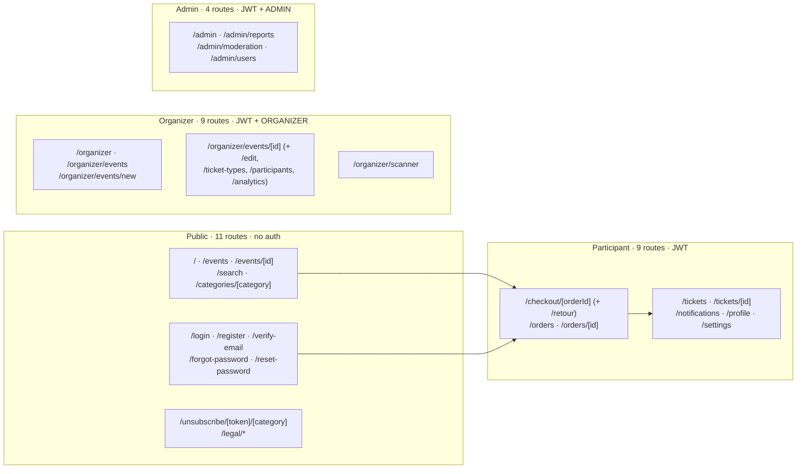
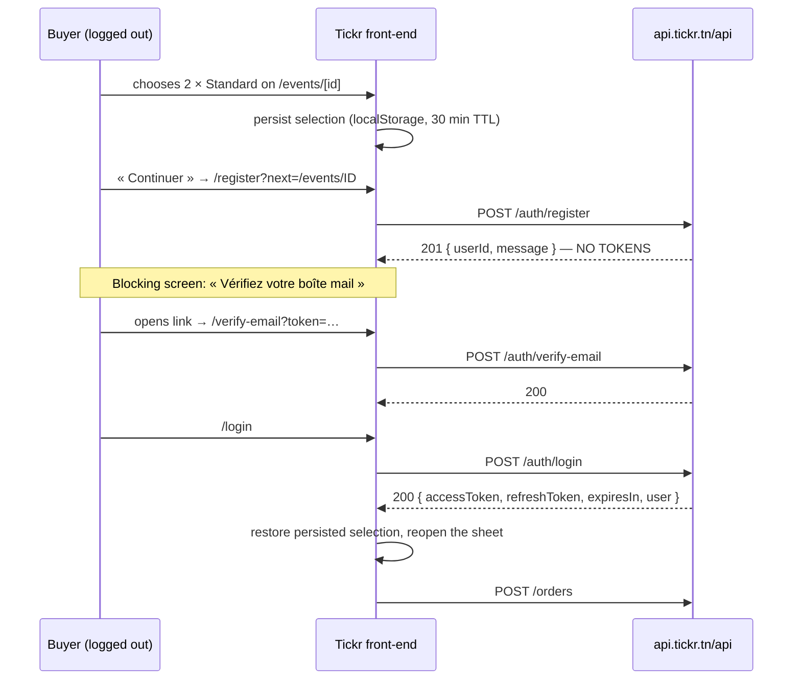
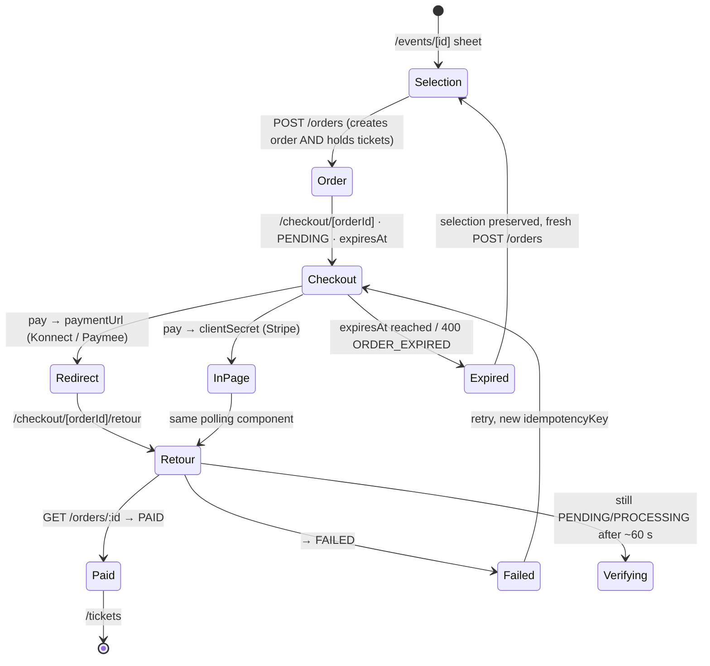

# Phase 5 — Feature Inventory

| Field | Value |
| --- | --- |
| **Phase** | 5 of 11 |
| **Epic** | [01-frontend-plan-and-design-direction.md](01-frontend-plan-and-design-direction.md) |
| **Status** | ✅ Complete |
| **Owner** | Frontend Lead |
| **Depends on** | [Phase 1 — Product Design Brief](02-product-design-brief.md) · [Phase 2 — Information Architecture](03-information-architecture.md) · [Phase 3 — User Journeys](04-user-journeys.md) · [Phase 4 — Screen Inventory](05-screen-inventory.md) |

> **Objective:** For every screen in the Phase 2 canonical route tree, specify the features and
> interactions, the components consumed, the exact API calls, the permission gating, and every UI
> state — loading, empty, success, error, `403`, business conflict and `429` — with French copy
> direction for each. Every endpoint named here was read out of `backend/src` and exists. Every
> endpoint the product *needs* and that does **not** exist is marked **⚠ NOT IMPLEMENTED** and
> routed to §9 rather than being designed around.

---

## 0. How to read this document

**Screen IDs.** Each screen has a stable ID (`P-01` … `A-04`) used by Phase 6 (components),
Phase 9 (wireframes) and Phase 10 (hi-fi). Never renumber; append.

**Per-screen shape.** Every screen section carries exactly five blocks, in this order:

1. **Meta line** — route · rendering strategy · role · guard.
2. **Features & interactions** — one bullet per user-visible capability. The bullet count is the
   feature count in [§10](#11-summary--features-per-zone).
3. **Components consumed** — names that Phase 6 must adopt verbatim.
4. **API calls** — `METHOD /path`, relative to the base URL, with when-and-why.
5. **Permission gating** and **UI states**.

**State table legend.** Every screen carries the same seven rows so that a reviewer can diff
screens against each other. A row that cannot occur is written `n/a` **with the reason** — an
absent row is a specification hole, `n/a` is a decision.

| Row | Meaning |
| --- | --- |
| **Loading** | First fetch in flight. Skeletons, never spinners (spinners live inside buttons only). |
| **Empty** | `200` with `total: 0` or an empty collection. |
| **Success** | Data rendered. |
| **Error** | `5xx`, timeout, or network failure. |
| **Forbidden (403)** | Role failure, ownership failure, **or** `RATE_LIMITED` on order creation, **or** unverified e-mail on login. Four unrelated situations behind one status — always disambiguated by endpoint context. |
| **Conflict** | Business conflict. **Arrives as `400`, not `409`** — sold out, event not published, order expired, invalid status. |
| **Rate limited (429)** | Throttler. |

Two further states are specified once, globally, in [§3](#3-cross-cutting-behaviour-specified-once)
and are **not** repeated per screen unless the screen deviates: **401 / session expiry** and
**offline**.

**Language.** Headings and technical prose in English; every user-facing string in French
(`fr-TN`), quoted with the guillemets used in the product. All strings are externalised — no copy
in this document ships as a literal in a component.

**Money.** Every amount shown to a user is rendered by `PriceDisplay`. TND, symbol `DT`,
3 decimals (millimes), millimes shown only when non-zero, `tabular-nums` always, non-breaking space
before `DT`. Never `toFixed(2)`, never a hand-rolled `× 1.06`.

---

## 1. Contract corrections applied in this phase

This phase was written against `backend/src`, not against the issue text. The following statements
in **GitHub issue #64** and in the earlier scaffolds are **wrong**, and this document uses the
verified behaviour instead. They are listed first because every downstream table depends on them.

| # | Claim in issue #64 / scaffolds | Verified reality | Where it bites |
| --- | --- | --- | --- |
| 1 | Base URL is `/v1` | **`https://api.tickr.tn/api`** — global prefix is `api` (`main.ts:17`, `config/app.config.ts`). Swagger at `/api/docs` | Every request. `NEXT_PUBLIC_API_URL` must end in `/api` |
| 2 | Paginated responses are `{ data, meta: { … } }` | **Flat**: `{ data, total, page, limit, totalPages, hasNextPage, hasPreviousPage }` | `Pagination` component props, every list screen |
| 3 | `GET /config/public` supplies the commission rate | **⚠ NOT IMPLEMENTED.** No config controller exists anywhere in `backend/src`. `PLATFORM_COMMISSION_RATE` is read only inside `create-order.handler.ts:41` | Fee disclosure before an order exists — see [§3.6](#36-the-commission-rate---not-implemented) |
| 4 | Errors carry a machine-readable `code` | Envelope is `{ statusCode, message, error, timestamp, path }` only. Domain error types (`INSUFFICIENT_AVAILABILITY`, `RATE_LIMITED`, `ORDER_EXPIRED`, `MAX_ATTEMPTS_EXCEEDED`) are **discarded at the controller boundary** | Every error state; forces the `mapApiError()` shim — see [§3.5](#35-error-mapping) |
| 5 | Sold out → `409`, rate limit → `429` | Sold out → **`400`**; `RATE_LIMITED` on `POST /orders` → **`403`** | Checkout error states |
| 6 | Checkout calls `POST /tickets/reserve` then `POST /orders` | **`POST /orders` reserves internally** (`create-order.handler.ts` step 5). Calling reserve first creates an orphaned second hold | The single most important rule in the participant flow |
| 7 | `GET /events/organizer/:organizerId` is public | **`@Roles('ORGANIZER','ADMIN')`** (`events.controller.ts:406`) | No public organiser profile in V1 |
| 8 | Auth routes live under `/auth/*` on the frontend | Canonical route tree uses `/login`, `/register`, … `frontend/src/lib/api/client.ts` hard-redirects to **`/auth/login`** | Defect — see [§3.4](#34-authentication-token-refresh-and-the-401-defect) |

Four further constraints were discovered while writing this phase. They are not in the issue, not in
Phase 1, and each one changes a screen:

| # | Discovery | Source | Consequence |
| --- | --- | --- | --- |
| 9 | **`POST /auth/register` returns `{ userId, message }` — no tokens.** And **`POST /auth/login` throws `403` when the e-mail is not verified** | `auth.controller.ts:121`, `auth.controller.ts:188` | A brand-new buyer **cannot complete a purchase in one session**. There is a mandatory inbox round-trip. See [§4.7](#p-07--register--register) and [§3.3](#33-the-e-mail-verification-wall) |
| 10 | **`GET /events/:id` returns `403` for any event that is not `PUBLISHED`**, unless the caller is the organiser (`get-event-by-id.handler.ts:71-79`) | verified | `CANCELLED` and `COMPLETED` events are **unreachable** to the public and to admins. The Phase 1 "cancelled event banner" cannot be built on this endpoint |
| 11 | **`GET /events` only ever returns `PUBLISHED` events** (`get-published-events.handler.ts:76`), and **`DELETE /events/:id` is `@Roles('ORGANIZER')` + `IsEventOwnerGuard` with no admin bypass** | verified | `/admin/moderation` is **read-only over published events** in V1. Specified honestly as such |
| 12 | **`TicketDto` and `OrderDto` carry no event title, date or venue** — only `eventId` | `ticket.dto.ts`, `OrderDto` | `/tickets`, `/orders` and every ticket surface need an event-resolution strategy. See [§3.7](#37-event-resolution-for-tickets-and-orders) |

> **Route-count note.** Phase 2 summarises the tree as "31 routes (+ `/legal/*`)", but the tree
> itself enumerates **33 addressable routes**. The two-route delta is the payment-return sub-route
> `/checkout/[orderId]/retour` and the organiser owner view `/organizer/events/[id]`, both of which
> are real, separately-addressable screens. This document specifies all 33 and treats `/legal/*` as
> one static group of three pages.

---

## 2. Zone map



---

## 3. Cross-cutting behaviour (specified once)

Everything in this section applies to **every** screen. Per-screen tables below do not repeat it.

### 3.1 Rendering and data policy

| Strategy | Applies to | Rule |
| --- | --- | --- |
| **SSR / ISR** | `/`, `/events`, `/events/[id]`, `/categories/[category]` | Rendered on the server for SEO and first paint, using the exact per-route codes fixed in [Phase 4](05-screen-inventory.md) (`ISR 60` on `/` and `/categories/*`, `ISR 30` + client refetch on `/events/[id]`, `SSR` on `/events` because the filter space is unbounded). Availability is always re-read in the browser on mount and on focus |
| **CSR** | everything behind auth, plus `/search` | TanStack Query, `staleTime` per table below |

> **⚠ SSR + throttler.** The throttler is IP-scoped (`short` 3 req/s, `medium` 20 req/10 s,
> `long` 100 req/min, `users.module.ts:131`). **All SSR traffic leaves the Next server from one
> IP.** If the API ever enables the global `ThrottlerGuard`, SSR fan-out will trip it platform-wide.
> Mitigations, in order: (a) never fan out more than 3 requests per SSR render — this is why the
> landing page's category rails are *links*, not fetches; (b) `Cache-Control` on SSR fetches;
> (c) backend task in §9 to exempt the server-side origin.

**Query keys and cache policy** — one module, `src/lib/api/query-keys.ts`:

| Key | Endpoint | `staleTime` | Refetch on focus |
| --- | --- | --- | --- |
| `['events','list',filters]` | `GET /events` | 30 s | yes |
| `['events','detail',id]` | `GET /events/:id` | 15 s | **yes** — availability is a per-fetch snapshot |
| `['events','upcoming',city]` | `GET /events/upcoming` | 60 s | no |
| `['events','category',cat,page]` | `GET /events/category/:category` | 60 s | no |
| `['events','search',q,page]` | `GET /events/search` | 30 s | no |
| `['orders','detail',id]` | `GET /orders/:id` | **0** | **yes** — money |
| `['orders','list',page]` | `GET /orders` | 30 s | yes |
| `['tickets','list',status,page]` | `GET /tickets` | 30 s | yes |
| `['tickets','detail',id]` | `GET /tickets/:id` | 60 s | yes · persisted to `localStorage` for offline QR |
| `['me']` | `GET /users/me` | 5 min | no |
| `['notifications','me',page]` | `GET /notifications/me` | 60 s | no |
| `['prefs','me']` | `GET /notifications/preferences/me` | 5 min | no |
| `['analytics',…]` | `GET /analytics/*` | 60 s | no |

**Mutations are never cached.** `POST /orders`, `POST /orders/:id/pay`, `POST /tickets/check-in`
and every `PUT`/`PATCH`/`DELETE` run through `useMutation` with explicit invalidation of the keys
listed in the screen section.

### 3.2 Permission gating

Three layers, all required — a missing middleware layer means a protected page flashes before
redirecting:

1. **`middleware.ts`** — reads the session cookie/token presence and redirects unauthenticated
   requests for `/checkout/*`, `/orders*`, `/tickets*`, `/notifications`, `/profile`, `/settings`,
   `/organizer/*`, `/admin/*` to `/login?next=<encoded original path>`. It does **not** decode roles.
2. **`RoleGate`** (client) — reads `role` from the Zustand auth store and renders the
   access-denied state for a wrong role, without a redirect (a redirect hides the mistake).
3. **The API** — the real authority. A `403` from the API always wins over the client's belief.

| Zone | Middleware | `RoleGate` | Server truth |
| --- | --- | --- | --- |
| Public | none | none | `@Public()` |
| Participant | token present | none (any authenticated role may buy) | `JwtAuthGuard` |
| Organizer | token present | `role === 'ORGANIZER' \|\| 'ADMIN'` where the endpoint allows both | `JwtAuthGuard + RolesGuard` (+ `IsEventOwnerGuard` on event mutations) |
| Admin | token present | `role === 'ADMIN'` | `JwtAuthGuard + RolesGuard` |

**`ADMIN` is not a superset of `ORGANIZER` in this API.** `POST /events`, `PUT /events/:id`,
`DELETE /events/:id`, the ticket-type routes and `POST /events/:id/image` are `@Roles('ORGANIZER')`
only. An admin calling them gets `403`. The organiser console therefore renders for `ADMIN` in
**read-only** mode, and every mutating control is hidden — not disabled — for that role.

**`EmailVerifiedGuard` exists but is applied to no endpoint.** Purchasing does not require a
verified e-mail; **logging in does** (see [§3.3](#33-the-e-mail-verification-wall)).

### 3.3 The e-mail verification wall



Consequences that every affected screen must honour:

- **The ticket selection is persisted before any auth navigation**, keyed
  `tickr.pendingSelection.<eventId>`, with a 30-minute TTL and the fields
  `{ eventId, ticketTypeId, quantity, holders, holder }`. It survives a tab change, an inbox
  round-trip and a cold start. It is cleared on successful `POST /orders` and on expiry.
- **A `403` from `POST /auth/login` is never rendered as "access denied."** It means exactly one
  thing: « Votre adresse e-mail n'est pas encore vérifiée. »
- **There is no resend-verification endpoint** — the six auth routes are register, login,
  verify-email, request-reset, reset-password, refresh-token. A user who loses the e-mail is stuck.
  Interim copy points at the support address; the endpoint is a **P1 backend task**
  (§9).
- **`emailVerified` is not exposed on `UserProfileDto`**, so `/profile` cannot display verification
  status. Also a backend task.

### 3.4 Authentication, token refresh and the 401 defect

`frontend/src/lib/api/client.ts` today clears `accessToken` and does
`window.location.href = '/auth/login'` on **any** `401`, with no refresh attempt. Two defects:

1. **No refresh.** `POST /auth/refresh-token` exists. A token expiring mid-checkout currently
   destroys the order context — the exact failure Phase 1 [E.4] forbids.
2. **Wrong route.** It redirects to `/auth/login`; the canonical route is **`/login`**.

Required interceptor, built once in Phase 3 and assumed by every screen here:

```ts
// src/lib/api/client.ts — required behaviour
// 1. On 401 (and not already a refresh call):
//      single-flight POST /auth/refresh-token  →  replay the original request once.
// 2. Refresh succeeds  →  transparent to the screen; no navigation, no state loss.
// 3. Refresh fails     →  open <SessionExpiredDialog/> OVER the current page.
//                         Never a hard redirect from a checkout route.
//                         Elsewhere: router.push(`/login?next=${encodeURIComponent(pathname)}`)
// 4. Never redirect to /auth/login. The route is /login.
// 5. Requests are queued while a refresh is in flight (single-flight, not per-request).
```

### 3.5 Error mapping

One module, `src/lib/api/map-api-error.ts`, is the **only** place that reads `statusCode` or
`message`. It returns `{ kind, title, body, moneyNote?, primary, secondary? }` and never leaks a raw
backend string to the UI.

```ts
type ErrorKind =
  | 'validation'      // 400 + errors[]  → field-level, inline
  | 'sold_out'        // 400 on POST /orders,   context-disambiguated
  | 'not_published'   // 400 on POST /orders
  | 'order_expired'   // 400 on POST /orders/:id/pay
  | 'max_attempts'    // 400 on POST /orders/:id/pay
  | 'gateway'         // 400 on POST /orders/:id/pay
  | 'rate_limited'    // 403 on POST /orders  (5 orders / hour)
  | 'unverified'      // 403 on POST /auth/login
  | 'forbidden'       // 403 everywhere else
  | 'not_found'       // 404
  | 'throttled'       // 429
  | 'server'          // 5xx
  | 'offline';        // no response
```

> **⚠ This module is a shim, and is documented as one.** Because the envelope has **no `code`
> field** and `INSUFFICIENT_AVAILABILITY`, `TICKET_LIMIT_EXCEEDED`, `EVENT_NOT_PUBLISHED` and
> `VALIDATION_ERROR` all arrive as bare `400`s, disambiguation is done by **endpoint + a substring
> probe on `message`**. Substring probes live in exactly one file, are covered by unit tests against
> the real backend strings, and are deleted the day the backend ships a `code` field
> (§9, P0).

**Three failure shapes**, per Phase 1 [G.0] — a shape is chosen by *stakes*, not by severity:
**toast** (non-money, recoverable) · **inline** (scoped to one control) · **blocking state**
(anything touching money, tickets or a hold). *If a user could wonder whether they were charged, it
is a blocking state.*

**Validation errors** use the second envelope —
`{ statusCode, message: 'Validation failed', errors, timestamp, path }` — and are mapped field-by-field
onto react-hook-form via `setError`. The global `ValidationPipe` runs
`whitelist + forbidNonWhitelisted + transform`, so **any extra property in a request body is a
`400`**: request payloads are built from explicit objects, never by spreading form state.

### 3.6 The commission rate — ⚠ NOT IMPLEMENTED

`GET /config/public` **does not exist**. Until it does:

```ts
// src/lib/constants/platform.ts — the ONLY place this value may appear
export const PLATFORM_COMMISSION_RATE = Number(
  process.env.NEXT_PUBLIC_PLATFORM_COMMISSION_RATE ?? '0.06',
);
export const RESERVATION_TTL_MINUTES = 15; // reserve-tickets.handler.ts:24
export const CURRENCY = 'TND' as const;    // symbol DT, 3 decimals
export const MAX_TICKETS_PER_ORDER = 10;   // @ArrayMaxSize(10)
export const MAX_TICKETS_PER_EVENT = 10;   // fraud-detection.service.ts
export const MAX_ORDERS_PER_HOUR = 5;      // fraud-detection.service.ts
export const MAX_TICKET_TRANSFERS = 3;     // ticket.entity.ts:100
```

Rules, enforced in review:

- The constant produces **estimates only**, and every estimate is labelled: « Estimation · le
  montant exact s'affiche à l'étape suivante ».
- **The instant an order exists, the API's `subtotal` / `platformFee` / `paymentFees` / `total` are
  authoritative** and are rendered verbatim. No component ever multiplies by a rate.
- A hard-coded `6 %` string anywhere outside this module is a review failure.
- `paymentFees` is rendered as a **conditional** line, shown only when non-zero.
  `OrderEntity.setPaymentFees()` exists but nothing calls it, so it is `0` today — designing a
  three-line breakdown would break the day gateway fees are switched on.

### 3.7 Event resolution for tickets and orders

`TicketDto` = `{ id, eventId, ticketTypeId, qrCode, status, priceAmount, priceCurrency, holderName,
holderEmail, pdfUrl, checkedInAt, reservedUntil, createdAt }`. `OrderDto` carries `eventId` and
`items[].ticketTypeName`, but **no event title, date or venue**. Neither carries a ticket-type name
on the ticket itself.

Resolution strategy, used by `/orders`, `/orders/[id]`, `/tickets`, `/tickets/[id]`:

1. Collect the **unique** `eventId`s on the page.
2. Issue at most **one** `GET /events/:id` per unique id, in parallel, through the shared
   `['events','detail',id]` key so the cache is reused across screens.
3. **Handle `403` and `404` as first-class outcomes, not errors.** Per correction #10, a
   `CANCELLED` or `COMPLETED` event returns `403` to a non-owner. A past ticket is a *normal* case,
   so the fallback renders « Événement terminé ou annulé » with the ticket's own data
   (holder, price, status) and never an error state.
4. Cap the fan-out at 8 unique events per page (page size 20 with repeats); beyond that, resolve
   lazily on row expansion.

A `GET /tickets?include=event` (or an embedded `event` summary on `TicketDto` / `OrderDto`) is a
**P1 backend task** — it removes a whole class of fan-out and the entire `403` fallback.

### 3.8 Offline and 401 — the two global states

| State | Trigger | UI treatment & copy (fr-TN) |
| --- | --- | --- |
| **Offline** | `navigator.onLine === false`, or a request with no response | Persistent `OfflineBanner` under the header: « Vous êtes hors connexion. Les billets déjà ouverts restent lisibles. » Cached QR codes stay readable. Every mutating control is **disabled with a reason**, never left to fail on tap |
| **401 / session expired** | Refresh failed after a `401` | On a checkout route: `SessionExpiredDialog` **over** the page — « Votre session a expiré. Reconnectez-vous pour continuer, vos billets restent réservés. » with the countdown still visible. Elsewhere: redirect to `/login?next=…` |

### 3.9 Accessibility and i18n baseline

WCAG 2.1 AA everywhere: 44 × 44 px minimum targets, visible labels, `:focus-visible` rings,
`aria-describedby` on every error, `aria-live="polite"` for async status (countdowns announce at the
5-minute and 1-minute thresholds only, never per tick), no meaning carried by colour alone. All copy
lives in `src/locales/fr-TN/*.json`, namespaced by screen ID. Dates go through `LocaleDate`
(`date-fns` + `fr` locale, `Africa/Tunis`).

### 3.10 Component naming reconciliation with Phase 6

The Phase 6 draft must adopt the names used here. Three renames and three corrections:

| Phase 6 draft | This document | Reason |
| --- | --- | --- |
| `ReservationTimer` | **`ReservationCountdown`** | Phase 1 [K.8] name; it is a countdown driven by the server's `expiresAt`, not a timer |
| `TicketCard` | **`TicketRow`** (list) + **`TicketPass`** (detail) | Two different objects: a 72 px list row and the dark `ink-950` pass |
| `NotificationItem` | **`NotificationRow`** | And it has **no read/unread state** — see correction below |
| `Pagination` "matches API `meta`" | `Pagination` takes **flat** props | Correction #2 |
| `OrderSummary` "order + 6 % commission" | `OrderSummary` renders **API values verbatim** | It never computes; see [§3.6](#36-the-commission-rate---not-implemented) |
| `PaymentMethodPicker` "Konnect/Paymee/Stripe" | unchanged, but **local-first order** and two distinct mechanisms | Konnect/Paymee → `paymentUrl` redirect; Stripe → `clientSecret` in-page |

---

## 4. Public zone — 11 routes + `/legal/*`

### P-01 · Landing — `/`

**Route** `/` · **Rendering** ISR 60 + client refetch · **Role** public · **Guard** none

**Features & interactions**

- Hero rail of upcoming events: full-bleed 4:5 poster on mobile / 16:9 on desktop, horizontally swipeable, paging dots, real focus management, first slide `priority` (LCP), the rest lazy.
- City chip row (Tunis, Sousse, Sfax, Hammamet, Nabeul, Monastir, Djerba) — the chosen city is stored in Zustand, persisted to `localStorage`, and re-applied on every visit; selecting a city refetches the hero via `GET /events/upcoming?city=`.
- Date-window chips « Ce soir » · « Ce week-end » · « Cette semaine » — each is a `dateFrom`/`dateTo` pair; the chips **navigate** to `/events?dateFrom=…&dateTo=…` rather than filtering in place, so every window is a shareable URL.
- Editorial rail « Les plus populaires » — `GET /events?sortBy=soldTickets&sortOrder=DESC&limit=12`.
- Editorial rail « Nouveautés » — `GET /events?sortBy=publishedAt&sortOrder=DESC&limit=12`.
- Category grid built from the ten `EventCategory` values using `displayNameFr`, `icon` and `color` from `EVENT_CATEGORY_METADATA`; each tile is a **link** to `/categories/[category]`, never a fetch — this caps SSR fan-out at three requests ([§3.1](#31-rendering-and-data-policy)).
- Persistent secondary search affordance in the header, opening `/search`.
- Every card shows poster, title, day + time, venue + city, « À partir de {minPrice} DT » and a scarcity badge — all from `EventListDto.ticketSummary`, with **no per-card follow-up request**.
- Service-fee footnote under the first price block: « Frais de service de 6 % en sus » — **estimate, sourced from the interim constant** ([§3.6](#36-the-commission-rate---not-implemented)).
- Footer with the three `/legal/*` links and the support address.

**Components consumed** — `PageShell`, `TopNav`, `BottomNav`, `Footer`, `HeroRail`, `EventCard`, `EventPoster`, `AvailabilityBadge`, `PriceDisplay`, `CityChipRow`, `DateWindowChips`, `CategoryChip`, `SearchBar`, `Skeleton`, `EmptyState`, `ErrorState`, `LocaleDate`

**API calls**

- `GET /events/upcoming?city={city}&limit=8` — hero rail (SSR).
- `GET /events?sortBy=soldTickets&sortOrder=DESC&limit=12` — popular rail (SSR).
- `GET /events?sortBy=publishedAt&sortOrder=DESC&limit=12` — new rail (SSR).

**Permission gating** — none. No token is sent. The header shows « Se connecter » when the auth store is empty and the avatar menu otherwise; this is a client-side swap after hydration and must not cause layout shift.

| State | Trigger | UI treatment & copy (fr-TN) |
| --- | --- | --- |
| **Loading** | SSR streaming / client refetch | Skeleton hero at the exact 4:5 ratio + two skeleton rails of three cards. Zero CLS |
| **Empty** | all three lists return `total: 0` | Single centred `EmptyState`: « Aucun événement à venir pour le moment » · « Revenez bientôt, de nouveaux événements sont publiés chaque semaine. » Category grid stays visible as the fallback path |
| **Success** | ≥ 1 list populated | Hero + rails. A rail with `total: 0` is **removed**, not shown empty |
| **Error** | `5xx` / network on SSR | Page still renders shell, nav and category grid; the failed rail is replaced by an inline retry: « Impossible de charger cette sélection. » · **[ Réessayer ]** |
| **Forbidden (403)** | n/a — all three endpoints are `@Public()` | — |
| **Conflict** | n/a — read-only screen | — |
| **Rate limited (429)** | throttler trips the shared SSR origin | Serve the last ISR payload; if none, the error treatment above with « Trop de trafic en ce moment. Réessayez dans quelques instants. ». **Never** an auto-retry loop from the server |

---

### P-02 · Event discovery — `/events`

**Route** `/events` · **Rendering** SSR (unbounded filter space) · **Role** public · **Guard** none

**Features & interactions**

- Result grid of `EventCard`s (1 column at base, 2 at `sm`, 3 at `lg`, capped at 1280 px).
- Full filter set, **all held in the URL** so every view is shareable and back-button-correct: `q`, `category`, `city`, `country`, `dateFrom`, `dateTo`, `minPrice`, `maxPrice`, `sortBy`, `sortOrder`, `page`, `limit`.
- Mobile: filters live in a `Drawer` opened by a sticky « Filtrer » button showing the active-filter count; desktop: a left rail, always visible.
- Sort select exposing only the four sorts that mean something to a buyer — « Date » (`startDate ASC`), « Les plus populaires » (`soldTickets DESC`), « Nouveautés » (`publishedAt DESC`), « Titre » (`title ASC`).
- Price range control bound to `minPrice`/`maxPrice`, stepped in whole dinars, with the millime rule applied on display.
- Active filters render as removable chips above the grid; « Effacer les filtres » clears all and resets to page 1.
- Result count line: « 47 événements » — from the flat `total`.
- Pagination: infinite scroll on mobile **with an explicit « Charger plus » button** (never scroll-only — unreachable by keyboard, unreliable on 3G); classic numbered pagination on desktop, driven by `totalPages` / `hasNextPage` / `hasPreviousPage`.
- Page size 20 (API default), hard-capped at 100 by the backend; `limit` is never exposed in the UI.
- Each card links to `/events/[id]`; one link, one tab stop, the whole card is the target.

**Components consumed** — `PageShell`, `EventFilters`, `Drawer`, `SortSelect`, `DatePicker`, `EventCard`, `AvailabilityBadge`, `PriceDisplay`, `Pagination`, `Skeleton`, `EmptyState`, `ErrorState`, `Badge`, `Button`

**API calls**

- `GET /events?q=&category=&city=&country=&dateFrom=&dateTo=&minPrice=&maxPrice=&page=&limit=20&sortBy=&sortOrder=` — the only call.

**Permission gating** — none. Note that this endpoint returns **`PUBLISHED` events only** (`get-published-events.handler.ts:76`); the `status` filter accepted by `EventFilterDto` has no effect here and is therefore **not exposed in the UI**.

| State | Trigger | UI treatment & copy (fr-TN) |
| --- | --- | --- |
| **Loading** | first render / filter change | 6 skeleton cards at the real aspect ratio; the filter rail stays interactive |
| **Empty** | `total: 0` | `EmptyState` echoing the **actual** filters: « Aucun événement pour "jazz" à Sfax en septembre » · primary **[ Effacer les filtres ]** · secondary: the same query with the narrowest filter dropped — « Voir tous les événements à Sfax » |
| **Success** | `total > 0` | Count line + grid + pagination. Cached data is shown immediately with a subtle refresh indicator rather than being replaced by skeletons |
| **Error** | `5xx` / network | `ErrorState` in the grid area, filters preserved: « Impossible de charger les événements. » · **[ Réessayer ]** |
| **Forbidden (403)** | n/a — `@Public()` | — |
| **Conflict** | n/a — read-only | — |
| **Rate limited (429)** | rapid filter changes | Requests are debounced 300 ms and the previous result is kept on screen; on `429`, keep the stale grid and show a toast: « Trop de requêtes. Vos résultats se mettront à jour dans un instant. » with automatic back-off retry |

---

### P-03 · Event detail — `/events/[id]`

**Route** `/events/[id]` · **Rendering** ISR 30 + client refetch on focus · **Role** public · **Guard** none (owner sees more) · **This is the most important screen in the product**

**Features & interactions**

- Poster at 4:5 (mobile) / 16:9 (desktop) with a back control on a scrim; deterministic category-tinted fallback when `imageUrl` is null.
- Title (`display-xl`), category eyebrow using `displayNameFr`.
- Facts block: full French date/time (« Vendredi 12 septembre 2026, 21:00 »), venue, address, postal code, city, country.
- Venue link-out to a maps URL **only when `latitude` and `longitude` are both present**; written address otherwise. A map is progressive enhancement, never a dependency.
- Price entry point « À partir de {minPrice} DT » plus the estimated-fee note.
- Ticket-type list — one `TicketTypeRow` per `TicketTypeDto`, each with name, description, `PriceDisplay`, and one of the four availability states derived **only** from `isOnSale`, `isSoldOut`, `availableQuantity` and the sales dates: available (silent) · limited (`sun-400`, « Plus que {availableQuantity} places ») · sold out (« Complet », control disabled **and labelled**, row stays visible) · not on sale (« En vente le 12 septembre » / « Ventes terminées » from the real dates).
- Availability is a **per-fetch snapshot**: never animated, never a live counter, never short-polled. Refetched on window focus and on sheet open. Sold-out rows carry a « Vérifier à nouveau » refetch action because a lapsed hold genuinely returns stock.
- Description clamped to 4 lines with « Lire la suite ».
- Organiser block: **name only** (`organizer.displayName`). No link, no stub — `GET /events/organizer/:organizerId` is role-guarded, so a public organiser profile is impossible in V1.
- Share: native share sheet on mobile, copy-link with confirmation toast on desktop.
- Sticky purchase bar from the moment the price block scrolls out: lowest price left, « Choisir mes billets » right, `shadow-sticky` upward, iOS safe-area aware.
- **Ticket-selection sheet** (documented here, not given its own route): one ticket type at a time; `QuantityStepper` bounded by three named limits — remaining availability, 10 holders per order (`@ArrayMaxSize(10)`), 10 tickets per event per user; the **binding** limit is always named on screen.
- The breakdown appears the instant quantity ≥ 1, marked « Estimation » until the order exists.
- Holder details: buyer contact captured once; ticket 1 pre-filled from the profile; tickets 2..n collapsed behind « Les billets sont à mon nom », checked by default.
- Primary action carries the total in its label: « Continuer · 106,000 DT ».
- **Logged-out path**: the selection is persisted (`tickr.pendingSelection.<eventId>`, 30 min TTL) and the user is routed to `/login?next=/events/[id]` — never a login wall before the price.
- **Order creation**: exactly one call, `POST /orders`. `POST /tickets/reserve` is **never** called here; it would create a second orphaned hold.
- On success, `router.replace('/checkout/{orderId}')` — replace, not push, so Back cannot re-enter a consumed selection.
- Organiser viewing their own `DRAFT` event sees the full preview plus a persistent « Brouillon — invisible par le public » bar with publish as the primary action.

**Components consumed** — `PageShell`, `EventPoster`, `EventFacts`, `LocaleDate`, `TicketTypeRow`, `AvailabilityBadge`, `PriceDisplay`, `TicketSelectionSheet`, `QuantityStepper`, `HolderFieldset`, `Field`, `OrderSummary`, `Button`, `Sheet`, `Badge`, `Skeleton`, `ErrorState`, `EmptyState`, `DraftBanner`, `CopyLinkButton`

**API calls**

- `GET /events/:id` — SSR + client refetch on focus.
- `POST /orders` — body `{ eventId, items: [{ ticketTypeId, quantity, holders: [{ name, email, phone? }] }], holder: { firstName, lastName, email } }`. Invalidates `['events','detail',id]`.
- ~~`POST /tickets/reserve`~~ — **must not be called from this screen** (correction #6).

**Permission gating** — viewing is public. `POST /orders` requires a JWT: a `401` here means the token expired between page load and submit, so the interceptor refreshes and replays before anything is shown to the user. Non-`PUBLISHED` events are visible only to the organiser (`403` otherwise).

| State | Trigger | UI treatment & copy (fr-TN) |
| --- | --- | --- |
| **Loading** | first fetch | Skeleton poster at exact ratio, three skeleton fact lines, two skeleton tier rows. Sticky bar renders disabled with a skeleton price |
| **Empty** | `ticketTypes: []` | Purchase bar replaced by non-interactive text: « Billetterie pas encore ouverte » · « Les tarifs seront annoncés prochainement. » Event content stays fully readable |
| **Success** | `200` | Full detail + sticky bar. Refetch-on-focus updates availability silently |
| **Error** | `5xx` / network | Full-page `ErrorState` on first load: « Impossible d'afficher cet événement. » · **[ Réessayer ]** · secondary « Voir tous les événements ». On refetch failure, the stale page is kept and a toast is shown |
| **Forbidden (403)** | event is `DRAFT`, `CANCELLED` or `COMPLETED` and the caller is not the organiser | **Never « accès refusé ».** Designed state: « Cet événement n'est plus disponible » · « Il a été annulé ou n'est plus en vente. Si vous avez un billet, il reste dans **Mes billets**. » · **[ Découvrir des événements ]** · secondary « Mes billets ». ⚠ This is also how a *cancelled* event currently presents — see correction #10 |
| **Conflict** | `POST /orders` → `400` | Blocking state **inside the sheet**, context never lost. `INSUFFICIENT_AVAILABILITY` → « Il ne reste que {n} billets Standard », the stepper **auto-adjusts** to `n`, primary **[ Continuer avec {n} billets ]**, other tiers with stock offered inline. If nothing remains: **[ Vérifier à nouveau ]** plus « Complet — voici d'autres événements à {city} » over `GET /events?city=&category=`. `EVENT_NOT_PUBLISHED` → « Cet événement n'est plus en vente. » `TICKET_LIMIT_EXCEEDED` → « Vous avez déjà 8 billets pour cet événement. La limite est de 10 par personne. » |
| **Rate limited (429)** | throttler on repeated submits | Disable the primary action, re-enable it on a visible countdown: « Trop de tentatives. Réessayez dans {n} s. » |
| **Forbidden — rate limit (403)** | `POST /orders` → `RATE_LIMITED` | **Different copy from a role 403**: « Vous avez atteint la limite de 5 commandes par heure. » · « Réessayez plus tard ou contactez-nous si c'est une erreur. » · **[ Voir mes commandes ]**. The selection stays persisted |

---

### P-04 · Search — `/search`

**Route** `/search?q=` · **Rendering** CSR · **Role** public · **Guard** none

**Features & interactions**

- Full-width `SearchBar`, autofocused on mount, debounced at 350 ms, minimum 1 non-blank character (the backend rejects an empty `q` with `400`).
- `q` is mirrored into the URL on every settled keystroke so a result page is shareable and the Back button walks the query history.
- Recent searches (max 5) in `localStorage`, shown while the field is empty, individually removable.
- Result list reuses `EventCard`; result count from the flat `total`; « Charger plus » paging from `hasNextPage`.
- **⚠ `GET /events/search` accepts only `q`, `page`, `limit`** — no category, city or date facets. Refinement chips are therefore rendered as **links into `/events?q=…&city=…`**, which does support the full lens set. The transition is explicit in the copy: « Affiner par ville, date ou prix ».
- Zero-state before any query: the ten categories as `CategoryChip` links.

**Components consumed** — `PageShell`, `SearchBar`, `EventCard`, `CategoryChip`, `Button`, `Skeleton`, `EmptyState`, `ErrorState`, `Pagination`

**API calls**

- `GET /events/search?q={q}&page={page}&limit=20`.

**Permission gating** — none.

| State | Trigger | UI treatment & copy (fr-TN) |
| --- | --- | --- |
| **Loading** | query in flight | 4 skeleton rows; the input never blocks and the previous results stay until the new ones land |
| **Empty** | `total: 0` | « Aucun résultat pour "{q}" » · « Essayez un autre mot, ou parcourez par catégorie. » · **[ Voir tous les événements ]** + the category chips |
| **Success** | `total > 0` | « {total} résultats pour "{q}" » + list + refinement links |
| **Error** | `5xx` / network | Inline `ErrorState` under the field: « La recherche est indisponible. » · **[ Réessayer ]** |
| **Forbidden (403)** | n/a — `@Public()` | — |
| **Conflict** | `400` from an empty/blank `q` | Never reaches the user: the client refuses to submit a blank query and shows the zero-state instead |
| **Rate limited (429)** | fast typing | Debounce plus back-off; previous results retained; toast only if two consecutive attempts fail: « Trop de requêtes, patientez un instant. » |

---

### P-05 · Category listing — `/categories/[category]`

**Route** `/categories/[category]` · **Rendering** ISR 60 · **Role** public · **Guard** none

**Features & interactions**

- Header band tinted with the category's `color`, showing its `icon` and `displayNameFr` from `EVENT_CATEGORY_METADATA`.
- The `[category]` segment is validated against the ten `EventCategory` values **before** fetching; an unknown value renders the designed 404 without a request.
- Result grid identical to `/events`, paginated from the flat envelope.
- Secondary link « Filtrer davantage » → `/events?category={category}` for the full lens set (this endpoint accepts only `page` and `limit`).
- Sibling-category chip row at the bottom for lateral discovery.

**Components consumed** — `PageShell`, `CategoryChip`, `EventCard`, `PriceDisplay`, `AvailabilityBadge`, `Pagination`, `Skeleton`, `EmptyState`, `ErrorState`, `NotFoundState`

**API calls**

- `GET /events/category/:category?page={page}&limit=20`.

**Permission gating** — none.

| State | Trigger | UI treatment & copy (fr-TN) |
| --- | --- | --- |
| **Loading** | first render | Tinted header renders instantly (no data needed) + 6 skeleton cards |
| **Empty** | `total: 0` | « Rien de prévu en Théâtre pour l'instant » · **[ Voir tous les événements ]** + sibling categories |
| **Success** | `total > 0` | Header + count + grid + pagination |
| **Error** | `5xx` / network | `ErrorState` in the grid area, header preserved · **[ Réessayer ]** |
| **Forbidden (403)** | n/a — `@Public()` | — |
| **Conflict** | unknown category slug | `NotFoundState`: « Cette catégorie n'existe pas. » · **[ Voir toutes les catégories ]** |
| **Rate limited (429)** | shared SSR origin | Serve the last ISR payload; otherwise the error treatment |

---

### P-06 · Login — `/login`

**Route** `/login?next=` · **Rendering** CSR (static shell) · **Role** public · **Guard** redirect away if already authenticated

**Features & interactions**

- E-mail + password, react-hook-form + zod, labels always visible, validation on blur.
- Show/hide password toggle with an accessible name that changes with state.
- « Mot de passe oublié ? » → `/forgot-password`, carrying the typed e-mail forward.
- « Créer un compte » → `/register?next=…`, preserving `next`.
- On success: store `accessToken` + `refreshToken` + `user`, then **restore any persisted ticket selection** and route to `next` (whitelisted to same-origin paths only — an open redirect here is a phishing vector).
- The `next` parameter survives the whole auth detour, including a bounce through `/register`.
- Rate-limit awareness: `POST /auth/login` is throttled at **5 attempts / 15 min**; after the third failure the form shows the remaining-attempts hint.

**Components consumed** — `PageShell`, `Field`, `Input`, `Button`, `ErrorState`, `Toast`, `AuthGate`

**API calls**

- `POST /auth/login` — body `{ email, password }` → `{ accessToken, refreshToken, expiresIn, user }`.

**Permission gating** — public. An authenticated visitor is redirected to `next` or `/`.

| State | Trigger | UI treatment & copy (fr-TN) |
| --- | --- | --- |
| **Loading** | submit in flight | Button enters its mandatory loading state, form disabled, no spinner overlay |
| **Empty** | n/a — a form has no empty state | — |
| **Success** | `200` | No success screen: navigate immediately to `next`, selection restored |
| **Error** | `401` bad credentials | **Inline, above the form**, generic on purpose: « E-mail ou mot de passe incorrect. » Never « cet e-mail n'existe pas » — that is account enumeration |
| **Forbidden (403)** | `!emailVerified` | ⚠ Its own state, never « accès refusé »: « Votre adresse e-mail n'est pas encore vérifiée » · « Ouvrez le lien que nous vous avons envoyé à {email} pour activer votre compte. » · secondary « Je n'ai pas reçu l'e-mail » → support, **because no resend endpoint exists** (§9, P1) |
| **Conflict** | n/a | — |
| **Rate limited (429)** | > 5 attempts / 15 min | Submit disabled with a visible timer: « Trop de tentatives de connexion. Réessayez dans {mm:ss}. » · secondary **[ Réinitialiser mon mot de passe ]** |

---

### P-07 · Register — `/register`

**Route** `/register?next=` · **Rendering** CSR (static shell) · **Role** public · **Guard** redirect away if already authenticated

**Features & interactions**

- Fields: `firstName` (1–100), `lastName` (1–100), `email`, `password`, optional `phone` (`+216XXXXXXXX`, or any `+[1-9]\d{1,14}`).
- Live password-rule checklist mirroring the backend regex exactly — at least 8 characters, one uppercase, one lowercase, one digit, one special character. Rules are shown as a checklist that ticks as you type, never as an error after submit.
- CGU acceptance checkbox linking to `/legal/cgu` (client-side requirement; the API does not record it).
- **Role is not selectable.** `RegisterUserDto` has no `role` field; every account is created as `PARTICIPANT`. Becoming an `ORGANIZER` is an out-of-band operation — the page carries a « Vous organisez des événements ? » link to the support address rather than a control that would not work.
- **After a successful registration the user is *not* logged in** — the response is `{ userId, message }` with no tokens. The screen replaces itself with a blocking verification notice.
- Any persisted ticket selection is retained across the entire inbox round-trip ([§3.3](#33-the-e-mail-verification-wall)).

**Components consumed** — `PageShell`, `Field`, `Input`, `Checkbox`, `Button`, `PasswordRules`, `ErrorState`, `AuthGate`

**API calls**

- `POST /auth/register` — body `{ email, password, firstName, lastName, phone? }` → `201 { userId, message }`.

**Permission gating** — public.

| State | Trigger | UI treatment & copy (fr-TN) |
| --- | --- | --- |
| **Loading** | submit in flight | Button loading state, fields disabled |
| **Empty** | n/a | — |
| **Success** | `201` | **Blocking, full-screen**: « Vérifiez votre boîte mail » · « Nous avons envoyé un lien d'activation à {email}. Ouvrez-le pour activer votre compte, puis connectez-vous. » · « Vos billets sélectionnés vous attendent. » · **[ J'ai activé mon compte · Se connecter ]** |
| **Error** | `400` « Email already registered » | Inline on the e-mail field: « Un compte existe déjà avec cette adresse. » · action **[ Se connecter ]** · « Mot de passe oublié ? ». ⚠ The backend returns **400**, not 409 — mapped by endpoint context |
| **Forbidden (403)** | n/a | — |
| **Conflict** | `400` validation (`errors[]`) | Field-level via `setError`; the password rule that failed is highlighted in the checklist rather than restated as prose |
| **Rate limited (429)** | > 3 registrations / hour / IP | « Trop de tentatives d'inscription. Réessayez dans une heure. » · secondary **[ Se connecter ]** |

---

### P-08 · Verify e-mail — `/verify-email`

**Route** `/verify-email?token=` · **Rendering** CSR · **Role** public · **Guard** none

**Features & interactions**

- Reads `token` from the query string and submits automatically on mount — the user clicked a link; asking them to click again is friction with no purpose.
- Submits **once**, guarded against React StrictMode double-invocation (a second call would consume an already-used token and show a false failure).
- On success, routes to `/login?next=…&verified=1`; the login screen shows a one-line confirmation banner.
- A missing `token` renders the manual state rather than an error.

**Components consumed** — `PageShell`, `Button`, `Skeleton`, `ErrorState`

**API calls**

- `POST /auth/verify-email` — body `{ token }`.

**Permission gating** — public.

| State | Trigger | UI treatment & copy (fr-TN) |
| --- | --- | --- |
| **Loading** | auto-submit in flight | Centred: « Activation de votre compte… » with a skeleton block, not a bare spinner |
| **Empty** | no `token` in the URL | « Lien d'activation incomplet » · « Ouvrez le lien depuis l'e-mail que vous avez reçu. » · **[ Se connecter ]** |
| **Success** | `200` | « Votre compte est activé » · « Vous pouvez maintenant vous connecter. » · **[ Se connecter ]** (primary, autofocused) |
| **Error** | `5xx` / network | « L'activation n'a pas pu aboutir » · « Ce n'est pas votre faute. » · **[ Réessayer ]** |
| **Forbidden (403)** | n/a | — |
| **Conflict** | `400` invalid / expired / already-used token | « Ce lien n'est plus valide » · « Il a peut-être déjà été utilisé, ou il a expiré. Essayez de vous connecter — si cela ne fonctionne pas, contactez-nous. » · **[ Se connecter ]**. ⚠ The API cannot distinguish *used* from *expired*, and there is no resend endpoint (§9) |
| **Rate limited (429)** | repeated reloads | « Trop de tentatives. Patientez un instant. » |

---

### P-09 · Forgot password — `/forgot-password`

**Route** `/forgot-password` · **Rendering** CSR · **Role** public · **Guard** none

**Features & interactions**

- Single e-mail field, pre-filled from `/login` when the user came from there.
- **Anti-enumeration by design**: the confirmation is identical whether or not the address exists.
- The confirmation names the address so a typo is catchable, and offers « Modifier l'adresse » to return to the form.
- Throttled at **3 requests / hour**; the UI states the limit before it is hit.

**Components consumed** — `PageShell`, `Field`, `Input`, `Button`, `ErrorState`

**API calls**

- `POST /auth/request-reset` — body `{ email }`.

**Permission gating** — public.

| State | Trigger | UI treatment & copy (fr-TN) |
| --- | --- | --- |
| **Loading** | submit in flight | Button loading state |
| **Empty** | n/a | — |
| **Success** | `200` (always, existing address or not) | « Si un compte existe pour {email}, un lien de réinitialisation vient d'être envoyé. » · « Pensez à vérifier vos spams. » · **[ Retour à la connexion ]** · secondary « Modifier l'adresse » |
| **Error** | `5xx` / network | Inline: « L'envoi a échoué. » · **[ Réessayer ]** |
| **Forbidden (403)** | n/a | — |
| **Conflict** | `400` malformed e-mail | Field-level: « Adresse e-mail invalide. » |
| **Rate limited (429)** | > 3 / hour | « Vous avez déjà demandé 3 liens cette heure. Réessayez plus tard ou vérifiez vos spams. » |

---

### P-10 · Reset password — `/reset-password`

**Route** `/reset-password?token=` · **Rendering** CSR · **Role** public · **Guard** none

**Features & interactions**

- `token` read from the query and kept out of every log, analytics event and error report.
- New password + confirmation, with the same live rule checklist as `/register`.
- On success the user is **not** auto-logged-in (the endpoint returns no tokens) — route to `/login` with a confirmation banner.
- Invalid or expired token offers a one-tap path back to `/forgot-password` with the e-mail retained where known.

**Components consumed** — `PageShell`, `Field`, `Input`, `PasswordRules`, `Button`, `ErrorState`

**API calls**

- `POST /auth/reset-password` — body `{ token, newPassword }`.

**Permission gating** — public.

| State | Trigger | UI treatment & copy (fr-TN) |
| --- | --- | --- |
| **Loading** | submit in flight | Button loading state |
| **Empty** | no `token` | « Lien incomplet » · **[ Demander un nouveau lien ]** |
| **Success** | `200` | « Votre mot de passe a été modifié » · « Connectez-vous avec votre nouveau mot de passe. » · **[ Se connecter ]** |
| **Error** | `5xx` / network | « La modification n'a pas abouti. » · **[ Réessayer ]** |
| **Forbidden (403)** | n/a | — |
| **Conflict** | `400` invalid/expired token, or a password failing the rules | Expired token → blocking: « Ce lien a expiré » · « Les liens sont valables une heure. » · **[ Demander un nouveau lien ]**. Weak password → inline in the checklist |
| **Rate limited (429)** | repeated submits | « Trop de tentatives. Patientez un instant. » |

---

### P-11 · Unsubscribe — `/unsubscribe/[token]/[category]`

**Route** `/unsubscribe/[token]/[category]` · **Rendering** CSR · **Role** public · **Guard** none

**Features & interactions**

- One-shot confirmation of an e-mail unsubscribe reached from a footer link in a Tickr e-mail.
- **The API endpoint is a `GET`**, so the request must be idempotent and must **not** be fired by a mail-client link prefetcher without user intent: the screen renders a confirmation first and calls the endpoint on an explicit tap.
- `[category]` is mapped to human copy — « e-mails marketing », « rappels d'événement » — never shown as a raw enum value.
- The copy always says « e-mail » or « SMS », never « notification »: `PUSH` exists in the enum but `isSupportedChannel` allows only `EMAIL` and `SMS`.
- Success offers a path to `/settings` for finer control, for users who have an account and are signed in.

**Components consumed** — `PageShell`, `Button`, `ErrorState`, `EmptyState`

**API calls**

- `GET /notifications/unsubscribe/:token/:category` — the only public notifications route.

**Permission gating** — public, token-scoped. No session is required or assumed.

| State | Trigger | UI treatment & copy (fr-TN) |
| --- | --- | --- |
| **Loading** | request in flight | « Traitement de votre demande… » |
| **Empty** | n/a | — |
| **Success** | `200` | « Vous êtes désabonné » · « Vous ne recevrez plus d'e-mails {catégorie}. Les e-mails liés à vos commandes et à vos billets continueront d'arriver — ils sont nécessaires. » · secondary **[ Gérer mes préférences ]** |
| **Error** | `5xx` / network | « La demande n'a pas pu aboutir. » · **[ Réessayer ]** |
| **Forbidden (403)** | n/a — public route | — |
| **Conflict** | `400`/`404` bad or consumed token | « Ce lien n'est plus valide » · « Vous êtes peut-être déjà désabonné. » · **[ Gérer mes préférences ]** |
| **Rate limited (429)** | repeated taps | Button disabled after the first tap; « Patientez un instant. » |

---

### P-12 · Legal pages — `/legal/*`

**Route** `/legal/cgu`, `/legal/confidentialite`, `/legal/remboursement` · **Rendering** SSG · **Role** public · **Guard** none

**Features & interactions**

- Three statically-generated MDX documents; **no endpoint, no data fetching, no client JS beyond the shell**.
- Anchored table of contents, deep-linkable headings, print stylesheet.
- « Dernière mise à jour » date rendered from front-matter.
- The refund page is **content-critical**, not boilerplate: it must state, in the same arithmetic the UI shows, that **the 6 % service fee is not refunded** — `refund = subtotal + paymentFees` (`request-refund.handler.ts:56`). The wording here and the wording in `RefundBreakdown` come from the same locale keys so they can never drift.
- The CGU page states the 15-minute hold, the 10-tickets-per-event limit and the 5-orders-per-hour limit in plain French.

**Components consumed** — `PageShell`, `Footer`, `TableOfContents`, `LocaleDate`

**API calls** — none.

**Permission gating** — none.

| State | Trigger | UI treatment & copy (fr-TN) |
| --- | --- | --- |
| **Loading** | n/a — statically generated | — |
| **Empty** | n/a — content is committed to the repo | — |
| **Success** | always | Rendered document |
| **Error** | n/a — a build failure is caught at build time, not at runtime | — |
| **Forbidden (403)** | n/a | — |
| **Conflict** | n/a | — |
| **Rate limited (429)** | n/a — no API call | — |

---

## 5. Participant zone — 9 routes



### C-01 · Checkout & payment — `/checkout/[orderId]`

**Route** `/checkout/[orderId]` · **Rendering** CSR · **Role** authenticated (order owner) · **Guard** middleware + ownership enforced by the API

**Features & interactions**

- Reads the authoritative order with `GET /orders/:id` on mount; **nothing on this screen is computed client-side**.
- `ReservationCountdown` pinned in the same position at every step, driven **only** by the server's `expiresAt` — never a `setTimeout` started at mount, which drifts in a backgrounded mobile tab.
- The countdown is stated in **both** forms simultaneously: relative « Il reste 12:34 » and absolute « Vos billets sont gardés jusqu'à 21:45 ». The absolute form is the one that survives a gateway redirect.
- Three countdown phases: > 5 min neutral (`ink-700` on `surface-2`) · ≤ 5 min `warning` tint, no animation · ≤ 1 min `sun-400` with a single pulse per 10 s, **suppressed entirely under `prefers-reduced-motion`**. Announced to screen readers at the 5-minute and 1-minute thresholds only.
- `OrderSummary` — the same component instance used in the selection sheet and on the order screen — rendering `subtotal`, `platformFee`, a **conditional** `paymentFees` line (shown only when non-zero) and `total`, all verbatim from the API.
- Order recap: event, tier name, quantity, unit price, line total, holder names, order reference.
- `PaymentMethodPicker`: three large radio cards, **local providers first** — Konnect « Carte bancaire tunisienne · e-DINAR », Paymee « Carte bancaire tunisienne », Stripe « Carte internationale (Visa / Mastercard) ». Never a dropdown. The last-used provider is pre-selected from `localStorage`.
- **One `idempotencyKey` (UUID v4) is generated per payment attempt and reused across retries of that attempt**; combined with the mandatory button loading state, this is the double-charge defence.
- Redirect providers: an explicit pre-navigation line — « Vous allez être redirigé vers Konnect pour payer en toute sécurité. Vous reviendrez automatiquement. » The order id is written to `localStorage` **before** navigating so the return is recoverable even if session state is lost.
- Stripe: in-page confirmation with `clientSecret`; the countdown stays visible throughout.
- The payment step is **replaced** in history, never pushed, so Back cannot re-trigger a charge.
- A `PAID` order opened at this route **redirects to `/tickets`** and never re-offers payment.
- Expiry never navigates silently: at zero, the screen swaps to a blocking expired state with the selection preserved.
- « Annuler et revenir à l'événement » as the single secondary escape, with an explicit consequence line.

**Components consumed** — `PageShell`, `ReservationCountdown`, `OrderSummary`, `PriceDisplay`, `PaymentMethodPicker`, `RadioCard`, `PaymentRedirectNotice`, `StripePaymentPanel`, `Button`, `Skeleton`, `ErrorState`, `SessionExpiredDialog`, `OrderStatusBadge`

**API calls**

- `GET /orders/:id` — on mount, on focus, and after every failed payment attempt. `staleTime: 0`.
- `POST /orders/:id/pay` — body `{ paymentMethod: 'KONNECT' | 'PAYMEE' | 'STRIPE', idempotencyKey }` → `{ id, paymentUrl?, clientSecret?, status }`.
- `GET /events/:id` — to name the event on the recap ([§3.7](#37-event-resolution-for-tickets-and-orders)); a `403` degrades to the tier name alone, never to an error.

**Permission gating** — authenticated. Ownership is enforced server-side; a `403` here means the URL belongs to another account. `RoleGate` is not used — any authenticated role may buy.

| State | Trigger | UI treatment & copy (fr-TN) |
| --- | --- | --- |
| **Loading** | `GET /orders/:id` in flight | Skeleton summary rows + skeleton provider cards. **The countdown is not rendered until `expiresAt` is known** — a guessed countdown is worse than none |
| **Empty** | n/a — an order always has ≥ 1 item | — |
| **Success** | `status: PENDING` | Countdown + summary + provider picker + « Payer 106,000 DT ». The total is always in the button label |
| **Error** | `5xx` / network on **pay** | **Blocking**, and deliberately non-committal: « Nous n'avons pas pu confirmer votre paiement » · « Le statut de votre commande est inconnu. **Ne relancez pas le paiement.** » · **[ Vérifier le statut ]** (refetches the order) · secondary « Voir mes commandes ». Never « échec », never a retry as primary |
| **Forbidden (403)** | order belongs to another user | « Cette commande n'est pas la vôtre » · **[ Voir mes commandes ]** |
| **Conflict** | `400` on pay | `ORDER_EXPIRED` → the expired state below. `INVALID_STATUS` → « Cette commande a déjà été traitée » · **[ Voir mes billets ]**. `MAX_ATTEMPTS_EXCEEDED` → « Nombre maximum de tentatives atteint » · « Aucun montant n'a été débité. » · **[ Voir mes commandes ]** — **no retry button**, it would fail. `GATEWAY_ERROR` → « Le paiement n'a pas abouti » · « Votre banque a refusé la transaction. **Aucun montant n'a été débité.** Vos billets restent réservés pendant {mm:ss}. » · **[ Réessayer le paiement ]** · secondary **[ Choisir un autre moyen de paiement ]** — a Konnect failure is very often solved by Paymee |
| **Rate limited (429)** | repeated pay taps | Button disabled with a visible timer; the idempotency key is **retained** so the retry cannot double-charge |
| **Expired** | `expiresAt` reached, or `400 ORDER_EXPIRED` | Blocking, calm: « Votre réservation a expiré » · « Les billets ont été remis en vente. **Aucun montant n'a été débité.** » · **[ Reprendre ma sélection ]** (rebuilds from the persisted selection and issues a fresh `POST /orders`, which may legitimately now fail on availability — handled, not assumed away) · secondary « Retour à l'événement » |

---

### C-02 · Payment return — `/checkout/[orderId]/retour`

**Route** `/checkout/[orderId]/retour` · **Rendering** CSR + polling with back-off · **Role** authenticated (order owner) · **Guard** middleware + API ownership

**Features & interactions**

- The landing route for every gateway return, and the terminal step for the in-page Stripe flow.
- **Never infers an outcome from URL parameters.** Gateway return params are ignored entirely; the only source of truth is `GET /orders/:id`.
- Polls with back-off — 2 s × 5, then 5 s × 6, hard ceiling ≈ 60 s — and stops immediately on any terminal status.
- Explicit waiting copy the whole time: « Nous confirmons votre paiement… **Ne fermez pas cette page.** » A bare spinner is not acceptable here.
- The countdown **stays visible during the wait**, because this is when it matters most.
- On `PAID`: the success screen — the amount paid, the order reference, the event with date and venue, a line saying the confirmation **e-mail** is on its way (never « notification »), and one dominant action **[ Voir mes billets ]**.
- On a prolonged `PENDING`/`PROCESSING`: a *verification-in-progress* state that is **not** an error and offers **no retry** — offering one here is exactly how double payments happen.
- Recovers the order id from `localStorage` if the route param is somehow lost on the return leg.
- Clears the persisted ticket selection on `PAID`.

**Components consumed** — `PageShell`, `ReservationCountdown`, `OrderSummary`, `PriceDisplay`, `OrderStatusBadge`, `Button`, `Skeleton`, `ErrorState`, `LocaleDate`

**API calls**

- `GET /orders/:id` — polled, back-off, ceiling ≈ 60 s.
- `GET /events/:id` — to name the event on the success screen; degrades gracefully.

**Permission gating** — authenticated, owner only.

| State | Trigger | UI treatment & copy (fr-TN) |
| --- | --- | --- |
| **Loading** | polling, status `PENDING`/`PROCESSING` | Calm waiting state with the order reference visible: « Nous confirmons votre paiement… Ne fermez pas cette page. » plus the running countdown |
| **Empty** | n/a | — |
| **Success** | `PAID` | « Paiement confirmé » · amount paid, order reference, event + date + venue · « Un e-mail de confirmation vous a été envoyé. » · **[ Voir mes billets ]** |
| **Error** | `5xx` / network while polling | Polling continues silently for the first two failures. After that: « Connexion perdue » · « Le statut de votre commande est inconnu, ne relancez pas le paiement. » · **[ Réessayer ]** · secondary « Voir mes commandes » |
| **Forbidden (403)** | order belongs to another user | « Cette commande n'est pas la vôtre » · **[ Voir mes commandes ]** |
| **Conflict** | status `FAILED` | « Le paiement n'a pas abouti » · « **Aucun montant n'a été débité.** Vos billets restent réservés pendant {mm:ss}. » · **[ Réessayer le paiement ]** → back to `/checkout/[orderId]` with a **new** `idempotencyKey` · secondary **[ Choisir un autre moyen de paiement ]` |
| **Rate limited (429)** | polling too aggressively | The back-off schedule is the mitigation; on `429` the interval doubles and the copy is unchanged — the user never sees a rate-limit message on this screen |
| **Ceiling reached** | still `PENDING`/`PROCESSING` after ≈ 60 s | **Not a failure**: « Votre paiement est en cours de vérification » · « Vous recevrez un e-mail dès confirmation. Référence : {orderId}. » · **[ Voir mes commandes ]**. No retry offered under any circumstances |

---

### C-03 · Orders — `/orders`

**Route** `/orders` · **Rendering** CSR · **Role** authenticated · **Guard** middleware

**Features & interactions**

- Paginated list of the user's own orders, newest first, from the flat envelope.
- Each row: event name (resolved per [§3.7](#37-event-resolution-for-tickets-and-orders)), order date, item count, `total` via `PriceDisplay`, and an `OrderStatusBadge`.
- Status vocabulary in French, mapped from `OrderStatus`: `PENDING` « En attente de paiement » · `PROCESSING` « Paiement en cours » · `PAID` « Payée » · `FAILED` « Échouée » · `CANCELLED` « Annulée » · `REFUNDED` « Remboursée ».
- A `PENDING` order that has **not** expired shows a « Finaliser le paiement » action linking straight back to `/checkout/[orderId]`, with the remaining time inline — this is the single highest-value recovery surface in the product.
- A `PENDING` order past its `expiresAt` is shown as « Expirée » client-side even if the server has not yet run the expiry job.
- Client-side status filter chips (« Toutes », « Payées », « En attente », « Remboursées ») applied over the fetched page — **`GET /orders` takes only `page` and `limit`**, so filtering is local and the chip labels say « sur cette page » to stay honest. A server-side `status` filter is a §9 item.
- Row → `/orders/[id]`.

**Components consumed** — `PageShell`, `BottomNav`, `OrderRow`, `OrderStatusBadge`, `PriceDisplay`, `LocaleDate`, `Pagination`, `Skeleton`, `EmptyState`, `ErrorState`, `Badge`

**API calls**

- `GET /orders?page={page}&limit=20`.
- `GET /events/:id` — one per unique `eventId` on the page, max 8, cached and shared.

**Permission gating** — authenticated. The endpoint scopes to the caller; there is no way to request another user's orders.

| State | Trigger | UI treatment & copy (fr-TN) |
| --- | --- | --- |
| **Loading** | first fetch | 5 skeleton rows at the real 72 px height |
| **Empty** | `total: 0` | « Vous n'avez pas encore de commande » · « Vos achats apparaîtront ici. » · **[ Découvrir des événements ]** |
| **Success** | `total > 0` | List + pagination. Pending-and-alive orders float to the top with their remaining time |
| **Error** | `5xx` / network | `ErrorState` · **[ Réessayer ]** |
| **Forbidden (403)** | n/a — self-scoped | — |
| **Conflict** | n/a — read-only | — |
| **Rate limited (429)** | fast pagination | Keep the current page on screen, back-off retry, toast « Patientez un instant. » |

---

### C-04 · Order detail — `/orders/[id]`

**Route** `/orders/[id]` · **Rendering** CSR · **Role** authenticated (owner) · **Guard** middleware + API ownership

**Features & interactions**

- Full order: reference, created date, status timeline, payment method, `transactionId`, `paidAt`, and — when present — `refundedAt` and `refundReason`.
- The **same** `OrderSummary` component as the sheet and the checkout: `subtotal`, `platformFee`, conditional `paymentFees`, `total`. The figures a user saw before paying are the figures they see forever.
- Item lines from `items[]`: `ticketTypeName`, `quantity`, `unitPrice`, `lineTotal`.
- Link to the tickets produced by this order.
- **Refund request** — available only when `status === 'PAID'` (`canBeRefunded()` returns true for `PAID` alone).
- The refund dialog shows the arithmetic **before** the request, never after:
  ```
  Montant payé                              106,000 DT
  Frais de service (non remboursables)       −6,000 DT
  ─────────────────────────────────────────────────────
  Montant remboursé                         100,000 DT
  ```
  computed as `subtotal + paymentFees` exactly as `request-refund.handler.ts:56` does.
- A **reason is mandatory** (`RequestRefundRequestDto.reason`, non-empty): a select of common reasons plus a free-text field, joined into one string.
- A refund is **irreversible and cancels the tickets** — the dialog says so, and the confirm button carries the consequence: « Confirmer le remboursement de 100,000 DT ».
- After success the page re-reads the order and shows the refund status; `RefundStatus.PENDING` gets a neutral in-progress state with an expected timeframe, `FAILED` gets a support contact path and **never** a retry button, because gateway refunds are not safely client-retryable.
- « Finaliser le paiement » for a live `PENDING` order, mirroring `/orders`.

**Components consumed** — `PageShell`, `OrderSummary`, `RefundBreakdown`, `ConfirmDialog`, `Field`, `Select`, `Textarea`, `PriceDisplay`, `OrderStatusBadge`, `LocaleDate`, `Button`, `Skeleton`, `ErrorState`, `NotFoundState`

**API calls**

- `GET /orders/:id`.
- `POST /orders/:id/refund` — body `{ reason }`. Invalidates `['orders','detail',id]`, `['orders','list']`, `['tickets','list']`.
- `GET /events/:id` — event name, degrades gracefully.

**Permission gating** — authenticated owner. A `403` means the order is not the caller's.

| State | Trigger | UI treatment & copy (fr-TN) |
| --- | --- | --- |
| **Loading** | first fetch | Skeleton header + skeleton summary rows |
| **Empty** | n/a | — |
| **Success** | `200` | Full order, summary, items, contextual actions |
| **Error** | `5xx` / network on the refund | **Blocking**: « Votre demande de remboursement n'a pas abouti » · « Aucune modification n'a été effectuée sur votre commande. » · **[ Réessayer ]** · secondary « Contacter le support » |
| **Forbidden (403)** | not the owner | « Cette commande n'est pas la vôtre » · **[ Voir mes commandes ]** |
| **Conflict** | `400 INVALID_STATUS` on refund | « Cette commande ne peut pas être remboursée » · « Seules les commandes payées sont remboursables. Statut actuel : {statut}. » · **[ Contacter le support ]** |
| **Rate limited (429)** | repeated refund taps | Button disabled after the first submit; « Demande déjà envoyée, patientez. » |
| **Not found (404)** | unknown order id | `NotFoundState`: « Commande introuvable » · **[ Voir mes commandes ]** |

---

### C-05 · My tickets — `/tickets`

**Route** `/tickets` · **Rendering** CSR · **Role** authenticated · **Guard** middleware

**Features & interactions**

- Paginated list of the user's tickets, with a **server-side** `status` filter (`GET /tickets` accepts `status`) exposed as tabs: « À venir » (`CONFIRMED`), « Utilisés » (`CHECKED_IN`), « Annulés » (`CANCELLED`, `EXPIRED`).
- Each row: event name (resolved, [§3.7](#37-event-resolution-for-tickets-and-orders)), date, holder name, price, `TicketStatusBadge`.
- **A ticket for an event happening today is promoted to the top** in a distinct card with a « Voir mon billet » action — one tap from here to the QR is a hard requirement of the venue-door context.
- `RESERVED` tickets are shown only while their `reservedUntil` is in the future, labelled « En cours d'achat » with a link back to the matching checkout.
- Holder name is prominent on every row: for a multi-ticket order the door needs to know which pass belongs to whom.
- Row → `/tickets/[id]`.
- The whole list is persisted to `localStorage` through the query cache so it renders offline.
- Status vocabulary: `RESERVED` « En cours d'achat » · `CONFIRMED` « Valide » · `CHECKED_IN` « Utilisé » · `CANCELLED` « Annulé » · `EXPIRED` « Expiré ».

**Components consumed** — `PageShell`, `BottomNav`, `Tabs`, `TicketRow`, `TicketStatusBadge`, `PriceDisplay`, `LocaleDate`, `Pagination`, `Skeleton`, `EmptyState`, `ErrorState`, `OfflineBanner`

**API calls**

- `GET /tickets?status={status}&page={page}&limit=20`.
- `GET /events/:id` — one per unique event, max 8, shared cache; `403` → « Événement terminé ou annulé », never an error.

**Permission gating** — authenticated, self-scoped.

| State | Trigger | UI treatment & copy (fr-TN) |
| --- | --- | --- |
| **Loading** | first fetch | 4 skeleton rows; tabs interactive immediately |
| **Empty** | `total: 0` on the active tab | « Vous n'avez pas encore de billets » · « Vos billets apparaîtront ici dès votre premier achat. » · **[ Découvrir des événements ]**. On a secondary tab the copy is tab-specific: « Aucun billet utilisé pour l'instant » |
| **Success** | `total > 0` | Today's event promoted, then the list |
| **Error** | `5xx` / network | If a cached page exists, **show it** with a « Données hors ligne » chip rather than an error. Otherwise `ErrorState` · **[ Réessayer ]** |
| **Forbidden (403)** | on the *event* lookup only | Never surfaced as an error — the row renders with the ticket's own data and « Événement terminé ou annulé » |
| **Conflict** | n/a — read-only | — |
| **Rate limited (429)** | tab-switch hammering | Tabs debounced 200 ms; stale list retained; back-off retry |

---

### C-06 · Ticket & QR — `/tickets/[id]`

**Route** `/tickets/[id]` · **Rendering** CSR (offline-capable) · **Role** authenticated (owner) · **Guard** middleware + API ownership

**Features & interactions**

- The ticket rendered as a physical object: dark `ink-950` pass, `radius-xl`, perforation notch, the event poster as a muted header. The one place in the product where a dark surface is used for delight.
- **The QR is the largest element** — minimum 240 px, rendered on pure white with a generous quiet zone regardless of the surrounding dark surface.
- The QR is generated **client-side from the `qrCode` string** on `TicketDto` — never a server-rendered image — and the payload is persisted so the pass renders **with no network connection**. Venue basements have no signal.
- « Augmenter la luminosité » full-screen mode; screen brightness is raised where the browser permits and restored on exit.
- Holder name prominent, tier name, price, order reference, event date and venue.
- Status is unmistakable: `CONFIRMED` shows a live QR · `CHECKED_IN` visually *spends* the ticket — dimmed QR, success stamp, `checkedInAt` timestamp — so a re-presented pass is obvious to both holder and door staff · `EXPIRED` and `CANCELLED` **hide the QR entirely** and explain why.
- **PDF backup** — primary path is `ticket.pdfUrl` when non-null, opened directly. When it is null, the fallback is `GET /tickets/:id/pdf`, which responds **`302` to a signed S3 URL**; a plain `<a>` cannot carry the bearer token and a browser-followed redirect may present both the `Authorization` header and the S3 query signature. **Required interim**: a same-origin Next Route Handler proxy that attaches the token server-side and streams the file. Backend task: return `{ url }` JSON instead of a redirect (§9).
- **Transfer** — `POST /tickets/:id/transfer` with `{ newOwnerEmail }`. The dialog states the two hard facts: **the recipient must already have a Tickr account** (the API returns `404` otherwise) and **a ticket can be transferred at most 3 times** (`MAX_TRANSFER_COUNT = 3`), with the remaining count shown from `transferCount`.
- Transfer is irreversible and **invalidates the current QR** — the response returns a `newQrCode`, and the copy says so before the confirm.
- Add-to-calendar (`.ics` generated client-side from the resolved event) and « Itinéraire » when the event has coordinates.

**Components consumed** — `PageShell`, `TicketPass`, `QrTicket`, `TicketStatusBadge`, `Button`, `Modal`, `TransferTicketDialog`, `Field`, `Input`, `PriceDisplay`, `LocaleDate`, `Skeleton`, `ErrorState`, `NotFoundState`, `OfflineBanner`

**API calls**

- `GET /tickets/:id` → `TicketDetailDto` (`qrCode`, `status`, `holderName`, `holderPhone`, `transferCount`, `checkedInAt`, `pdfUrl`, …).
- `GET /tickets/:id/pdf` — via the proxy route; `302` → signed S3 URL; `404` when no PDF exists.
- `POST /tickets/:id/transfer` — body `{ newOwnerEmail }` → `{ newQrCode }`. Invalidates `['tickets','detail',id]` and `['tickets','list']`.
- `GET /events/:id` — poster, date and venue; `403` degrades to the ticket's own data.

**Permission gating** — authenticated owner. `403` = not the ticket owner.

| State | Trigger | UI treatment & copy (fr-TN) |
| --- | --- | --- |
| **Loading** | first fetch | Dark pass skeleton with a reserved 240 px QR box — zero layout shift when the code lands |
| **Empty** | `pdfUrl` null and the PDF endpoint returns `404` | The PDF action is **hidden**, not disabled-and-mysterious. The QR is the ticket; the PDF is a backup |
| **Success** | `status: CONFIRMED` | Live QR, brightness control, holder, tier, event facts, transfer and PDF actions |
| **Error** | `5xx` / network | If a cached payload exists, render the pass offline with a « Hors ligne » chip. Otherwise: « Impossible d'afficher ce billet. » · **[ Réessayer ]** |
| **Forbidden (403)** | not the owner | « Ce billet n'est pas le vôtre » · **[ Voir mes billets ]** |
| **Conflict** | `400` on transfer | Max transfers → « Ce billet a déjà été transféré 3 fois » · « La limite est atteinte, il ne peut plus changer de main. » Invalid state → « Un billet utilisé ou annulé ne peut pas être transféré. » `404` on the recipient → « Aucun compte Tickr avec cette adresse » · « La personne doit créer un compte avant de recevoir le billet. » |
| **Rate limited (429)** | repeated transfer submits | Button disabled with a timer; « Patientez un instant. » |
| **Checked in** | `status: CHECKED_IN` | QR dimmed with a success stamp: « Billet utilisé le 12 septembre à 21:07 · Entrée principale ». The QR stays visible but visibly spent |
| **Cancelled / expired** | `status: CANCELLED` / `EXPIRED` | **QR hidden.** « Ce billet a été annulé » / « Cette réservation a expiré » plus the money implication and a link to the order |

---

### C-07 · Notifications — `/notifications`

**Route** `/notifications` · **Rendering** CSR · **Role** authenticated · **Guard** middleware

**Features & interactions**

- **This is a message *history*, not an inbox.** `NotificationDto` has **no `readAt` and no `isRead`** — `status` is a *delivery* status (`PENDING`, `SENDING`, `SENT`, `DELIVERED`, `FAILED`), not a read state. The screen is therefore titled « Historique des messages » and **no unread badge is shown anywhere in the product**.
- One row per message: type label, `subject`, channel, `sentAt` (or `scheduledFor`), delivery status.
- Type labels in French, from `NotificationType`: `ORDER_CONFIRMATION` « Confirmation de commande » · `TICKET_CONFIRMED` « Billet confirmé » · `EVENT_REMINDER` « Rappel d'événement » · `EVENT_CANCELLED` « Événement annulé » · `PASSWORD_RESET` « Réinitialisation du mot de passe » · `ACCOUNT_UPDATE` « Mise à jour du compte » · `SECURITY_ALERT` « Alerte de sécurité » · `MARKETING_PROMO` « Offre » · `WELCOME` « Bienvenue ».
- Channel is rendered as « E-mail » or « SMS » — **never « notification »**. `PUSH` exists in the enum but `isSupportedChannel` allows only `EMAIL` and `SMS`, so it is filtered out of the UI entirely.
- A `FAILED` delivery is shown honestly with its `failureReason` mapped to plain French and a « Vérifier mes coordonnées » link to `/profile`.
- Client-side type filter chips over the fetched page.
- Link to `/settings` for preferences.
- **⚠ Pagination shape differs here**: `PaginatedNotificationsDto` is `{ data, total, page, limit }` — **no `totalPages`, no `hasNextPage`**. `Pagination` must accept a computed `totalPages = Math.ceil(total / limit)` for this one screen; the prop is optional and derived, not assumed.
- `GET /notifications/:id` is used only for a row-expansion detail view; the list already carries everything a row needs.

**Components consumed** — `PageShell`, `BottomNav`, `NotificationRow`, `Badge`, `LocaleDate`, `Pagination`, `Skeleton`, `EmptyState`, `ErrorState`

**API calls**

- `GET /notifications/me?page={page}&limit=20`.
- `GET /notifications/:id` — row expansion only.
- ~~`POST /notifications`~~ — exists and is JWT-guarded, but it is an **internal send API**; the UI never calls it.

**Permission gating** — authenticated, self-scoped.

| State | Trigger | UI treatment & copy (fr-TN) |
| --- | --- | --- |
| **Loading** | first fetch | 6 skeleton rows |
| **Empty** | `total: 0` | The calmest state in the product — no illustration: « Aucun message pour l'instant » · secondary **[ Gérer mes préférences ]** |
| **Success** | `total > 0` | List + filters + pagination |
| **Error** | `5xx` / network | `ErrorState` · **[ Réessayer ]** |
| **Forbidden (403)** | n/a — self-scoped | — |
| **Conflict** | n/a — read-only | — |
| **Rate limited (429)** | fast paging | Stale list retained, back-off retry |

---

### C-08 · Profile — `/profile`

**Route** `/profile` · **Rendering** CSR · **Role** authenticated · **Guard** middleware

**Features & interactions**

- Read and edit `firstName`, `lastName`, `phone`. **`email` and `role` are read-only** — no endpoint changes either.
- Client validation mirrors the server exactly: names 2–50 characters matching `^[a-zA-ZÀ-ÿ\s'-]+$` (so accented Tunisian French names pass), phone `^(\+216[2-9][0-9]{7})?$` **or empty** — an empty string clears the number, and the UI says so.
- Dirty-state tracking: « Enregistrer » is disabled until something changes; navigating away with unsaved changes prompts.
- Optimistic update with rollback on failure, then invalidation of `['me']`.
- Account facts, read-only: member since (`createdAt`), last login (`lastLoginAt`), role badge.
- Links to `/settings` for password, preferences and deletion, and to `/organizer` when `role !== 'PARTICIPANT'`.
- **⚠ `emailVerified` is not exposed by `UserProfileDto`**, so verification status cannot be displayed here. Marked as a backend task rather than faked.

**Components consumed** — `PageShell`, `Field`, `Input`, `Button`, `Badge`, `LocaleDate`, `Skeleton`, `ErrorState`, `Toast`

**API calls**

- `GET /users/me` → `UserProfileDto`.
- `PUT /users/me` — body `{ firstName?, lastName?, phone? }` (only changed fields; `forbidNonWhitelisted` rejects anything else).

**Permission gating** — authenticated, self-scoped.

| State | Trigger | UI treatment & copy (fr-TN) |
| --- | --- | --- |
| **Loading** | first fetch | Skeleton fields at their real heights |
| **Empty** | n/a | — |
| **Success** | save `200` | Toast « Profil mis à jour » (non-money change → a toast is the correct shape) |
| **Error** | `5xx` / network | Optimistic update rolled back, inline above the form: « L'enregistrement a échoué. » · **[ Réessayer ]** |
| **Forbidden (403)** | n/a — self-scoped | — |
| **Conflict** | `400` validation | Field-level via `setError`, using the API's `errors[]` mapped to French field labels |
| **Rate limited (429)** | repeated saves | Submit disabled with a timer |

---

### C-09 · Settings — `/settings`

**Route** `/settings` · **Rendering** CSR · **Role** authenticated · **Guard** middleware

**Features & interactions**

- **Password** — `currentPassword` + `newPassword` + confirmation, with the same live rule checklist as registration.
- On success the copy states the security consequence explicitly and the user is signed out of this device with a return to `/login`.
- **Communication preferences** — four booleans from `NotificationPreferenceDto`: `emailEnabled`, `smsEnabled`, `marketingEnabled`, `eventRemindersEnabled`. Each toggle is labelled with what it actually controls, and a permanent note states that transactional messages (order confirmation, ticket, cancellation) are always sent: « Les e-mails liés à vos commandes et à vos billets sont toujours envoyés. »
- **No `PUSH` toggle** — the channel is dead in the backend and must not be offered.
- Toggles save individually and optimistically; a failure reverts the single toggle, never the whole group.
- **Danger zone** — account deletion via `DELETE /users/me`, behind a typed confirmation (« SUPPRIMER »), stating what is lost: « Vos billets ne seront plus accessibles. Les commandes déjà payées restent soumises à notre politique de remboursement. » with a link to `/legal/remboursement`.
- Logout, clearing tokens, the query cache and the persisted ticket selection.
- Language selector present but fixed to Français in V1, with Arabic shown as « bientôt disponible ».

**Components consumed** — `PageShell`, `Field`, `Input`, `PasswordRules`, `PreferenceToggleGroup`, `Switch`, `ConfirmDialog`, `Button`, `Skeleton`, `ErrorState`, `Toast`

**API calls**

- `PATCH /users/me/password` — body `{ currentPassword, newPassword }`.
- `GET /notifications/preferences/me` → `NotificationPreferenceDto`.
- `PUT /notifications/preferences/me` — body of only the changed booleans.
- `DELETE /users/me`.

**Permission gating** — authenticated, self-scoped.

| State | Trigger | UI treatment & copy (fr-TN) |
| --- | --- | --- |
| **Loading** | preferences fetch | Skeleton toggle rows; the password form renders immediately (it needs no data) |
| **Empty** | preferences endpoint returns defaults for a new user | Treated as success — all four toggles rendered from the returned values |
| **Success** | any save `200` | Password → full-screen confirmation then sign-out. Toggle → inline « Enregistré » micro-state, no toast per toggle |
| **Error** | `5xx` / network | Toggle reverts with an inline reason; password error appears above the form · **[ Réessayer ]** |
| **Forbidden (403)** | n/a — self-scoped | — |
| **Conflict** | `400` wrong current password | Field-level on `currentPassword`: « Mot de passe actuel incorrect. » — never a generic form error |
| **Rate limited (429)** | repeated password attempts | Submit disabled with a visible timer: « Trop de tentatives. Réessayez dans {mm:ss}. » |
| **Deletion** | `DELETE /users/me` `200` | Full-screen farewell, tokens and caches cleared, redirect to `/` |

---

## 6. Organizer zone — 9 routes

> **Zone-wide constraint — organiser payout is undefined.** The buyer pays `subtotal + 6 %`; what
> the organiser *nets* is contradicted between `docs/04-modele-economique.md` and the code, and **no
> payout or organiser-side deduction exists in `backend/src`**. Every organiser surface therefore
> shows **gross sales only**, labelled « Ventes brutes », and no screen displays « vous recevrez X ».
> This is Phase 1 [§L] gap 8 and is repeated here because it constrains four screens.
>
> **Zone-wide constraint — `ADMIN` is not an organiser.** `POST/PUT/DELETE /events*` are
> `@Roles('ORGANIZER')` only. An admin reaching these screens sees them **read-only**: mutating
> controls are hidden, not disabled.

### O-01 · Organizer dashboard — `/organizer`

**Route** `/organizer` · **Rendering** CSR · **Role** `ORGANIZER` (read-only for `ADMIN`) · **Guard** middleware + `RoleGate`

**Features & interactions**

- Headline stat tiles from `OrganizerDashboardDto`: `totalRevenue` (labelled « Ventes brutes »), `totalEvents`, `totalTicketsSold`, `averageCheckInRate`.
- Revenue timeline chart from `revenueTimeline: TimeSeriesDto[]`.
- Time-range selector — `7d` / `30d` / `90d`, the only three values `DashboardQueryDto` accepts; the control offers exactly those and nothing else.
- Per-event performance list from the embedded `events: EventAnalyticsDto[]`, paginated with the DTO's own `page` / `limit` / `total`.
- Each event row links to `/organizer/events/[id]/analytics`.
- Primary action « Créer un événement » → `/organizer/events/new`, promoted to hero size when `totalEvents === 0`.
- Quick link to `/organizer/scanner` when any owned event starts within 24 h.
- Every money figure through `PriceDisplay`; every percentage with one decimal and `tabular-nums`.

**Components consumed** — `PageShell`, `Sidebar`, `StatTile`, `RevenueStat`, `AnalyticsChart`, `Select`, `Table`, `PriceDisplay`, `Pagination`, `Skeleton`, `EmptyState`, `ErrorState`, `RoleGate`

**API calls**

- `GET /analytics/dashboard?timeRange={7d|30d|90d}&page={page}&limit={limit}`.

**Permission gating** — `JwtAuthGuard` only on the API (any authenticated user may call it; it scopes to the caller's organiser id). `RoleGate` restricts the console to `ORGANIZER` and `ADMIN` so a participant is not shown an empty dashboard.

| State | Trigger | UI treatment & copy (fr-TN) |
| --- | --- | --- |
| **Loading** | first fetch | Four skeleton tiles at fixed height + a skeleton chart block. No CLS when numbers land |
| **Empty** | `totalEvents: 0` | A genuine first-run experience, not an error: « Créez votre premier événement » · « Publiez-le, partagez le lien, suivez vos ventes en direct. » · **[ Créer un événement ]**. Stat tiles are **hidden**, not rendered as zeros |
| **Success** | data present | Tiles + chart + event list |
| **Error** | `5xx` / network | `ErrorState` in the content area, navigation intact · **[ Réessayer ]** |
| **Forbidden (403)** | role is `PARTICIPANT` | « Cette page est réservée aux organisateurs » · « Vous organisez des événements ? Écrivez-nous. » · **[ Retour à l'accueil ]** |
| **Conflict** | n/a — read-only | — |
| **Rate limited (429)** | rapid range switching | Range switch debounced 300 ms; previous data retained; back-off retry |

---

### O-02 · My events — `/organizer/events`

**Route** `/organizer/events` · **Rendering** CSR · **Role** `ORGANIZER` / `ADMIN` · **Guard** middleware + `RoleGate`

**Features & interactions**

- List of the organiser's own events via `GET /events/organizer/:organizerId`, where `organizerId` comes from the auth store's `user.id` — the route is `@Roles('ORGANIZER','ADMIN')`, so **this is the only way to see `DRAFT` events**.
- **Server-side status tabs** — the endpoint accepts `status`: « Brouillons » (`DRAFT`), « Publiés » (`PUBLISHED`), « Annulés » (`CANCELLED`), « Terminés » (`COMPLETED`), plus « Tous » with no `status` param.
- Each row: poster thumbnail, title, dates, city, `EventStatus` badge, capacity and `soldTickets`, and a sales-progress bar.
- Row actions by status — `DRAFT`: « Modifier », « Publier », « Supprimer »; `PUBLISHED`: « Voir la billetterie », « Analytique », « Participants », « Copier le lien »; `CANCELLED`/`COMPLETED`: « Analytique » only.
- « Copier le lien public » on published rows — the single highest-value organiser action, since organiser traffic arrives from WhatsApp and Instagram.
- Primary « Créer un événement ».
- **A `DRAFT` row's title does not link to `/events/[id]`** — that route returns `403` for non-published events to everyone but the owner and is the wrong surface anyway; it links to `/organizer/events/[id]`.

**Components consumed** — `PageShell`, `Sidebar`, `Tabs`, `Table`, `EventStatusBadge`, `CopyLinkButton`, `Pagination`, `Skeleton`, `EmptyState`, `ErrorState`, `Button`, `RoleGate`

**API calls**

- `GET /events/organizer/:organizerId?status={EventStatus}&page={page}&limit=20`.

**Permission gating** — `@Roles('ORGANIZER','ADMIN')`. The `organizerId` in the path is the caller's own id; passing someone else's is a server-side concern, and the UI never constructs one.

| State | Trigger | UI treatment & copy (fr-TN) |
| --- | --- | --- |
| **Loading** | first fetch | 5 skeleton rows (40 px data-table density on desktop) |
| **Empty** | `total: 0`, « Tous » tab | « Vous n'avez pas encore d'événement » · « Créez-en un, ajoutez vos tarifs, publiez. » · **[ Créer un événement ]**. On a status tab: « Aucun brouillon » |
| **Success** | `total > 0` | Table + tabs + pagination |
| **Error** | `5xx` / network | `ErrorState` · **[ Réessayer ]** |
| **Forbidden (403)** | role is `PARTICIPANT` | Same access-denied treatment as O-01 |
| **Conflict** | n/a — read-only | — |
| **Rate limited (429)** | tab hammering | Debounced tabs, stale list retained |

---

### O-03 · Create event — `/organizer/events/new`

**Route** `/organizer/events/new` · **Rendering** CSR · **Role** `ORGANIZER` only · **Guard** middleware + `RoleGate`

**Features & interactions**

- Three-step stepper with per-step validation and no data loss between steps: **1 · L'événement** → **2 · Le lieu** → **3 · L'affiche**.
- Step 1: `title` (1–200), `description` (≤ 5000, character counter), `category` (the ten enum values with `displayNameFr`), `startDate`, `endDate` (ISO 8601, end after start, both in the future).
- Step 2: `location.city` and `location.country` **required**; `address` (≤ 500), `postalCode` (≤ 20), `latitude`, `longitude` optional. Coordinates are entered as an optional pair and validated together — a lone latitude is rejected client-side with an explanation, since a map needs both.
- Step 3: **one image only** (`POST /events/:id/image`, field name `file`, JPEG/PNG/WebP, **max 5 MB**). No gallery exists in V1. Client-side downscale to ≤ 2000 px on the long edge before upload, and a live 4:5 / 16:9 crop preview so the organiser sees what a card will look like.
- **The image upload requires an event id**, so the flow is necessarily two calls: `POST /events` first, then `POST /events/:id/image`. The stepper says so — « Votre événement est créé en brouillon, ajoutez maintenant l'affiche » — and a failed upload never loses the created event.
- **No capacity field.** `CreateEventDto` has none: capacity is the sum of the ticket types. The stepper states this and routes to `/organizer/events/[id]/ticket-types` on completion, which is the real next step.
- Draft autosave to `localStorage` on every step change so a refresh does not cost the organiser their work.
- The event is created as `DRAFT` and is invisible to the public until published.

**Components consumed** — `PageShell`, `Sidebar`, `EventFormStepper`, `EventForm`, `Field`, `Input`, `Textarea`, `Select`, `DatePicker`, `ImageUploader`, `Button`, `ErrorState`, `Toast`, `RoleGate`

**API calls**

- `POST /events` — body `{ title, description?, category, location: { city, country, address?, postalCode?, latitude?, longitude? }, startDate, endDate, imageUrl? }` → `{ eventId }`.
- `POST /events/:id/image` — `multipart/form-data`, field `file`.

**Permission gating** — `@Roles('ORGANIZER')`. **An `ADMIN` gets `403`** — the screen is not offered to that role at all.

| State | Trigger | UI treatment & copy (fr-TN) |
| --- | --- | --- |
| **Loading** | submit in flight | Step's primary button in its loading state; the stepper cannot advance until the id is returned |
| **Empty** | n/a — a creation form has no empty state | — |
| **Success** | `201 { eventId }` | Advance to step 3, then « Votre événement est créé en brouillon » · **[ Ajouter les tarifs ]** (primary) · secondary « Voir mes événements » |
| **Error** | `5xx` / network on create | Inline above the step, **all form state retained**: « La création n'a pas abouti. Vos informations sont conservées. » · **[ Réessayer ]** |
| **Forbidden (403)** | role is `ADMIN` or `PARTICIPANT` | « La création d'événement est réservée aux organisateurs. » · **[ Retour ]** |
| **Conflict** | `400` validation, or `415` on the image | Validation → field-level via `setError`. Wrong file type → « Format non pris en charge. Utilisez JPEG, PNG ou WebP. » Too large → « Image trop lourde (max 5 Mo). Elle sera automatiquement réduite. » with the client-side downscale offered as the fix |
| **Rate limited (429)** | repeated submits | Submit disabled with a timer; the draft stays in `localStorage` |

---

### O-04 · Event overview (owner) — `/organizer/events/[id]`

**Route** `/organizer/events/[id]` · **Rendering** CSR · **Role** `ORGANIZER` (owner) / `ADMIN` read-only · **Guard** middleware + `RoleGate` + API ownership

**Features & interactions**

- The organiser's view of one event, **including `DRAFT`** — `GET /events/:id` returns non-published events to the organiser and only to the organiser.
- Persistent `DraftBanner` when `status === 'DRAFT'`: « Brouillon — invisible par le public », with **[ Publier ]** as the primary action.
- `PublishChecklist` mirroring the five server-side publish rules exactly, each with a fix link: title present, location present, **at least one ticket type**, start date in the future, status is `DRAFT`. The publish button is enabled only when all five pass, so the organiser never discovers a `400` after tapping.
- Preview of the public page as buyers will see it, at the real card and hero ratios.
- Live snapshot tiles: `soldTickets`, `totalCapacity`, `availableCapacity`, `salesProgress`, `isSoldOut`, `isOnSale`.
- Ticket-type summary table with per-tier `soldQuantity` / `availableQuantity` and each tier's on-sale window.
- Action rail: « Modifier », « Tarifs », « Participants », « Analytique », « Copier le lien public » (published only), « Annuler l'événement ».
- **`soldQuantity` moves at hold time and reverses on expiry** — the tiles are labelled « à l'instant T » and carry a manual refresh, never an auto-incrementing counter.

**Components consumed** — `PageShell`, `Sidebar`, `DraftBanner`, `PublishChecklist`, `StatTile`, `Table`, `EventStatusBadge`, `CopyLinkButton`, `PriceDisplay`, `Button`, `ConfirmDialog`, `Skeleton`, `ErrorState`, `NotFoundState`, `RoleGate`

**API calls**

- `GET /events/:id` — owner view, includes `DRAFT`.
- `POST /events/:id/publish` — from the checklist.

**Permission gating** — `IsEventOwnerGuard` on every mutation: a different organiser gets `403`. `ADMIN` can read a **published** event here but gets `403` on a draft (no admin bypass in `get-event-by-id.handler.ts`) and cannot mutate.

| State | Trigger | UI treatment & copy (fr-TN) |
| --- | --- | --- |
| **Loading** | first fetch | Skeleton hero + skeleton tiles |
| **Empty** | `ticketTypes: []` | Checklist shows the blocking item: « Ajoutez au moins un tarif pour pouvoir publier » · **[ Ajouter un tarif ]** |
| **Success** | `200` | Overview + checklist + actions |
| **Error** | `5xx` / network | `ErrorState` · **[ Réessayer ]** |
| **Forbidden (403)** | not the owner | « Cet événement appartient à un autre organisateur. » · **[ Mes événements ]** |
| **Conflict** | `400` on publish | Mapped per rule: `MISSING_TICKET_TYPES` → « Ajoutez au moins un tarif. » · `EVENT_DATE_IN_PAST` → « La date de début est passée. Modifiez-la avant de publier. » · `MISSING_LOCATION` → « Ajoutez une ville et un pays. » · `WRONG_STATUS` → « Cet événement est déjà publié. » `422` `VALIDATION_ERROR` gets the same treatment as `400` |
| **Rate limited (429)** | repeated publish taps | Button disabled with a timer |

---

### O-05 · Edit event — `/organizer/events/[id]/edit`

**Route** `/organizer/events/[id]/edit` · **Rendering** CSR · **Role** `ORGANIZER` (owner) · **Guard** middleware + `RoleGate` + `IsEventOwnerGuard`

**Features & interactions**

- The same form as creation, pre-filled from `GET /events/:id`, submitting `PUT /events/:id` with **only changed fields** (`forbidNonWhitelisted` rejects unknown properties).
- Replace the poster via `POST /events/:id/image`; the previous image is overwritten (one image per event).
- **Publish** from here as well, gated by the same `PublishChecklist`.
- **Cancel the event** — `DELETE /events/:id` is **a cancellation, not a hard delete**: it requires a body `{ reason }` of 1–1000 characters and moves the event to `CANCELLED`. The UI says « Annuler l'événement », never « Supprimer », and the reason field is mandatory and labelled as visible to attendees.
- The cancel dialog states the consequences in full: « Les billets vendus seront annulés. Les acheteurs recevront un e-mail. Consultez la politique de remboursement avant de confirmer. » with a link to `/legal/remboursement`.
- On a **published** event, date and location edits carry an explicit warning that ticket-holders are affected; a `PUBLISHED` event that has sold tickets shows the sold count next to the warning.
- Unsaved-changes guard on navigation.

**Components consumed** — `PageShell`, `Sidebar`, `EventForm`, `Field`, `Input`, `Textarea`, `Select`, `DatePicker`, `ImageUploader`, `PublishChecklist`, `ConfirmDialog`, `Button`, `Skeleton`, `ErrorState`, `RoleGate`

**API calls**

- `GET /events/:id` — prefill.
- `PUT /events/:id` — changed fields only.
- `POST /events/:id/publish`.
- `POST /events/:id/image`.
- `DELETE /events/:id` — body `{ reason }` (cancellation).

**Permission gating** — `@Roles('ORGANIZER')` **+ `IsEventOwnerGuard`**: another organiser gets `403`, and so does an `ADMIN`.

| State | Trigger | UI treatment & copy (fr-TN) |
| --- | --- | --- |
| **Loading** | prefill fetch | Skeleton fields; no field is editable before its value has loaded |
| **Empty** | n/a | — |
| **Success** | `PUT` `200` | Toast « Modifications enregistrées » and the form re-baselines its dirty state |
| **Error** | `5xx` / network | Inline, form state retained · **[ Réessayer ]** |
| **Forbidden (403)** | not the owner, or role `ADMIN` | « Vous ne pouvez modifier que vos propres événements. » · **[ Mes événements ]** |
| **Conflict** | `400` on update or cancel | Publish rules as in O-04. Cancel on an already-cancelled event → « Cet événement est déjà annulé. » Empty reason → field-level « Indiquez un motif d'annulation. » |
| **Rate limited (429)** | repeated saves | Submit disabled with a timer |

---

### O-06 · Ticket types — `/organizer/events/[id]/ticket-types`

**Route** `/organizer/events/[id]/ticket-types` · **Rendering** CSR · **Role** `ORGANIZER` (owner) · **Guard** middleware + `RoleGate` + `IsEventOwnerGuard`

**Features & interactions**

- Table of tiers from `GET /events/:id` → `ticketTypes[]`: name, price, `quantity`, `soldQuantity`, `availableQuantity`, sales window, `isActive`, plus the derived `isOnSale` / `isSoldOut`.
- Create a tier — `name` (1–100), `description` (≤ 500), `price` (> 0), `currency` (`TND`), `quantity` (integer ≥ 1), `salesStartDate`, `salesEndDate`, `isActive` (default true). All except description are **required** by `AddTicketTypeDto`.
- Price input in dinars with millimes, validated against the 3-decimal TND rule and echoed back through `PriceDisplay` so the organiser sees exactly the string a buyer will see.
- **Buyer-price preview per tier**: « Le participant paiera 53,000 DT (dont 3,000 DT de frais de service) » — explicitly labelled **⚠ estimate**, derived from the interim `PLATFORM_COMMISSION_RATE` constant because **`GET /config/public` is NOT IMPLEMENTED** ([§3.6](#36-the-commission-rate---not-implemented)).
- Sales window defaults: start = now, end = event start. Both are required, so the form pre-fills rather than leaving the organiser to guess.
- Edit a tier — `PUT /events/:id/ticket-types/:typeId`. Reducing `quantity` below `soldQuantity` is blocked client-side with the real number: « 12 billets sont déjà vendus, la quantité ne peut pas descendre en dessous. »
- Delete a tier — `DELETE /events/:id/ticket-types/:typeId`, behind a confirmation that names the sold count; deletion is offered only when `soldQuantity === 0`.
- Deactivating (`isActive: false`) is presented as the safe alternative to deletion for a tier that has sales, with its effect spelled out: « Le tarif reste visible mais n'est plus achetable. »
- Running total of `totalCapacity` across tiers, which is what makes the event publishable.

**Components consumed** — `PageShell`, `Sidebar`, `TicketTypeTable`, `TicketTypeForm`, `Modal`, `Field`, `Input`, `DatePicker`, `Switch`, `PriceDisplay`, `ConfirmDialog`, `Button`, `Skeleton`, `EmptyState`, `ErrorState`, `RoleGate`

**API calls**

- `GET /events/:id` — the tier list source.
- `POST /events/:id/ticket-types` → `{ ticketTypeId }`.
- `PUT /events/:id/ticket-types/:typeId`.
- `DELETE /events/:id/ticket-types/:typeId`.

**Permission gating** — `@Roles('ORGANIZER')` + `IsEventOwnerGuard`.

| State | Trigger | UI treatment & copy (fr-TN) |
| --- | --- | --- |
| **Loading** | first fetch | 3 skeleton table rows |
| **Empty** | `ticketTypes: []` | « Aucun tarif pour l'instant » · « Ajoutez au moins un tarif pour pouvoir publier votre événement. » · **[ Ajouter un tarif ]** |
| **Success** | ≥ 1 tier | Table + capacity total + buyer-price preview per row |
| **Error** | `5xx` / network | Inline in the table area, form state retained · **[ Réessayer ]** |
| **Forbidden (403)** | not the owner | « Vous ne pouvez modifier que vos propres événements. » |
| **Conflict** | `400` on update/delete | « Ce tarif a déjà des ventes » · « Vous pouvez le désactiver, mais pas le supprimer. » · **[ Désactiver ]**. Quantity below sold → the inline message above |
| **Rate limited (429)** | rapid CRUD | Submit disabled with a timer |

---

### O-07 · Participants & check-in — `/organizer/events/[id]/participants`

**Route** `/organizer/events/[id]/participants` · **Rendering** CSR · **Role** `ORGANIZER` / `ADMIN` · **Guard** middleware + `RoleGate`

**Features & interactions**

- Check-in progress: `checkedIn` / `totalTickets` with `checkInRate` as a large percentage and a progress bar.
- Per-tier breakdown from `byType: TicketTypeStatsDto[]` — `ticketTypeName`, `total`, `checkedIn`, `rate`.
- Manual refresh with a « Mis à jour à 21:07 » timestamp; **no auto-polling** — the endpoint is aggregate-only and door staff use the scanner, not this screen.
- Direct link to `/organizer/scanner` for the door.
- **⚠ There is no attendee roster.** `GET /tickets/event/:eventId/stats` returns **aggregate counts only** (`CheckInStatsDto`), and **no endpoint anywhere returns the list of ticket-holders for an event**. `GET /tickets` is strictly self-scoped. The screen therefore states this honestly — « La liste nominative des participants n'est pas encore disponible » — and does **not** ship a fake table, an export button that produces nothing, or a search field over data that does not exist. This is the single largest organiser gap and a **P1 backend task** (§9).

**Components consumed** — `PageShell`, `Sidebar`, `CheckInProgress`, `StatTile`, `Table`, `Button`, `Skeleton`, `EmptyState`, `ErrorState`, `RoleGate`

**API calls**

- `GET /tickets/event/:eventId/stats` → `{ totalTickets, checkedIn, checkInRate, byType[] }`.
- `GET /events/:id` — event name and dates for the header.

**Permission gating** — `@Roles('ORGANIZER','ADMIN')` on the stats endpoint. ⚠ **The endpoint does not verify that the caller owns the event**, so any organiser could read another organiser's aggregates by id. The UI never constructs such a URL, and the hole is reported in §9.

| State | Trigger | UI treatment & copy (fr-TN) |
| --- | --- | --- |
| **Loading** | first fetch | Skeleton progress ring + 3 skeleton tier rows |
| **Empty** | `totalTickets: 0` | « Aucun billet vendu pour l'instant » · « Partagez le lien de votre événement pour lancer les ventes. » · **[ Copier le lien de l'événement ]** — the organiser empty state that matters most |
| **Success** | `totalTickets > 0` | Progress + tier breakdown + refresh timestamp |
| **Error** | `5xx` / network | `ErrorState` · **[ Réessayer ]** |
| **Forbidden (403)** | role is `PARTICIPANT` | Standard access-denied |
| **Conflict** | n/a — read-only | — |
| **Rate limited (429)** | manual refresh spam | Refresh disabled for 5 s after each use, with the reason shown |

---

### O-08 · Event analytics — `/organizer/events/[id]/analytics`

**Route** `/organizer/events/[id]/analytics` · **Rendering** CSR · **Role** `ORGANIZER` / `ADMIN` · **Guard** middleware + `RoleGate`

**Features & interactions**

- Headline tiles from `EventAnalyticsDto`: `totalRevenue` (« Ventes brutes »), `totalTicketsSold` / `totalCapacity`, `checkInCount` + `checkInRate`, `conversionRate`, `averageTicketPrice`, `topSellingTicketType`.
- Sales-by-day chart from `salesByDay: TimeSeriesDto[]`, check-ins-by-hour chart from `checkInsByHour`.
- Sales timeline with a granularity switch — **`hour` or `day` only**, the two values `SalesTimelineQueryDto` accepts.
- **`startDate` and `endDate` are required** on the timeline endpoint (`@IsDateString()`, not optional). The UI therefore always sends a range, defaulting to the event's own `createdAt` → `endDate`, and never issues a call with a missing bound.
- « Dernière mise à jour » from `lastUpdated`, so the organiser knows how fresh the aggregation is.
- Charts follow one system: a single sequential palette, `tabular-nums` axis labels, French date formats, an accessible data-table fallback behind « Voir les données » for screen readers.
- **No payout or earnings figure anywhere on this screen** — see the zone-wide constraint.

**Components consumed** — `PageShell`, `Sidebar`, `StatTile`, `RevenueStat`, `AnalyticsChart`, `SalesTimelineChart`, `Select`, `DatePicker`, `Table`, `PriceDisplay`, `LocaleDate`, `Skeleton`, `EmptyState`, `ErrorState`, `RoleGate`

**API calls**

- `GET /analytics/events/:id`.
- `GET /analytics/events/:id/sales-timeline?granularity={hour|day}&startDate={iso}&endDate={iso}`.

**Permission gating** — `JwtAuthGuard` on the API; `RoleGate` for `ORGANIZER`/`ADMIN` in the console.

| State | Trigger | UI treatment & copy (fr-TN) |
| --- | --- | --- |
| **Loading** | first fetch | Skeleton tiles + a fixed-height chart placeholder so nothing jumps |
| **Empty** | `totalTicketsSold: 0` / empty series | « Aucune vente pour l'instant » · « Les graphiques apparaîtront dès la première vente. » · **[ Copier le lien de l'événement ]** |
| **Success** | data present | Tiles + charts + freshness timestamp |
| **Error** | `5xx` / network | `ErrorState` per block — a failing timeline does not blank the tiles · **[ Réessayer ]** |
| **Forbidden (403)** | role is `PARTICIPANT` | Standard access-denied |
| **Conflict** | `400` from a missing or inverted date range | Never reaches the user: the range picker enforces `startDate < endDate` and always sends both |
| **Rate limited (429)** | rapid granularity/range switching | Debounced 300 ms; previous chart retained; back-off retry |

---

### O-09 · Door scanner — `/organizer/scanner`

**Route** `/organizer/scanner` · **Rendering** CSR · **Role** `ORGANIZER` / `ADMIN` · **Guard** middleware + `RoleGate`

**Features & interactions**

- Full-screen camera scanner using `BarcodeDetector` where available, with a WASM fallback, plus a **manual code entry** field — a camera failure at the door must never stop entry.
- The result panel is the whole screen and is designed for a two-second glance in the dark: a large green « VALIDE » with the holder name and tier, or a large red « REFUSÉ » with the reason.
- **`POST /tickets/check-in` requires three fields**: `qrCode`, `deviceId` (≤ 100) and `locationGate` (≤ 50). `deviceId` is generated once per device and persisted in `localStorage`; `locationGate` is chosen by the operator from a gate selector (default « Entrée principale ») and persisted for the session — the operator sets it once per shift, not per scan.
- Continuous scanning: after a result, the camera re-arms automatically after 1.5 s, with an audible and haptic cue distinct for valid and refused.
- A running session counter of validated and refused scans, held client-side.
- **The check-in window is enforced server-side: it opens 1 hour before `startDate` and closes at `endDate`** (`check-in-ticket.handler.ts:25`). The screen states the window before scanning starts and blocks the camera outside it, so staff never scan into a guaranteed rejection.
- Torch toggle where the browser supports it.
- **Offline is a hard stop**, stated honestly: check-in requires the server, so an offline device shows « Connexion requise pour valider les billets » and disables the scanner rather than queueing scans that might double-admit.
- ⚠ **The API does not verify that the operator owns the event.** Any `ORGANIZER` or `ADMIN` token can check in any ticket. The UI does not exploit this and the hole is reported in §9.

**Components consumed** — `PageShell`, `CheckInScanner`, `CheckInResultPanel`, `GateSelector`, `Field`, `Input`, `Button`, `Badge`, `ErrorState`, `OfflineBanner`, `RoleGate`

**API calls**

- `POST /tickets/check-in` — body `{ qrCode, deviceId, locationGate }` → `{ isValid, ticketId, holderName, ticketTypeName, checkedInAt, failureReason }`.

**Permission gating** — `@Roles('ORGANIZER','ADMIN')`.

| State | Trigger | UI treatment & copy (fr-TN) |
| --- | --- | --- |
| **Loading** | scan submitted | Freeze the frame with a « Vérification… » overlay; the camera does not re-arm until the result lands, so one ticket cannot be scanned twice in flight |
| **Empty** | no camera permission | « Autorisez l'accès à la caméra pour scanner » · **[ Autoriser ]** · secondary **[ Saisir le code manuellement ]** — never a dead end |
| **Success** | `200`, `isValid: true` | Full-screen `success-700`: « VALIDÉ » · holder name in `display-l` · tier · gate · time. Auto re-arm after 1.5 s |
| **Error** | `5xx` / network | « Le serveur ne répond pas » · « Le billet n'a **pas** été validé. Réessayez. » · **[ Réessayer ]**. Never presented as a refusal — an ambiguous result must not turn a paying guest away |
| **Forbidden (403)** | role is `PARTICIPANT` | Standard access-denied |
| **Conflict** | `400` — **all refusals share this status** | Full-screen `danger-700` « REFUSÉ » plus the disambiguated reason, resolved by `mapCheckInError()`: already used → « Billet déjà utilisé » + `checkedInAt`; invalid format/checksum → « Code QR non valide »; outside window → « Les validations ouvrent 1 h avant le début » / « L'événement est terminé ». ⚠ Because the envelope has **no `code` field**, this disambiguation is a message-substring shim in one module — the sharpest instance of the §9 P0 gap |
| **Rate limited (429)** | fast continuous scanning | Queue scans client-side one at a time and pace to ≤ 2/s; on `429`, hold the frame and show « Ralentissez un peu » rather than dropping a scan |
| **Not found (404)** | unknown QR | « Billet inconnu » · « Ce code ne correspond à aucun billet Tickr. » |

---

## 7. Admin zone — 4 routes

> **Zone-wide reality check.** The admin zone is the thinnest in V1, and it is thin because of the
> API, not because of the design. `GET /events` returns **only `PUBLISHED` events**, and
> `DELETE /events/:id` is `@Roles('ORGANIZER')` + `IsEventOwnerGuard` with **no admin bypass** —
> so an admin can neither see a draft nor take down an event. `/admin/moderation` ships **read-only**
> and says so, instead of shipping buttons that always return `403`.

### A-01 · Platform dashboard — `/admin`

**Route** `/admin` · **Rendering** CSR · **Role** `ADMIN` · **Guard** middleware + `RoleGate`

**Features & interactions**

- Platform tiles from `PlatformAnalyticsDto`: `totalRevenue`, `platformCommission`, `totalEvents`, `totalTicketsSold`, `activeUsers`, `conversionRate`.
- **`platformCommission` is the one place in the product where Tickr's own revenue is displayed** — labelled « Commission plateforme » and never mixed into « Ventes brutes ».
- Revenue-by-category breakdown from `revenueByCategory: CategoryRevenueDto[]`, rendered with the category `displayNameFr` and one bar per category, sorted by revenue.
- Top events table from `topEvents: TopEventDto[]` — title, revenue, tickets sold, each linking to `/organizer/events/[id]/analytics`.
- Period selector sending `startDate` / `endDate` (both optional on `PlatformAnalyticsQueryDto`), with presets « 7 jours », « 30 jours », « 90 jours », « Personnalisé ».
- `periodStart` / `periodEnd` / `lastUpdated` shown verbatim so a figure is never ambiguous about the window it covers.

**Components consumed** — `PageShell`, `Sidebar`, `StatTile`, `RevenueStat`, `AnalyticsChart`, `Table`, `DatePicker`, `PriceDisplay`, `LocaleDate`, `Skeleton`, `EmptyState`, `ErrorState`, `RoleGate`

**API calls**

- `GET /analytics/platform?startDate={iso}&endDate={iso}`.

**Permission gating** — `@Roles('ADMIN')` server-side; `RoleGate` client-side.

| State | Trigger | UI treatment & copy (fr-TN) |
| --- | --- | --- |
| **Loading** | first fetch | Skeleton tiles + chart placeholders |
| **Empty** | zeroed metrics | « Aucune donnée pour cette période » · **[ Élargir la période ]** |
| **Success** | data present | Tiles + category breakdown + top events |
| **Error** | `5xx` / network | `ErrorState` · **[ Réessayer ]** |
| **Forbidden (403)** | role is not `ADMIN` | « Cette page est réservée aux administrateurs. » · **[ Retour à l'accueil ]** |
| **Conflict** | n/a — read-only | — |
| **Rate limited (429)** | rapid period switching | Debounced; previous data retained |

---

### A-02 · Reports & exports — `/admin/reports`

**Route** `/admin/reports` · **Rendering** CSR · **Role** `ADMIN` · **Guard** middleware + `RoleGate`

**Features & interactions**

- Revenue report over a **required** date range (`TimeRangeQueryDto` demands both `startDate` and `endDate`), rendering `totalRevenue`, `totalTransactions`, `currency`, `periodStart`, `periodEnd`, `generatedAt`.
- Export builder: `reportType` (`EVENT_REVENUE`, `PLATFORM_SUMMARY`, `TICKET_SALES`), `format` (`CSV`, `PDF`), `startDate`, `endDate`, optional `eventId` (UUID). The form offers exactly these enum values and nothing else.
- `eventId` is required in practice for `EVENT_REVENUE` and is validated as such client-side, with a picker rather than a raw UUID field.
- The response carries a `url`; the UI presents it as **[ Télécharger le rapport ]** opening in a new tab, and keeps a session-local list of recently generated reports with their `generatedAt` — **the API has no "list my exports" endpoint**, so the list is explicitly labelled « Rapports de cette session ».
- Report generation is asynchronous in nature: the button enters its loading state and the copy sets the expectation — « La génération peut prendre jusqu'à une minute. »

**Components consumed** — `PageShell`, `Sidebar`, `Field`, `Select`, `DatePicker`, `ExportDialog`, `Table`, `RevenueTable`, `PriceDisplay`, `LocaleDate`, `Button`, `Skeleton`, `EmptyState`, `ErrorState`, `RoleGate`

**API calls**

- `GET /analytics/revenue-report?startDate={iso}&endDate={iso}`.
- `POST /analytics/export` — body `{ reportType, format, startDate, endDate, eventId? }` → `RevenueReportDto` with `url`.

**Permission gating** — `JwtAuthGuard` on both endpoints; `RoleGate` restricts the screen to `ADMIN`. ⚠ Note that **`GET /analytics/revenue-report` and `POST /analytics/export` are not `@Roles`-guarded** — any authenticated user could call them. The UI does not expose them outside `/admin`, and the gap is reported in §9.

| State | Trigger | UI treatment & copy (fr-TN) |
| --- | --- | --- |
| **Loading** | report/export in flight | Skeleton figures; the export button shows its loading state with the expectation copy |
| **Empty** | `totalTransactions: 0` | « Aucune transaction sur cette période » · **[ Élargir la période ]** |
| **Success** | `200` | Figures rendered; export returns **[ Télécharger le rapport ]** plus the session list |
| **Error** | `5xx` / network | « La génération du rapport a échoué. » · **[ Réessayer ]** · secondary « Réduire la période » |
| **Forbidden (403)** | role is not `ADMIN` (client gate) | Standard admin access-denied |
| **Conflict** | `400` validation | Missing or inverted range → field-level: « La date de fin doit être postérieure à la date de début. » Missing `eventId` for `EVENT_REVENUE` → « Choisissez un événement. » |
| **Rate limited (429)** | repeated exports | Export disabled with a timer; « Un export est déjà en cours. » |

---

### A-03 · Moderation — `/admin/moderation`

**Route** `/admin/moderation` · **Rendering** CSR · **Role** `ADMIN` · **Guard** middleware + `RoleGate`

**Features & interactions**

- Browsable, filterable table of **published** events across the platform, reusing every `GET /events` lens: `q`, `category`, `city`, `dateFrom`, `dateTo`, `sortBy`, `sortOrder`, pagination.
- Each row: title, organiser `displayName`, category, city, dates, capacity, `soldTickets`, `salesProgress`, with links to the public page and to `/organizer/events/[id]/analytics`.
- « Copier le lien » and « Ouvrir la page publique » for verification.
- **⚠ Read-only in V1, stated on screen.** Two verified constraints make moderation actions impossible:
  1. `GET /events` returns **`PUBLISHED` events only** (`get-published-events.handler.ts:76`) — the `status` filter has no effect, so **drafts and cancelled events are invisible to admins**, and the queue an admin actually wants (« à vérifier ») cannot be built.
  2. `DELETE /events/:id` is `@Roles('ORGANIZER')` + `IsEventOwnerGuard` — an admin gets **`403` every time**. It is also a *cancellation* requiring a `{ reason }` body, not a delete.
- The screen therefore ships **no take-down control** and shows a persistent notice with the escalation path (contact the organiser) rather than a button that cannot work. Both items are **P1 backend tasks** (§9).

**Components consumed** — `PageShell`, `Sidebar`, `Table`, `EventFilters`, `SearchBar`, `EventStatusBadge`, `CopyLinkButton`, `Pagination`, `Skeleton`, `EmptyState`, `ErrorState`, `RoleGate`

**API calls**

- `GET /events?q=&category=&city=&dateFrom=&dateTo=&page=&limit=20&sortBy=&sortOrder=`.
- ~~`DELETE /events/:id`~~ — **not callable by an admin** (`403`). Not wired.

**Permission gating** — `RoleGate` `ADMIN` for the screen; the listing endpoint itself is public.

| State | Trigger | UI treatment & copy (fr-TN) |
| --- | --- | --- |
| **Loading** | first fetch | 8 skeleton table rows at 40 px |
| **Empty** | `total: 0` | « Aucun événement ne correspond à ces filtres » · **[ Effacer les filtres ]** |
| **Success** | `total > 0` | Table + filters + the read-only notice: « Modération en lecture seule — les retraits se font aujourd'hui via l'organisateur. » |
| **Error** | `5xx` / network | `ErrorState` · **[ Réessayer ]** |
| **Forbidden (403)** | role is not `ADMIN` | Standard admin access-denied |
| **Conflict** | n/a — no mutation is wired | — |
| **Rate limited (429)** | rapid filtering | Debounced; stale table retained |

---

### A-04 · Users — `/admin/users`

**Route** `/admin/users` · **Rendering** CSR · **Role** `ADMIN` · **Guard** middleware + `RoleGate`

**Features & interactions**

- Paginated user table from `GET /users` (`@Roles('ADMIN')`), page and limit only.
- Columns: name, e-mail, role badge, `isActive`, `lastLoginAt`, `createdAt`.
- Row expansion loads `GET /users/:id` for the full `UserProfileDto`, including `phone`.
- Client-side filter chips by role over the fetched page, labelled « sur cette page » — **`GET /users` accepts no role or search filter**, so anything else would be a lie. A server-side filter is a §9 item.
- **Read-only.** No endpoint exists to change a role, deactivate an account, or reset another user's password, so no such control is rendered. Promoting a `PARTICIPANT` to `ORGANIZER` — the single most-needed admin action, since registration cannot create one — is a **P0 backend task**.
- E-mail addresses are copyable, and the table is never exported client-side: personal data leaves this screen only through the audited `POST /analytics/export` path.

**Components consumed** — `PageShell`, `Sidebar`, `UserTable`, `Table`, `Badge`, `LocaleDate`, `Pagination`, `Skeleton`, `EmptyState`, `ErrorState`, `RoleGate`

**API calls**

- `GET /users?page={page}&limit=20`.
- `GET /users/:id` — row expansion.

**Permission gating** — `@Roles('ADMIN')` on both endpoints.

| State | Trigger | UI treatment & copy (fr-TN) |
| --- | --- | --- |
| **Loading** | first fetch | 10 skeleton rows at 40 px |
| **Empty** | `total: 0` | « Aucun utilisateur » — a state that only occurs on a fresh environment |
| **Success** | `total > 0` | Table + pagination + expansion |
| **Error** | `5xx` / network | `ErrorState` · **[ Réessayer ]** |
| **Forbidden (403)** | role is not `ADMIN` | Standard admin access-denied |
| **Conflict** | n/a — read-only | — |
| **Rate limited (429)** | fast paging | Stale table retained, back-off retry |


---

## 8. Endpoint → screen traceability

Every backend endpoint, and the screen(s) that call it. This is the reconciliation the Epic's
Definition of Done requires: **no screen invents an endpoint, and every unwired endpoint is explained.**

| Endpoint | Called by |
|---|---|
| `POST /auth/register` | P-07 Register |
| `POST /auth/login` | P-06 Login |
| `POST /auth/verify-email` | P-08 Verify email |
| `POST /auth/request-reset` | P-09 Forgot password |
| `POST /auth/reset-password` | P-10 Reset password |
| `POST /auth/refresh-token` | **Axios interceptor** — never a screen |
| `GET /users/me` · `PUT /users/me` | U-07 Profile |
| `PATCH /users/me/password` · `DELETE /users/me` | U-08 Settings |
| `GET /users` · `GET /users/:id` | A-04 Users |
| `GET /events` | P-02 Discovery · A-03 Moderation |
| `GET /events/upcoming` | P-01 Landing |
| `GET /events/search` | P-04 Search |
| `GET /events/category/:category` | P-05 Category |
| `GET /events/:id` | P-03 Event detail · O-04 Event overview |
| `GET /events/organizer/:organizerId` | O-02 My events |
| `POST /events` · `POST /events/:id/image` | O-03 Create event |
| `PUT /events/:id` · `POST /events/:id/publish` | O-05 Edit event |
| `POST\|PUT\|DELETE /events/:id/ticket-types[/:typeId]` | O-06 Ticket types |
| `POST /orders` | P-03 (ticket selection sheet) |
| `GET /orders` | U-03 Orders |
| `GET /orders/:id` | U-01 Checkout · U-02 Payment return · U-04 Order detail |
| `POST /orders/:id/pay` | U-01 Checkout |
| `POST /orders/:id/refund` | U-04 Order detail |
| `GET /tickets` | U-05 My tickets |
| `GET /tickets/:id` · `GET /tickets/:id/pdf` · `POST /tickets/:id/transfer` | U-06 Ticket detail |
| `POST /tickets/check-in` | O-09 Door scanner |
| `GET /tickets/event/:eventId/stats` | O-07 Participants · O-09 Scanner (counter) |
| `GET /analytics/dashboard` | O-01 Organizer dashboard |
| `GET /analytics/events/:id` · `/sales-timeline` | O-08 Event analytics |
| `GET /analytics/platform` | A-01 Platform dashboard |
| `GET /analytics/revenue-report` · `POST /analytics/export` | A-02 Reports |
| `GET /notifications/me` · `GET /notifications/:id` | U-09 Notifications |
| `GET\|PUT /notifications/preferences/me` | U-08 Settings |
| `GET /notifications/unsubscribe/:token/:category` | P-11 Unsubscribe |

### 8.1 Endpoints no screen calls — and why

| Endpoint | Reason |
|---|---|
| `POST /tickets/reserve` | `POST /orders` reserves internally. Calling it from the UI creates an orphaned 15-minute hold |
| `POST /tickets/confirm` | Invoked by the Payments module after a successful payment |
| `POST /tickets/cancel` | No participant-facing cancel flow in V1; cancellation happens via refund or expiry |
| `POST /notifications` | Server-side dispatch only |
| `DELETE /events/:id` | `@Roles('ORGANIZER')` + `IsEventOwnerGuard`, **no admin bypass** — unusable for moderation. O-05 exposes it only to the owning organizer |
| `POST /payments/webhooks/*` | Server-to-server. The UI polls `GET /orders/:id` instead |

---

## 9. Features deliberately NOT built in V1

Each of these is a common ticketing feature with **no backend capability behind it**. They are listed
so nobody designs a screen for them, and so the absence reads as a decision rather than an oversight.

| Not built | Why |
|---|---|
| Favourites / wishlist | No endpoint, no persistence |
| Reviews & ratings | No endpoint. The event card layout must not leave a hole where a rating would sit |
| Personalised / "for you" feed | No recommendation engine. V1 curation is **editorial and filter-driven** |
| Social graph, friends, "N friends going" | No data. Fabricating it would violate [Phase 1 §C.2](02-product-design-brief.md#c2-the-seven-attributes-made-operational) |
| Seat maps / assigned seating | Ticket types are quantity-based; no seat inventory exists |
| Promo / discount codes | No endpoint |
| Waitlists | No endpoint. A sold-out tier offers a re-check instead ([Phase 1 §E.2](02-product-design-brief.md#e2--availability-is-stated-in-words-and-numbers-never-implied-by-a-disabled-button)) |
| Resale marketplace | `POST /tickets/:id/transfer` is a peer-to-peer courtesy with no pricing or escrow |
| Multi-image galleries | One image per event (`POST /events/:id/image`) |
| Push notifications | `NotificationChannel.PUSH` exists but `isSupportedChannel` allows **EMAIL and SMS only**. All copy says « email » / « SMS » |
| Public organizer profile | `GET /events/organizer/:organizerId` is role-guarded |
| Full app-wide dark theme | Out of scope; only the ticket pass and scanner are dark surfaces |
| Admin event takedown | Guards grant no admin bypass — see §8.1 |
| Organizer net-payout figures | The payout model is contradicted between docs and code; organizer screens show **gross sales only** |

---

## 10. Required backend work this phase surfaced

| # | Work item | Blocks |
|---|---|---|
| 1 | **`GET /config/public`** returning `{ commissionRate, currency, reservationTtlMinutes }` | Authoritative pre-order pricing on P-03, O-03, O-05 |
| 2 | **Machine-readable `code` in the error envelope** | Reliable conflict vs validation handling on every money screen |
| 3 | **Confirm the QR string is stable for the ticket's lifetime** — it is already client-renderable (`ticket.dto.ts:33`) | U-06 cache policy — **not a P0 blocker** |
| 4 | **Status-code alignment** — `409` for conflicts, `429` for rate limiting | Cleaner error mapping; today `RATE_LIMITED` is `403` |
| 5 | **Settle the organizer payout model** | All organizer revenue UI |
| 6 | **Admin bypass in `RolesGuard` / `IsEventOwnerGuard`**, or a dedicated moderation endpoint | A-03 takedown |
| 7 | **`status` filter honoured on `GET /events`** | A-03 seeing drafts |

---

## 11. Summary — features per zone

| Zone | Screens | Distinct features | Endpoints consumed | P0 screens |
|---|---|---|---|---|
| Public | 11 (+3 static) | 48 | 10 | 9 |
| Participant | 9 | 41 | 12 | 4 |
| Organizer | 9 | 37 | 11 | 4 |
| Admin | 4 | 14 | 6 | 0 |
| **Total** | **33 (+3)** | **140** | **39** | **17** |

Cross-cutting features from §1 (auth refresh, error boundary, offline banner, toast host, skeletons,
focus management, i18n) are implemented once and are not counted per screen.

---

## Acceptance Criteria

- [x] Every screen from [Phase 4](05-screen-inventory.md) has a feature subsection — all 33 routes
- [x] Every listed API path exists in the backend (verified against controllers, not the Epic body)
- [x] All UI states specified per screen: loading · empty · error · success · 403 · conflict · 429
- [x] Permission/role gating stated per screen
- [x] Components named consistently with [Phase 6](07-component-inventory.md)
- [x] Endpoint → screen traceability complete, with unwired endpoints explained
- [x] Features deliberately excluded from V1 recorded with their reason
- [ ] **Reviewed and signed off by the Product Owner**
- [ ] Verified against the Postman collection in `docs/collections/` once it is regenerated

---

**Next:** [Phase 6 — Component Inventory](07-component-inventory.md) turns these features into a component catalogue.
