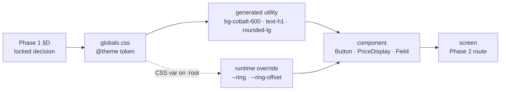
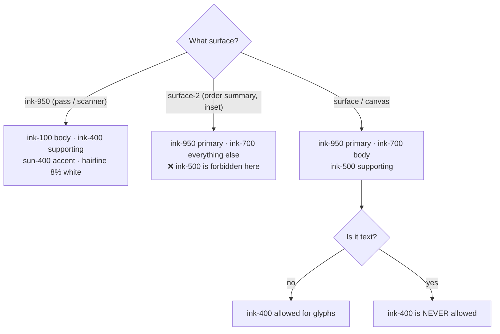

# Phase 7 — Design System

| Field | Value |
| --- | --- |
| **Phase** | 7 of 11 |
| **Epic** | [01-frontend-plan-and-design-direction.md](01-frontend-plan-and-design-direction.md) |
| **Status** | ✅ Complete |
| **Owner** | Design System |
| **Depends on** | [Phase 1 — Product Design Brief](02-product-design-brief.md) (§D, §K — locked) · [Phase 2 — Information Architecture](03-information-architecture.md) (route tree) · [Phase 6 — Component Inventory](07-component-inventory.md) (consumers) |

> **Objective:** Define foundations as **TailwindCSS 4-consumable tokens** so implementation is copy-paste, not re-interpretation. Target **WCAG 2.1 AA**.

---

## 0. How to read this document

This document is the **implementation contract** for `frontend/src/app/globals.css` and every component
built on top of it. It does not re-open any decision: colour, type, shape, motion and density were
locked in [Phase 1 §D and §K](02-product-design-brief.md). Phase 7's job is to turn those decisions
into **tokens that a developer pastes into a file**, plus the rules that stop the tokens being misused.

**Three rules govern everything below.**

1. **A value that is not in `@theme` does not exist.** No hex codes, no `px` sizes, no `ms` durations
   inside a component. If a component needs a value the system does not have, the system gains a token
   first — see [§11 Governance](#11-token-governance).
2. **Every contrast ratio in this document has been computed, not estimated.** The failing pairs are
   listed as loudly as the passing ones, because the failing pairs are the ones that get shipped by
   accident.
3. **This file replaces the Next.js starter styling.** The `--background` / `--foreground` /
   `--font-geist-*` variables and the `@media (prefers-color-scheme: dark)` block currently in
   `frontend/src/app/globals.css` are scaffolding and are **deleted**, not extended — see
   [§1.4](#14-what-is-removed-from-the-current-globalscss).

### Contents

| § | Section | What it fixes |
|---|---|---|
| [1](#1-token-source-of-truth) | Token source of truth | The complete, copy-pasteable `@theme` block |
| [2](#2-colour) | Colour | Role table, verified contrast matrix, the hard rules |
| [3](#3-typography) | Typography | `next/font/google` code, the 9-step scale, the money rules |
| [4](#4-spacing-radius-elevation-and-layout) | Spacing · radius · elevation · layout | Scales, breakpoints, container caps |
| [5](#5-motion) | Motion | Duration/easing tokens, the global reduced-motion block |
| [6](#6-focus-and-interaction-states) | Focus & interaction | `--ring` / `--ring-offset` and the dark-surface swap |
| [7](#7-component-density) | Component density | Heights and targets, mobile vs desktop |
| [8](#8-tokens-in-real-use) | Tokens in real use | `cn()` and the full `Button` implementation |
| [9](#9-iconography) | Iconography | Heroicons rules and the category glyph map |
| [10](#10-accessibility-checklist) | Accessibility checklist | The AA obligations, per surface |
| [11](#11-token-governance) | Token governance | How a token is added, and the CI guard |
| [12](#12-backend-reality-checks-that-touch-this-document) | Backend reality checks | Including **⚠ `GET /config/public` is NOT IMPLEMENTED** |
| [13](#13-inherited-defects-to-fix-when-this-lands) | Inherited defects | Four concrete fixes in existing frontend files |

### Where the tokens live

```
frontend/src/
├── app/
│   ├── globals.css          ← §1: @import, @theme, @utility, @layer base   (THE source of truth)
│   └── layout.tsx           ← §3.1: next/font/google wiring
├── lib/
│   ├── utils.ts             ← §8.1: cn()
│   ├── format/money.ts      ← §3.4: formatTnd(), the TND rules
│   └── constants/pricing.ts ← §12.1: the interim commission constant
└── components/ui/
    └── button.tsx           ← §8.2: the reference implementation
```

There is **no `tailwind.config.js`**. TailwindCSS 4 is configured entirely in CSS; creating a JS config
would split the source of truth in two.



---

## 1. Token source of truth

### 1.1 The complete `globals.css`

Paste this file whole. It is the entire styling foundation of the product; nothing else is global.

```css
/* frontend/src/app/globals.css
 * Tickr design system — Phase 7. TailwindCSS 4, CSS-first configuration.
 * Locked by docs/08-frontend/02-product-design-brief.md §D + §K. Do not add values here
 * without following §11 of docs/08-frontend/08-design-system.md.
 */
@import "tailwindcss";

@theme {
  /* ══ Colour ══════════════════════════════════════════════════════════
     Tailwind's default palette is DELETED. `--color-*: initial` removes
     every built-in colour (red-500, slate-800, …) so `bg-red-500` becomes
     an unknown class and cannot ship by accident. The four generic
     keywords are re-declared below because that reset removes them too. */
  --color-*: initial;

  --color-transparent: transparent;
  --color-current: currentColor;
  --color-inherit: inherit;
  --color-white: #FFFFFF;
  /* NOTE: there is deliberately no `--color-black`. The darkest value in
     Tickr is ink-950 (#0B0F1A); pure black is never used. */

  /* ── Brand · Cobalt is the ONLY action colour ─────────────────────── */
  --color-cobalt-700: #2430C9;   /* pressed / active   · white on it 8.97:1 AAA */
  --color-cobalt-600: #2E3DE8;   /* PRIMARY · links · focus ring · 7.12:1 AAA   */
  --color-cobalt-500: #3B4DF5;   /* hover              · white on it 5.89:1 AA  */
  --color-cobalt-100: #E6E9FF;   /* selected tint      · 600 on it   5.92:1 AA  */
  --color-cobalt-50:  #F0F2FF;   /* wash — decorative only                      */

  /* ── Accent · Sun — scarcity, countdown attention, brand mark ────────
     NEVER a primary button. NEVER an error or a warning. */
  --color-sun-400: #FFD23F;      /* accent / scarcity  · ink-950 on it 13.25:1 AAA */
  --color-sun-500: #F5B80B;      /* heavier icon fill  · ink-950 on it 10.70:1 AAA */
  --color-sun-700: #8A5B00;      /* sun-family TEXT    · on white      5.87:1  AA  */

  /* ── Warm neutrals · paper and ink ───────────────────────────────── */
  --color-canvas:    #F8F7F4;    /* page ground (warm paper)                      */
  --color-surface:   #FFFFFF;    /* cards — lift by value, not by shadow          */
  --color-surface-2: #F1EFEA;    /* inset: order summary, disabled, table stripes */

  --color-ink-950: #0B0F1A;      /* primary text · dark surfaces · on white 19.13:1 */
  --color-ink-700: #374151;      /* body copy                    · on white 10.31:1 */
  --color-ink-500: #6B7280;      /* supporting text              · on white  4.83:1 */
  --color-ink-400: #9CA3AF;      /* ⚠ NON-TEXT on light (2.54:1) · on ink-950 7.54:1 */
  --color-ink-100: #E8E6E1;      /* text ON DARK                 · on ink-950 15.34:1 */

  --color-border:        #E5E3DD; /* decorative hairline ONLY  (1.28:1)             */
  --color-border-strong: #7F848F; /* CONTROL boundaries        (3.75:1 ✓ SC 1.4.11) */
  --color-hairline-dark: rgb(255 255 255 / 0.08); /* separator on dark surfaces     */

  /* ── Semantic · -700 text-safe · -600 fill-safe (≥3:1) · -100 tint ── */
  --color-success-700: #047857;  /* on white 5.48:1 · on tint 4.84:1 */
  --color-success-600: #059669;
  --color-success-100: #D1FAE5;
  --color-warning-700: #B45309;  /* on white 5.02:1 · on tint 4.51:1 */
  --color-warning-600: #D97706;
  --color-warning-100: #FEF3C7;
  --color-danger-700:  #B91C1C;  /* on white 6.47:1 · on tint 5.30:1 */
  --color-danger-600:  #DC2626;  /* white on it 4.83:1 — the one -600 that carries text */
  --color-danger-100:  #FEE2E2;

  /* ══ Typography ══════════════════════════════════════════════════════
     Families live in the `@theme inline` block below — they reference the
     CSS variables injected by next/font, which `inline` resolves correctly. */

  /* size · line-height · tracking · weight — every step has one job (§3.2) */
  --text-display-xl: 2.25rem;                        /* 36 px */
  --text-display-xl--line-height: 2.5rem;            /* 40 px */
  --text-display-xl--letter-spacing: -0.02em;
  --text-display-xl--font-weight: 700;

  --text-display-xl-lg: 2.75rem;                     /* 44 px — the lg: pair of display-xl */
  --text-display-xl-lg--line-height: 3rem;           /* 48 px */
  --text-display-xl-lg--letter-spacing: -0.02em;
  --text-display-xl-lg--font-weight: 700;

  --text-display-l: 1.75rem;                         /* 28 px */
  --text-display-l--line-height: 2rem;               /* 32 px */
  --text-display-l--letter-spacing: -0.015em;
  --text-display-l--font-weight: 700;

  --text-h1: 1.375rem;                               /* 22 px */
  --text-h1--line-height: 1.75rem;                   /* 28 px */
  --text-h1--letter-spacing: -0.01em;
  --text-h1--font-weight: 600;

  --text-h2: 1.125rem;                               /* 18 px */
  --text-h2--line-height: 1.5rem;                    /* 24 px */
  --text-h2--font-weight: 600;

  --text-body: 1rem;                                 /* 16 px — floor for primary reading */
  --text-body--line-height: 1.5rem;                  /* 24 px */
  --text-body--font-weight: 400;

  --text-body-sm: 0.875rem;                          /* 14 px */
  --text-body-sm--line-height: 1.25rem;              /* 20 px */
  --text-body-sm--font-weight: 400;

  --text-caption: 0.8125rem;                         /* 13 px — floor for running text */
  --text-caption--line-height: 1.125rem;             /* 18 px */
  --text-caption--font-weight: 500;

  --text-overline: 0.75rem;                          /* 12 px */
  --text-overline--line-height: 1rem;                /* 16 px */
  --text-overline--letter-spacing: 0.06em;
  --text-overline--font-weight: 600;

  /* ══ Spacing · 4 px base ═════════════════════════════════════════════
     Tailwind 4 derives the whole scale from this single value:
     p-1 = 4px · p-4 = 16px · p-16 = 64px. */
  --spacing: 0.25rem;

  /* ══ Radius · posters are square, tickets are round ══════════════════
     These intentionally OVERRIDE Tailwind's defaults, so `rounded-sm` = 8px. */
  --radius-sm: 8px;    /* inputs, chips, badges, small controls   */
  --radius-md: 12px;   /* buttons, compact cards, thumbnails      */
  --radius-lg: 16px;   /* cards, panels, order-summary block      */
  --radius-xl: 24px;   /* bottom sheets, modals, the ticket pass  */
  /* rounded-none and rounded-full are Tailwind built-ins — kept as-is. */

  /* ══ Elevation · warm-tinted, five levels, no more ═══════════════════ */
  --shadow-sm: 0 1px 2px rgb(11 15 26 / 0.06), 0 2px 8px rgb(11 15 26 / 0.04);
  --shadow-md: 0 4px 12px rgb(11 15 26 / 0.08), 0 2px 4px rgb(11 15 26 / 0.04);
  --shadow-lg: 0 12px 32px rgb(11 15 26 / 0.14);
  --shadow-sticky: 0 -1px 0 #E5E3DD, 0 -8px 24px rgb(11 15 26 / 0.08); /* points UP */
  /* shadow-none is a Tailwind built-in and is the default for cards at rest. */

  /* ══ Layout caps ═════════════════════════════════════════════════════
     Breakpoints are Tailwind defaults, unmodified (§4.4). */
  --container-content: 80rem;  /* 1280 px — max-w-content, the page shell */
  --container-prose:   45rem;  /* 720 px  — max-w-prose-tickr, ~72ch measure */

  /* ══ Motion ══════════════════════════════════════════════════════════
     Tailwind 4 has no `--duration-*` theme namespace, so these exist as
     CSS variables and are exposed as classes by the @utility rules below. */
  --duration-fast: 120ms;   /* hover, press, chip toggle          */
  --duration-base: 200ms;   /* small surfaces entering / leaving  */
  --duration-slow: 320ms;   /* sheets, modals, route transitions  */

  --ease-standard: cubic-bezier(0.2, 0, 0, 1);  /* entering and moving */
  --ease-exit:     cubic-bezier(0.4, 0, 1, 1);  /* leaving             */

  /* The countdown's ≤1 min attention pulse. Killed by the global
     prefers-reduced-motion block while the countdown itself keeps running. */
  --animate-countdown-pulse: countdown-pulse 10s var(--ease-standard) infinite;

  @keyframes countdown-pulse {
    0%, 90%, 100% { opacity: 1; }
    95%           { opacity: 0.62; }
  }
}

/* Font families are declared `inline` because they reference the CSS
   variables next/font injects onto <html> (§3.1). Without `inline`,
   Tailwind emits a var-to-var indirection that breaks under @font-face
   scoping. */
@theme inline {
  --font-sans:    var(--font-inter), ui-sans-serif, system-ui, -apple-system,
                  "Segoe UI", Roboto, sans-serif;
  --font-display: var(--font-archivo), var(--font-inter), ui-sans-serif,
                  system-ui, sans-serif;
}

/* ── Custom utilities ────────────────────────────────────────────────── */

@utility duration-fast { transition-duration: var(--duration-fast); }
@utility duration-base { transition-duration: var(--duration-base); }
@utility duration-slow { transition-duration: var(--duration-slow); }

/* The scrim that guarantees 4.5:1 for any text placed over an organizer's
   uploaded poster. Text is NEVER placed on a raw image. */
@utility poster-scrim {
  background-image: linear-gradient(
    to top,
    rgb(11 15 26 / 0.85) 0%,
    rgb(11 15 26 / 0.45) 40%,
    transparent 75%
  );
}

/* ── Base layer ──────────────────────────────────────────────────────── */

@layer base {
  /* Focus-ring context. Surface-level, never a per-component decision (§6). */
  :root {
    --ring: var(--color-cobalt-600);
    --ring-offset: var(--color-canvas);
  }
  .on-surface { --ring-offset: var(--color-surface); }
  .on-dark    { --ring: var(--color-sun-400); --ring-offset: var(--color-ink-950); }

  html {
    -webkit-text-size-adjust: 100%;
    scroll-behavior: smooth;
  }

  body {
    background-color: var(--color-canvas);
    color: var(--color-ink-950);
    font-family: var(--font-sans);
    font-size: var(--text-body);
    line-height: var(--text-body--line-height);
    -webkit-font-smoothing: antialiased;
    text-rendering: optimizeLegibility;
  }

  /* Display family is opt-in per element via `font-display`; it is never
     the body default. */

  /* Visible focus for keyboard users only. The 2 px box-shadow in the
     page colour separates the ring from the control it surrounds, so the
     cobalt ring stays visible even on a cobalt button (§6). */
  :where(a, button, input, select, textarea, summary,
         [tabindex]:not([tabindex="-1"])):focus-visible {
    outline: 3px solid var(--ring);
    outline-offset: 2px;
    box-shadow: 0 0 0 2px var(--ring-offset);
  }
  :where(a, button, input, select, textarea, summary, [tabindex]):focus:not(:focus-visible) {
    outline: none;
  }

  /* Dark surfaces (ticket pass, check-in scanner) are separated by a
     hairline, never by fill value — a near-black panel on ink-950 measures
     only ≈1.08:1, and there is no ink-900 token to reach for. */
  .on-dark {
    background-color: var(--color-ink-950);
    color: var(--color-ink-100);
  }
  .on-dark hr,
  .on-dark [data-hairline] { border-color: var(--color-hairline-dark); }

  /* Money, counts and countdowns never jitter. Tailwind's built-in
     `tabular-nums` utility is used in components; this covers raw <output>. */
  output, [data-money] { font-variant-numeric: tabular-nums; }

  ::selection { background-color: var(--color-cobalt-100); color: var(--color-ink-950); }

  /* Media never overflows its column. Layout is reserved by the aspect-ratio
     box on the container (next/image), not by this rule — Phase 1 §D.8. */
  img, video { max-width: 100%; height: auto; }

  /* Motion preference is honoured globally, once, not per component. */
  @media (prefers-reduced-motion: reduce) {
    html { scroll-behavior: auto; }
    *, *::before, *::after {
      animation-duration: 0.01ms !important;
      animation-iteration-count: 1 !important;
      transition-duration: 0.01ms !important;
      scroll-behavior: auto !important;
    }
  }
}
```

### 1.2 What the `@theme` block generates

| Token namespace | Utilities you get | Example |
|---|---|---|
| `--color-*` | `bg-*` `text-*` `border-*` `ring-*` `fill-*` `stroke-*` `divide-*` | `bg-cobalt-600` `text-ink-700` `border-border-strong` |
| `--text-*` | `text-*` (size + line-height + tracking + weight in one class) | `text-h1` `text-body-sm` `lg:text-display-xl-lg` |
| `--font-*` | `font-*` | `font-sans` `font-display` |
| `--spacing` | the whole numeric scale for `p-*` `m-*` `gap-*` `w-*` `h-*` | `p-4` = 16 px · `h-11` = 44 px |
| `--radius-*` | `rounded-*` | `rounded-md` = 12 px |
| `--shadow-*` | `shadow-*` | `shadow-sticky` |
| `--container-*` | `max-w-*` `w-*` | `max-w-content` = 1280 px |
| `--ease-*` | `ease-*` | `ease-standard` |
| `--animate-*` | `animate-*` | `animate-countdown-pulse` |
| `--duration-*` | **nothing by default** — exposed by the three `@utility` rules | `duration-base` |

### 1.3 Consequences of `--color-*: initial`

This is the single highest-leverage line in the file, and it has costs worth stating plainly.

| Consequence | Handling |
|---|---|
| `bg-red-500`, `text-slate-600`, `border-gray-200` no longer compile | Intended. This is how the palette stays a palette. |
| `text-white` still works | `--color-white` is re-declared. |
| `bg-black` no longer works | Intended — the darkest value is `ink-950`. |
| `bg-transparent`, `text-current`, `border-inherit` still work | The three keywords are re-declared. |
| Third-party snippets pasted from the internet will fail to style | Intended, and it fails loudly at build time rather than quietly at review time. |
| Arbitrary values (`bg-[#ff0000]`) still compile | Not preventable in CSS — caught by the CI grep in [§11.3](#113-the-ci-guard). |

### 1.4 What is removed from the current `globals.css`

The file currently in `frontend/src/app/globals.css` is Next.js starter scaffolding. All of it goes:

| Removed | Why |
|---|---|
| `--background` / `--foreground` | Replaced by `--color-canvas` / `--color-ink-950`. |
| `@theme inline { --color-background … --font-mono }` | Replaced by the block above. Tickr has no monospace face. |
| `--font-geist-sans` / `--font-geist-mono` | Geist is not in the type stack. Archivo + Inter only. |
| `@media (prefers-color-scheme: dark) { … }` | **A full dark theme is out of scope for V1 and must not be half-implemented** ([Phase 1 §D.2](02-product-design-brief.md)). Tickr is a light product with two deliberately dark *surfaces* — see [§2.6](#26-dark-surfaces). |
| `body { font-family: Arial, Helvetica, sans-serif }` | Replaced by `var(--font-sans)`. |

---

## 2. Colour

### 2.1 Colour roles

Every token has exactly one job. The "Never" column is the part that gets violated.

| Role | Token | Value | Used for | Never used for |
|---|---|---|---|---|
| Action / interactive identity | `cobalt-600` | `#2E3DE8` | Primary buttons, links, active tabs, selected states, focus ring | Backgrounds, headers, decoration |
| Action · hover | `cobalt-500` | `#3B4DF5` | Primary button hover | Rest state |
| Action · pressed | `cobalt-700` | `#2430C9` | Primary button active | Rest state |
| Selected tint | `cobalt-100` | `#E6E9FF` | Selected row, info callout ground | Text |
| Accent / scarcity / brand | `sun-400` | `#FFD23F` | « Plus que N places », countdown attention, brand mark | **Primary buttons, errors, warnings, large fills** |
| Accent · heavier glyph | `sun-500` | `#F5B80B` | Icon fills on light surfaces | Text |
| Accent · text | `sun-700` | `#8A5B00` | Sun-family text on light | Fills |
| Page ground | `canvas` | `#F8F7F4` | The page | Cards |
| Raised content | `surface` | `#FFFFFF` | Cards, sheets, inputs | The page ground |
| Inset content | `surface-2` | `#F1EFEA` | Order summary, disabled fields, table stripes | **Anything carrying `ink-500` text** |
| Primary text | `ink-950` | `#0B0F1A` | Headlines, totals, primary copy | — |
| Body text | `ink-700` | `#374151` | Body copy, labels, **all text on `surface-2`** | — |
| Supporting text | `ink-500` | `#6B7280` | Metadata, captions, helper text on `surface`/`canvas` | Text on `surface-2` |
| Disabled / decorative glyphs | `ink-400` | `#9CA3AF` | Non-text glyphs on light; supporting text **on dark only** | **Any text on a light surface** |
| Text on dark | `ink-100` | `#E8E6E1` | Ticket pass, scanner | Light surfaces |
| Decorative edges | `border` | `#E5E3DD` | Card edges, dividers | **Input / control boundaries** |
| Control boundaries | `border-strong` | `#7F848F` | Inputs, checkboxes, radios, steppers, secondary buttons | Decorative dividers (too heavy) |
| Success | `success-700/600/100` | `#047857` / `#059669` / `#D1FAE5` | Order paid, ticket confirmed, checked in | Decoration |
| Warning | `warning-700/600/100` | `#B45309` / `#D97706` / `#FEF3C7` | Reservation expiring, low availability, sales closing | Errors |
| Danger | `danger-700/600/100` | `#B91C1C` / `#DC2626` / `#FEE2E2` | Payment failed, reservation expired, event cancelled | Emphasis |

### 2.2 Verified contrast matrix

All ratios computed against the WCAG 2.x relative-luminance formula. **Bold = the pairing you will
actually ship.** ❌ rows exist so nobody re-derives them by accident.

| Foreground | Background | Ratio | Verdict | Where it is used |
|---|---|---|---|---|
| **`ink-950` #0B0F1A** | **`surface` #FFFFFF** | **19.13 : 1** | ✅ AAA | Headlines, totals, primary copy |
| `ink-950` | `canvas` #F8F7F4 | 17.86 : 1 | ✅ AAA | Page-level headings |
| **`ink-700` #374151** | **`surface`** | **10.31 : 1** | ✅ AAA | Body copy, form labels |
| `ink-700` | `surface-2` #F1EFEA | 8.97 : 1 | ✅ AAA | **All text inside the order summary** |
| **`ink-500` #6B7280** | **`surface`** | **4.83 : 1** | ✅ AA | Metadata, helper text, timestamps |
| `ink-500` | `canvas` | 4.51 : 1 | ✅ AA (bare pass) | Supporting text on the page ground |
| `ink-500` | `surface-2` | **4.21 : 1** | ❌ **FAILS AA** | **Forbidden — step up to `ink-700`** |
| `ink-400` #9CA3AF | `surface` | **2.54 : 1** | ❌ **FAILS AA** | **Forbidden as text on light. Glyphs only** |
| `ink-100` #E8E6E1 | `ink-950` | 15.34 : 1 | ✅ AAA | Ticket pass and scanner body text |
| `ink-400` | `ink-950` | 7.54 : 1 | ✅ AAA | The **one** place `ink-400` is legitimate as text |
| **`cobalt-600` #2E3DE8** | **`surface`** | **7.12 : 1** | ✅ AAA | Links, ghost-button label, focus ring |
| `cobalt-600` | `canvas` | 6.65 : 1 | ✅ AA | Links on the page ground |
| **`white`** | **`cobalt-600`** | **7.12 : 1** | ✅ AAA | **Primary button label** |
| `white` | `cobalt-700` | 8.97 : 1 | ✅ AAA | Primary button, pressed |
| `white` | `cobalt-500` | 5.89 : 1 | ✅ AA | Primary button, hover |
| `cobalt-600` | `cobalt-100` #E6E9FF | 5.92 : 1 | ✅ AA | Selected row label, info callout |
| **`ink-950`** | **`sun-400` #FFD23F** | **13.25 : 1** | ✅ AAA | Scarcity badge, countdown attention |
| `ink-950` | `sun-500` #F5B80B | 10.70 : 1 | ✅ AAA | Heavier accent chip |
| `sun-700` #8A5B00 | `surface` | 5.87 : 1 | ✅ AA | Sun-family text on light |
| **`success-700` #047857** | **`surface`** | **5.48 : 1** | ✅ AA | « Paiement confirmé », « Billet valide » |
| `success-700` | `success-100` #D1FAE5 | 4.84 : 1 | ✅ AA | Success callout body |
| `white` | `success-700` | 5.48 : 1 | ✅ AA | Success solid badge |
| **`warning-700` #B45309** | **`surface`** | **5.02 : 1** | ✅ AA | « Il reste 4:12 », low-availability text |
| `warning-700` | `warning-100` #FEF3C7 | 4.51 : 1 | ✅ AA (bare pass) | Expiring-hold callout |
| `danger-700` #B91C1C | `surface` | 6.47 : 1 | ✅ AA | Error headings and field errors |
| `danger-700` | `danger-100` #FEE2E2 | 5.30 : 1 | ✅ AA | Payment-failure callout body |
| **`white`** | **`danger-600` #DC2626** | **4.83 : 1** | ✅ AA | Danger button — the only `-600` that carries text |
| `border-strong` #7F848F | `surface` | **3.75 : 1** | ✅ SC 1.4.11 (non-text ≥ 3:1) | Input, checkbox, radio, stepper boundaries |
| `border` #E5E3DD | `surface` | **1.28 : 1** | ❌ non-text fail | **Decorative only — never bounds a control** |

Large text (≥ 18.66 px bold or ≥ 24 px) needs only 3 : 1. **Tickr does not spend that allowance** —
every text pairing above clears the 4.5 : 1 normal-text threshold, and the headroom stays headroom.

### 2.3 The two hard rules

Both are trivially violated by a well-meaning developer reaching for "a lighter grey".

> **Hard rule 1 — `ink-400` is never text on a light surface.**
> At **2.54 : 1** on white it fails AA outright. Disabled *text* is `ink-500` at **full opacity** on a
> `surface-2` fill with `aria-disabled="true"` — never a lighter grey and never `opacity-50`, which
> would drag any colour below threshold. `ink-400` is legal for: decorative glyphs, disabled icons,
> and body text **on `ink-950`** (7.54 : 1).

> **Hard rule 2 — `ink-500` is never used on `surface-2`.**
> That pairing measures **4.21 : 1** and fails AA for normal text. Inside `surface-2` blocks —
> which is to say **inside the order summary, the single most important block in the product to be
> able to read** — supporting text steps up to `ink-700` (8.97 : 1).
> The single exception is a **disabled control's own label**: WCAG 1.4.3 places no contrast
> requirement on the text of an inactive component, which is what makes the disabled recipe in
> [§6.2](#62-the-five-states-every-interactive-element-defines) legal. The adjacent sentence
> explaining *why* the control is disabled is not inactive, and is `ink-700`.

> **Corollary — `border` never bounds a control.**
> `#E5E3DD` at **1.28 : 1** may draw a card edge or a divider. An input, checkbox, radio, stepper or
> secondary button needs `border-strong` (3.75 : 1) to satisfy WCAG 1.4.11 Non-text Contrast.

Use this when picking a text colour:



### 2.4 Status → token mapping

The frontend maps backend **enum values** to Tickr tokens. It never consumes a colour the backend
sends (see [§2.5](#25-the-backend-ships-hex-codes--the-frontend-ignores-them)).

| Backend enum | Token treatment | Copy (fr-TN) |
|---|---|---|
| `EventStatus.DRAFT` | `ink-700` on `surface-2`, `rounded-sm` badge — organizer surfaces only | « Brouillon » |
| `EventStatus.PUBLISHED` | **No badge** — the normal case is silent | — |
| `EventStatus.CANCELLED` | `danger-700` on `danger-100` badge + full-width page banner | « Événement annulé » |
| `EventStatus.COMPLETED` | Neutral badge, poster desaturated to 60 % | « Terminé » |
| `OrderStatus.PENDING` | `warning-700` on `warning-100` + countdown from `expiresAt` | « En attente de paiement » |
| `OrderStatus.PROCESSING` | `warning-700` on `warning-100` + indeterminate indicator | « Paiement en cours de vérification » |
| `OrderStatus.PAID` | `success-700` on `success-100` | « Payé » |
| `OrderStatus.FAILED` | `danger-700` on `danger-100` | « Paiement échoué » |
| `OrderStatus.CANCELLED` | `danger-700` on `danger-100` | « Annulée » |
| `OrderStatus.REFUNDED` | Neutral `ink-700` on `surface-2` — a refund is an outcome, not an error | « Remboursée » |
| `TicketStatus.RESERVED` | `warning-700` on `warning-100` + countdown | « Réservé » |
| `TicketStatus.CONFIRMED` | `success-700` on `success-100`, QR live | « Confirmé » |
| `TicketStatus.CHECKED_IN` | Neutral `ink-700` + timestamp, QR visually spent | « Scanné à 21:14 » |
| `TicketStatus.EXPIRED` | `ink-700` on `surface-2`, QR hidden | « Expiré » |
| `TicketStatus.CANCELLED` | `ink-700` on `surface-2`, QR hidden | « Annulé » |

**Deliberate divergence from Phase 1.** [Phase 1 §D.2](02-product-design-brief.md)'s status table
puts the two spent ticket states in `ink-500` on `surface-2` — the 4.21 : 1 pairing its own hard rule
forbids. This document uses `ink-700` (8.97 : 1); a status badge is live text, not an inactive control.

**Colour is never the only carrier.** Every badge above pairs its token with a text label, and every
error state pairs the token with an icon *and* text (WCAG 1.4.1 Use of Colour).

### 2.5 The backend ships hex codes — the frontend ignores them

Two backend metadata maps carry display colours:

- `EVENT_CATEGORY_METADATA` (`event-category.vo.ts`) — `#E91E63`, `#2196F3`, `#4CAF50`, `#9C27B0`,
  `#FF9800`, `#F44336`, `#00BCD4`, `#3F51B5`, `#FFEB3B`, `#607D8B`
- `EVENT_STATUS_METADATA` — the same Material family

**None of these enter the frontend** — and neither does anything else in those maps. They are
domain-layer constants: `EventDto` and `EventListDto` expose `category: EventCategory` and nothing
more (`event.dto.ts:110`, `event-list.dto.ts:71`), so the Material hues, the `icon` strings and
`displayNameFr` all stop at the API boundary. The French label and the glyph are **frontend-owned
maps keyed by the enum** ([§9](#9-iconography)). That is the right outcome anyway: ten competing
hues on a discovery screen would destroy the "one action colour" rule.

That leaves the poster fallback needing "category tinting" without category hues. V1 resolves this as
**tone-tinted, not hue-tinted**: a `surface-2` panel carrying the category glyph in `ink-400`
(a non-text glyph — legal) plus the event's initials in `ink-700`, with the glyph's scale, rotation
and offset derived deterministically from the event `id` so the panel is stable across renders and
visually distinct between events. No new colour tokens are required, and the discovery grid stays calm.

### 2.6 Dark surfaces

Tickr is a **light product with two dark surfaces**, not a dark product: the **ticket pass** in the
wallet (a dark card reads as a physical object) and the **check-in scanner** (usable at a venue door
at night).

Both opt in with the `.on-dark` class, which does three things at once: sets the ground and text
colour, swaps the focus ring to `sun-400`, and re-points `--ring-offset` at `ink-950`.

```tsx
<section className="on-dark rounded-xl p-6">
  <p className="text-caption uppercase tracking-[0.06em] text-ink-400">Billet</p>
  <h2 className="font-display text-display-l text-ink-100">Nuits de Carthage</h2>
  <hr data-hairline className="my-4 border-t" />
  <p className="text-body-sm text-ink-400">Rangée libre · Entrée 19:30</p>
</section>
```

| Pairing | Ratio | Note |
|---|---|---|
| `ink-100` on `ink-950` | 15.34 : 1 ✅ AAA | Body and headings |
| `ink-400` on `ink-950` | 7.54 : 1 ✅ AAA | Supporting text — the one legal text use of `ink-400` |
| `sun-400` on `ink-950` | 13.25 : 1 ✅ AAA | Accent, focus ring, brand mark |
| A near-black panel on `ink-950` | ≈ 1.08 : 1 ❌ | There is **no `ink-900` token**. Dark surfaces are separated by `--color-hairline-dark` (1 px `rgb(255 255 255 / 0.08)`), never by fill value. |

The QR code itself is always rendered **dark-on-light** inside the dark pass — a white quiet-zone
plate — because scanners require that polarity. The pass is dark; the code is not.

---

## 3. Typography

Two families, one job each. **The budget is two families; adding a third requires removing one.**

| Role | Family | Why this face |
|---|---|---|
| **Display** — event titles, page headings, poster-weight numbers | **Archivo** (variable, Google Fonts) | Grotesque with real poster energy at heavy weights, tightens well at display sizes, full Latin-Extended for French diacritics |
| **UI / body** — everything else, and **all** money | **Inter** (variable, already installed) | The most legible UI face at small sizes on low-density Android screens, excellent French coverage, **true tabular figures** |
| *Reserved — Arabic* | IBM Plex Sans Arabic | **Not loaded in V1.** Reserved so an RTL locale is a font swap plus logical properties, not a redesign. |

### 3.1 Loading — `next/font/google`

Replaces the current `Inter({ subsets: ['latin'] })` call in `frontend/src/app/layout.tsx`.

```tsx
// frontend/src/app/layout.tsx
import type { Metadata } from 'next';
import { Archivo, Inter } from 'next/font/google';
import './globals.css';
import { Providers } from '@/components/providers';

// Variable fonts: omit `weight` to ship the full wght axis at no extra cost.
// Do NOT add `axes` — pulling slnt/wdth would break the ≤4-axis budget.
const inter = Inter({
  subsets: ['latin', 'latin-ext'],
  display: 'swap',
  variable: '--font-inter',
  fallback: ['ui-sans-serif', 'system-ui', 'sans-serif'],
  adjustFontFallback: true,
});

const archivo = Archivo({
  subsets: ['latin', 'latin-ext'],
  display: 'swap',
  variable: '--font-archivo',
  fallback: ['ui-sans-serif', 'system-ui', 'sans-serif'],
  adjustFontFallback: true,
});

export const metadata: Metadata = {
  title: 'Tickr — Billetterie en ligne',
  description: 'Réservez vos billets pour les meilleurs événements en Tunisie',
  openGraph: { locale: 'fr_TN', siteName: 'Tickr', type: 'website' },
};

export default function RootLayout({ children }: Readonly<{ children: React.ReactNode }>) {
  return (
    <html lang="fr" className={`${inter.variable} ${archivo.variable}`} suppressHydrationWarning>
      <body className="font-sans antialiased">
        <Providers>{children}</Providers>
      </body>
    </html>
  );
}
```

Only the font wiring and the `<html>` `className` change: the `keywords`, `authors`, `twitter` and
`robots` entries already in `layout.tsx` stay exactly as they are.

**Performance ceiling (hard):** two families, variable, `subsets: ['latin', 'latin-ext']`,
`display: 'swap'`, **≤ 4 loaded axes total**. `adjustFontFallback` is on so the metric-adjusted
fallback prevents layout shift during the swap — this matters on the 3G-first target device.

### 3.2 The scale

Nine steps. Every step has an assigned job; no step exists to complete a scale.

| # | Token / class | Size / line-height | Family · weight · tracking | Job |
|---|---|---|---|---|
| 1 | `text-display-xl` | 36 / 40 px | Archivo 700 · −2 % | Event title in the event-page hero |
| 1b | `lg:text-display-xl-lg` | 44 / 48 px | Archivo 700 · −2 % | The `lg` pair of step 1 — a responsive pair, not a tenth step |
| 2 | `text-display-l` | 28 / 32 px | Archivo 700 · −1.5 % | Page titles, section heroes |
| 3 | `text-h1` | 22 / 28 px | Archivo 600 · −1 % | Card titles, sheet titles |
| 4 | `text-h2` | 18 / 24 px | Inter 600 | Sub-sections, ticket-type names |
| 5 | `text-body` | 16 / 24 px | Inter 400 | Default reading text — **never below 16 px for primary reading** |
| 6 | `text-body-sm` | 14 / 20 px | Inter 400 | Metadata, helper text, dense lists |
| 7 | `text-caption` | 13 / 18 px | Inter 500 | Timestamps, legal, fine print — **the floor for running text** |
| 8 | `text-overline` | 12 / 16 px | Inter 600 · +6 % · uppercase | Category eyebrows, section labels — **short strings only** |
| 9 | `tabular-nums` | inherits | modifier | **All money, all counts, all countdowns** |

Steps 1–3 use the display family and must be written `font-display text-display-l`; the family is
never the body default. Step 9 is Tailwind's **built-in** `tabular-nums` utility — the `.tabular`
helper class sketched in [Phase 1 §K.1](02-product-design-brief.md) is not needed and is not shipped.

```tsx
<h1 className="font-display text-display-xl lg:text-display-xl-lg text-balance text-ink-950">
  Nuits de Carthage 2026
</h1>
<p className="text-overline uppercase text-ink-500">Concert</p>
<p className="mt-2 max-w-prose-tickr text-body text-ink-700">…</p>
```

**Measure:** long-form prose (event descriptions, legal pages) is capped with `max-w-prose-tickr`
(720 px ≈ 72 characters). Headings use `text-balance`; body paragraphs use `text-pretty`.

### 3.3 The money rules

Money is the highest-stakes text in the product, so it gets explicit rules rather than conventions.

1. **Every monetary value, count and countdown uses `tabular-nums`.** Proportional digits make a
   countdown jitter and a price column fail to align; both read as unreliability.
2. **TND has three decimals (millimes).** `currency.vo.ts` sets `decimals: 3` for TND. But rendering
   `50,000 DT` for a fifty-dinar ticket invites a catastrophic misreading. **The rule: show millimes
   only when they are non-zero** — `50 DT` · `53 DT` · `52,500 DT`. **Full three-decimal precision is
   always used** in the order-summary total, the payment button, and receipts.
3. **A non-breaking space precedes `DT`**, which never wraps onto its own line.
4. **Never construct a price client-side from a rate.** `POST /orders` returns `subtotal`,
   `platformFee`, `paymentFees` and `total` — render those verbatim. The rate is configurable
   server-side, so a client-side `× 1.06` will eventually disagree with the actual charge.
5. **The total is the visually heaviest number on any screen it appears on** — `text-h1` minimum,
   `ink-950`, `font-display` on the checkout summary.
6. **Nothing about a price ever animates.** No count-ups, no transitions, no highlight flashes.

### 3.4 `formatTnd()` — the implementation

```ts
// frontend/src/lib/format/money.ts
const NBSP = '\u00A0'; // non-breaking space — DT never wraps onto its own line

/** Amounts are kept in dinars as numbers by the API; millimes are the 3rd decimal. */
export type TndPrecision = 'auto' | 'full';

const cache = new Map<string, Intl.NumberFormat>();
function nf(min: number, max: number): Intl.NumberFormat {
  const key = `${min}:${max}`;
  let f = cache.get(key);
  if (!f) {
    f = new Intl.NumberFormat('fr-TN', {
      minimumFractionDigits: min,
      maximumFractionDigits: max,
      useGrouping: true,
    });
    cache.set(key, f);
  }
  return f;
}

/**
 * Rule 2: millimes are shown only when non-zero, EXCEPT in totals and
 * receipts, which pass precision: 'full'.
 *   formatTnd(50)          -> "50 DT"
 *   formatTnd(52.5)        -> "52,500 DT"
 *   formatTnd(53, 'full')  -> "53,000 DT"
 *   formatTnd(1500)        -> "1 500 DT"
 */
export function formatTnd(amount: number, precision: TndPrecision = 'auto'): string {
  const millimes = Math.round(amount * 1000);          // never float-compare money
  const showDecimals = precision === 'full' || millimes % 1000 !== 0;
  const digits = showDecimals ? 3 : 0;
  return `${nf(digits, digits).format(millimes / 1000)}${NBSP}DT`;
}

/** Spoken form for screen readers — "cinquante-deux dinars cinq cents millimes" is
 *  unnecessary; digits plus full unit names are clearer and locale-safe. */
export function speakTnd(amount: number): string {
  const millimes = Math.round(amount * 1000);
  const dinars = Math.trunc(millimes / 1000);
  const rest = millimes % 1000;
  return rest === 0
    ? `${dinars} dinars`
    : `${dinars} dinars ${rest} millimes`;
}
```

```tsx
// frontend/src/components/ui/price-display.tsx
import { cn } from '@/lib/utils';
import { formatTnd, speakTnd, type TndPrecision } from '@/lib/format/money';

export function PriceDisplay({
  amount,
  precision = 'auto',
  className,
}: {
  amount: number;
  precision?: TndPrecision;
  className?: string;
}) {
  return (
    <span className={cn('tabular-nums whitespace-nowrap', className)}>
      <span aria-hidden="true">{formatTnd(amount, precision)}</span>
      <span className="sr-only">{speakTnd(amount)}</span>
    </span>
  );
}
```

[Phase 6 §3.1](07-component-inventory.md) catalogues this component with a wider prop surface
(`currency`, `size`, `from`); the code above fixes only what the token system owns — the formatter,
`tabular-nums`, and the spoken form.

The order-summary block that consumes it — note the **conditional** `paymentFees` line
(`OrderEntity.setPaymentFees()` exists and can rewrite the total, so the line must already be there)
and `ink-700`, never `ink-500`, because the block sits on `surface-2`:

```tsx
<dl className="rounded-lg bg-surface-2 p-4 text-body-sm text-ink-700">
  <div className="flex justify-between py-1">
    <dt>2 × Standard</dt>
    <dd><PriceDisplay amount={order.subtotal} /></dd>
  </div>
  <div className="flex justify-between py-1">
    <dt>Frais de service</dt>
    <dd><PriceDisplay amount={order.platformFee} /></dd>
  </div>
  {order.paymentFees > 0 && (
    <div className="flex justify-between py-1">
      <dt>Frais de paiement</dt>
      <dd><PriceDisplay amount={order.paymentFees} /></dd>
    </div>
  )}
  <div className="mt-3 flex justify-between border-t border-border pt-3">
    <dt className="text-h2 text-ink-950">Total à payer</dt>
    <dd className="font-display text-h1 text-ink-950">
      <PriceDisplay amount={order.total} precision="full" />
    </dd>
  </div>
</dl>
```

---

## 4. Spacing, radius, elevation and layout

### 4.1 Spacing — 4 px base

`--spacing: 0.25rem` makes Tailwind derive the entire numeric scale, so `p-3` is 12 px and `gap-8` is
32 px with no further configuration. Ten steps are in active use, each with a job:

| Class | px | Job |
|---|---|---|
| `1` | 4 | Icon-to-label, tight inline pairs |
| `2` | 8 | Inside chips and badges, dense stacks |
| `3` | 12 | Input padding, list-row rhythm |
| **`4`** | **16** | **Default gap · card padding · mobile gutter** |
| `5` | 20 | Between related blocks |
| `6` | 24 | Card padding at `md`+, tablet gutter |
| `8` | 32 | Between sections within a screen, desktop gutter |
| `10` | 40 | Section separation on mobile |
| `12` | 48 | Major section separation |
| `16` | 64 | Page-level top/bottom rhythm on desktop |

Odd steps (`7`, `9`, `11`, `13`, `14`, `15`) compile but are **not part of the system** — using one
is a signal that a layout is being nudged rather than composed.

### 4.2 Radius — posters are square, tickets are round

| Class | Value | Applies to |
|---|---|---|
| `rounded-none` | 0 | Full-bleed hero imagery, edge-to-edge media |
| `rounded-sm` | 8 px | Inputs, chips, badges, small controls |
| `rounded-md` | 12 px | Buttons, compact cards, thumbnails |
| `rounded-lg` | 16 px | Cards, panels, order-summary block |
| `rounded-xl` | 24 px | Bottom sheets, modals, the ticket pass |
| `rounded-full` | 9999 px | Avatars, filter pills, quantity stepper, status dots |

Card imagery uses `rounded-t-lg` only — the poster keeps its bottom corners square where it meets the
card body.

### 4.3 Elevation

Shadows are warm-tinted (`rgb(11 15 26 / …)`, never pure black) and there are exactly five levels.

| Class | Value | Use |
|---|---|---|
| `shadow-none` | — | **Default for cards at rest.** Cards lift off `canvas` by value, not by depth |
| `shadow-sm` | `0 1px 2px /.06, 0 2px 8px /.04` | Card hover (pointer devices only), raised chips |
| `shadow-md` | `0 4px 12px /.08, 0 2px 4px /.04` | Dropdowns, popovers, date pickers |
| `shadow-lg` | `0 12px 32px /.14` | Bottom sheets, modals |
| `shadow-sticky` | `0 -1px 0 #E5E3DD, 0 -8px 24px /.08` | The sticky purchase bar — the shadow points **upward** |

### 4.4 Breakpoints and containers

**Tailwind defaults, unmodified.** Overriding them buys nothing and breaks every developer's intuition.

| Name | Min-width | Primary role in Tickr |
|---|---|---|
| *(base)* | 0 | **The design target** — 360–412 px mid-range Android |
| `sm` | 640 px | Large phones, small tablets portrait |
| `md` | 768 px | Tablet — discovery grid goes to 2 columns |
| `lg` | 1024 px | Desktop — sidebar layouts, 3-column grid, `display-xl` grows, data tables appear |
| `xl` | 1280 px | Wide desktop — 4-column discovery grid |
| `2xl` | 1536 px | Content stays capped; the gutters grow |

| Cap | Class | Value |
|---|---|---|
| Page shell | `max-w-content` | 1280 px |
| Prose measure | `max-w-prose-tickr` | 720 px (≈ 72 characters) |
| Page gutter | `px-4 md:px-6 lg:px-8` | 16 / 24 / 32 px |

```tsx
<main className="mx-auto w-full max-w-content px-4 md:px-6 lg:px-8">…</main>
```

**Mobile is derived from nothing** — it is the base case, and every desktop rule is an additive
`md:`/`lg:` override. A base-level style that only makes sense at `lg` is a bug.

---

## 5. Motion

| Token | Class | Duration | Use |
|---|---|---|---|
| `--duration-fast` | `duration-fast` | 120 ms | State changes — hover, press, chip toggle, checkbox |
| `--duration-base` | `duration-base` | 200 ms | Small surfaces entering and leaving — popovers, toasts, accordions |
| `--duration-slow` | `duration-slow` | 320 ms | Bottom sheets, modals, route transitions |
| `--ease-standard` | `ease-standard` | `cubic-bezier(.2,0,0,1)` | Entering and moving — the default |
| `--ease-exit` | `ease-exit` | `cubic-bezier(.4,0,1,1)` | Leaving |
| `--animate-countdown-pulse` | `animate-countdown-pulse` | 10 s loop | The ≤ 1 min countdown attention state, one pulse per 10 s |

```tsx
<button className="transition-colors duration-fast ease-standard hover:bg-cobalt-500">…</button>
<div  className="transition-transform duration-slow ease-standard data-[state=closed]:ease-exit">…</div>
```

**Four rules govern all motion.**

1. Motion must communicate a **spatial relationship or a state change**. It never decorates.
2. **Nothing in checkout animates beyond a fade.** The money path is still and calm.
3. **Nothing animates the price** — no count-ups, no transitions on a total, no highlight flash.
   Availability counts are equally static: `soldQuantity` is incremented at hold time and restored on
   expiry, so a rendered count is a **per-fetch snapshot** and an animated one would read as a lie.
4. `prefers-reduced-motion` is honoured **globally by the block in `globals.css`**, not per component.
   The countdown's pulse disappears; **the countdown itself keeps running**, because it is a contract,
   not an animation.

Anything that must survive reduced motion (a loading spinner, a progress indicator) is additionally
guarded so its meaning does not depend on movement — a spinner is always paired with
`aria-live="polite"` text.

---

## 6. Focus and interaction states

### 6.1 The ring

Focus visibility is a **surface-level decision**, not a per-component one. Two custom properties carry
it, and components never restyle focus.

```css
:root       { --ring: var(--color-cobalt-600); --ring-offset: var(--color-canvas); }
.on-surface { --ring-offset: var(--color-surface); }
.on-dark    { --ring: var(--color-sun-400); --ring-offset: var(--color-ink-950); }

:where(a, button, input, select, textarea, summary,
       [tabindex]:not([tabindex="-1"])):focus-visible {
  outline: 3px solid var(--ring);
  outline-offset: 2px;
  box-shadow: 0 0 0 2px var(--ring-offset);
}
```

**Why the `box-shadow` is not decoration.** A cobalt ring around a cobalt button would be invisible.
The 2 px shadow paints the *page* colour into the `outline-offset` gap, producing
`button → 2 px of page colour → 3 px cobalt ring`. The ring therefore always sits against a surface it
contrasts with, on every variant. Both `outline` and `box-shadow` follow `border-radius` in every
supported browser, so the ring hugs a `rounded-full` stepper as tightly as a `rounded-md` button.
Note there is **no whitespace before `:focus-visible`** — a line break there is a descendant
combinator, and the ring would land on the control's children instead of the control.

| Ring | Adjacent colour | Ratio | Verdict |
|---|---|---|---|
| `cobalt-600` | `canvas` | 6.65 : 1 | ✅ ≫ 3 : 1 (SC 1.4.11) |
| `cobalt-600` | `surface` | 7.12 : 1 | ✅ |
| `sun-400` | `ink-950` | 13.25 : 1 | ✅ |

**Usage.** Apply `.on-surface` to any card, sheet, modal or input group sitting on white; apply
`.on-dark` to the ticket pass and the scanner. The default (`canvas`) needs no class.

```tsx
<article className="on-surface rounded-lg border border-border bg-surface p-4">
  <a href="/events/42" className="text-h1 text-ink-950">Nuits de Carthage</a>
</article>
```

### 6.2 The five states every interactive element defines

| State | Requirement |
|---|---|
| **Rest** | The token defaults for the variant |
| **Hover** | Pointer devices only (`@media (hover: hover)` via Tailwind's `hover:`) — never the sole affordance |
| **Focus-visible** | The global ring. **Never overridden, never removed, never `outline: none`** |
| **Active / pressed** | A darker step (`cobalt-700`), applied within `duration-fast` |
| **Disabled** | `aria-disabled="true"`, `surface-2` fill, `ink-500` text **at full opacity**, `cursor-not-allowed`. The 4.21 : 1 pairing is legal here only because WCAG 1.4.3 exempts inactive components ([§2.3](#23-the-two-hard-rules)). **Never `opacity-50`** — it drags every colour below threshold |
| **Loading** | Mandatory on any control that triggers a network call — see [§8.2](#82-the-button-reference-implementation) |

A disabled control is always accompanied by adjacent text explaining *why*
([Phase 1 §E.2](02-product-design-brief.md)): « Complet », « En vente le 12 septembre ». A greyed
button with no explanation is a defect, not a state.

---

## 7. Component density

Density is **comfortable and near-identical across breakpoints**. Touch targets do not shrink on
desktop; a 44 px control is also more comfortable with a mouse.

| Element | Mobile | Desktop | Tailwind |
|---|---|---|---|
| Primary CTA height | 48 px | 44 px | `h-12 lg:h-11` |
| Standard control height | 44 px | 44 px | `h-11` |
| Input height | 48 px | 44 px | `h-12 lg:h-11` |
| Minimum touch target | 44 × 44 px | 44 × 44 px | `min-h-11 min-w-11` |
| Icon-only control | 44 × 44 px | 44 × 44 px | `size-11` |
| List row | 56–72 px | 56–72 px | `min-h-14` … `min-h-18` |
| Data-table row | *(not used)* | 40 px | `h-10` — **the only density increase in the system** |
| Card padding | `space-4` | `space-6` | `p-4 md:p-6` |
| Page gutter | `space-4` | `space-8` | `px-4 md:px-6 lg:px-8` |
| Sticky purchase bar | 72 px + safe area | n/a | `min-h-18 pb-[env(safe-area-inset-bottom)]` |

Two notes that matter more than they look:

- **Input font-size is 16 px minimum on mobile** (`text-body`). A smaller value triggers iOS Safari's
  zoom-on-focus, which throws the user out of the checkout layout.
- **Data tables are desktop-only.** The 40 px row exists for `/admin/users`, `/admin/reports` and the
  organizer participant list. On mobile those surfaces render as list rows, never as a scrolling table.

---

## 8. Tokens in real use

### 8.1 `cn()`

Already present at `frontend/src/lib/utils.ts` and correct as written — `tailwind-merge` is what makes
variant overrides safe, because a later `className` wins over a variant's own class instead of both
landing in the class list.

```ts
// frontend/src/lib/utils.ts
import { clsx, type ClassValue } from 'clsx';
import { twMerge } from 'tailwind-merge';

/** Compose conditional classes, then resolve Tailwind conflicts (last wins). */
export function cn(...inputs: ClassValue[]) {
  return twMerge(clsx(inputs));
}
```

### 8.2 The `Button` reference implementation

Five variants, five states, mandatory loading. No `class-variance-authority` — it is not a dependency,
and a plain record is smaller and clearer.

```tsx
// frontend/src/components/ui/button.tsx
'use client';

import { forwardRef, type ButtonHTMLAttributes, type ReactNode } from 'react';
import { cn } from '@/lib/utils';

type Variant = 'primary' | 'secondary' | 'ghost' | 'danger' | 'onImage';
type Size = 'md' | 'lg';

/** Rest · hover · active. Focus comes from the global ring — never restyled here. */
const VARIANT: Record<Variant, string> = {
  primary:
    'bg-cobalt-600 text-white hover:bg-cobalt-500 active:bg-cobalt-700 ' +
    'aria-disabled:bg-surface-2 aria-disabled:text-ink-500',
  secondary:
    'bg-surface text-ink-950 border border-border-strong hover:bg-surface-2 ' +
    'active:bg-surface-2 aria-disabled:text-ink-500',
  ghost:
    'bg-transparent text-cobalt-600 hover:bg-cobalt-50 active:bg-cobalt-100 ' +
    'aria-disabled:text-ink-500',
  danger:
    'bg-danger-600 text-white hover:bg-danger-700 active:bg-danger-700 ' +
    'aria-disabled:bg-surface-2 aria-disabled:text-ink-500',
  onImage:
    'bg-surface text-ink-950 shadow-sm hover:bg-canvas active:bg-surface-2',
};

/** Density from §7. Primary CTAs use `lg`; everything else uses `md`. */
const SIZE: Record<Size, string> = {
  md: 'h-11 px-4 text-body-sm',
  lg: 'h-12 lg:h-11 px-6 text-body',
};

/** `pointer-events-none` is deliberately absent — it would suppress
 *  `cursor-not-allowed`. Inertness comes from the onClick guard below, which
 *  also covers keyboard activation. */
const BASE =
  'relative inline-flex items-center justify-center gap-2 rounded-md font-sans font-semibold ' +
  'transition-colors duration-fast ease-standard select-none ' +
  'aria-disabled:cursor-not-allowed';

export interface ButtonProps extends Omit<ButtonHTMLAttributes<HTMLButtonElement>, 'disabled'> {
  variant?: Variant;
  size?: Size;
  loading?: boolean;
  /** Rendered instead of the label while loading; announced politely. */
  loadingLabel?: string;
  disabled?: boolean;
  children: ReactNode;
}

export const Button = forwardRef<HTMLButtonElement, ButtonProps>(function Button(
  {
    variant = 'primary',
    size = 'md',
    loading = false,
    loadingLabel = 'Traitement en cours',
    disabled = false,
    type = 'button',
    onClick,
    className,
    children,
    ...props
  },
  ref,
) {
  const inert = disabled || loading;

  return (
    <button
      ref={ref}
      // The rest spread comes FIRST. Everything under it is a guarantee this
      // component makes, and a caller must not be able to overwrite it — a
      // trailing {...props} would silently restore onClick on an inert button.
      {...props}
      type={type}
      // aria-disabled, not `disabled`: a natively disabled button leaves the tab
      // order and stops announcing why it cannot be pressed.
      aria-disabled={inert || undefined}
      aria-busy={loading || undefined}
      onClick={inert ? undefined : onClick}
      className={cn(BASE, SIZE[size], VARIANT[variant], className)}
    >
      {/* Loading preserves the button's exact width — the label stays in flow,
          invisible, so there is zero layout shift and no double-submit window. */}
      <span className={cn('inline-flex items-center gap-2', loading && 'invisible')}>
        {children}
      </span>
      {loading && (
        <span className="absolute inline-flex items-center gap-2">
          <svg
            aria-hidden="true"
            viewBox="0 0 24 24"
            className="size-4 animate-spin"
            fill="none"
            stroke="currentColor"
            strokeWidth="2"
          >
            <circle cx="12" cy="12" r="9" className="opacity-25" />
            <path d="M21 12a9 9 0 0 0-9-9" strokeLinecap="round" />
          </svg>
          <span role="status" aria-live="polite" className="sr-only">
            {loadingLabel}
          </span>
        </span>
      )}
    </button>
  );
});
```

**Why the loading state is not a nicety.** On `/checkout/[orderId]`, the pay button calls
`POST /orders/:id/pay`. It is the client half of the double-charge defence; the server half is the
optional `idempotencyKey` UUID (`request.dto.ts:98`) plus the handler returning an existing pending
payment instead of opening a second one (`process-payment.handler.ts:80`). That budget is finite:
`PaymentEntity.MAX_ATTEMPTS` is **3** (`payment.entity.ts:50`), after which the endpoint returns
`MAX_ATTEMPTS_EXCEEDED` as **400** (`orders.controller.ts:183`) and the only recovery is a new order.

**Usage across the purchase path:**

```tsx
{/* Event page — sticky purchase bar */}
<Button size="lg" className="w-full">Choisir mes billets</Button>

{/* Checkout — the one action that moves money */}
<Button size="lg" variant="primary" loading={isPaying} loadingLabel="Redirection vers Konnect…">
  Payer 106,000&nbsp;DT
</Button>

{/* Order detail — destructive, always behind a confirmation dialog */}
<Button variant="danger">Demander un remboursement</Button>

{/* Sold-out tier — disabled AND labelled, never disabled alone. Sold out is not
    terminal: soldQuantity is released when a hold expires, so the recheck is a
    real affordance and gets a real 44 px control, not a 13 px inline link. */}
<Button disabled aria-describedby="tier-3-state">Complet</Button>
<p id="tier-3-state" className="text-caption text-ink-500">Plus aucune place à ce tarif.</p>
<Button variant="ghost" onClick={refetch}>Vérifier à nouveau</Button>
```

### 8.3 The primitives these tokens exist to serve

In build order, from [Phase 6](07-component-inventory.md) — the purchase path depends on them:

| # | Component | Tokens it exercises |
|---|---|---|
| 1 | `PriceDisplay` | `tabular-nums`, `text-h1`, `ink-950` |
| 2 | `OrderSummary` | `surface-2` + `ink-700` (hard rule 2), `rounded-lg`, conditional `paymentFees` line |
| 3 | `ReservationCountdown` | `ink-700`/`surface-2` → `warning-*` → `sun-400` + `animate-countdown-pulse` |
| 4 | `TicketTypeRow` | `sun-400` scarcity badge, `border-strong` stepper, disabled-with-label |
| 5 | `EventCard` | `rounded-t-lg` poster, `shadow-none` → `shadow-sm` hover, one link / one tab stop |
| 6 | `QuantityStepper` | `size-11` targets, `rounded-full`, `border-strong` |
| 7 | `Button` | §8.2 |
| 8 | `ErrorState` | `danger-100`/`danger-700`, icon + text, one primary recovery |
| 9 | `EmptyState` | `ink-400` glyph (non-text — legal), `ink-700` copy |
| 10 | `Field` | Label above in `ink-700`, `h-12 lg:h-11`, `border-strong`, `text-body` (16 px) |

---

## 9. Iconography

**Heroicons exclusively** (`@heroicons/react`, already a dependency). Mixing icon sets is the fastest
way to make a product look assembled rather than designed.

- **24 px outline** is the default; **20 px solid** for active/selected states and dense rows.
- Icons inherit `currentColor` and are `aria-hidden="true"` unless they are the only content of a
  control — in which case the control carries an `aria-label` and a 44 × 44 px hit area.
- **An icon never carries meaning alone.** Every status icon is paired with text — an accessibility
  requirement (WCAG 1.4.1) and a hedge against cultural icon ambiguity.
- `ink-400` is legal for decorative and disabled glyphs on light surfaces. It is not legal for text.

No endpoint ships an icon. `EVENT_CATEGORY_METADATA` (`event-category.vo.ts`) carries an `icon` name
per category, but it is a domain constant and the events DTOs expose only `category: EventCategory`
(`event.dto.ts:110`). The glyph map therefore lives in the frontend, keyed by the enum — one explicit
record, never a dynamic component lookup, which cannot be tree-shaken and crashes on an unknown key:

```tsx
// frontend/src/components/ui/category-icon.tsx
import {
  MusicalNoteIcon, MicrophoneIcon, TrophyIcon, TicketIcon, WrenchScrewdriverIcon,
  SparklesIcon, PaintBrushIcon, UsersIcon, FaceSmileIcon, CalendarDaysIcon,
} from '@heroicons/react/24/outline';
import type { ComponentType, SVGProps } from 'react';

type Glyph = ComponentType<SVGProps<SVGSVGElement>>;

/** Keys are the ten EventCategory values — the only category data the API sends. */
const GLYPHS: Record<string, Glyph> = {
  CONCERT: MusicalNoteIcon,
  CONFERENCE: MicrophoneIcon,
  SPORT: TrophyIcon,
  THEATER: TicketIcon,             // no mask glyph in Heroicons
  WORKSHOP: WrenchScrewdriverIcon,
  FESTIVAL: SparklesIcon,          // no horn glyph in Heroicons
  EXHIBITION: PaintBrushIcon,
  NETWORKING: UsersIcon,
  COMEDY: FaceSmileIcon,
  OTHER: CalendarDaysIcon,
};

export function CategoryIcon({ category, className }: { category: string; className?: string }) {
  const Glyph = GLYPHS[category] ?? CalendarDaysIcon; // unknown value degrades, never crashes
  return <Glyph aria-hidden="true" className={className} />;
}
```

---

## 10. Accessibility checklist

Target: **WCAG 2.1 AA**. These are build obligations, checked in review, not aspirations.

### 10.1 Colour and contrast

- [x] All body and supporting text pairings computed and recorded ([§2.2](#22-verified-contrast-matrix))
- [x] Failing pairings documented as **forbidden**, with the substitution named (`ink-400` text, `ink-500` on `surface-2`)
- [x] Control boundaries use `border-strong` (3.75 : 1) — `border` is decorative only
- [x] Focus ring clears 3 : 1 against every adjacent colour it can appear on
- [x] No information conveyed by colour alone — every status token is paired with a text label
- [x] Disabled styling uses full-opacity `ink-500` on `surface-2`, never `opacity-*`

### 10.2 Typography and content

- [x] Body text floor 16 px; running-text floor 13 px (`caption`) — 12 px `overline` is uppercase labels only
- [x] Inputs are 16 px on mobile so iOS Safari does not zoom on focus
- [x] Line-height ≥ 1.5 for body copy; prose measure capped at ~72 characters
- [x] Layout survives 200 % zoom and 400 % text scaling — no fixed heights on text containers
- [x] `lang="fr"` on `<html>` — fr-TN is the only V1 locale
- [ ] Strings externalised for the reserved Arabic/RTL locale — deliberately deferred ([§3](#3-typography))

### 10.3 Interaction

- [x] Minimum touch target 44 × 44 px everywhere, including icon-only controls
- [x] `:focus-visible` defined globally and **never** removed by a component
- [x] Every interactive element defines rest / hover / focus / active / disabled / loading
- [x] Loading states preserve width, disable re-entry, and announce via `aria-live="polite"`
- [x] Hover is never the sole affordance
- [ ] Full keyboard traversal verified on every route in the [Phase 2 tree](03-information-architecture.md) — *requires built screens (Phase 9–10)*
- [ ] Focus trapping and restore verified for `@headlessui/react` `Dialog` / bottom sheet — *requires built screens*

### 10.4 Motion

- [x] `prefers-reduced-motion` honoured globally in `globals.css`
- [x] The countdown's pulse is suppressed while the countdown itself keeps running
- [x] Nothing animates a price or an availability count
- [x] No auto-playing motion longer than 5 s anywhere in the product

### 10.5 Structure and semantics

- [x] One `<h1>` per route; heading levels never skipped for visual reasons (`text-*` is a size, not a level)
- [x] Event cards are a single link with the title as the accessible name — no nested interactive elements
- [x] Money has an `sr-only` spoken form (`speakTnd`) alongside the `aria-hidden` display form
- [x] Errors wired with `aria-invalid` + `aria-describedby`, validated on blur, never on keystroke
- [x] Countdown announces at the 5-minute and 1-minute thresholds only — never on every tick
- [ ] Automated axe-core pass on every route, wired into CI — *requires the test harness (Phase 11)*
- [ ] Screen-reader smoke test (VoiceOver iOS + TalkBack) on the purchase path — *requires built screens*

---

## 11. Token governance

### 11.1 Adding a token

A new token is justified only if **all four** hold:

1. The value is needed by **two or more** components, or by one component on the purchase path.
2. No existing token is within 10 % of it. (« It needs to be a bit lighter » is not a reason; the
   nearest existing step is.)
3. If it is a colour used for text, its contrast against `surface`, `canvas` **and** `surface-2` is
   computed and recorded in [§2.2](#22-verified-contrast-matrix) before it ships.
4. It has a one-line job description in this document.

Removing a token requires only that nothing references it. Prefer removal.

### 11.2 What is forbidden in a component file

| Forbidden | Instead |
|---|---|
| A hex code (`#2E3DE8`, `bg-[#fff]`) | The token (`bg-cobalt-600`) |
| An arbitrary size (`text-[15px]`, `p-[18px]`) | The nearest scale step |
| An arbitrary duration (`duration-[250ms]`) | `duration-fast` / `duration-base` / `duration-slow` |
| `outline-none` on an interactive element | Nothing — the global ring is correct |
| `opacity-50` for a disabled state | `aria-disabled` + `surface-2` + `ink-500` |
| A `style={{ }}` colour | A token class, or a CSS variable if it is genuinely dynamic |
| A second icon library | Heroicons |
| A hard-coded `« 6 % »` string | The constant in [§12.1](#121--get-configpublic-does-not-exist) |

### 11.3 The CI guard

Arbitrary values cannot be blocked in CSS, so they are blocked in review:

```bash
#!/usr/bin/env bash
# frontend/scripts/check-tokens.sh — run in CI before the build.
set -euo pipefail
cd "$(dirname "$0")/.."

fail=0
# contrast.test.ts (§11.4) is the one file that must hold hex literals — it asserts them.
scan() { # pattern, message
  if rg -n --glob 'src/**/*.{ts,tsx}' --glob '!src/lib/theme/contrast.test.ts' "$1" .; then
    echo "✖ $2"; fail=1
  fi
}

scan '#[0-9a-fA-F]{3,8}\b'                 'Hex colour in a component — use a token (§2.1).'
scan '\b(bg|text|border|ring|fill)-\[#'    'Arbitrary colour utility — use a token (§2.1).'
scan '\b(text|p|m|gap|w|h)-\[[0-9]+px\]'   'Arbitrary size — use the scale (§4.1).'
scan '\bduration-\[[0-9]'                  'Arbitrary duration — use duration-fast/base/slow (§5).'
scan '\boutline-none\b'                    'Focus outline removed — the global ring is mandatory (§6).'
scan '\bopacity-(25|40|50|60)\b.*disabled' 'Opacity-based disabled state — see §6.2.'

exit "$fail"
```

Wire it as `"check:tokens": "bash scripts/check-tokens.sh"` and add it to the `lint` job.

### 11.4 Contrast regression test

The ratios in [§2.2](#22-verified-contrast-matrix) are asserted, not trusted:

```ts
// frontend/src/lib/theme/contrast.test.ts
import { describe, expect, it } from 'vitest';

const srgb = (c: number) => (c <= 0.03928 ? c / 12.92 : ((c + 0.055) / 1.055) ** 2.4);
const lum = (hex: string) => {
  const n = parseInt(hex.slice(1), 16);
  const [r, g, b] = [(n >> 16) & 255, (n >> 8) & 255, n & 255].map((v) => srgb(v / 255));
  return 0.2126 * r + 0.7152 * g + 0.0722 * b;
};
export const ratio = (a: string, b: string) => {
  const [x, y] = [lum(a), lum(b)].sort((p, q) => q - p);
  return (x + 0.05) / (y + 0.05);
};

const T = {
  white: '#FFFFFF', canvas: '#F8F7F4', surface2: '#F1EFEA',
  ink950: '#0B0F1A', ink700: '#374151', ink500: '#6B7280',
  ink400: '#9CA3AF', ink100: '#E8E6E1',
  cobalt600: '#2E3DE8', sun400: '#FFD23F', borderStrong: '#7F848F',
  success700: '#047857', warning700: '#B45309', danger600: '#DC2626',
};

/** Tuple-typed, not inline: an inline mixed array widens to (string | number)[]
 *  and `ratio(fg, bg)` then fails `tsc --noEmit`. */
const CASES: ReadonlyArray<[string, string, string, number]> = [
  ['ink-950 / white',     T.ink950,     T.white,     19.13],
  ['ink-950 / canvas',    T.ink950,     T.canvas,    17.86],
  ['ink-700 / white',     T.ink700,     T.white,     10.31],
  ['ink-500 / white',     T.ink500,     T.white,      4.83],
  ['ink-500 / canvas',    T.ink500,     T.canvas,     4.51],
  ['cobalt-600 / white',  T.cobalt600,  T.white,      7.12],
  ['ink-950 / sun-400',   T.ink950,     T.sun400,    13.25],
  ['white / danger-600',  T.white,      T.danger600,  4.83],
  ['success-700 / white', T.success700, T.white,      5.48],
  ['warning-700 / white', T.warning700, T.white,      5.02],
  ['ink-100 / ink-950',   T.ink100,     T.ink950,    15.34],
  ['ink-400 / ink-950',   T.ink400,     T.ink950,     7.54],
];

describe('Tickr palette — WCAG 2.1 AA', () => {
  it.each(CASES)('%s ≈ %s:1', (_n, fg, bg, expected) => {
    expect(ratio(fg, bg)).toBeCloseTo(expected, 1);
  });

  it('border-strong meets the 3:1 non-text threshold', () => {
    expect(ratio(T.borderStrong, T.white)).toBeGreaterThanOrEqual(3);
  });

  it('records the two forbidden pairings as failing', () => {
    expect(ratio(T.ink400, T.white)).toBeLessThan(4.5);   // 2.54 — never text on light
    expect(ratio(T.ink500, T.surface2)).toBeLessThan(4.5); // 4.21 — never on surface-2
  });
});
```

---

## 12. Backend reality checks that touch this document

Verified against `backend/src`. Three of these contradict [GitHub issue #64](01-frontend-plan-and-design-direction.md).

### 12.1 ⚠ `GET /config/public` **does not exist**

> **⚠ NOT IMPLEMENTED.** There is no config controller anywhere in the backend —
> `backend/src/config/` contains `*.config.ts` files only. The rate reaches an order through exactly
> one live read — `PLATFORM_COMMISSION_RATE`, default `0.06`, at `create-order.handler.ts:41` — and is
> never exposed over HTTP. `config/payments.config.ts:6` declares a second, **divergent** `0.04`
> fallback, but that file is absent from `ConfigModule.forRoot({ load: [...] })` (`app.module.ts:32`),
> so nothing reads it: 4 % is dead config, not a real default.
> `docs/02-technique/05-configuration-management.md` still specifies the endpoint (controller sketch
> at `:239`, frontend fetch at `:278`); the Epic and this folder's `README.md` already flag it as
> missing. **It is a required backend task, not an available call.** No component may fetch it.

The design system is affected because [Phase 1 §E.3](02-product-design-brief.md) requires the service
fee to be disclosed **the instant a quantity exists** — which is *before* an order exists, and
therefore before `platformFee` is available from the API.

**Interim: one constant module, one label, one place to fix.**

```ts
// frontend/src/lib/constants/pricing.ts
/**
 * ⚠ INTERIM — build-time mirror of the backend's PLATFORM_COMMISSION_RATE.
 *
 * There is no endpoint exposing this value: `GET /config/public` is documented
 * but NOT IMPLEMENTED (no config controller exists in backend/src). This constant
 * WILL silently drift the day ops changes the backend env var.
 *
 * Remove this file the moment the endpoint ships; replace with a React Query
 * fetch on a long staleTime. Tracked as gap #1 in
 * docs/08-frontend/02-product-design-brief.md §L.
 */
export const PLATFORM_COMMISSION_RATE = Number(
  process.env.NEXT_PUBLIC_PLATFORM_COMMISSION_RATE ?? '0.06',
);

/** Reservation / order hold, minutes. Server truth is `order.expiresAt` —
 *  this value is for pre-order copy only, never for a countdown. */
export const HOLD_MINUTES = 15;

/** Every pre-order fee figure must be labelled an estimate. */
export const ESTIMATE_SUFFIX = ' (estimation)';
```

Rules that follow, and they are absolute:

| Context | Source of the fee | Presentation |
|---|---|---|
| Before `POST /orders` (ticket sheet, quantity selection) | `PLATFORM_COMMISSION_RATE` constant | **Labelled an estimate**: « Frais de service (6 %) — 6,000 DT *(estimation)* » |
| After `POST /orders` (checkout, order detail, receipt) | `order.platformFee` / `order.total` **verbatim** | No estimate label. Never recomputed client-side |

A hard-coded `« 6 % »` string in a component is a lint failure ([§11.2](#112-what-is-forbidden-in-a-component-file)).

### 12.2 Other contract facts this document depends on

| Fact | Verified value | Where issue #64 is wrong | Effect here |
|---|---|---|---|
| API base | `https://api.tickr.tn/api` — global prefix `api` (`main.ts:17`) | Issue #64 says `/v1`. **Wrong.** | No token impact; fix the `NEXT_PUBLIC_API_URL` default, which currently points at `http://localhost:3000` with no `/api` |
| Pagination | **Flat**: `{ data, total, page, limit, totalPages, hasNextPage, hasPreviousPage }` | Issue #64 says `{ data, meta: {…} }`. **Wrong** — [Phase 6](07-component-inventory.md) §1 corrects it as well | `Pagination` props read the flat fields |
| Error envelope | `{ statusCode, code, message, details, timestamp, path, method }` — **no machine-readable `code`** | — | Status token selection ([§2.4](#24-status--token-mapping)) must key off endpoint context, not an error code. `RATE_LIMITED` arrives as **403**, `INSUFFICIENT_AVAILABILITY` as **400** |
| Currency | TND, symbol `DT`, **3 decimals** (`currency.vo.ts:35-41`) | — | [§3.3](#33-the-money-rules), [§3.4](#34-formattnd--the-implementation) |
| Commission | Default **0.06** (`create-order.handler.ts:41`), **added on top**: `total = subtotal + platformFee` (`order.entity.ts:192`) | — | Estimate labelling above; a refund pays back `subtotal + paymentFees` only (`request-refund.handler.ts:56`) |
| `paymentFees` | Field exists; `setPaymentFees()` (`order.entity.ts:563`) can rewrite the total; **nothing calls it today** | — | The summary renders it as a **conditional** line so switching gateway fees on is not a redesign |
| Hold | 15 min (`ORDER_EXPIRATION_MINUTES`, `create-order.handler.ts:42`); the order carries `expiresAt` | — | Countdowns are driven by `expiresAt`, never by a client `setTimeout` |
| Notification channels | **EMAIL and SMS only** — `PUSH` is in the enum but not in `SUPPORTED_CHANNELS` (`notification-channel.vo.ts:18`) | — | Copy says « email » / « SMS », never « notification » |

---

## 13. Inherited defects to fix when this lands

Recorded here because each one touches a file this document rewrites.

| # | File | Defect | Fix |
|---|---|---|---|
| 1 | `frontend/src/lib/api/client.ts` | Hard-redirects to `/auth/login` and clears the token on **any** 401, with no refresh attempt, although `POST /auth/refresh-token` exists (`auth.controller.ts:353`). A token expiring mid-checkout destroys the user's order context | Single-flight refresh-and-replay before any redirect |
| 2 | `frontend/src/lib/api/client.ts` | Redirects to **`/auth/login`**, but the [Phase 2 canonical route tree](03-information-architecture.md) defines **`/login`** | Use `/login`. The route tree is authoritative |
| 3 | `frontend/src/lib/utils.ts` | `formatCurrency` uses `minimumFractionDigits: 2` and `style: 'currency'` — wrong precision for TND (3 decimals) and it emits `TND` rather than `DT` | Replace with `formatTnd()` ([§3.4](#34-formattnd--the-implementation)) and delete the old function |
| 4 | `frontend/src/app/globals.css` | Next.js starter scaffolding, including a half-wired `prefers-color-scheme: dark` block | Replaced wholesale by [§1.1](#11-the-complete-globalscss) |

---

## Acceptance Criteria

- [x] All foundations tokenized and Tailwind-consumable — the complete `@theme` block is in [§1.1](#11-the-complete-globalscss)
- [x] Contrast verified (AA) for text and interactive elements — [§2.2](#22-verified-contrast-matrix), with the two failing pairings named and forbidden
- [x] Focus states, keyboard nav, and breakpoints defined — [§6](#6-focus-and-interaction-states), [§4.4](#44-breakpoints-and-containers)
- [x] Tokens exportable to the Tailwind config — CSS-first `@theme`; there is deliberately no `tailwind.config.js`
- [x] Typography loaded and wired (`next/font/google`, two variable families, ≤ 4 axes) — [§3.1](#31-loading--nextfontgoogle)
- [x] Money formatting rules implemented, not described — [§3.4](#34-formattnd--the-implementation)
- [x] Motion tokens defined and `prefers-reduced-motion` honoured globally — [§5](#5-motion)
- [x] Component density fixed for mobile and desktop — [§7](#7-component-density)
- [x] A reference component proves the tokens in real use — [§8.2](#82-the-button-reference-implementation)
- [x] Governance rules and a CI guard specified — [§11](#11-token-governance)
- [x] `GET /config/public` marked **⚠ NOT IMPLEMENTED** with a single-module interim — [§12.1](#121--get-configpublic-does-not-exist)
- [ ] Contrast regression test and token guard **wired into CI** — the code exists in [§11.3](#113-the-ci-guard) / [§11.4](#114-contrast-regression-test); wiring is a repo change owned by [Phase 11](11-frontend-architecture.md)
- [ ] Keyboard traversal and axe-core pass verified on every route — requires built screens ([Phase 9–10](10-hifi-and-responsive.md))
- [ ] Figma library published and kept in sync with these tokens — requires external design tooling
- [ ] Design sign-off recorded by the Epic owner — requires external sign-off
- [ ] `GET /config/public` implemented, the interim constant deleted — requires a **backend change**

---

**Next:** [Phase 8 — Low-Fidelity Wireframes](09-wireframes.md) consumes this token set directly; no wireframe may introduce a value that is not defined here.
