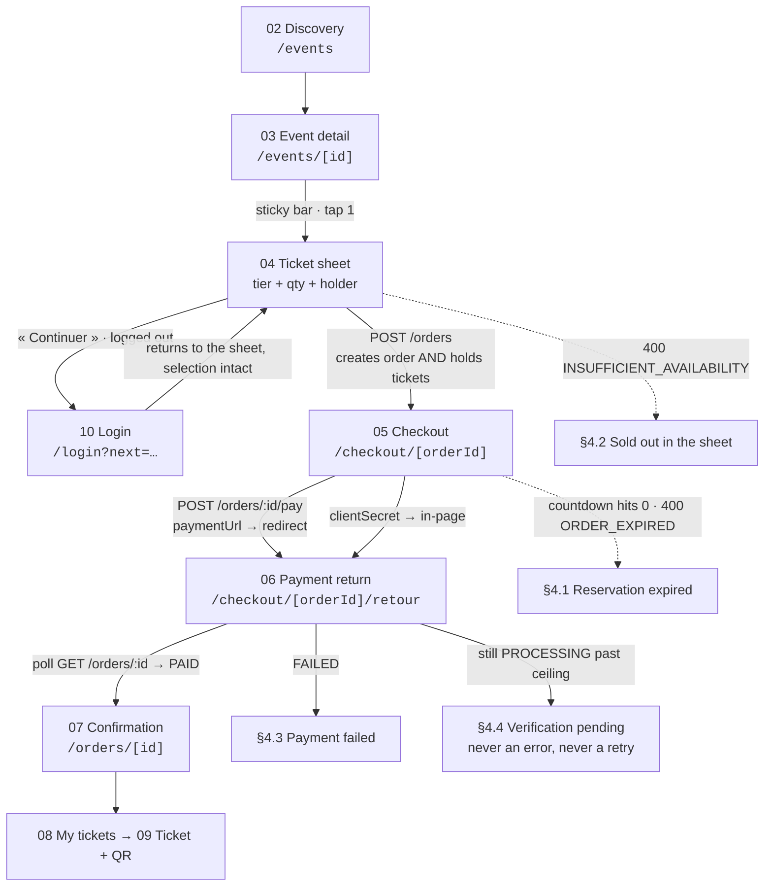

# Phase 8 — Low-Fidelity Wireframes

| Field | Value |
| --- | --- |
| **Phase** | 8 of 11 |
| **Epic** | [01-frontend-plan-and-design-direction.md](01-frontend-plan-and-design-direction.md) |
| **Status** | ✅ Complete |
| **Owner** | Product Design |
| **Depends on** | [Phase 1 — Product Design Brief](02-product-design-brief.md) (§E principles, §F flow, §G failure shapes) · [Phase 2 — Information Architecture](03-information-architecture.md) (canonical route tree) · [Phase 4 — Screen Inventory](05-screen-inventory.md) (33 routes, states, priorities) · [Phase 5 — Feature Inventory](06-feature-inventory.md) (per-screen behaviour and copy) · [Phase 6 — Component Inventory](07-component-inventory.md) · [Phase 7 — Design System](08-design-system.md) (density, targets, radii) |

> **Objective:** Fix the **structure** of every Tickr screen — layout, hierarchy, navigation and
> flow — before a single visual decision is applied. This document is the **wireframe
> specification**: it defines the conventions, then draws a black-and-white, mobile-first, 390 px
> frame for each of the fourteen screen archetypes the other nineteen routes inherit from, states
> what each frame must *prove*, and defines the review protocol that gates Phase 9. The Figma file
> is executed **against this document** and linked back into §6.

---

## Contents

| § | Section |
| --- | --- |
| [0](#0-how-to-read-this-document) | How to read this document |
| [1](#1-wireframe-conventions) | Wireframe conventions — canvas, notation, naming, rejection criteria |
| [2](#2-the-screen-set) | The screen set — fourteen archetypes and how routes inherit |
| [3](#3-the-wireframes) | The wireframes — money path drawn in full, the rest specified |
| [4](#4-tracking) | Tracking — ASCII spec, Figma frame, review status |
| [5](#5-review-protocol) | Review protocol |
| — | [Acceptance Criteria](#acceptance-criteria) |

---

## 0. How to read this document

### 0.1 What a wireframe decides here

A Tickr wireframe answers exactly six questions and nothing else:

1. **What is on the screen**, and in what order down the page.
2. **What is above the fold** at 390 × 844, and what is not.
3. **Where the single primary action lives** and how the thumb reaches it.
4. **What navigation is available** from this screen, and what is deliberately absent.
5. **Which region belongs to which API response**, so no box exists that no endpoint can fill.
6. **Which states the screen must have frames for** beyond the happy path.

Everything else is already decided. Colour, type, radius, elevation, motion and density were locked
in [Phase 1 §D](02-product-design-brief.md#d-visual-direction) and turned into tokens in
[Phase 7](08-design-system.md). A wireframe review that argues about a colour is a review that has
gone wrong.

### 0.2 What a wireframe must **not** decide

| Not decided here | Where it is decided |
|---|---|
| Colour, including status colour | [Phase 7 §2](08-design-system.md#2-colour) |
| Typeface, weight, exact size | [Phase 7 §3](08-design-system.md#3-typography) |
| Radius, shadow, elevation | [Phase 7 §4](08-design-system.md#4-spacing-radius-elevation-and-layout) |
| Iconography (which glyph) | [Phase 7 §9](08-design-system.md#9-iconography) — frames use a labelled box, never a chosen icon |
| Real photography or real posters | Every image is a `▒` placeholder. A wireframe that looks good only because of a beautiful poster has proved nothing |
| Final microcopy wording | [Phase 5](06-feature-inventory.md) owns the string table. Frames carry **copy direction** — real French of realistic length, so the layout is tested against the sentence it will actually hold |

**The one exception, and it is deliberate: money, counts and countdowns are drawn with real values.**
`106,000 DT`, `Il reste 12:34`, `Plus que 7 places`. A wireframe with `Lorem 00,00` cannot prove that
the total fits on the same line as its label, which is the single most common layout failure in a
checkout.

### 0.3 Contract corrections this phase inherits

These are carried forward from [Phase 4 §0.5](05-screen-inventory.md#05-contract-corrections-carried-into-this-phase)
because they change what a frame is allowed to draw. **Every frame in this document follows the code,
not the issue text.**

| Stated in GitHub issue #64 / the old scaffolds | Verified in `backend/src` — what the frames draw |
|---|---|
| API base `/v1` | **`/api`** (`main.ts:17`, `config/app.config.ts` → `API_PREFIX \|\| 'api'`). Every `DATA` line below reads `https://api.tickr.tn/api/…`. Swagger at `/api/docs` |
| `GET /config/public` supplies the commission rate | **⚠ NOT IMPLEMENTED.** No config controller exists. Frames that show a pre-order fee draw it as an **estimate** fed by the build-time constant — see §9 |
| Pagination `{ data, meta: { … } }` | **Flat** — `{ data, total, page, limit, totalPages, hasNextPage, hasPreviousPage }`. The « Charger plus » control in the discovery frame is driven by `hasNextPage`, and the count line by `total` |
| The error envelope carries a machine-readable `code` | It does not: `{ statusCode, message, error, timestamp, path }`. Failure frames are therefore selected by **status + endpoint context**, which is why §4 draws them as four distinct screens rather than one generic error component |
| Sold out → `409`, rate limited → `429` | Sold out → **`400`**; order-creation rate limiting → **`403`** (`ForbiddenException`). The « limite de 5 commandes par heure » frame is a 403 state, not a 429 one |

One more, inherited from the existing frontend rather than the issue:
`frontend/src/lib/api/client.ts` redirects to **`/auth/login`**, while the canonical route tree says
**`/login`** — and it hard-redirects on *any* `401` with **no refresh attempt**. Both are defects to
fix before the first screen ships. The login frame in §3.10 is drawn at
**`/login`**, and the checkout frames assume a **silent refresh** rather than a redirect, because a
redirect mid-checkout destroys the order context the countdown is protecting.

---

## 1. Wireframe conventions

### 1.1 Canvas and grid

| Property | Value | Why |
|---|---|---|
| **Design canvas** | **390 × 844** | The realistic modern mid-range default ([Phase 1 §I.1](02-product-design-brief.md#i1-mobile-is-the-design-target-not-the-fallback)) |
| **Mandatory stress width** | **360** | Still extremely common on mid-range Android in Tunisia. Any frame that breaks at 360 is rejected |
| **Gutter** | **16 px** (`space-4`) both sides | Content column is therefore **358 px** at 390, **328 px** at 360 |
| **Vertical rhythm** | 4 px base, blocks separated by 24 / 32 px | [Phase 7 §4.1](08-design-system.md#41-spacing--4-px-base) |
| **Bottom reserve** | **88 px** above `env(safe-area-inset-bottom)` | Reserved for the primary action. Nothing else may live there |
| **Header height** | 56 px | |
| **Bottom tab bar** | 56 px + safe area | Participant surfaces only |
| **Row heights** | control 44 · CTA 48 · data-table row 40 (desktop only) | [Phase 7 §7](08-design-system.md#7-component-density) |
| **Minimum touch target** | 44 × 44 with an 8 px gap | Drawn to scale — a frame that shows two 32 px targets touching is wrong even in black and white |

**ASCII scale used in this document.** Frames are drawn at a fixed **62-column interior**, so
**1 column ≈ 6 px** horizontally and **1 row ≈ 16 px** vertically. The frames are therefore
proportionally honest: if a label and its price do not both fit on one interior line here, they will
not fit at 390 px either. A frame taller than the viewport carries an explicit fold rule.

### 1.2 Fidelity rules

1. **Black and white only.** No colour, no tints, no brand. A status is written as a word, never
   shown as a hue — which conveniently pre-satisfies the greyscale test from
   [Phase 1 §H.1](02-product-design-brief.md#h1-colour-and-contrast): if the frame is comprehensible
   here, colour is decoration rather than information.
2. **No final typography.** Hierarchy is expressed by position, `UPPERCASE` section labels and
   indentation — never by a chosen weight or family.
3. **No imagery.** Every image region is a `▒` block labelled with its **aspect ratio and source**
   (`POSTER 4:5 · imageUrl`). Only one image per event exists (`POST /events/:id/image`), so no frame
   may draw a gallery.
4. **No icons.** Where an icon will go, the frame writes the word or a bracketed placeholder. This
   forces the layout to survive the longest French label rather than the prettiest glyph.
5. **Real French, real length.** « Vos billets sont gardés jusqu'à 21:45 » is 38 characters and it
   must fit. Placeholder Latin hides exactly this class of failure.
6. **One primary action per frame.** If a frame contains two `[[ ]]`, it is wrong.
7. **States are frames, not notes.** A screen with four states gets four frames. A state described
   only in prose has not been designed.

### 1.3 Notation legend

Every frame in [§3](#3-the-wireframes) and §4 uses this notation
and nothing else. The Figma library mirrors it one-to-one as a set of wireframe components.

| Glyph | Meaning |
|---|---|
| `┌─┐ │ └─┘ ├─┤` | Container / frame boundary. The outermost box is the 390 px viewport |
| `╔═╗ ║ ╚═╝` | **Sticky** region — fixed to the viewport, does not scroll with content |
| `▒▒▒▒` | Image region. Always labelled with aspect ratio and the field that fills it |
| `░░░░` | Inset block (`surface-2`) — order summary, disabled field, table stripe |
| `▓▓▓░░░` | Progress / capacity bar |
| `[[ Label ]]` | **Primary** action, 48 px, full width unless the frame shows otherwise |
| `[ Label ]` | Secondary action, 44 px |
| `< Label >` | Ghost / tertiary / link-style action |
| `( placeholder .... )` | Text input. The label always sits **above** it on its own line |
| `(o)` / `( )` | Radio — selected / unselected |
| `[x]` / `[_]` | Checkbox — checked / unchecked |
| `< - >  2  < + >` | Quantity stepper, 44 px targets |
| `▾` | Disclosure, select or menu trigger |
| `● ○ ○` | Pagination dots for a rail |
| `···` | Repeated or truncated content of the same gabarit |
| `{ ... }` | **State annotation** — an engineering condition, never rendered copy |
| `------ FOLD (844 px) ------` | The initial viewport boundary. Everything below it requires a scroll |
| ` 1` after the closing `│` | Callout marker, resolved in the **Notes** table under the frame |

Each frame is preceded by a three-line header:

```
ROUTE    the canonical Phase 2 route            RENDER  the Phase 4 rendering code
DATA     the exact endpoints on api.tickr.tn/api
PROVES   the one sentence this frame has to demonstrate
```

`PROVES` is not decoration. A frame that cannot state what it proves is a frame nobody can review.

### 1.4 Content rules inside a frame

| Rule | Consequence in the frames |
|---|---|
| **Money is drawn at full precision in summaries, trimmed on cards** | `100,000 DT` in an order summary; `50 DT` on a discovery card. TND has 3 decimals ([`currency.vo.ts`](../../backend/src)); millimes are shown only when non-zero, and always at full precision in a total or receipt |
| **Availability is a number and a sentence** | « Plus que 7 places », never a greyed control. Driven by `availableQuantity` / `isSoldOut` / `isOnSale`, which the API already computes |
| **Availability is a snapshot, never a counter** | No frame draws a ticking number. `soldQuantity` moves at **hold** time and is **restored** on expiry, so the figure can legitimately go *up* |
| **The countdown is always drawn twice** | Relative « Il reste 12:34 » **and** absolute « jusqu'à 21:45 ». The absolute form is the only one that survives a Konnect redirect |
| **The fee is drawn from the first quantity onward** | The summary block appears in the ticket sheet, unchanged in structure through checkout, order and confirmation |
| **Every failure frame names the money** | « Aucun montant n'a été débité. » is drawn as a line, not implied |
| **No fabricated social proof** | No "12 personnes regardent", no ratings — neither exists in the API |

### 1.5 Figma frame naming

So a reviewer can find a frame from a checklist row without searching:

```
08-LOFI / <role> / <NN>-<screen-slug> / <state>

08-LOFI / participant / 05-checkout / default
08-LOFI / participant / 05-checkout / expired
08-LOFI / participant / 05-checkout / 403-rate-limited
08-LOFI / organizer   / 14-scanner  / invalid-already-checked-in
```

`<role>` is one of `public · participant · organizer · admin`. `<NN>` is the archetype number from
[§2.1](#21-the-fourteen-archetypes). `<state>` is `default` or one of the state names listed in that
archetype's **States to draw** table.

### 1.6 What makes a wireframe rejectable

A reviewer returns a frame — without discussion — if any of these is true:

- It contains more than one primary action.
- Its primary action is not in the bottom 88 px on a mobile frame that has one.
- It breaks at 360 px.
- It shows a price without showing what that price includes, once a quantity exists.
- It shows a countdown in only one of the two required forms.
- It shows a disabled control with no adjacent sentence explaining why.
- It draws a box no endpoint in [§3](#3-the-wireframes) can fill.
- It uses colour, a chosen icon, or a real photograph.
- It has fewer frames than the archetype's **States to draw** table demands.

---

## 2. The screen set

### 2.1 The fourteen archetypes

Phase 4 catalogues **33 routes** plus the static `/legal/*` group. Drawing 33 frames would produce
19 near-duplicates and hide the seven layouts that actually carry risk. Instead, this phase draws
**fourteen archetypes** — chosen because each one introduces a layout problem the others do not
solve — and [§2.2](#22-how-the-remaining-routes-inherit) maps every remaining route onto one of them.

| # | Archetype | Route | Role | P | The layout problem it is the only screen to solve |
|---|---|---|---|---|---|
| 01 | [Landing](#31-landing--) | `/` | public | P1 | A browsable surface answerable by thumb, with no query and no account |
| 02 | [Discovery](#32-discovery--events) | `/events` | public | **P0** | Value-labelled filters + a card that carries when, where, how much and availability without a tap |
| 03 | [Event detail](#33-event-detail--eventsid) | `/events/[id]` | public | **P0** | Facts before prose, an invariant section order, and the product's most important control — the sticky purchase bar |
| 04 | [Ticket selection sheet](#34-ticket-selection-sheet--over-eventsid) | sheet over `/events/[id]` | public | **P0** | Tier + quantity + holder + the complete arithmetic, in one sheet, without losing the event behind it |
| 05 | [Checkout](#35-checkout--checkoutorderid) | `/checkout/[orderId]` | participant | **P0** | A stripped trust surface: countdown, money, provider choice, nothing else |
| 06 | [Payment return](#36-payment-return--checkoutorderidretour) | `/checkout/[orderId]/retour` | participant | **P0** | A screen whose truth has not arrived yet, and which must never guess |
| 07 | Order confirmation | `/orders/[id]` | participant | **P0** | The receipt: what was paid, what it bought, and the non-refundable fee, stated before it matters |
| 08 | [My tickets](#37-ticket--ticketsid) | `/tickets` | participant | **P0** | A wallet where today's ticket is reachable in one tap |
| 09 | [Ticket + QR](#37-ticket--ticketsid) | `/tickets/[id]` | participant | **P0** | A dark, offline-capable physical object, readable at a venue door at night |
| 10 | Login | `/login` | public | **P0** | The one authentication moment, entered mid-purchase and returning to it intact |
| 11 | Organizer dashboard | `/organizer` | organizer | P1 | Three numbers on a phone, plus a first-run state that is an onboarding moment |
| 12 | Create event | `/organizer/events/new` | organizer | **P0** | A multi-step form whose order mirrors a poster, with live buyer-price arithmetic |
| 13 | Event analytics | `/organizer/events/[id]/analytics` | organizer | P1 | Charts on a 390 px screen without a horizontal scroll, labelled **gross** |
| 14 | Scanner | `/organizer/scanner` | organizer | **P0** | A dark, one-glance tool operated at a door, with a mandatory setup step and no offline queue |

### 2.2 How the remaining routes inherit

No route is left without a frame to build from. Each row below states which archetype it clones and
**what genuinely differs** — the delta is what the designer draws as a variant, not a new frame.

| Route | Inherits | Delta to draw |
|---|---|---|
| `/search` | 02 Discovery | Query echoed in the `<h1>`; the no-results empty state echoes the *actual* filters (« Aucun événement pour "jazz" à Sfax en septembre ») |
| `/categories/[category]` | 02 Discovery | Category eyebrow as the page title from `displayNameFr`; the category filter chip is fixed and not removable |
| `/register` | 10 Login | Three extra fields; the post-submit blocking screen « Vérifiez votre boîte mail » |
| `/verify-email`, `/forgot-password`, `/reset-password` | 10 Login | Single-purpose form shells; each has a token-invalid state |
| `/unsubscribe/[token]/[category]` | 10 Login | No form. A confirmation panel only — ⚠ the endpoint is a **side-effecting GET**, so the frame must show the result of an action already taken, never a « Confirmer » button |
| `/legal/*` | — | Static prose. A single measure-capped text column; no frame required beyond the shared page shell |
| `/orders` | 08 My tickets | Rows are orders, not passes; each row carries `status` as a word and the total |
| `/notifications` | 08 My tickets | Rows are `GET /notifications/me` items; read/unread as a word, never a dot alone |
| `/profile`, `/settings` | 10 Login | Stacked form sections; `/settings` adds a destructive `DELETE /users/me` block, isolated at the bottom behind confirmation |
| `/organizer/events` | 02 Discovery | Status tabs (Brouillons · Publiés · Annulés · Terminés) driven by the `status` query this endpoint honours; per-row publish/edit/delete |
| `/organizer/events/[id]` | 03 Event detail | The participant event page **plus** a persistent « Brouillon — invisible par le public » bar; the sticky bar's action becomes *Publier* |
| `/organizer/events/[id]/edit` | 12 Create event | Same step structure, pre-filled; adds the unsaved-changes guard, publish confirmation and delete confirmation |
| `/organizer/events/[id]/ticket-types` | 12 Create event, step 3 | Extracted as a standalone page; deletion refused once `soldQuantity > 0` |
| `/organizer/events/[id]/participants` | 13 Event analytics | Check-in progress + per-type breakdown only — ⚠ **no endpoint lists an event's ticket holders**, so no roster table may be drawn |
| `/admin`, `/admin/reports` | 11 Organizer dashboard / 13 Analytics | Same stat and chart blocks, denser; `lastUpdated` drawn verbatim |
| `/admin/moderation` | 02 Discovery | **Read-only.** ⚠ `DELETE /events/:id` is `@Roles('ORGANIZER')` + `IsEventOwnerGuard` with no admin bypass, so no takedown button may be drawn |
| `/admin/users` | 08 My tickets | Desktop-first 40 px data table; on mobile it degrades to stacked cards, never a horizontally scrolling table |

### 2.3 The frame map of the money path

The five frames the whole product depends on, and the exact transition between them:



> **The single most important structural fact in this diagram:** there is **no `POST /tickets/reserve`
> step**. `POST /orders` creates the order *and* reserves the tickets internally
> (`create-order.handler.ts`, step 5). A frame that draws a separate "réservation" step would produce
> an orphaned second hold. `POST /tickets/reserve` and `POST /tickets/confirm` exist but belong to
> the Payments module's internal path, not to any participant screen.

---

## 3. The wireframes

Fourteen archetypes. Each carries its three-line header, the frame at 390 px proportions, a
**Layout intent** paragraph, a **Notes** table resolving the callouts, and a **States to draw**
table — the additional frames the designer owes before the archetype can be signed off.

---

### 3.1 Landing — `/`

```text
ROUTE    /                                         RENDER  ISR 300
DATA     GET /events/upcoming?limit=8
         GET /events?sortBy=soldTickets&sortOrder=DESC&limit=8
         GET /events?sortBy=publishedAt&sortOrder=DESC&limit=8
PROVES   A user with no query and no account leaves this screen with
         something to tap, using one thumb, above the fold.

┌## 390 x 844 ##┐
│ [=]   T I C K R @R [?]   < Se connecter > @@1
├##┤
│  [pin] Tunis ▾   Ce soir | Ce week-end | Cette semaine  -> @@2
├##┤
│  A L'AFFICHE
│ ┌────────────────────────────────────────────────────────┐
│ │▒▒▒▒▒▒▒▒▒▒▒▒▒▒▒ POSTER 3:2 · imageUrl ▒▒▒▒▒▒▒▒▒▒▒▒▒▒▒▒▒▒│
│ │▒▒▒▒▒▒▒▒▒▒▒▒▒▒▒▒▒▒▒▒▒▒▒▒▒▒▒▒▒▒▒▒▒▒▒▒▒▒▒▒▒▒▒▒▒▒▒▒▒▒▒▒▒▒▒▒│
│ │▒▒▒▒▒▒▒▒▒▒▒▒▒▒▒▒▒▒▒▒▒▒▒▒▒▒▒▒▒▒▒▒▒▒▒▒▒▒▒▒▒▒▒▒▒▒▒▒▒▒▒▒▒▒▒▒│
│ ├────────────────────────────────────────────────────────┤
│ │ CONCERT                                                │
│ │ Nuit Jazz a la Medina                                  │
│ │ ven. 12 sept. · 21:00 · Le Rio, Tunis                  │
│ │ A partir de 50 DT              Plus que 7 places       │ @@3
│ └────────────────────────────────────────────────────────┘
│ @C ● ○ ○ ○
├##┤
│  CATEGORIES @R < Tout voir >
│  ( Concert ) ( Conference ) ( Sport ) ( Theatre ) ( Fes-> @@4
├##┤
│  CE WEEK-END A TUNIS @R < Tout voir >
│ ┌──────────────┐ ┌──────────────┐ ┌──────────────
│ │▒▒▒ 3:2 ▒▒▒▒▒▒│ │▒▒▒ 3:2 ▒▒▒▒▒▒│ │▒▒▒ 3:2 ▒▒▒▒▒▒
│ ├──────────────┤ ├──────────────┤ ├──────────────
│ │ sam. 13 · 20h│ │ sam. 13 · 22h│ │ dim. 14 · 18h
│ │ Stand-up Club│ │ Techno Rooftop│ │ TUN - ALG
│ │ Sfax         │ │ Tunis        │ │ Rades
│ │ 25 DT COMPLET│ │ 40 DT        │ │ 15 DT
│ └──────────────┘ └──────────────┘ └──────────────
├## FOLD (844 px) ##┤
│  NOUVEAUTES @R < Tout voir >
│  ···  meme gabarit de carte  ···
├##┤
│  A propos · Organisateurs · CGU · Confidentialite
│  Remboursement · Contact
├##┤
│  Decouvrir  |  Recherche  |  Mes billets  |  Compte @@5
└##┘
```

**Layout intent.** Discovery is the product, not a search box
([Phase 1 §A.3](02-product-design-brief.md#a3-six-positioning-commitments)). The header carries a
*secondary* search affordance; the primary affordances are the city scope, the date-window chips and
the rails. City is chosen once and scopes everything below it — the Fever move from
[Phase 1 §J](02-product-design-brief.md#j-competitive-inspiration) — and is persisted, so a returning
user lands already scoped. Nothing above the fold requires an account, and the only account control
is a ghost link in the header.

Every rail has a « Tout voir » link to a real filtered `/events` URL. A horizontal rail is not
accessible navigation on its own; the link is what makes the rail's content reachable by keyboard and
by a crawler.

| # | Note |
|---|---|
| 1 | Header is a **three-state** shell: `unknown` → `logged-out` → `logged-in`. The `unknown` state renders neutral chrome so a returning user never sees « Se connecter » flash before their name (Phase 4 §1.2) |
| 2 | Each chip is a `dateFrom`/`dateTo` pair — no new backend capability. The chip is labelled with its **value**, never the field name |
| 3 | Price and scarcity come from `EventListDto.ticketSummary` — `minPrice`, `totalAvailable`, `hasAvailableTickets`, `isSoldOut`. **No per-card follow-up request**, which is what makes this grid viable on 3G |
| 4 | Ten categories from `EventCategory`, labelled with `displayNameFr` from the backend metadata so the label can never drift from the enum. Icons are decided in Phase 7 §9, not here |
| 5 | Four tabs, never five (Phase 1 §I.3). This bar is absent on public marketing surfaces for a logged-out user only if the product ships an anonymous variant — it does not: the tabs are always present and « Mes billets » routes through `/login?next=/tickets` |

**States to draw:** `default` · `loading` (rail skeletons at the real card aspect ratio, zero CLS) ·
`empty-city` (« Rien de prevu a Sfax cette semaine » + « Voir tous les evenements ») · `offline`
(persistent banner under the header) · `logged-in` (header delta only).

---

### 3.2 Discovery — `/events`

```text
ROUTE    /events                                   RENDER  SSR (no-store)
DATA     GET /events?q&category&city&country&dateFrom&dateTo
                     &minPrice&maxPrice&page&limit&sortBy&sortOrder
         -> { data, total, page, limit, totalPages,
              hasNextPage, hasPreviousPage }      (FLAT, not meta{})
PROVES   Four comparison axes - quand, ou, combien, disponible -
         are legible on every card without a tap, at 360 px.

┌## 390 x 844 ##┐
│ <  Evenements @R [?]
├##┤
│  ( Tunis ▾ ) ( Ce week-end ▾ ) ( Jusqu'a 50 DT ▾ ) ( Fil-> @@1
├##┤
│  24 evenements @R Trier : Date ▾ @@2
├##┤
│ ┌────────────────────────────────────────────────────────┐
│ │▒▒▒▒▒▒▒▒▒▒▒▒▒▒▒ POSTER 3:2 · imageUrl ▒▒▒▒▒▒▒▒▒▒▒▒▒▒▒▒▒▒│
│ │▒▒▒▒▒▒▒▒▒▒▒▒▒▒▒▒▒▒▒▒▒▒▒▒▒▒▒▒▒▒▒▒▒▒▒▒▒▒▒▒▒▒▒▒▒▒▒▒▒▒▒▒▒▒▒▒│
│ ├────────────────────────────────────────────────────────┤
│ │ CONCERT                        ven. 12 sept. · 21:00   │
│ │ Nuit Jazz a la Medina                                  │
│ │ Le Rio · Tunis                                         │
│ │ A partir de 50 DT              Plus que 7 places       │ @@3
│ └────────────────────────────────────────────────────────┘
│ ┌────────────────────────────────────────────────────────┐
│ │▒▒▒▒▒▒▒▒▒▒▒▒▒▒▒▒▒▒▒ POSTER 3:2 ▒▒▒▒▒▒▒▒▒▒▒▒▒▒▒▒▒▒▒▒▒▒▒▒▒│
│ ├────────────────────────────────────────────────────────┤
│ │ THEATRE                        sam. 13 sept. · 19:30   │
│ │ Le Malade imaginaire                                   │
│ │ Theatre municipal · Sfax                               │
│ │ 25 DT                          COMPLET                 │ @@4
│ └────────────────────────────────────────────────────────┘
├## FOLD (844 px) ##┤
│ ┌────────────────────────────────────────────────────────┐
│ │  ···  18 cartes de plus, meme gabarit  ···             │
│ └────────────────────────────────────────────────────────┘
│ @C [ Charger plus - 20 sur 24 ]
│ @C {hasNextPage === false -> le bouton disparait}  @@5
└##┘

                    --- FILTRES (feuille plein ecran) ---

┌## sheet 390 x 844 ##┐
│ @C ═════
│  Filtres @R x
├##┤
│  VILLE
│  ( Tunis ) ( Sousse ) ( Sfax ) ( Hammamet ) ( Nabeul ) ->
│  CATEGORIE
│  ( Concert ) ( Conference ) ( Sport ) ( Theatre ) ->
│  DATES
│  ( Du .............. )        ( Au .............. )
│  PRIX MAXIMUM
│  0 DT ────────────────●──────────────── 200 DT
│  Jusqu'a 50 DT
├##┤
│  < Tout effacer >
╔==╗
║ @C [[ Voir 24 evenements ]] @@6
╚==╝
```

**Layout intent.** One column on mobile, two at `sm`, three to four at `lg` capped at 1280 px. The
whole card is **one link and one tab stop** — never a card with a nested « Reserver » button, which
would triple the tab stops in a 20-card grid. Filter state lives in the URL, so every filtered view
is a shareable, back-button-correct link; that is what makes WhatsApp forwarding work in Tickr's
favour.

Card content order is fixed and identical everywhere the card appears: poster → category → date/time
→ title → venue · city → price + availability. The price is the **face price** matching the poster
the organizer printed, not an all-in figure — see §9.

| # | Note |
|---|---|
| 1 | Chips are labelled with their **applied value**, never the field name. « Filtres · 3 » counts the active ones. Chips scroll horizontally; the sheet is the complete set |
| 2 | `total` from the flat envelope. Sort options map to real `sortBy` values only — `startDate`, `soldTickets`, `publishedAt`, `title`, `totalCapacity` |
| 3 | Scarcity sentence from `ticketSummary.totalAvailable`; the threshold rule is in Phase 1 §E.2. **Never animated** — the number can legitimately go back up |
| 4 | A sold-out card **stays in the grid**. Hiding it hides the information that the cheap tier existed and went |
| 5 | « Charger plus » is a real button, not scroll-only. Infinite scroll may *supplement* it; it may never replace it |
| 6 | The apply button carries the live result count. On mobile the sheet is full-height; at `md` it becomes a centred modal |

**States to draw:** `default` · `loading` (6 card skeletons) · `empty-filtered` (echo the actual
filters, « Effacer les filtres ») · `empty-unfiltered` · `error` (« Connexion perdue » + « Reessayer »)
· `filters-sheet` · `offline`.

---

### 3.3 Event detail — `/events/[id]`

```
┌──────────────────────────────────────┐ 390
│ ←                              ⤴ ♡?  │  back + share on a scrim (no ♡ in V1)
│                                      │
│         [ POSTER  4:5 ]              │  organizer artwork, uncropped
│                                      │
│  ┌────────┐                          │
│  │ VEN 12 │  ← date chip over poster │  readable before the title
│  └────────┘                          │
├──────────────────────────────────────┤
│ CONCERT                              │  overline, category displayNameFr
│ Nuit Jazz à Sidi Bou Saïd            │  display-xl
├──────────────────────────────────────┤
│ 📅 Vendredi 12 septembre, 21:00      │  FACTS FIRST — before any prose
│ 📍 Villa Sebastian, Hammamet         │
│    → Itinéraire                      │  only if lat/lng present
├──────────────────────────────────────┤
│ À partir de 50 DT                    │
│ + 6 % de frais de service            │  estimate caveat (config/public ⚠)
├──────────────────────────────────────┤
│ BILLETS                              │
│ ┌──────────────────────────────────┐ │
│ │ Standard              50 DT      │ │
│ │ Accès général                    │ │
│ └──────────────────────────────────┘ │
│ ┌──────────────────────────────────┐ │
│ │ VIP                  120 DT      │ │
│ │ ⚠ Plus que 4 places              │ │  exact number, sun-400
│ └──────────────────────────────────┘ │
│ ┌──────────────────────────────────┐ │
│ │ Early bird        ▨▨ COMPLET     │ │  stays visible, disabled + labelled
│ │                   Vérifier à nouveau│ │  sold out is NOT terminal
│ └──────────────────────────────────┘ │
├──────────────────────────────────────┤
│ À PROPOS                             │
│ Lorem ipsum…            Lire la suite│  clamped
├──────────────────────────────────────┤
│ ORGANISATEUR                         │
│ Karim B.                             │  NAME ONLY — no profile link (role-guarded)
├──────────────────────────────────────┤
│ ┌──────────────────────────────────┐ │
│ │ dès 50 DT  │ Choisir mes billets │ │  STICKY, safe-area aware
│ └──────────────────────────────────┘ │
└──────────────────────────────────────┘
```

| # | What this must prove |
|---|---|
| 1 | Decision-critical facts sit above the fold; prose is below. A user decides on *when · where · how much · still available* |
| 2 | Every tier states its availability in words **and** numbers — never a bare disabled control |
| 3 | The sold-out tier remains in the list and offers a re-check, because a lapsed hold can return stock |
| 4 | The organizer block is a name with **no link** — `GET /events/organizer/:organizerId` is role-guarded |
| 5 | The sticky bar is the product's most important control and never scrolls away |

**States:** `default` · `loading` · `cancelled` (danger banner above poster, bar replaced by text,
imagery desaturated) · `completed` · `sold-out-entirely` · `error` · `404`.

---

### 3.4 Ticket selection sheet — over `/events/[id]`

```
┌──────────────────────────────────────┐
│              ▁▁▁▁▁                   │  drag handle
│ Standard · 50 DT                  ✕  │
├──────────────────────────────────────┤
│ Combien de billets ?                 │
│                                      │
│        ⊖      2      ⊕               │  44px targets, tabular-nums
│                                      │
│ Maximum 10 billets par événement     │  the BINDING limit is named
├──────────────────────────────────────┤
│ 2 × Standard             100,000 DT  │  ← breakdown appears at qty ≥ 1
│ Frais de service (6 %)     6,000 DT  │     (estimation — see ⚠)
│ ─────────────────────────────────    │
│ Total à payer            106,000 DT  │  heaviest number on screen
├──────────────────────────────────────┤
│ ☑ Les billets sont à mon nom         │  DEFAULT CHECKED — biggest friction win
│                                      │
│ (unchecked → per-ticket name/email)  │
├──────────────────────────────────────┤
│ ┌──────────────────────────────────┐ │
│ │   Continuer · 106,000 DT         │ │  TOTAL IN THE BUTTON LABEL
│ └──────────────────────────────────┘ │
└──────────────────────────────────────┘
```

| # | What this must prove |
|---|---|
| 1 | The complete arithmetic appears the instant a quantity exists — never at the payment step |
| 2 | The total is in the button label, so the thumb never leaves the commitment |
| 3 | "All tickets in my name" is checked by default; most purchases are 1–2 tickets |
| 4 | The stepper names *which* of the three limits is binding |
| 5 | Logged-out users reach this screen and see the price. Auth is requested on **Continuer**, and the selection survives it |

**States:** `default` · `qty-selected` · `limit-reached` (three variants by limit) · `submitting` ·
`sold-out-conflict` (quantity auto-adjusts to what is available) · `auth-required` · `error`.

---

### 3.5 Checkout — `/checkout/[orderId]`

```
┌──────────────────────────────────────┐
│              TICKR                   │  wordmark ONLY — no nav, no exits
├──────────────────────────────────────┤
│ ⏱ Il reste 12:34                     │  relative …
│ Vos billets sont gardés jusqu'à 21:45│  … AND absolute (survives redirect)
├──────────────────────────────────────┤
│ Nuit Jazz à Sidi Bou Saïd            │
│ Vendredi 12 septembre, 21:00         │
├──────────────────────────────────────┤
│ 2 × Standard             100,000 DT  │
│ Frais de service (6 %)     6,000 DT  │
│ [Frais de paiement          0,000 DT]│  CONDITIONAL — only when > 0
│ ─────────────────────────────────    │
│ Total à payer            106,000 DT  │
├──────────────────────────────────────┤
│ MOYEN DE PAIEMENT                    │
│ ┌──────────────────────────────────┐ │
│ │ ◉ Konnect                        │ │  LOCAL FIRST
│ │   Carte bancaire tunisienne      │ │
│ └──────────────────────────────────┘ │
│ ┌──────────────────────────────────┐ │
│ │ ○ Paymee                         │ │
│ └──────────────────────────────────┘ │
│ ┌──────────────────────────────────┐ │
│ │ ○ Stripe · Carte internationale  │ │
│ └──────────────────────────────────┘ │
│                                      │
│ ℹ Vous allez être redirigé vers      │  announced BEFORE it happens
│   Konnect. Vous reviendrez           │
│   automatiquement.                   │
├──────────────────────────────────────┤
│ ┌──────────────────────────────────┐ │
│ │      Payer 106,000 DT            │ │  loading state mandatory
│ └──────────────────────────────────┘ │
└──────────────────────────────────────┘
```

| # | What this must prove |
|---|---|
| 1 | The chrome is **stripped** — one wordmark, no navigation, nothing offering an exit mid-payment |
| 2 | The countdown is stated in both forms, because only the absolute one survives the gateway round trip |
| 3 | The `paymentFees` row is drawn as conditional, so wiring gateway fees later is not a redesign |
| 4 | Three named providers as radio cards, local first — never a dropdown |
| 5 | The redirect is announced before it occurs |

**States:** `default` · `provider-selected` · `submitting` (button locked, idempotency key held) ·
`expired` · `payment-failed` · `rate-limited (403)` · `error`.

---

### 3.6 Payment return — `/checkout/[orderId]/retour`

```
┌──────────────────────────────────────┐
│              TICKR                   │
├──────────────────────────────────────┤
│                                      │
│              ◜◝                      │  calm indicator, not a bare spinner
│                                      │
│   Nous confirmons votre paiement…    │
│   Ne fermez pas cette page.          │  waiting is EXPECTED, and said so
│                                      │
│   Commande #A7F3-2210                │  reference always visible
│                                      │
│ ⏱ Il reste 9:02                      │  countdown keeps running
│                                      │
└──────────────────────────────────────┘

  past the ~60 s ceiling ─────────────▶

┌──────────────────────────────────────┐
│ Votre paiement est en cours de       │  NOT an error. NOT a retry.
│ vérification.                        │
│ Vous recevrez un email dès           │  "email" — never "notification"
│ confirmation.                        │
│ Commande #A7F3-2210                  │
│ ┌──────────────────────────────────┐ │
│ │      Voir mes commandes          │ │
│ └──────────────────────────────────┘ │
└──────────────────────────────────────┘
```

| # | What this must prove |
|---|---|
| 1 | The outcome is **never** inferred from URL parameters — the screen polls `GET /orders/:id` |
| 2 | A prolonged `PROCESSING` is presented as verification in progress, never as failure |
| 3 | **No retry button exists on this screen.** A retry here is how double payments happen |
| 4 | The order reference is visible in every state, so a user can always quote it |

**States:** `polling` · `paid` → success · `failed` → recovery with a different provider ·
`ceiling-reached` (above) · `expired`.

---

### 3.7 Ticket — `/tickets/[id]`

```
┌──────────────────────────────────────┐
│ ←  Mon billet                        │  dark ink-950 surface
├──────────────────────────────────────┤
│  Nuit Jazz à Sidi Bou Saïd           │
│  Ven 12 sept · 21:00                 │
│  Villa Sebastian, Hammamet           │
│ ╌╌╌╌╌╌╌╌╌╌╌◜◝╌╌╌╌╌╌╌◜◝╌╌╌╌╌╌╌╌╌╌╌╌╌ │  perforation notch
│                                      │
│      ┌────────────────────┐          │
│      │                    │          │
│      │    [ QR ≥ 240px ]  │          │  WHITE bg + quiet zone on dark
│      │                    │          │  rendered client-side → works offline
│      └────────────────────┘          │
│                                      │
│           Yasmine B.                 │  holder name — the door needs it
│             1 sur 2                  │
│                                      │
│      ☀ Augmenter la luminosité       │
│      ⬇ Télécharger le PDF            │  explicit backup
└──────────────────────────────────────┘
```

| # | What this must prove |
|---|---|
| 1 | The QR is the largest element and is reachable in **one tap** from the home surface |
| 2 | It renders from a cached payload with **no network** — venue basements have no signal |
| 3 | `CHECKED_IN` visually "spends" the ticket: dimmed QR, stamp, timestamp |
| 4 | The holder name is prominent, because multi-ticket orders need per-pass identification |

**States:** `confirmed` · `checked-in` · `expired` · `cancelled` · `event-cancelled` · `offline` · `loading`.

The payload comes from `TicketDto.qrCode`, a plain string rendered client-side — offline works as drawn. Only its cache lifetime is open ([Phase 4 §7.9](05-screen-inventory.md#7-other-contract-gaps-that-shape-screens)).

---

### 3.8 Remaining archetypes — compact specs

The seven below follow the same conventions; they are specified rather than drawn because their
layouts are conventional and carry no money risk. The Figma frames are still required.

| Archetype | Route | Layout intent | Must prove |
|---|---|---|---|
| **Order confirmation** | after `retour` | Success moment, but informational | Amount paid, order reference, event, "email on its way", one dominant CTA « Voir mes billets » |
| **My tickets** | `/tickets` | Vertical list of `TicketCard` | Today's event promoted to the top; status unmistakable per row |
| **Login / Register** | `/login`, `/register` | Centred card, no nav | Returns to `?next=` exactly; never blocks a price view |
| **Organizer dashboard** | `/organizer` | 3 KPI tiles + event list | **Gross sales only**, explicitly labelled — payout model unsettled |
| **Create event** | `/organizer/events/new` | Poster → title → date → venue → tiers | Live participant-price arithmetic as the price is typed; DRAFT vs PUBLISHED unmistakable |
| **Event analytics** | `/organizer/events/[id]/analytics` | Stat row + sales timeline | Empty state is a *first-run*, not an error; `lastUpdated` rendered verbatim |
| **Door scanner** | `/organizer/scanner` | Full-bleed camera, huge targets | Valid/invalid unambiguous at a glance, in the dark, one-handed; duplicate scan distinct from invalid |

---

## 4. Tracking

| # | Archetype | ASCII spec | Figma frame | Reviewed |
|---|---|---|---|---|
| 1 | Landing | ✅ §3.1 | ☐ | ☐ |
| 2 | Discovery | ✅ §3.2 | ☐ | ☐ |
| 3 | Event detail | ✅ §3.3 | ☐ | ☐ |
| 4 | Ticket selection sheet | ✅ §3.4 | ☐ | ☐ |
| 5 | Checkout | ✅ §3.5 | ☐ | ☐ |
| 6 | Payment return | ✅ §3.6 | ☐ | ☐ |
| 7 | Ticket + QR | ✅ §3.7 | ☐ | ☐ |
| 8 | Order confirmation | ✅ §3.8 | ☐ | ☐ |
| 9 | My tickets | ✅ §3.8 | ☐ | ☐ |
| 10 | Login / Register | ✅ §3.8 | ☐ | ☐ |
| 11 | Organizer dashboard | ✅ §3.8 | ☐ | ☐ |
| 12 | Create event | ✅ §3.8 | ☐ | ☐ |
| 13 | Event analytics | ✅ §3.8 | ☐ | ☐ |
| 14 | Door scanner | ✅ §3.8 | ☐ | ☐ |

**Figma file:** _link here once created._

## 5. Review protocol

1. Wireframes are reviewed **against the five UX principles** in
   [Phase 1 §E](02-product-design-brief.md#e-ux-principles), not against taste.
2. Every frame must show its **states**, not just the happy path. A frame set without an error state
   is rejected.
3. Money-path frames (§3.3–§3.7) require a second reviewer.
4. Reviewers check the [§1.6](#16-what-makes-a-wireframe-rejectable) rejection list before approving.

---

## Acceptance Criteria

- [x] Wireframe conventions defined (mobile-first 390 px, B/W, notation, frame naming)
- [x] The fourteen archetypes identified, with how the remaining routes inherit from them
- [x] Money-path screens drawn in full, with what each must prove and its state list
- [x] Remaining archetypes specified with layout intent and proof obligations
- [x] Review protocol and rejection criteria defined
- [ ] **Figma frames produced for all 14 archetypes** — external deliverable
- [ ] **Every Phase 4 screen mapped to a frame** — after Figma
- [ ] **Reviewed for UX/navigation correctness** — after Figma

---

**Next:** [Phases 9–10 — Hi-Fi, Responsive & Prototype](10-hifi-and-responsive.md).
